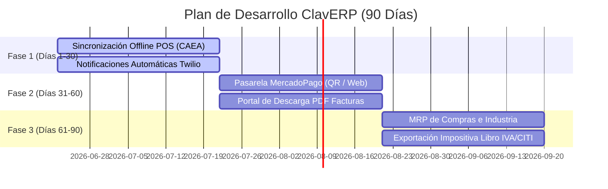

# ClavERP — Propuesta de Valor y Ficha Comercial

ClavERP es la solución integral de gestión administrativa, fiscal y operativa para PyMEs y comercios en Argentina. Unifica el punto de venta (POS), la facturación oficial AFIP, el control de stock, la logística y la contabilidad en una plataforma moderna, rápida y multi-tenant.

---

## 💎 Propuesta de Valor Única
1. **Facturación AFIP Nativa y Fluida**: Emisión de comprobantes (Facturas A, B, C y Notas de Crédito/Débito) con CAE oficial de AFIP en menos de 30 segundos, integrado directo en el cierre del turno de venta.
2. **Control Multicanal en Tiempo Real**: El stock se sincroniza de forma inmediata entre el mostrador de venta física (POS) y la tienda online (E-commerce B2C / Portal B2B).
3. **Optimizado para el Contexto Local**: Precios ajustados en pesos argentinos (ARS), cálculo automático de alícuotas impositivas (IVA 21%, 10.5%, percepciones de IIBB), y soporte de contingencia fiscal offline mediante CAEA.
4. **Diseño Premium y Alta Performance**: Interfaz moderna, rápida y responsiva basada en Glassmorphism (tema *Glass Aurora*) para agilizar el trabajo operativo diario.

---

## 📦 Alcance Comercial: ¿Qué se vende HOY?

Los siguientes módulos están **100% operativos, validados con pruebas automatizadas** y listos para ser desplegados a clientes finales:

### 1. POS Táctil & Facturación AFIP
- Interfaz optimizada para pantallas táctiles con accesos rápidos por teclado (F12 para Cobrar).
- Emisión instantánea de tickets/facturas con CAE.
- Emisión de Notas de Crédito unitarias o masivas con referencia al comprobante original.
- Flujo de arqueo, apertura y cierre de turnos de caja integrado.

### 2. E-commerce B2C y Portal B2B
- Tienda online pública integrada de forma nativa con el catálogo y stock centralizado.
- Portal de clientes mayoristas (B2B) con login mediante CUIT para consultar precios especiales, cuenta corriente e ingresar pedidos directo al ERP.

### 3. Gestión Contable y Centro de Costos
- Configuración de plan de cuentas dinámico adaptado a legislaciones contables de Argentina.
- Apertura y cierre de períodos fiscales mensuales/anuales.
- Estructuración de centros de costo para control detallado de egresos/ingresos.
- Módulo de auditoría y trazabilidad completa de logs de acciones de usuario.

### 4. Agro e Internet de las Cosas (IoT)
- Gestión de lotes, tipos de cultivo y telemetría de campo.
- Recepción de pesadas de camiones en balanzas digitales e integración de telemetría de humedad e IoT.

---

## 💳 Planes y Precios (Facturación en ARS)

El modelo de cobro es de suscripción recurrente mensual (SaaS) sin contratos de permanencia mínima, e incluye soporte por correo electrónico y actualizaciones fiscales automáticas.

| Plan | Tarifa Mensual | Usuarios Incluidos | Características Principales |
| :--- | :--- | :--- | :--- |
| **Starter** | **$29.900** | Hasta 3 usuarios | POS local, Facturación AFIP básica, Gestión de stock e inventario elemental. |
| **Pro** | **$49.900** | Hasta 10 usuarios | Todo lo de Starter + E-commerce integrado, Onboarding asistido con IA, y KPIs visuales avanzados. |
| **Enterprise** | **$89.900** | Ilimitados | Todo lo de Pro + Módulo Agro, Control de Industria/MRP, Multi-sucursal, y acuerdo de nivel de servicio (SLA). |

---

## 🗺️ Roadmap de Desarrollo a 90 Días

El plan de evolución técnica de la plataforma está dividido en sprints mensuales enfocados en automatización y movilidad:

### 📅 Fase 1 (Días 1 a 30): Robustez Fiscal y Autonomía
- **Contingencia CAEA Completa**: Implementación definitiva de lógica offline de CAEA en el POS con base de datos IndexedDB local para facturar sin internet y sincronizar al recuperar conexión.
- **Notificaciones por WhatsApp/Email**: Envío automático del comprobante digital (factura) vía Twilio y correos transaccionales (Resend) al momento de autorizar la venta.

### 📅 Fase 2 (Días 31 a 60): Pagos y Portales de Autoservicio
- **Checkout Integrado MercadoPago**: Cobros inmediatos mediante códigos QR dinámicos y enlaces de pago en el POS y E-commerce con webhook de validación de estado de transacción.
- **Autoservicio de Descarga de Comprobantes**: Portal web para que los clientes puedan ingresar de forma directa y descargar el PDF de sus facturas históricas sin requerir atención del área administrativa.
- **Preparación de Despachos (Picking)**: Creación automatizada de listas de picking (armado de mercadería) en el depósito a partir de compras confirmadas online.

### 📅 Fase 3 (Días 61 a 90): Manufactura, Agro Avanzado e Impuestos
- **Planificación de Materiales (MRP)**: Generación automática de sugerencias de compra y abastecimiento según demanda de producción estimada e inventario de seguridad.
- **Exportadores Contables / Impositivos**: Generación de archivos listos para el Libro de IVA Digital y el régimen informativo de compras y ventas (CITI AFIP).
- **NDVI y Mapas en Agro**: Integración visual de imágenes satelitales NDVI en el módulo de lotes para monitoreo del estado de cultivos.
