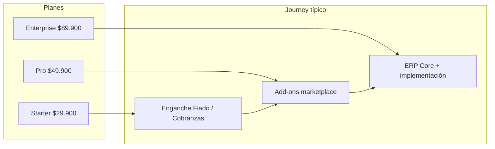
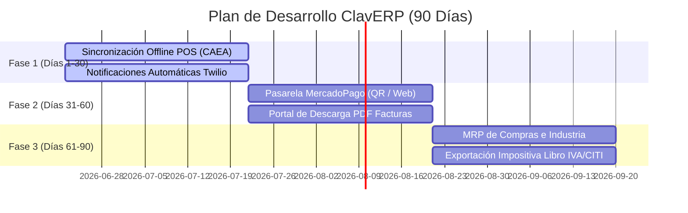

# ClavERP — Propuesta de Valor y Ficha Comercial

ClavERP es la solución integral de gestión administrativa, fiscal y operativa para PyMEs y comercios en Argentina. Unifica el punto de venta (POS), la facturación oficial AFIP, el control de stock, la logística y la contabilidad en una plataforma moderna, rápida y multi-tenant.

---

## 💎 Propuesta de Valor Única
1. **Facturación AFIP Nativa y Fluida**: Emisión de comprobantes (Facturas A, B, C y Notas de Crédito/Débito) con CAE oficial de AFIP en menos de 30 segundos, integrado directo en el cierre del turno de venta.
2. **Control Multicanal en Tiempo Real**: El stock se sincroniza de forma inmediata entre el mostrador de venta física (POS) y la tienda online (E-commerce B2C / Portal B2B).
3. **Optimizado para el Contexto Local**: Precios ajustados en pesos argentinos (ARS), cálculo automático de alícuotas impositivas (IVA 21%, 10.5%, percepciones de IIBB), y soporte de contingencia fiscal offline mediante CAEA.
4. **Diseño Premium y Alta Performance**: Interfaz moderna, rápida y responsiva basada en Glassmorphism (tema *Glass Aurora*) para agilizar el trabajo operativo diario.

---

## 📦 Alcance Comercial: ¿Qué se vende HOY?

Los siguientes módulos están **100% operativos, validados con pruebas automatizadas** y listos para ser desplegados a clientes finales:

### 1. POS Táctil & Facturación AFIP
- Interfaz optimizada para pantallas táctiles con accesos rápidos por teclado (F12 para Cobrar).
- Emisión instantánea de tickets/facturas con CAE.
- Emisión de Notas de Crédito unitarias o masivas con referencia al comprobante original.
- Flujo de arqueo, apertura y cierre de turnos de caja integrado.

### 2. E-commerce B2C y Portal B2B
- Tienda online pública integrada de forma nativa con el catálogo y stock centralizado.
- Portal de clientes mayoristas (B2B) con login mediante CUIT para consultar precios especiales, cuenta corriente e ingresar pedidos directo al ERP.

### 3. Gestión Contable y Centro de Costos
- Configuración de plan de cuentas dinámico adaptado a legislaciones contables de Argentina.
- Apertura y cierre de períodos fiscales mensuales/anuales.
- Estructuración de centros de costo para control detallado de egresos/ingresos.
- Módulo de auditoría y trazabilidad completa de logs de acciones de usuario.

### 4. Agro e Internet de las Cosas (IoT)
- Gestión de lotes, tipos de cultivo y telemetría de campo.
- Recepción de pesadas de camiones en balanzas digitales e integración de telemetría de humedad e IoT.

---

## ⚡ Claver AutoPool — Premium ERP 7 (Servicios Intangibles)

Automatizaciones de **clase enterprise** (inspiradas en SAP, NetSuite, Salesforce, Odoo) adaptadas a Argentina. Se activan en minutos desde [Claver AutoPool](/claver/apps).

| # | Servicio | Dolor que resuelve | Precio/mes |
|---|----------|-------------------|------------|
| 1 | **Conciliador Liquidación MP y Tarjetas** | Comisiones fantasmas y plata retenida en procesadoras | $24.900 |
| 2 | **Recuperador de Retenciones AFIP** | Percepciones olvidadas y proveedores apócrifos | $18.900 |
| 3 | **Guardián de Caja POS** | Robo hormiga: anulaciones y egresos sospechosos | $14.900 |
| 4 | **Reactivador B2B** | Cliente mayorista que deja de comprar — alerta temprana | $12.900 |
| 5 | **Reponedor JIT** | Quiebres de stock y capital muerto en depósito | $16.900 |
| 6 | **OCR Compras Proveedores** | Carga manual de facturas de compra (IA + mail) | $9.900 + uso |
| 7 | **Ruteador de Entregas** | Rutas ineficientes y clientes preguntando horario | $19.900 |

**Pack Premium ERP 7:** los siete servicios por **$89.900/mes** (−22%). Documentación técnica: `docs/marketplace/13-servicios-intangibles-premium-7.md`.

---

## 🏪 Pack Almacén Rosario — Retail de Barrio (18 módulos)

Automatizaciones POS para almacenes, kioscos y verdulerías de barrio. Inspiradas en Odoo Retail, Square y Toast, adaptadas a Argentina (listas de distribuidora, envases retornables, fiado, AFIP).

**Principio comercial:** todos los módulos son **siempre visibles** en panel, guía y POS. Sin SKU contratado la UI se muestra bloqueada y las APIs responden 403 — nada se oculta del menú.

| Superficie | URL | Para qué |
|------------|-----|----------|
| Panel operativo | `/dashboard/almacen` | Resumen, importar listas, vales, envases y acciones retail |
| Guía in-app | `/dashboard/almacen/guia` | Pasos de uso y diagramas por módulo |
| App Store | `/dashboard/apps` | Activar pack o SKU suelto (`?sku=pos.envases_gaseosas`) |
| POS | `/dashboard/pos` | Envases, vales, promos, pánico y atajos retail |

**Pack completo:** `pool-almacen-rosario` — **$34.900/mes** (−28% vs. SKUs sueltos). Incluye fiado barrio y Guardián POS como add-ons relacionados.

### Módulos incluidos (18 SKUs POS)

| # | Nombre | Dolor que resuelve | Precio/mes |
|---|--------|-------------------|------------|
| 1 | Guardián de Margen | Vendés debajo del costo cuando sube la lista | $3.990 |
| 2 | Zero Waste | Mercadería por vencer sin plan de descuento | $5.990 |
| 3 | Alerta Stock Cero | Vendés con stock 0 y el dueño se entera tarde | $2.990 |
| 4 | Promos Medios de Pago | El cajero no recuerda reintegros MODO/BSF/MP | $2.990 |
| 5 | Importador Listas | Actualizás precios a mano desde Excel distribuidora | $4.990 |
| 6 | Pánico Vecinal | Sin botón discreto de alerta en el local | $1.990 |
| 7 | Envases de Gaseosas | Cajones retornables en cuaderno que no cierra | $2.490 |
| 8 | Vale de Dinero | Vales en papel sin control de saldo | $1.990 |
| 9 | Recargas y Servicios | SUBE/celular fuera de la caja del día | $2.990 |
| 10 | Venta por Peso | Peso × precio en calculadora en verdulería | $2.490 |
| 11 | Promos por Cantidad (2×1) | 2×1 aplicado a mano con errores | $1.990 |
| 12 | Ticket Regalo | Devoluciones sin crédito trazable en tienda | $1.490 |
| 13 | Pedido Distribuidora | Pedido urgente al reparto a las corridas | $3.490 |
| 14 | Mermas y Roturas | Roturas que no bajan stock | $1.990 |
| 15 | Arqueo Ciego | Cajero ve saldo sistema antes de contar | $2.490 |
| 16 | Lista Mayorista POS | Precio bulto en otra lista o de memoria | $2.990 |
| 17 | Cheques en Cartera | Cheques que vencen sin aviso | $2.490 |
| 18 | Inventario Express | Inventario completo que frena el mostrador | $3.490 |

**Referencia de precio total:** Clavis Core $39.900/mes + Pack $34.900/mes = **$74.800/mes** (ERP + retail barrio).

**Vitrina pública:** [/claver/almacen-rosario](/claver/almacen-rosario) · **In-app:** `/dashboard/almacen` y `/dashboard/almacen/guia`

### Activación (cliente)

1. Ir a **App Store** → Pack **Almacén Rosario** o SKU individual → **Obtener App**
2. Esperar badge **Instalado** (polling automático, `REGION_AUTO`)
3. Abrir **Panel Almacén** → verificar módulo **Activo**
4. Seguir **Guía** del módulo para el primer uso

Documentación técnica completa (diagramas, APIs, runbooks): `docs/marketplace/14-pack-almacen-rosario.md`.

---

## 🔄 Ciclo comercial completo (diagramas)

Flujos funcionales **comercial → implementación CCA → postventa** documentados en:

- **[00-ciclo-completo](docs/marketplace/00-ciclo-completo.md)** — diagrama maestro + activación por certificación
- **[VAL/PRD activación](docs/operaciones/VAL_PRD_ACTIVACION.md)** — promoción validación → producción
- Índice marketplace: [docs/marketplace/README.md](docs/marketplace/README.md)

---

## 💳 Planes y Precios (Facturación en ARS)

El modelo de cobro es de suscripción recurrente mensual (SaaS) sin contratos de permanencia mínima, e incluye soporte por correo electrónico y actualizaciones fiscales automáticas.

| Plan | Tarifa Mensual | Usuarios Incluidos | Características Principales |
| :--- | :--- | :--- | :--- |
| **Starter** | **$29.900** | Hasta 3 usuarios | POS local, Facturación AFIP básica, Gestión de stock e inventario elemental. |
| **Pro** | **$49.900** | Hasta 10 usuarios | Todo lo de Starter + E-commerce integrado, Onboarding asistido con IA, y KPIs visuales avanzados. |
| **Enterprise** | **$89.900** | Ilimitados | Todo lo de Pro + Módulo Agro, Control de Industria/MRP, Multi-sucursal, y acuerdo de nivel de servicio (SLA). |

---

## 🗺️ Roadmap de Desarrollo a 90 Días

El plan de evolución técnica de la plataforma está dividido en sprints mensuales enfocados en automatización y movilidad:

### 📅 Fase 1 (Días 1 a 30): Robustez Fiscal y Autonomía
- **Contingencia CAEA Completa**: Implementación definitiva de lógica offline de CAEA en el POS con base de datos IndexedDB local para facturar sin internet y sincronizar al recuperar conexión.
- **Notificaciones por WhatsApp/Email**: Envío automático del comprobante digital (factura) vía Twilio y correos transaccionales (Resend) al momento de autorizar la venta.

### 📅 Fase 2 (Días 31 a 60): Pagos y Portales de Autoservicio
- **Checkout Integrado MercadoPago**: Cobros inmediatos mediante códigos QR dinámicos y enlaces de pago en el POS y E-commerce con webhook de validación de estado de transacción.
- **Autoservicio de Descarga de Comprobantes**: Portal web para que los clientes puedan ingresar de forma directa y descargar el PDF de sus facturas históricas sin requerir atención del área administrativa.
- **Preparación de Despachos (Picking)**: Creación automatizada de listas de picking (armado de mercadería) en el depósito a partir de compras confirmadas online.

### 📅 Fase 3 (Días 61 a 90): Manufactura, Agro Avanzado e Impuestos
- **Planificación de Materiales (MRP)**: Generación automática de sugerencias de compra y abastecimiento según demanda de producción estimada e inventario de seguridad.
- **Exportadores Contables / Impositivos**: Generación de archivos listos para el Libro de IVA Digital y el régimen informativo de compras y ventas (CITI AFIP).
- **NDVI y Mapas en Agro**: Integración visual de imágenes satelitales NDVI en el módulo de lotes para monitoreo del estado de cultivos.
