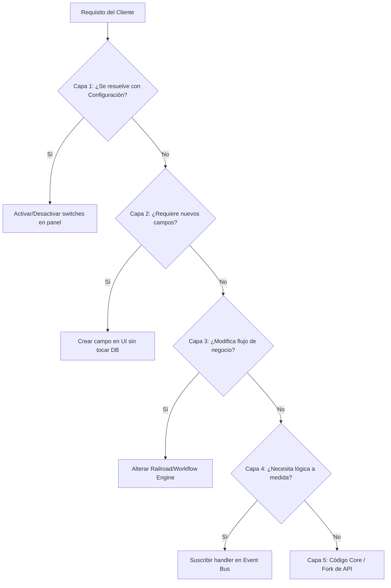

# Las 5 Capas de Personalización del ERP

Para estructurar las solicitudes de adaptaciones de los clientes de manera eficiente sin sobrecargar al equipo de desarrollo, los analistas técnicos deben seguir el siguiente árbol de decisión estructurado en **5 capas concéntricas**.

---

## 🗺️ Estructura de las Capas

### 🔹 Capa 1: Configuración de Rubro (Zero Code)
- **Método**: Activación/desactivación de features pre-construidas por rubro.
- **Ejemplo**: Habilitar balanza de pesaje para carnicerías, o comanderas/KDS para gastronomía.

### 🔹 Capa 2: Campos Dinámicos (Metadata)
- **Método**: Panel de "Campos Personalizados" para inyectar campos en formularios del dashboard (clientes, facturas, productos).
- **Ejemplo**: Agregar "Número de lote de trazabilidad ANMAT" en medicamentos.

### 🔹 Capa 3: Orquestación de Procesos (Workflow Engine)
- **Método**: Configuración del motor de workflows secuenciales (Railroad Config).
- **Ejemplo**: Modificar si el remito de entrega de stock se genera automáticamente antes o después de la facturación A/B.

### 🔹 Capa 4: Event-Driven Programming (Low Code)
- **Método**: Creación de listeners sobre el canal global de eventos del ERP sin alterar el código del servicio núcleo.
- **Ejemplo**: Registrar un evento para disparar un mail a compras cuando el stock de un producto cruza el mínimo histórico.

### 🔹 Capa 5: Desarrollo de Endpoints e Integraciones (Hard Code)
- **Método**: Modificación de código TypeScript directo en API Routes (`app/api/*`) y persistencia física en base de datos.
- **Ejemplo**: Conectar un lector de balanza IoT propietario del agro.
