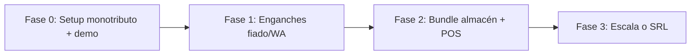

# Roadmap venta — Vendedor en calle (fase monotributo)

Guía para vender **digitalización + IA** en comercios retail, empezando **sin sociedad** y facturando como **monotributista**.

## ¿Dónde está el detalle?

El documento maestro (checklists, speech, precios, diagramas) vive en el repo:

👉 [docs/comercial/roadmap-venta-vendedor-calle.md](https://github.com/pablocla/erpia/blob/main/docs/comercial/roadmap-venta-vendedor-calle.md)

En la wiki resumimos el mapa y los enlaces al resto del ecosistema documentado.

---

## Qué ya existía vs qué es nuevo

| Tema | Documento existente |
|------|---------------------|
| Enganches y precios | [12-enganches-comerciales](/dashboard/documentacion/marketplace/12-enganches-comerciales) — ver `docs/marketplace/` |
| Ciclo venta → implementación | `docs/marketplace/00-ciclo-completo.md` |
| Proceso CCA | [Proceso CCA](/dashboard/documentacion/operaciones/claver-cloud-proceso-implementacion) |
| Pack retail almacén | `docs/marketplace/14-pack-almacen-rosario.md` |
| **Playbook vendedor calle** | **Nuevo** — roadmap monotributo arriba |

---

## Roadmap en 4 fases

| Fase | Duración | Meta |
|------|----------|------|
| **0** | 2 semanas | Facturación, MP, Cloud, plantillas |
| **1** | 2 meses | 3–5 clientes en fiado o cobranzas |
| **2** | 3 meses | 2 bundles + 1 homologación AFIP |
| **3** | 6+ meses | Zona 2, referidos, evaluar sociedad |

---

## Regla de venta

**No vendas el ERP en la primera visita.** Vendé un enganche con dolor inmediato:

- `pos.fiado_barrio` — $4.990/mes (trial 14 días)
- `intang.cobranzas_wa` — $20.000/mes
- `pool-almacen-barrio` — $34.900/mes (upsell)

Speech base: *“Ordenamos una cosa que hoy te está costando plata; el resto crece después.”*

---

## Flujo post-cierre

1. Cliente acepta (WhatsApp u orden de servicio).
2. Vos facturás (monotributo) y cobrás.
3. Provisioning en [Claver Cloud](/claver-cloud/provisioning/new).
4. Capacitación 30 min + seguimiento día 12 del trial.

---

## Enlaces producto

- [Grupo Claver](/claver) · [Clavis](/claver/claverp) · [Ecommerce](/claver/ecommerce)
- [Login demo](/login) · [Claver Cloud](/claver-cloud)