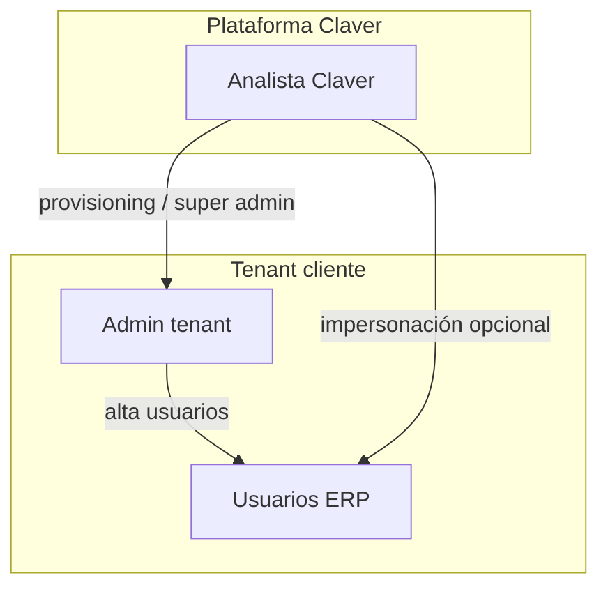
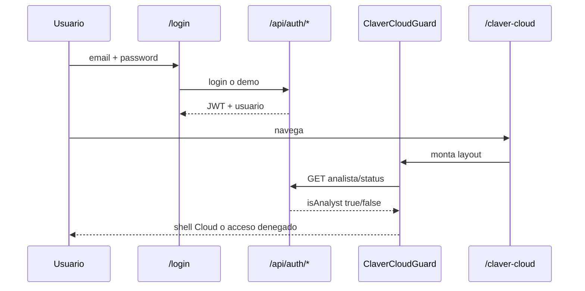

# Identidad, cuentas y claves

Este documento **no** es el proceso comercial de implementación (eso está en [Proceso CCA](/dashboard/documentacion/operaciones/claver-cloud-proceso-implementacion)).  
Acá se documenta **ingeniería**: actores, flujos, secretos de plataforma y puntos de código.

---

## 1. Tres capas de identidad (no mezclar)

| Capa | Qué es | Quién la crea | Dónde vive |
|------|--------|---------------|------------|
| **Plataforma Claver** | Analistas que operan `/claver-cloud` | DevOps / admin Claver (`CLAVER_ANALYST_EMAILS` o rol `analista_claver`) | Env + tabla `Usuario` |
| **Tenant (cliente)** | Empresa + usuarios ERP (`empresaId`) | Provisioning Cloud o registro demo | `Empresa`, `Usuario` |
| **Integraciones / fiscal** | Claves AFIP, MP, Shopify, cifrado | Analista + cliente en parametrización | Env global + `IntegracionCredencial` |

Cada capa tiene documento y responsable distinto. **No** documentar AFIP y login ERP en el mismo runbook.

---

## 2. Actores y permisos

| Actor | Cómo se reconoce | Acceso |
|-------|------------------|--------|
| **Analista Claver** | `isClaverAnalyst(email, rol)` → rol `analista_claver` **o** email en `CLAVER_ANALYST_EMAILS` | `/claver-cloud`, APIs `/api/claver/*` |
| **Admin tenant** | `rol` ∈ `administrador`, `admin`, `dueno`, `gerente` | `/dashboard/*` de su `empresaId` |
| **Usuario operativo** | Resto de roles (`cajero`, `vendedor`, …) | Módulos según rol y SKUs activos |
| **Demo pública** | `testing@claver.com.ar` | Solo ERP demo (testing) |
| **Admin plataforma** | `pabloclavero03@gmail.com` | Claver Cloud (`CLAVER_ANALYST_EMAILS` o fallback) |

**Código:** `lib/auth/claver-analyst.ts`, `components/claver-cloud/claver-cloud-guard.tsx`, `GET /api/claver/analista/status`.

---

## 3. Flujos de creación de cuenta (mapa de ingeniería)

Documentá cada flujo con la misma plantilla:

1. **Trigger** (UI o API)
2. **Precondiciones**
3. **Tablas / registros creados**
4. **Credenciales entregadas** (email, pantalla, nunca en logs)
5. **Rollback** si falla a mitad

### 3.1 Demo rápida (desarrollo / ventas)

| Campo | Valor |
|-------|-------|
| Trigger | `POST /api/auth/demo` o botón "Acceder con cuenta Demo" en `/login` |
| Crea | `Empresa` CUIT `20-00000000-0`, `Usuario` `testing@claver.com.ar`, rol `administrador` |
| Token | JWT vía `AuthService.generarToken()` |
| Seed | `prisma/seed.ts` (misma cuenta) |

### 3.2 Registro self-service (si está habilitado)

| Campo | Valor |
|-------|-------|
| Trigger | `/login/register` → API de registro |
| Crea | Nueva `Empresa` + primer `Usuario` admin |
| Notas | Documentar política de contraseña y verificación de email si aplica |

### 3.3 Provisioning Claver Cloud (cliente real)

| Campo | Valor |
|-------|-------|
| Trigger | `/claver-cloud/provisioning/new` → `POST /api/claver-cloud/provisioning/orders` |
| Crea | `Empresa`, entornos dev/val/prd, admin tenant, `ProyectoImplementacion` (CCA), SKUs iniciales |
| Email ONBOARD | `lib/provisioning/provisioning-service.ts` |
| Proceso funcional | [Proceso CCA § CCA-030](/dashboard/documentacion/operaciones/claver-cloud-proceso-implementacion) |

### 3.4 Alta de usuarios dentro del tenant

| Campo | Valor |
|-------|-------|
| Trigger | `/dashboard/usuarios` (admin tenant) |
| API | Rutas bajo `/api/usuarios` con `whereEmpresa()` |
| Regla | Nunca crear usuario sin `empresaId` del JWT |

### 3.5 Analistas Claver (acceso torre)

| Campo | Valor |
|-------|-------|
| Producción | Variable `CLAVER_ANALYST_EMAILS=email1@claver.com,email2@claver.com` en Vercel |
| Alternativa | Usuario en DB con `rol: analista_claver` |
| Asignación por cliente | Tabla `AnalistaAsignacion` — ver `getAnalystEmpresaScope()` |

---

## 4. Secretos y claves (inventario técnico)

| Secreto | Propósito | Rotación | Documentar en |
|---------|-----------|----------|---------------|
| `JWT_SECRET` | Firmar sesiones ERP/Cloud | Cada deploy crítico | Runbook deploy |
| `CLAVER_ANALYST_EMAILS` | Allowlist analistas | Alta/baja de equipo | Este doc + `.env.example` |
| `INTEGRATION_ENCRYPTION_KEY` | Cifrar credenciales de integraciones por tenant | Anual / incidente | `multi-tenant.mdx` |
| `AFIP_CERT_PROD` / `AFIP_KEY_PROD` | Factura electrónica | Según AFIP | `afip-integracion.mdx` |
| Passwords `Usuario.password` | Login ERP | Política cliente | Manual analista |

**Regla:** las contraseñas de usuario van hasheadas (`bcrypt`); **nunca** se regeneran en claro salvo reset explícito.

---

## 5. JWT y sesión (cómo encaja Cloud con ERP)

1. Login → JWT en `localStorage` (`token`)
2. Middleware / APIs → `getAuthContext()` lee `Authorization: Bearer`
3. Claver Cloud además setea cookie legible por SSR: `lib/auth/token-cookie.ts`
4. Guard cliente: `ClaverCloudGuard` llama `/api/claver/analista/status` antes de renderizar

---

## 6. Dónde documentar cada cosa (estructura recomendada)

| Tema | Tipo de doc | Ubicación sugerida |
|------|-------------|-------------------|
| Venta → go-live cliente | Proceso funcional CCA | `operaciones/claver-cloud-proceso-implementacion.mdx` ✅ |
| Cuentas, JWT, analistas | **Este doc** — referencia técnica | `developer/identity-and-access.mdx` |
| Aislamiento por empresa | Arquitectura | `developer/multi-tenant.mdx` ✅ |
| AFIP / MP / OAuth | Integración por proveedor | `funcional/*` o `developer/*` por módulo |
| Checklist pre go-live | Operación analista | `analista/checklist-go-live.mdx` ✅ |

Cuando agregues un flujo nuevo de credenciales, sumá una fila en **§3** con la plantilla de los 5 puntos.

---

## 7. Puntos de entrada UI (referencia)

| Superficie | Ruta al Cloud |
|------------|---------------|
| Matriz comercial | `/claver` → botón y card "Claver Cloud" |
| Nav comercial | Header/footer `ClaverShell`, `/claver/ecommerce` |
| ERP logueado | Sidebar "Claver Interno", topbar "Cloud", menú usuario |
| Directo | `/claver-cloud` (requiere analista) |
| Login | Footer link + post-login analista → Cloud; cliente → `/dashboard` |

---

## 8. Checklist para nuevos desarrollos

- [ ] ¿La API usa `getAuthContext` + `whereEmpresa`?
- [ ] ¿Cloud usa `getClaverAnalystContext` o variante con `empresaId`?
- [ ] ¿Las contraseñas nuevas pasan por `bcrypt`?
- [ ] ¿Los emails de bienvenida no incluyen secretos en logs?
- [ ] ¿Actualizaste este doc si agregaste un flujo de alta?