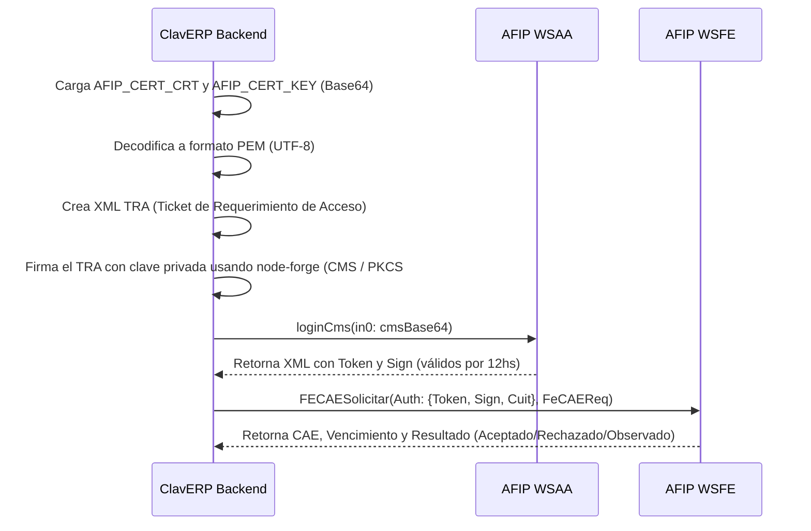

# Guía de Integración AFIP — ClavERP

Esta guía detalla los pasos técnicos y operativos necesarios para configurar la facturación electrónica nativa con la **Administración Federal de Ingresos Públicos (AFIP)** en ClavERP, utilizando el Web Service de Facturación Electrónica (WSFE v1) y el Web Service de Autenticación y Autorización (WSAA).

---

## 1. Conceptos Clave de la Integración

ClavERP interactúa con AFIP de forma directa mediante protocolos SOAP/WSDL y criptografía PKCS#7.

- **WSAA (Web Service de Autenticación y Autorización)**: Autentica a la empresa emisora utilizando un par de claves (privada/pública) y un certificado digital emitido por AFIP. Retorna un token temporal y una firma (`Token` y `Sign`) con validez de 12 horas.
- **WSFE v1 (Web Service de Factura Electrónica)**: Permite solicitar el **CAE (Código de Autorización Electrónico)** para facturas, notas de crédito y notas de débito de tipo A, B, C, M, y MiPyME FCE.
- **TRA (Ticket de Requerimiento de Acceso)**: Mensaje XML firmado que se envía a WSAA para obtener el token temporal.

---

## 2. Generación de Credenciales y Certificados

Para operar, cada contribuyente (empresa tenant) necesita un certificado de firma digital (`.crt`) y su correspondiente clave privada (`.key`).

### Paso 1: Generación de Clave Privada y Pedido de Certificado (CSR)
Ejecutar el siguiente comando en una terminal con `openssl` instalado (reemplazar los valores de `CN`, `O`, `serialNumber` por los reales):

```bash
# 1. Generar la clave privada de 2048 bits
openssl genrsa -out mi_empresa.key 2048

# 2. Generar el archivo CSR (Certificate Signing Request)
# CN: Nombre descriptivo del sistema o empresa
# O: Razón social de la empresa
# serialNumber: CUIT en formato CUIT XX-XXXXXXXX-X o simplemente CUIT XXXXXXXXXXX
openssl req -new -key mi_empresa.key -subj "/C=AR/O=Razon Social S.A./CN=ClavERP/serialNumber=CUIT 20123456789" -out mi_empresa.csr
```

### Paso 2: Obtención del Certificado en AFIP

#### Para Entorno de Homologación (Pruebas)
1. Ingresar con clave fiscal al portal de AFIP.
2. Ir a **Administración de Certificados Digitales** (si no está activo, adherir el servicio en el administrador de relaciones).
3. Seleccionar o dar de alta el CUIT, cargar el archivo `.csr` y descargar el certificado generado (`.crt` o `.pem`).
4. Asociar el computador al Web Service `wsfe` desde la sección de relaciones de homologación en el portal de AFIP.

#### Para Entorno de Producción (Real)
1. Ingresar con clave fiscal a la web de AFIP.
2. Utilizar el servicio **Administración de Certificados Digitales**.
3. Cargar el `.csr` y descargar el `.crt` generado.
4. Ingresar al **Administrador de Relaciones de Clave Fiscal** y autorizar el servicio **Facturación Electrónica** (WSFE) al computador / alias creado con el certificado nuevo.

---

## 3. Configuración del Entorno en ClavERP

Las credenciales digitales se cargan en el sistema mediante variables de entorno codificadas en **Base64** para evitar problemas de formato con los saltos de línea del estándar PEM.

### Conversión de Certificados a Base64
En consola Linux/macOS o PowerShell en Windows, codificar los archivos descargados:

```powershell
# En Windows (PowerShell)
[Convert]::ToBase64String([IO.File]::ReadAllBytes("mi_empresa.key")) > key_base64.txt
[Convert]::ToBase64String([IO.File]::ReadAllBytes("mi_empresa.crt")) > cert_base64.txt
```

### Configuración en `.env` (Variables Globales)
Añadir al archivo `.env` de producción o staging:

```env
# CUIT emisor (11 dígitos, sin guiones)
AFIP_CUIT="20123456789"

# Modo de operación: homologacion | produccion
AFIP_MODO="homologacion"

# Contenido del certificado y clave en una sola línea (codificado en Base64)
AFIP_CERT_CRT="MIIE3TCCAysCAQEwDQYJKoZIhvcNAQELBQAw..."
AFIP_CERT_KEY="MIIEvgIBADANBgkqhkiG9w0BAQEFAASCBKgw..."
```

> [!NOTE]
> En entornos multi-tenant (donde cada sucursal o empresa cliente tiene su propio CUIT), ClavERP permite cargar los certificados directamente en la base de datos dentro del modelo `Empresa` o `ConfiguracionFiscal`, decodificándolos de manera dinámica usando el mismo método.

---

## 4. Flujo de Autenticación y Emisión de Comprobantes

El cliente de integración de ClavERP está implementado en `lib/afip/soap-client.tsx` y encapsula toda la interacción SOAP.



---

## 5. Respuestas de AFIP y Manejo de Errores

Cada interacción con AFIP se registra en la tabla `AfipWebserviceLog` para auditoría y troubleshooting. Los estados de respuesta son:

1. **A (Aprobado)**: El comprobante fue autorizado y se asignó el número de CAE y su fecha de vencimiento.
2. **R (Rechazado)**: AFIP rechazó la solicitud. En el log se detallarán los códigos de error (ej: desincronización de números de comprobante, CUIT receptor inválido, inconsistencia en alícuotas de IVA).
3. **O (Observado)**: El comprobante es aceptado pero AFIP devuelve advertencias. Se debe alertar al emisor pero se permite continuar con la operación.

---

## 6. Contingencia Offline y CAEA

Cuando los servidores de AFIP no responden o el comercio local pierde la conexión a internet:
- **CAEA (Clave de Autorización Electrónica Anticipada)**: Permite facturar sin conexión de forma diferida. El sistema solicita al inicio del período una clave de contingencia. Las facturas emitidas de forma local en `IndexedDB` se registran con este CAEA y se sincronizan a AFIP una vez recuperada la red en un plazo máximo de 12 horas.
- **Servicio de Sincronización**: Localizado en `lib/afip/sync-pendientes.ts`, encargado de reintentar la emisión y subida de lotes rechazados o diferidos por falta de red.
