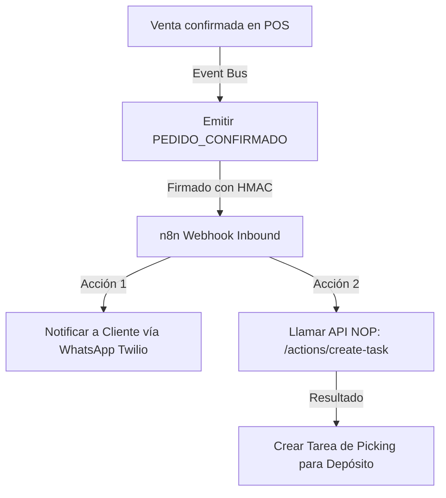

# NOP Automation Hub & Orquestación con n8n

El ERP evoluciona de un sistema de registro a un **orquestador dinámico de procesos**. En lugar de acoplar un motor rígido de workflows en el backend, NOP implementa un **Automation Hub** nativo que despacha eventos firmados y recibe acciones mediante APIs REST protegidas.

---

## 🧭 Flujo de Trabajo (Mermaid)

El siguiente flujo ilustra cómo interactúan NOP, n8n y los servicios externos al ocurrir una venta que requiere logística:



---

## 📊 Matriz de Decisión: n8n vs. Operaciones Locales

| Situación | n8n (Flujos Descentralizados) | NOP (Lógica Core) |
|---|---|---|
| **Cobranza multi-canal** | ✅ Enviar recordatorios, mails, actualizar CRM externos. | ❌ Solo emite el vencimiento y calcula saldos. |
| **Reposición simple de Stock** | ❌ Operación de alta velocidad e interna. | ✅ Resuelto en `compras-service.ts`. |
| **Facturación AFIP** | ❌ Requiere transaccionalidad exacta y certificados locales. | ✅ Adaptador AFIP directo SOAP. |
| **Sincronización MercadoLibre** | ✅ Mapear productos, catalogación externa. | ❌ |

---

## 📡 Lista de 15 Eventos del Negocio

Todos los eventos salientes encapsulan su carga útil en el siguiente **Envelope** de seguridad:

```json
{
  "eventId": "uuid-v4",
  "event": "STOCK_BAJO",
  "empresaId": 1,
  "timestamp": "2026-06-19T12:00:00Z",
  "idempotencyKey": "empresa-1-stock-ibup-20260619",
  "data": {
    "productoId": 15,
    "codigo": "MED-IBU-600",
    "stockActual": 3.0,
    "stockMinimo": 10.0
  },
  "signature": "hmac-sha256-signature-hex"
}
```

### Detalle de Eventos Soportados

1.  **`VENTA_EMITIDA`**: Factura o ticket generado exitosamente.
2.  **`NC_EMITIDA`**: Nota de crédito impositiva registrada.
3.  **`STOCK_BAJO`**: El inventario de un artículo cruza su mínimo.
4.  **`CAJA_ABIERTA`**: Apertura de turno de caja en el POS.
5.  **`CAJA_CERRADA`**: Cierre de turno de caja (incluye diferencias de arqueo).
6.  **`CIERRE_Z_EJECUTADO`**: Emisión del reporte de cierre fiscal diario Z.
7.  **`CAE_RECHAZADO`**: Error o rechazo de comprobante por parte de AFIP.
8.  **`CAE_OBTENIDO`**: Autorización exitosa de factura electrónica.
9.  **`PEDIDO_CONFIRMADO`**: Venta B2B que entra en preparación.
10. **`OC_CREADA`**: Generación de Orden de Compra para reposición.
11. **`CUENTA_VENCIDA`**: Mora en cuenta corriente del cliente.
12. **`APROBACION_PENDIENTE`**: Compra/gasto que excede límites del rol.
13. **`USUARIO_CREADO`**: Alta de nuevo usuario o empleado.
14. **`TURNO_AGENDA_CREADO`**: Reserva en el módulo de turnos (gastronomía/salud/estética).
15. **`WEBHOOK_TEST`**: Ping manual enviado desde la interfaz de administración.

---

## 🤖 Catálogo de Empleados Virtuales (Virtual Workers)

Los **Trabajadores Virtuales** simulan perfiles técnicos del negocio operando playbooks fijos parametrizados:

*   **Ana Reposición (Rol: `deposito`)**: Monitorea alertas `STOCK_BAJO` y genera Órdenes de Compra borrador.
*   **Bot Caja Noche (Rol: `cajero`)**: Monitorea que no queden cajas abiertas en el POS al final de la jornada.
*   **Leo Cobranzas (Rol: `vendedor`)**: Ejecuta crons de escaneo de deudas y despacha avisos de cobro.
*   **Sofía Onboarding (Rol: `administrador`)**: Prepara checklists de tareas para el alta de nuevos empleados.

👉 Detalle completo: [Empleados Virtuales](/dashboard/documentacion/funcional/automation-workers)

---

## 🔌 Modos de conexión n8n

| Modo | Config `metadata.modoConexion` | Descripción |
|------|-------------------------------|-------------|
| **A — Webhook** | `webhook` (default) | NOP hace POST a URL n8n |
| **B — Inbound** | — | n8n llama `/api/automation/webhooks/inbound` |
| **C — Poll** | `poll` | n8n consulta `GET /api/automation/poll` |
| **D — Ambos** | `both` | Cola poll + webhook simultáneo |

👉 [Guía API Poll](/dashboard/documentacion/funcional/automation-api-poll) | [Entitlements](/dashboard/documentacion/developer/automation-entitlements)
