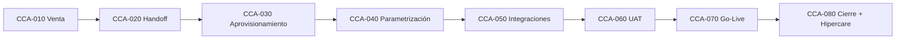
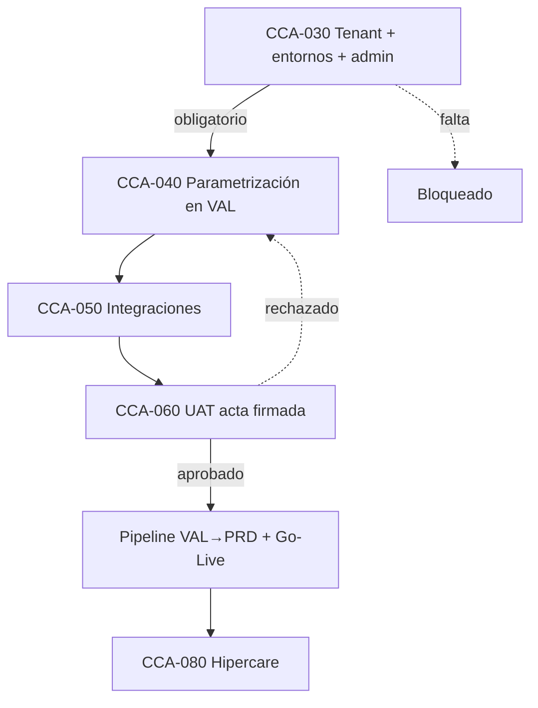
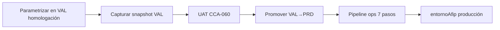

# Claver Cloud — Proceso de Implementación (CCA)

> **Metodología CCA** (*Claver Cloud Activation*) — equivalente funcional a TOTVS MIT + aba ONBOARD de TCloud.  
> Audiencia: comercial, analista implementador, DBA, soporte N2/N3.

---

## 1. Objetivo y alcance

Este documento define el **proceso obligatorio** para activar un nuevo cliente en ClavERP / Claver Cloud, desde el cierre comercial hasta la **puesta en marcha operativa** y el período de hipercare.

**No es un runbook técnico de deploy global** (eso está en [Deploy Runbook](/dashboard/documentacion/operaciones/deploy-runbook)).  
Es la **guía funcional por cliente**: qué datos pedir, en qué orden, quién es responsable, qué evidencia guardar.

### Referencias normativas (trazabilidad)

| Norma / referencia | Aplicación en Claver Cloud |
|--------------------|----------------------------|
| **ISO 9001:2015** §8.5 | Procedimiento documentado, registros por cliente, revisión antes de entrega |
| **ISO/IEC 20000** | Gestión de servicio: SLAs, incidentes, cambios (tickets + `SistemaLog`) |
| **ISO/IEC 27001** | Control de accesos, credenciales, segregación por `empresaId` |
| **TOTVS MIT 001** | Fases de implementación, acta de entrega, matriz de requerimientos |
| **TOTVS TCloud ONBOARD** | Panel con URL, credenciales, datos técnicos del ambiente antes del primer login |

---

## 2. Mapa de procesos CCA (equivalente MIT)



### CCA con gates (no avanzar sin entregable)



### Provisioning (CCA-030)

```mermaid
flowchart LR
    P[/claver-cloud/provisioning/new] --> E[Empresa + CUIT]
    E --> ENT[ensureTenantEntornos dev/val/prd]
    ENT --> ADM[Usuario admin + email ONBOARD]
    ADM --> CCA[ProyectoImplementacion]
    CCA --> HC[Healthcheck ops]
```

### VAL → PRD

Detalle: `docs/operaciones/VAL_PRD_ACTIVACION.md`



| Código | Nombre | Entregable principal | Responsable |
|--------|--------|----------------------|-------------|
| **CCA-001** | Metodología (este doc) | Procedimiento vigente | Líder implementación |
| **CCA-010** | Venta y contratación | Orden de servicio + SKUs | Comercial |
| **CCA-020** | Handoff comercial → implementación | Dossier cliente iniciado | Comercial + PM |
| **CCA-030** | Aprovisionamiento Cloud | Tenant + entornos + URL acceso | Analista / DevOps |
| **CCA-040** | Parametrización funcional | Empresa operativa en **val** | Analista |
| **CCA-050** | Integraciones y canales | Credenciales validadas | Analista + cliente |
| **CCA-060** | UAT y capacitación | Acta UAT firmada | Analista + key user |
| **CCA-070** | Go-Live | Producción AFIP + primer día operativo | Analista + cliente |
| **CCA-080** | Cierre e hipercare | Acta de cierre + plan 15/30 días | PM + soporte |

> En TOTVS, el proceso **MIT 006** y afines cubren fases de implantação com checklists por módulo. En Claver, cada CCA-04x/05x se desglosa por **feature** (`FeatureEmpresa`) y **SKU** (`SuscripcionModulo`).

---

## 3. CCA-010 — Venta y contratación

### 3.1 Datos mínimos del contrato (antes de escalar a implementación)

| Campo | Obligatorio | Ejemplo |
|-------|-------------|---------|
| Razón social | Sí | Distribuidora Norte S.A. |
| CUIT | Sí | 30-71234567-8 |
| Rubro / vertical | Sí | `distribuidora`, `gastronomia`, `agro`… |
| Plan comercial | Sí | Starter / Pro / Enterprise |
| SKUs add-on | Sí | `channel.mercadopago`, `channel.whatsapp`… |
| Cantidad de usuarios | Sí | 5 (Pro) |
| Cantidad de puntos de venta | Sí | 2 cajas + 1 depósito |
| Condición AFIP | Sí | RI / Monotributista |
| Jurisdicción IIBB | Sí | CABA, convenio multilateral, etc. |
| Contacto decisor (go-live) | Sí | Nombre, email, teléfono |
| Contacto operativo diario | Sí | Administración / cajero referente |
| Contacto contador | Recomendado | Estudio contable externo |
| Fecha objetivo go-live | Sí | 2026-07-15 |
| `planHosting` | Sí | `shared` (default) o `dedicated` (Enterprise) |

### 3.2 Registro comercial en sistema

1. Alta de `SuscripcionModulo` por cada SKU vendido (`lib/platform/commercial-service.ts`).
2. Ticket interno de implementación (módulo `implementacion` en soporte).
3. Asignación de analista en `AnalistaAsignacion` si aplica escopo restringido.

**Criterio de salida CCA-010:** orden de servicio aprobada + pago / facturación según política comercial.

---

## 4. CCA-020 — Handoff comercial → implementación

### 4.1 Dossier del cliente (plantilla obligatoria)

Crear carpeta: `docs/clientes/<empresaId>/DOSSIER.md` (ver plantilla en repo).

Debe incluir:

- Acta de kick-off (fecha, participantes, alcance IN/OUT)
- Matriz de requerimientos (ID, prioridad, módulo, estado)
- Diagrama de procesos del cliente (venta → factura → cobro mínimo)
- Riesgos y dependencias (certificado AFIP pendiente, migración de sistema legado, etc.)

### 4.2 Checklist de handoff (comercial no suelta sin esto)

- [ ] CUIT validado en AFIP / padrón
- [ ] Rubro y módulos vendidos coinciden con propuesta (`COMERCIAL.md` / cotización)
- [ ] Cliente informado: **homologación primero, producción después**
- [ ] Analista asignado en Claver Interno → Asignaciones
- [ ] Ventana de implementación acordada (horas de corte, feriados)

---

## 5. CCA-030 — Aprovisionamiento Cloud (CRÍTICO — antes del primer deploy)

> Equivalente TCloud: **sin URL y sin tenant no hay ONBOARD**.  
> Este paso resuelve la pregunta "¿qué falta antes de Vercel?".

### 5.1 Datos críticos pre-deploy (bloqueantes)

Estos datos deben existir **antes** de considerar el cliente "activado":

| # | Dato | Quién lo provee | Dónde queda registrado |
|---|------|-----------------|------------------------|
| 1 | **`empresaId`** (tenant) | Analista / seed | Tabla `Empresa` |
| 2 | **URL de acceso** (`NEXT_PUBLIC_APP_URL`) | DevOps | `TenantEntorno.urlBase` (prd) |
| 3 | **Entornos dev / val / prd** | Sistema (lazy) | `ensureTenantEntornos()` |
| 4 | **Usuario admin inicial** | Analista | `Usuario` + JWT primer login |
| 5 | **`DATABASE_URL`** (shared o dedicated) | DevOps | Vercel env / vault |
| 6 | **`JWT_SECRET`** del entorno | DevOps | Vercel env (nunca por cliente) |
| 7 | **Plan hosting** | Comercial | `Empresa.planHosting` |
| 8 | **Asignación analista** | Líder ops | `AnalistaAsignacion` |

### 5.2 URLs y topología Claver Cloud

| Entorno | URL típica (shared SaaS) | Uso |
|---------|--------------------------|-----|
| **prd** | `https://app.claver.cloud` o dominio white-label | Operación real |
| **val** | `https://val.app.claver.cloud` o preview Vercel | UAT del cliente |
| **dev** | `https://dev.app.claver.cloud` o branch preview | Parametrización analista |

**Enterprise dedicated (futuro PR-G):** cada entorno puede tener `TenantEntorno.metadata.connectionMode = "vault"` y proyecto Vercel propio (`metadata.vercelProjectId`).

### 5.3 Procedimiento de alta tenant

```text
1. Crear registro Empresa (CUIT único, rubro, condicionIva, planHosting)
2. Crear usuario administrador (rol: administrador / dueno)
3. POST /api/config/onboarding/apply  — rubro + módulos + plan cuentas
4. inicializarFeaturesDesdeRubro(empresaId, rubroId)
5. ensureTenantEntornos(empresaId)    — dev, val, prd
6. Activar SuscripcionModulo por SKU vendido
7. Healthcheck: GET /api/ops/overview (cliente) o /api/claver/ops/[empresaId] (analista)
8. Entregar al cliente: URL + usuario + contraseña temporal (ONBOARD)
```

### 5.4 Panel ONBOARD del cliente (equivalente TCloud)

Tras CCA-030, el cliente debe recibir un **pack de bienvenida** con:

| Ítem ONBOARD | Contenido Claver Cloud |
|--------------|------------------------|
| URL ERP | `TenantEntorno[prd].urlBase` |
| URL portal B2B | `{urlBase}/portal` (si aplica) |
| URL tienda | `{urlBase}/tienda?empresaId=X` (si aplica) |
| Usuario y contraseña inicial | Email admin + reset obligatorio |
| Código empresa / CUIT | Para soporte y facturación |
| Entorno AFIP actual | `homologacion` hasta CCA-070 |
| Centro de Operaciones | `/dashboard/operaciones` (admin/gerente) |
| Contacto analista asignado | Email + SLA |
| Links capacitación | `/dashboard/capacitacion` |

**Criterio de salida CCA-030:** healthcheck OK + pack ONBOARD enviado + registro en dossier.

---

## 6. CCA-040 — Parametrización funcional

Orden recomendado (capas 1→3, ver [Guía del Analista](/dashboard/documentacion/analista/guia-implementacion)):

### Fase 4.1 — Empresa y fiscal base

| Tarea | Ruta / API | Evidencia |
|-------|------------|-----------|
| Datos empresa | `/dashboard/configuracion` | Captura pantalla |
| Puntos de venta AFIP | Config fiscal | PV habilitados en AFIP |
| Certificado homologación | AFIP CRT/KEY en `Empresa` | Test conexión OK |
| Plan de cuentas | `/dashboard/contabilidad/plan-cuentas` | Export PDF |
| Depósitos / sucursales | Productos → Inventario | Al menos 1 depósito |
| Numeradores | Configuración | Factura A/B, NC, remito |

### Fase 4.2 — Activación de módulos (departamentos funcionales)

Los "departamentos" del ERP son **features**, no bases de datos separadas:

```text
FeatureRubro (template) → FeatureEmpresa (override por cliente) → Menú dashboard
```

| Departamento negocio | Feature keys típicas |
|---------------------|----------------------|
| Ventas / POS | `pos`, `pedidos_venta`, `presupuestos` |
| Compras | `ordenes_compra`, `remitos` |
| Stock | `stock`, `stock_multi_deposito`, `picking_warehouse` |
| Finanzas | `contabilidad`, `cobros_pagos`, `cheques`, `cc_cp` |
| Impuestos | `iva_digital`, `iibb`, `sicore`, `retenciones` |
| Logística | `logistica`, `hojas_ruta` |
| RRHH | Módulo empleados + campo `departamento` en legajo |
| IA / Automatización | `agentes_ia`, SKU `automation.n8n_hub` |

Activar vía:
- UI: `/dashboard/capacitacion/parametrizacion`
- API: `setFeature(empresaId, featureKey, { activado: true })`
- Onboarding IA: `/api/config/onboarding/apply`

### Fase 4.3 — Maestros

| Maestro | Método de carga | Validación |
|---------|-----------------|------------|
| Clientes | CSV / manual | Al menos 1 cliente de prueba |
| Proveedores | CSV / manual | Si módulo compras activo |
| Productos | CSV / manual | Códigos de barra + IVA |
| Listas de precio | Config | Lista default asignada |
| Usuarios por rol | `/dashboard/usuarios` | Matriz rol × módulo |

**Criterio de salida CCA-040:** venta de prueba en **homologación** con CAE obtenido.

---

## 7. CCA-050 — Integraciones y canales

Credenciales **por tenant** (preferido) o env global documentado en dossier.

| Integración | Datos requeridos | Validación |
|-------------|------------------|------------|
| AFIP producción | CRT + KEY producción | `AfipConnectionTest` OK |
| Mercado Pago | Access token + webhook secret | Cobro test $1 |
| Mercado Libre | OAuth app + user_id | Sync 1 publicación |
| WhatsApp (Twilio) | SID, token, número | Mensaje test |
| Shopify / Tienda Nube | API keys + webhook URL | Pedido test |
| Logística (OCA, Andreani) | Credenciales carrier | Cotización test |
| n8n Automation | URL hub + API key | Playbook test |

Registrar en dossier: fecha, responsable, resultado test, **sin guardar secretos en texto plano** (referencia a vault / BD cifrada).

---

## 8. CCA-060 — UAT y capacitación

### 8.1 Escenarios UAT mínimos (por rol)

| Rol | Escenario | Resultado esperado |
|-----|-----------|-------------------|
| Cajero | Venta POS → factura B → cierre caja | CAE + arqueo OK |
| Administración | NC sobre factura | NC con CAE |
| Depósito | Pedido → picking → remito | Stock descontado |
| Contador | Libro IVA / export | Archivo generado |
| Gerente | Dashboard KPIs | Datos coherentes |

### 8.2 Capacitación

- Sesión por rol (máx. 2 h c/u)
- Manual: `/dashboard/capacitacion/manual-usuario`
- Registro de asistencia en dossier

### 8.3 Acta UAT

Plantilla:

```markdown
## Acta UAT — [Cliente] — [Fecha]
- Ambiente: val / homologación AFIP
- Participantes: ...
- Escenarios ejecutados: X/Y OK
- Observaciones abiertas: ticket #...
- Aprobación go-live: Sí / No / Condicionada
- Firma cliente: ___________
- Firma analista: ___________
```

**Criterio de salida CCA-060:** acta UAT aprobada o condicionada con tickets P0 resueltos.

---

## 9. CCA-070 — Go-Live

Checklist extendido (complementa [Checklist Go-Live](/dashboard/documentacion/analista/checklist-go-live)):

### 9.1 Pre go-live (T-48h)

- [ ] Backup DB (`OpsJob` tipo `backup_db`)
- [ ] Migraciones al día (`migrate_db` en val → pipeline val→prd)
- [ ] Certificado AFIP **producción** cargado
- [ ] `Empresa.entornoAfip` = `produccion`
- [ ] Stock inicial conciliado con inventario físico
- [ ] Usuarios con contraseña cambiada
- [ ] Integraciones en credenciales de producción
- [ ] Plan de rollback documentado (ver §9.3)

### 9.2 Día G (ventana de corte)

| Hora | Actividad |
|------|-----------|
| H-2 | Congelar cargas en sistema legado |
| H-1 | Último backup + snapshot |
| H0 | Switch entorno AFIP a producción |
| H+1 | Primera venta real supervisada |
| H+4 | Verificación caja + stock |
| H+8 | Checkpoint con cliente |

### 9.3 Rollback

Si falla emisión AFIP o stock crítico en las primeras 4 h:

1. Revertir `entornoAfip` a homologación (solo emergencia)
2. Restaurar backup si corrupción de datos
3. Ticket P0 + escalamiento analista lead
4. Comunicación formal al cliente (plantilla en dossier)

**Criterio de salida CCA-070:** primera jornada operativa cerrada sin incidentes P0 abiertos.

---

## 10. CCA-080 — Cierre e hipercare

| Período | Actividad | SLA sugerido |
|---------|-----------|--------------|
| Día 1-7 | Hipercare intensivo | Respuesta 4 h |
| Día 8-15 | Seguimiento diario | Respuesta 8 h |
| Día 16-30 | Soporte estándar | Según plan |
| Día 30 | Acta de cierre proyecto | — |

Entregables finales:

- Acta de cierre firmada
- Dossier actualizado (features activas, campos custom, integraciones)
- Handoff a soporte N1 con base de conocimiento
- Encuesta NPS / CSAT

---

## 11. Matriz RACI resumida

| Actividad | Comercial | Analista | DevOps | Cliente | Contador |
|-----------|-----------|----------|--------|---------|----------|
| CCA-010 Venta | R/A | I | — | C | I |
| CCA-030 Aprovisionamiento | I | R | A | I | — |
| CCA-040 Parametrización | — | R/A | C | C | C |
| CCA-050 Integraciones | — | R | C | A | — |
| CCA-060 UAT | — | R | — | A | C |
| CCA-070 Go-Live | I | R/A | C | A | C |
| CCA-080 Cierre | C | R | — | A | — |

*R = Responsable, A = Aprueba, C = Consultado, I = Informado*

---

## 12. Registros y auditoría (ISO 9001)

Cada cliente debe conservar:

| Registro | Ubicación | Retención |
|----------|-----------|-----------|
| Dossier implementación | `docs/clientes/<empresaId>/` | 5 años |
| Actas kick-off, UAT, cierre | Dossier | 5 años |
| Cambios de configuración | `SistemaLog` + auditoría config | 2 años |
| Jobs ops (backup, deploy) | `OpsJob` | 1 año |
| Tickets soporte | Módulo soporte | Según SLA |

---

## 13. Herramientas del repo

| Necesidad | Archivo / ruta |
|-----------|----------------|
| Guard multi-tenant | `lib/auth/empresa-guard.ts` |
| Analista cross-tenant | `lib/auth/claver-analyst.ts` |
| Entornos dev/val/prd | `lib/ops/ops-service.ts` → `ensureTenantEntornos` |
| Onboarding funcional | `app/api/config/onboarding/apply/route.ts` |
| Features por rubro | `lib/config/rubro-config-service.ts` |
| SKUs comerciales | `lib/platform/entitlements.ts` |
| Consola ops cliente | `/dashboard/operaciones` |
| Flota analista | `/dashboard/claver/operaciones` |
| Plantilla dossier | `docs/clientes/_TEMPLATE/DOSSIER.md` |

---

## 14. Comparación rápida TCloud vs Claver Cloud

| TCloud (TOTVS) | Claver Cloud |
|----------------|--------------|
| Aba ONBOARD con URLs y credenciales | Pack ONBOARD post CCA-030 |
| Topologías RM / Protheus | Entornos `TenantEntorno` dev/val/prd |
| License Server | `SuscripcionModulo` + `canUseSku` |
| SFTP para archivos | Export CSV / API / futuro SFTP |
| MIT 001 fases de implantação | Procesos CCA-010 a CCA-080 |
| Ambiente dedicado | `planHosting: dedicated` |

---

## 15. Torre de implementaciones (producto)

Seguimiento en vivo en **`/dashboard/claver/implementaciones`** (analistas CLAVER):

| Función | Detalle |
|---------|---------|
| Alta de proyecto | POST desde UI — crea `ProyectoImplementacion` + entornos |
| Fases CCA | Checklist interactivo CCA-010 → CCA-080 |
| Pack ONBOARD | URL, notas, marca de entrega |
| Señales automáticas | Detecta entornos, wizard onboarding, AFIP producción |
| KPIs | Activos, atrasados, sin ONBOARD, avance promedio |

API: `GET/POST /api/claver/implementaciones`, `GET/PATCH /api/claver/implementaciones/[id]`

## 16. Próximos pasos de producto

- Formulario web CCA-020 que precarga dossier en repo
- Pipeline val→prd obligatorio antes de go-live Enterprise
- Integración CRM → alta automática de `Empresa` + `SuscripcionModulo`