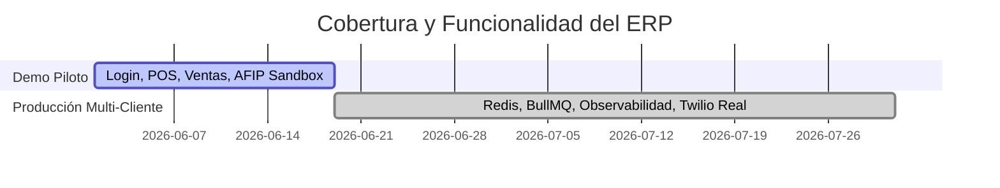

# Score de Calidad y Preparación (QA)

Realizamos auditorías de código constantes para verificar la preparación del sistema tanto para instancias de demostración controladas como para producción de alta concurrencia.

## 📊 Score Global (Junio 2026)

### 🧪 Preparación para Demostraciones y Piloto
**Score: 85/100**  
- **Ventas & POS**: Auto-resolución de precios operando de manera integrada en la vista del Cajero y en pedidos.
- **Base de Datos**: Seed de datos consistente para 5 rubros de negocio (barberías, gastronomía, estaciones de servicio, farmacia, veterinaria).
- **Tests**: 286 tests unitarios pasando exitosamente.

### 🏭 Preparación para Producción Masiva
**Score: 68/100**  
*Gaps pendientes para alcanzar el 100/100:*
1. **Infraestructura de Cola Asíncrona (Redis + BullMQ)**: Faltan procesadores en background para la descarga de PDFs de AFIP, reportes contables e IA.
2. **APM / Monitorización**: Sin telemetría centralizada en producción para diagnosticar tiempos de respuesta lentos en el pool de conexiones Prisma.
3. **Planes de Contingencia en AFIP**: Falta lógica avanzada de facturación offline para emitir comprobantes de contingencia con CAEA si el web service de AFIP cae temporalmente.
