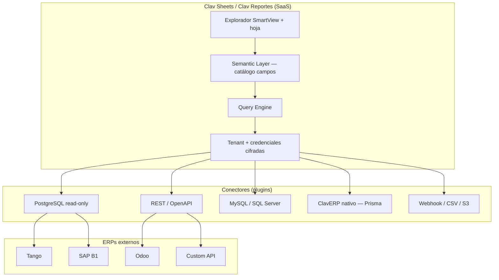
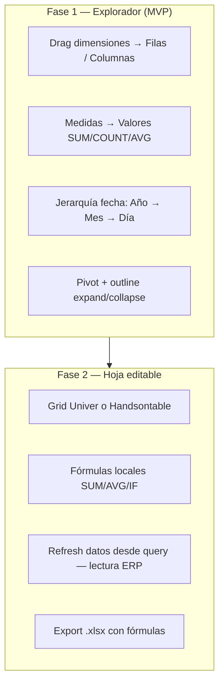
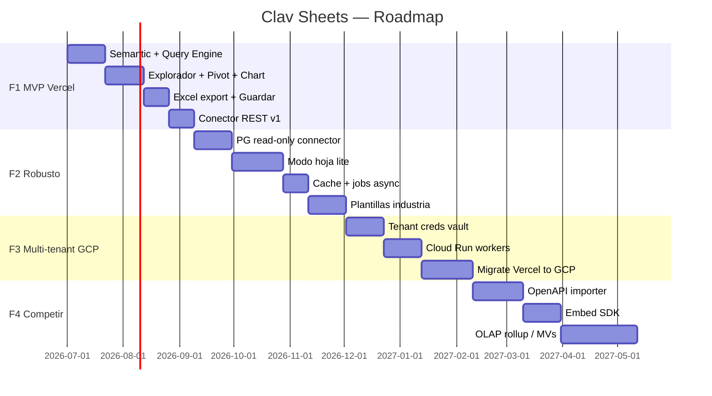
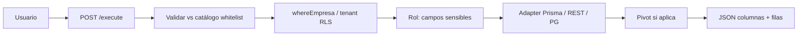

# Clav Sheets — Arquitectura del módulo vertical de reporting

> Documento de arquitectura senior full-stack.  
> Producto: **módulo vertical de reporting + tablas dinámicas** (SmartView / Metadata mejorado en la nube), integrable con cualquier ERP vía API o base de datos.  
> Stack: Next.js 15, Vercel → GCP, Supabase multi-tenant, Tailwind + shadcn/ui.  
> Fecha: junio 2026.

---

## Resumen ejecutivo

| Pregunta | Respuesta |
|----------|-----------|
| ¿Vertical a cualquier ERP? | **Sí**, vía conectores REST + DB read-only + semantic layer |
| ¿REST + DB + APIs? | **Sí**; “cualquier API” implica mapping por conector, no magia automática |
| ¿Modo hoja SmartView? | **Sí** — Fase 1: pivot + outline tree; Fase 2: grid editable tipo Excel |
| ¿Mejor que SmartView / T-Reports? | **Sí** en cloud, UX, API-first, export Excel profesional |
| ¿Mejor que Metabase? | **En embed ERP + hoja + plantillas verticales**; no en SQL ad-hoc maduro |
| ¿Mejor que Power BI? | **No globalmente**; sí en PyME ERP (precio, flujo operativo, español AR) |

**Posicionamiento:** no competir como “otro Power BI”. Competir como **SmartView en la nube para cualquier ERP** — tabular + pivot + hoja + Excel serio + conectores REST/DB.

**Hueco de mercado:** consultoras y PyMEs que hoy exportan CSV a Excel y arman pivots a mano.

---

## 1. ¿Puede ser vertical a cualquier ERP?

Sí, como **producto separado** — pero no como “conectá lo que quieras sin configuración”. El modelo viable:



### Matriz de conexiones

| Conexión | ¿Viable? | Condición |
|----------|----------|-----------|
| **REST API** | ✅ Mejor primer conector externo | OpenAPI o mapping manual endpoint → fuente |
| **PostgreSQL / Supabase** | ✅ | Solo lectura, schema whitelist, RLS o `empresa_id` |
| **“Cualquier API”** | ⚠️ Parcial | Sin estándar = costo de onboarding por cliente |
| **SQL libre del usuario** | ❌ No en MVP | Metabase sí; este producto compite con **semántica ERP** |
| **Modo hoja Excel editable** | ✅ | Diferenciador vs Power BI / Metabase |

**ClavERP** es el **primer conector nativo** (dogfooding). El producto es un **motor + semantic layer + conectores**, no un clon de Excel ni de Power BI.

---

## 2. Competencia — diagnóstico honesto

| Competidor | ¿Podemos ganarle? | Dónde ganamos | Dónde perdemos |
|------------|-------------------|---------------|----------------|
| **SmartView** (Hyperion / legacy) | **Sí, en UX moderna** | Web, drag-drop, Excel export, multi-ERP API, sin cliente Windows | OLAP MOLAP pesado, consolidación holding |
| **T-Reports** (TOTVS) | **Sí, en agilidad** | Cloud, REST, precio, tiempo de implementación | Ecosistema cerrado TOTVS + plantillas legacy |
| **Metadata / Evolution** | **Sí, en PyME AR** | Plano/pivot/gráfico en browser | Años de reportes instalados on-premise |
| **Metabase** | **Parcial** | Modo hoja, templates industriales, embed ERP, fiscal AR | SQL explorer maduro, comunidad OSS |
| **Power BI** | **No en BI enterprise** | Precio PyME, embedded en flujo ERP, vertical rubro | DAX, Fabric, ecosistema Microsoft |

---

## 3. Qué tenemos hoy (ClavERP + stack declarado)

| Capa | Estado |
|------|--------|
| **Next.js 15 App Router** | ✅ Producción |
| **Supabase / PostgreSQL** | ✅ Multi-tenant vía `empresaId` |
| **UI** | ✅ shadcn + Tailwind; `DataTable` custom (patrón TanStack, no dependencia explícita) |
| **Gráficos** | ✅ Recharts (`/dashboard`, `/dashboard/kpis`) |
| **Export** | 🟡 CSV fuerte; XLSX mencionado en `export-service`, **ExcelJS no instalado** |
| **Reportes** | 🟡 Plantillas HTML + stub Jasper (`lib/reportes/`) |
| **Pivot / explorador / hoja** | ❌ |
| **Query engine genérico** | ❌ Consultas hardcodeadas por módulo |
| **Conectores externos** | ❌ Solo ERP propio |
| **Semantic catalog** | ❌ |
| **Producto standalone** | ❌ Acoplado a `/dashboard` |

**Balance:** ~60% en datos/auth/multi-tenant; ~10% en reporting avanzado.

### Piezas reutilizables del repo

| Archivo | Rol futuro |
|---------|------------|
| `lib/export/export-service.ts` | Base CSV → evolucionar a ExcelJS |
| `lib/reportes/plantillas-service.ts` | Evolucionar a `ReporteDefinicion` JSON |
| `lib/kpis/kpi-service.ts` | Medidas precalculadas en catálogo |
| `components/data-table.tsx` | Base tabla plana |
| `lib/platform/commercial-service.ts` | SKU + `usageEvent` para monetización |
| `whereEmpresa()` / JWT | Patrón multi-tenant |

Ver también: `docs/MONETIZACION_REPORTES_BI.md` sección 12 (plano + pivot + gráfico).

---

## 4. Qué falta técnicamente

### MVP fuerte (mínimo vendible)

| # | Componente | Por qué |
|---|------------|---------|
| 1 | **Semantic catalog** | Sin catálogo no hay SmartView ni multi-ERP seguro |
| 2 | **Query engine** (JSON → datos, sin SQL usuario) | Corazón del producto |
| 3 | **Explorador UI** (drag → Filas / Columnas / Valores / Filtros) | Experiencia SmartView |
| 4 | **3 renderers**: plano, pivot, gráfico | Una query, tres vistas |
| 5 | **Excel export real** (ExcelJS: hojas, formatos, totales) | Expectativa #1 usuario ERP |
| 6 | **Guardar definición** (`ReporteDefinicion` por tenant) | Reutilización |
| 7 | **Conector REST v1** | Vertical a otros ERPs |
| 8 | **Conector PostgreSQL read-only v1** | Segundo conector más pedido |

### Producto competitivo (post-MVP)

| # | Componente |
|---|------------|
| 9 | Modo hoja editable (grid) |
| 10 | Programación email PDF/Excel |
| 11 | Plantillas por industria |
| 12 | OpenAPI importer → catálogo semi-automático |
| 13 | Cache Redis + límites por plan |
| 14 | Worker async (reportes >30s) |
| 15 | Embed SDK (iframe en ERP tercero) |
| 16 | Audit log de queries |

---

## 5. Principio de diseño — una definición, tres renderers

```mermaid
flowchart TB
    subgraph Def["ReportDefinition (JSON)"]
        D1[fuente + connectorId]
        D2[dimensiones + medidas]
        D3[filtros]
        D4[vista: plano | pivot | grafico | hoja]
        D5[layout bandas / chart config]
    end

    subgraph Motor["Core portable"]
        CAT[semantic/catalog]
        QE[query-engine]
        PE[pivot-engine]
        ADP[connector-adapters]
    end

    subgraph Render["UI React"]
        R1[PlanoRenderer — TanStack Table]
        R2[PivotRenderer — outline tree]
        R3[ChartRenderer — Recharts]
        R4[SheetRenderer — Univer Fase 2]
    end

    subgraph Export["Salida"]
        E1[CSV / XLSX multi-hoja]
        E2[PDF]
    end

    Def --> QE
    CAT --> QE
    ADP --> QE
    QE --> R1 & R2 & R3 & R4
    R1 & R2 & R3 --> E1 & E2
```

---

## 6. Modo hoja SmartView — cómo se resuelve

SmartView no es Excel completo: es **modelo dimensional en grilla** (filas/columnas desplegables, drill, expand/collapse).



**Regla MVP:** la hoja **no escribe al ERP** (solo lectura + cálculos locales). Escritura al ERP = fase posterior con permisos explícitos.

**Mejor que SmartView si:**
- Todo en browser, sin add-in Excel ni cliente Windows
- Export XLSX con formato en 1 click
- Conectores REST sin consultor Hyperion
- Plantillas por rubro listas para usar

---

## 7. Roadmap en fases



### Fase 1 — MVP (Vercel, 8–10 semanas)

- `/reportes/explorar` con drag-drop (`@dnd-kit`)
- Pivot + tabla + gráfico (toggle)
- Export Excel multi-hoja (datos + pivot)
- Guardar / cargar reportes
- Auth JWT + `tenantId`
- Conector nativo ClavERP (Prisma)
- Conector REST demo (1 ERP)
- Límites: 10k filas, timeout 30s

### Fase 2 — Versión robusta (12–16 semanas)

- PostgreSQL read-only (credenciales en Supabase Vault)
- Modo hoja lite (Univer)
- Inngest / BullMQ para reportes pesados
- 5 packs plantillas industria
- Excel: formatos condicionales, fórmulas simples

### Fase 3 — Multi-tenant + Google Cloud

- **Control plane** (defs, usuarios, billing) vs **data plane** (queries)
- Cloud Run: workers + conectores DB
- GCS para exports grandes
- Secret Manager para credenciales ERP cliente
- Migración progresiva desde Vercel

### Fase 4 — Competir con SmartView / Metabase / Power BI

- OpenAPI → semantic auto-mapping
- Embed white-label
- Rollups nocturnos (materialized views por tenant)
- Puente opcional Power BI dataset (tier enterprise)

---

## 8. Stack técnico recomendado

### Arquitectura lógica

```mermaid
flowchart LR
    subgraph Frontend["Next.js 15"]
        EX[FieldExplorer — dnd-kit]
        TBL[SheetGrid / TanStack Table]
        PIV[PivotView]
        CH[Recharts]
    end

    subgraph API["API Routes"]
        CAT[/catalog]
        RUN[/execute]
        EXP[/export]
        CON[/connectors]
    end

    subgraph Core["lib/reporting — portable"]
        SEM[semantic-layer]
        QE[query-engine]
        PE[pivot-engine]
        XL[excel-builder]
        ADP[connector-adapters]
    end

    subgraph Data["Persistencia"]
        SB[(Supabase — defs, tenants)]
        REDIS[(Upstash — cache)]
        GCS[(GCS — archivos)]
    end

    EX --> RUN
    RUN --> QE --> ADP
    ADP --> ERP[(ERP REST / DB)]
    QE --> PE
    EXP --> XL
    RUN --> SB
    QE --> REDIS
```

### Tabla de componentes

| Necesidad | Elección | Notas |
|-----------|----------|-------|
| Tabla avanzada | **TanStack Table v8** + `@tanstack/react-virtual` | Evitar AG Grid (licencia SaaS) |
| Drag campos | **@dnd-kit/core** | SmartView UX |
| Pivot | Motor **propio server-side** + UI outline | No depender solo de `react-pivottable` |
| Modo hoja | **Univer** (Fase 2) o Handsontable CE | Luckysheet abandonado |
| Export Excel | **ExcelJS** (write) | Instalar en `package.json` |
| Import Excel | **SheetJS** (opcional) | |
| Gráficos | **Recharts** | Ya en repo |
| PDF | `@react-pdf/renderer` o Puppeteer en worker | |
| Auth | **jose JWT** + Supabase RLS | Patrón ClavERP |
| Credenciales | **Supabase Vault** → GCP Secret Manager | Nunca plaintext |
| Jobs | **Inngest** (Vercel) → **BullMQ** (GCP) | Exports CPU-heavy |
| Cache | **Upstash Redis** | TTL 5–15 min por query |
| Validación | **Zod** `ReportDefinition` | |
| API pública | REST v1 + OpenAPI propia | GraphQL overkill MVP |

---

## 9. Query engine y seguridad

### Contrato (pseudocódigo)

```typescript
type ReportDefinition = {
  connectorId: string
  fuente: string
  dimensiones: { campo: string; agruparPor?: "dia" | "mes" | "anio" }[]
  medidas: { campo: string; fn: "sum" | "count" | "avg" | "min" | "max" }[]
  filtros: { campo: string; op: "eq" | "gte" | "lte" | "in" | "contains"; valor: unknown }[]
  pivot?: { filas: string[]; columnas: string[]; medida: string }
  chart?: { tipo: "bar" | "line" | "pie" | "area"; ejeX: string; series: string[] }
  limit?: number
}
```

### Flujo seguro



- **Prohibido:** SQL libre del usuario en MVP.
- **Campos sensibles** (`costo`, `margen`): `requiereRol` en catálogo.
- **Límite comercial:** `recordUsageEvent(tenantId, "clav.sheets", "execute")`.

### Pivot — estrategias por volumen

| Estrategia | Cuándo | Tecnología |
|------------|--------|------------|
| Server pivot | <50k filas agregadas | `pivot-engine.ts` en Node |
| SQL pivot | Reportes pesados | `GROUP BY CUBE`, vistas materializadas PG |
| Client pivot | Dataset chico post-agg | TanStack + expand local |

---

## 10. Modelo de datos (Supabase / Prisma)

```prisma
model ReporteDefinicion {
  id          Int      @id @default(autoincrement())
  tenantId    Int      // empresaId o orgId SaaS
  codigo      String
  nombre      String
  descripcion String?
  connectorId String   @default("claverp")
  tipoVista   String   // plano | pivot | grafico | hoja | mixto
  definicion  Json
  publico     Boolean  @default(false)
  creadoPor   Int?
  createdAt   DateTime @default(now())
  updatedAt   DateTime @updatedAt

  @@unique([tenantId, codigo])
}

model ReporteCatalogoCampo {
  id         Int      @id @default(autoincrement())
  connectorId String
  fuente     String
  campo      String
  etiqueta   String
  tipo       String   // dimension | medida | fecha
  agregacion String?  // sum | count | avg
  rubros     String[] // vacío = todos
  requiereRol String[] @default([])
}

model ConectorConfig {
  id         Int      @id @default(autoincrement())
  tenantId   Int
  tipo       String   // rest | postgres | mysql | claverp
  nombre     String
  config     Json     // baseUrl, headers — secretos en Vault
  activo     Boolean  @default(true)
  createdAt  DateTime @default(now())

  @@index([tenantId])
}
```

---

## 11. APIs del producto

```
GET  /api/reporting/catalog?connectorId=
POST /api/reporting/execute              → { definicion } → datos
GET  /api/reporting/definitions
POST /api/reporting/definitions
GET  /api/reporting/definitions/:id/export?format=csv|xlsx|pdf
POST /api/reporting/definitions/:id/schedule
GET  /api/reporting/connectors
POST /api/reporting/connectors           → alta REST/PG (admin)
POST /api/reporting/connectors/:id/test
```

---

## 12. Pantallas y botones

| Ruta | Botones clave |
|------|---------------|
| `/reportes` | **Nuevo reporte**, **Duplicar**, **Programar envío** |
| `/reportes/explorar` | **Fuente**, drag campos, **Filtros**, **Ejecutar**, **Tabla \| Pivot \| Gráfico**, **Guardar**, **Exportar Excel** |
| `/reportes/[id]` | **Editar**, **Exportar**, **Compartir**, **Fijar en dashboard** |
| `/reportes/plantillas` | **Usar plantilla** (pack industria) |
| `/reportes/hoja/[id]` (Fase 2) | **Refrescar datos**, **Exportar xlsx**, fórmulas locales |

---

## 13. Estructura de carpetas

### Fase A — Módulo en ClavERP (ahora)

```
lib/reporting/
  semantic/
    catalog.ts
    types.ts              # Zod ReportDefinition
  engine/
    query-engine.ts
    pivot-engine.ts
    aggregators.ts
  connectors/
    types.ts
    claverp-adapter.ts    # ⭐ primero
    rest-adapter.ts
    postgres-adapter.ts
  export/
    excel-builder.ts      # ExcelJS
    pdf-builder.ts
  cache/
    query-cache.ts

app/api/reporting/
  catalog/route.ts
  execute/route.ts
  definitions/route.ts
  definitions/[id]/export/route.ts
  connectors/route.ts

app/(product)/reportes/
  page.tsx
  explorar/page.tsx       # ⭐ crear primero
  [id]/page.tsx
  components/
    FieldExplorer.tsx     # ⭐ prioridad 1
    PivotGrid.tsx
    ChartPanel.tsx
    FilterBar.tsx
    ViewToggle.tsx
```

### Fase B — Producto standalone (fase 3 GCP)

```
apps/sheets-web/
packages/reporting-core/
packages/connector-odoo/
services/query-worker/    # Cloud Run
```

---

## 14. Orden de implementación (valor rápido)

| Orden | Componente | Días est. |
|-------|------------|-----------|
| 1 | `semantic/types.ts` + `catalog.ts` (ventas ClavERP) | 3 |
| 2 | `query-engine.ts` + `POST /api/reporting/execute` | 5 |
| 3 | `FieldExplorer.tsx` + `FilterBar.tsx` | 5 |
| 4 | `PivotGrid.tsx` + `pivot-engine.ts` | 5 |
| 5 | `excel-builder.ts` + Exportar | 3 |
| 6 | `ReporteDefinicion` Prisma + guardar/cargar | 3 |
| 7 | `rest-adapter.ts` (1 ERP demo) | 5 |

**MVP usable: ~4 semanas** enfocado; **8–10 semanas** pulido comercial.

---

## 15. Riesgos y mitigaciones

| Riesgo | Impacto | Mitigación |
|--------|---------|------------|
| Datos grandes (>100k filas) | Timeout Vercel, OOM | Agregar en SQL/API; límite por plan; worker async |
| Multi-tenant + credenciales DB | Fuga cross-tenant | Vault, pool por tenant, whitelist schema |
| “Cualquier API” | Semanas por ERP | Conectores certificados + OpenAPI importer |
| Costo Vercel (PDF/Excel CPU) | Factura alta | Inngest / Cloud Run para exports |
| Bundle hoja (Univer) | LCP lento | Lazy load en `/reportes/hoja` |
| Fórmulas Excel | Paridad imposible corto plazo | Subset: SUM, AVG, IF, refs locales |
| Competir con Power BI en marketing | Expectativa errónea | Posicionar “tabular ERP-native” |

**Moat #1:** semantic layer curado (o semi-auto OpenAPI).  
**Moat #2:** modo hoja + Excel export superior a Metabase en contexto ERP.

---

## 16. Monetización (SKU único)

| Plan | Incluye | Precio orientativo ARS/mes |
|------|---------|---------------------------|
| **Base** (incluido ERP) | Tabla plana, 3 reportes guardados | — |
| **Clav Sheets Starter** | Pivot + gráficos + Excel | +$9.900 |
| **Clav Sheets Pro** | Ilimitado + PDF bandas + email programado + plantillas | +$19.900 |
| **Clav Sheets API** | Execute API + embed | +$29.900 |
| **Vertical Pack** | Plantillas industria (agro, retail…) | +$14.900 c/u |

Eventos `usageEvent`: `execute`, `export_xlsx`, `export_pdf`, `connector_sync`.

---

## 17. Prompt Gemini — Sprint 1

```
Implementar Clav Sheets Sprint 1 en repo pos-system-argentina:

1. Crear lib/reporting/ (semantic, engine, export/excel-builder con ExcelJS)
2. Prisma: ReporteDefinicion, ReporteCatalogoCampo, seed catálogo ventas ClavERP
3. claverp-adapter: facturas, clientes, productos — groupBy Prisma
4. POST /api/reporting/execute — Zod ReportDefinition, whereEmpresa
5. UI app/reportes/explorar — FieldExplorer (dnd-kit), FilterBar, ViewToggle
6. PivotGrid server-side pivot-engine
7. Botones: Ejecutar, Guardar, Exportar Excel (multi-hoja: datos + pivot)
8. Tests vitest: query-engine, pivot-engine, excel-builder

NO SQL libre. NO Power BI. Locale es-AR. Multi-tenant obligatorio.
```

---

## 18. Referencias en el repo

| Documento / archivo | Relación |
|---------------------|----------|
| `docs/MONETIZACION_REPORTES_BI.md` | BI, pivot, monetización ERP |
| `lib/export/export-service.ts` | Export CSV actual |
| `lib/reportes/*` | Plantillas legacy |
| `lib/kpis/kpi-service.ts` | KPIs → medidas catálogo |
| `lib/platform/commercial-service.ts` | Billing add-ons |
| `components/data-table.tsx` | Patrón tabla |

---

## 19. Sprint 1 — implementado (jun 2026)

| Entregable | Ruta / archivo |
|------------|----------------|
| Modelos Prisma | `ReporteDefinicion`, `ReporteCatalogoCampo` + migración `20260623210000_clav_sheets` |
| Core | `lib/reporting/semantic/*`, `engine/*`, `connectors/claverp-adapter.ts`, `export/excel-builder.ts` |
| APIs | `/api/reporting/catalog`, `execute`, `definitions`, `export` |
| UI | `/dashboard/reportes`, `/dashboard/reportes/explorar` |
| Componentes | `components/reporting/*` (FieldExplorer, FilterBar, ViewToggle, Plano, Pivot, Chart) |
| Menú | Gestión Comercial → **Clav Sheets** |
| Deps | `exceljs`, `@dnd-kit/*`, `@tanstack/react-table` |
| Tests | `__tests__/reporting/pivot-engine.test.ts` |

**Fuentes MVP:** ventas, clientes, productos, compras, stock_movimientos.

**Pendiente Sprint 2:** modo hoja editable, conector REST, conector PostgreSQL, programación email.

### Sprint 1+ — pulido explorador (jun 2026)

| Mejora | Detalle |
|--------|---------|
| Abrir guardado | `/dashboard/reportes/explorar?load={id}` + botón **Abrir** en lista |
| Restaurar definición | `lib/reporting/restore-definition.ts` — no resetea pivot al cargar |
| Drill-down | Clic en fila/columna/celda pivot o celda plana → filtro `eq` + re-ejecutar |
| Breadcrumb drill | `DrillBreadcrumb` — navegar niveles / limpiar |
| Gráficos | Selector bar / line / area / pie |

---

## 20. FODA — Clav Sheets vs T-Reports / SmartView / reporting moderno

Análisis estratégico post-Sprint 1. Objetivo: paridad **percibida** con herramientas de reporting empresarial (T-Reports TOTVS, Oracle SmartView, Metadata/Evolution, FineReport) y BI moderno (Power BI, Metabase).

### Fortalezas (internas — hoy)

| # | Fortaleza | Por qué importa |
|---|-----------|-----------------|
| F1 | **Cloud-native + embed ERP** | Sin cliente Windows; vive dentro del flujo operativo ClavERP |
| F2 | **Semantic layer cerrado** | Campos whitelist → seguro multi-tenant; el usuario no rompe la DB |
| F3 | **Pivot + plano + gráfico unificados** | Misma definición JSON para las tres vistas (como SmartView) |
| F4 | **Export Excel multi-hoja** | Salida que consultoras y contadores ya usan |
| F5 | **Dogfooding ClavERP** | Catálogo alineado a ventas/stock/fiscal AR desde día 1 |
| F6 | **API-first** | `/execute`, `/export`, `/definitions` → integrable en portal, cron, IA |
| F7 | **Drill-down básico** | Clic → filtro → re-ejecutar (MVP de interactividad OLAP) |
| F8 | **Precio y time-to-value PyME** | Sin licencias Hyperion/TOTVS ni implementación de meses |

### Debilidades (internas — gaps reales)

| # | Debilidad | Impacto vs competencia |
|---|-----------|------------------------|
| D1 | **Un solo conector** (ClavERP Prisma) | No es “vertical a cualquier ERP” aún |
| D2 | **Sin diseñador de bandas** (Header/Group/Detail/Footer) | T-Reports/FineReport ganan en facturas/listados formales |
| D3 | **Sin jerarquías expandibles** (Año→Mes→Día) | SmartView OLAP se siente más “profundo” |
| D4 | **Sin drill-through** a detalle transaccional | Solo drill-down por filtro, no panel de líneas |
| D5 | **Sin modo hoja Excel editable** | Diferenciador prometido pero no entregado |
| D6 | **Catálogo estático en código** | No hay admin UI de campos calculados / joins |
| D7 | **Sin programación / suscripciones** | T-Reports y Power BI mandan reportes por mail |
| D8 | **Sin PDF pixel-perfect ni Word/PPT** | Export “serio” solo Excel hoy |
| D9 | **Gráficos básicos** | Sin combo, mapas, KPI cards, formatting condicional |
| D10 | **Sin SQL libre** | Metabase gana con power users |
| D11 | **Sin auditoría ni versionado** de definiciones | Enterprise exige trazabilidad |
| D12 | **Sin embed SDK / iframe tenant** | Power BI/Metabase venden “dashboard en tu web” |

### Oportunidades (externas — mercado)

| # | Oportunidad | Acción sugerida |
|---|-------------|-----------------|
| O1 | **PyMEs AR exportan CSV a Excel** | Plantillas verticales “Ventas por mes”, “Stock crítico” |
| O2 | **Consultoras sin SmartView en la nube** | Conector REST + PostgreSQL read-only como SKU |
| O3 | **ERPs legacy sin BI** (Tango, SAP B1, Odoo) | Posicionar “SmartView para tu ERP en 2 semanas” |
| O4 | **IA + lenguaje natural** | “Mostrame ventas por cliente último trimestre” → definición JSON |
| O5 | **Monetización add-on** | Tiers: Explorer / Pro (REST+PG) / Enterprise (embed+audit) |
| O6 | **Fiscal AR como vertical** | Reportes IVA, percepciones, libro IVA digital pre-armados |
| O7 | **Partners implementadores** | Catálogo semántico por industria (agro, retail, industria) |

### Amenazas (externas — riesgo)

| # | Amenaza | Mitigación |
|---|---------|------------|
| A1 | **Power BI / Looker gratis o barato** | No competir en OLAP global; ganar en flujo ERP + español AR |
| A2 | **Metabase open-source self-hosted** | Competir en semántica ERP + hoja + soporte local |
| A3 | **TOTVS/Tango bundlean reporting** | Tiempo de implementación y precio PyME |
| A4 | **Expectativa “es Excel en la web”** | Comunicar roadmap hoja editable; no oversell |
| A5 | **Scope creep conectores** | Mapping por conector facturado, no “cualquier API mágica” |
| A6 | **Performance sin OLAP cube** | Límites, cache, read replicas; no prometer millones de filas live |

### Matriz de brecha funcional (paridad percibida)

| Función | T-Reports | SmartView | Metadata | Power BI | Metabase | **Clav Sheets hoy** | Prioridad cierre |
|---------|-----------|-----------|----------|----------|----------|---------------------|------------------|
| Tabla plana | ✅ | ✅ | ✅ | ✅ | ✅ | ✅ | — |
| Pivot drag-drop | ✅ | ✅ | ✅ | ✅ | ⚠️ | ✅ | — |
| Drill-down | ✅ | ✅ | ✅ | ✅ | ⚠️ | ✅ MVP | P1 drill-through |
| Jerarquías tiempo | ✅ | ✅ | ✅ | ✅ | ⚠️ | ❌ | P1 |
| Diseñador bandas | ✅ | ⚠️ | ✅ | ❌ | ❌ | ❌ | P2 |
| Hoja editable | ⚠️ | ✅ | ✅ | ❌ | ❌ | ❌ | P1 (diferenciador) |
| Export Excel | ✅ | ✅ | ✅ | ✅ | ✅ | ✅ | P2 PDF |
| Export PDF formal | ✅ | ✅ | ✅ | ✅ | ⚠️ | ❌ | P2 |
| Conector REST/DB | ⚠️ | ❌ | ⚠️ | ✅ | ✅ | ❌ | P1 |
| SQL ad-hoc | ❌ | ❌ | ⚠️ | ✅ | ✅ | ❌ | No (por diseño) |
| Programación email | ✅ | ⚠️ | ✅ | ✅ | ✅ | ❌ | P2 |
| Embed / SDK | ⚠️ | ❌ | ⚠️ | ✅ | ✅ | ❌ | P3 |
| IA / NL query | ❌ | ❌ | ❌ | ✅ | ⚠️ | ❌ | P3 |
| Multi-ERP | ❌ | ❌ | ❌ | ✅ | ✅ | ❌ | P1 conectores |
| Fiscal AR nativo | ⚠️ | ❌ | ❌ | ❌ | ❌ | ✅ (vía ERP) | Oportunidad |

**Leyenda prioridad:** P1 = percepción “esto es un reporteador serio”; P2 = enterprise; P3 = moat / upsell.

### Veredicto honesto

| Pregunta | Respuesta |
|----------|-----------|
| ¿Parece T-Reports / SmartView hoy? | **Parcialmente** — el explorador drag-drop + pivot + drill básico evoca SmartView; falta bandas, jerarquías y hoja. |
| ¿Parece Power BI? | **No** — sin modelo semántico rico, DAX, ni visuals avanzados. |
| ¿Parece Metabase? | **No** — sin SQL ni exploración libre de schema. |
| ¿Dónde puede ganar ya? | **PyME ERP Argentina**: mismo login, datos fiscales, Excel export, precio, español. |
| ¿Qué cerraría el 80% de la percepción? | **Sprint 2–3:** jerarquías fecha, drill-through a detalle, conector REST/PG, 5 plantillas verticales, PDF simple. |
| ¿Qué lo haría “mejor que SmartView”? | **Hoja editable cloud + API + multi-ERP + IA** — combinación que legacy no tiene. |

---

*Documento vivo — actualizar al cerrar cada fase del roadmap.*