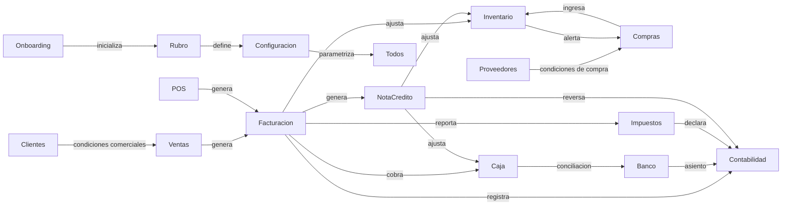
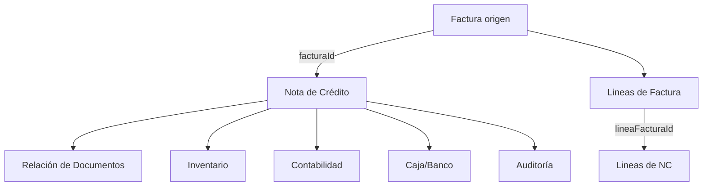
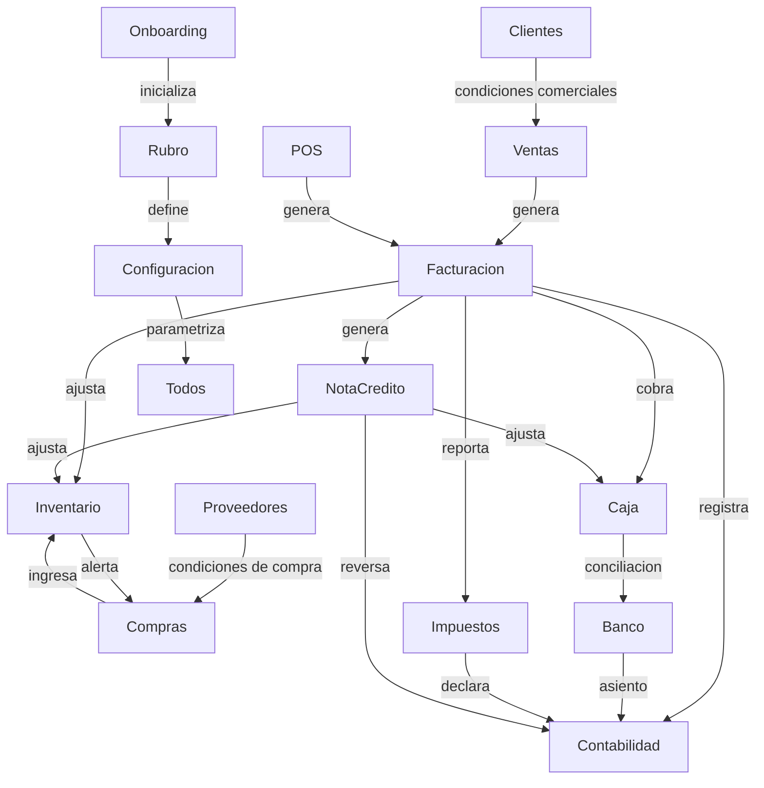
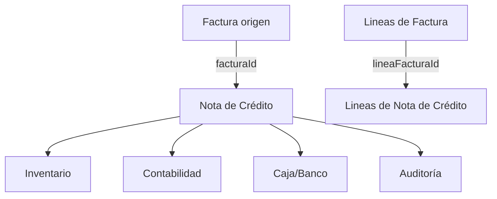

# Especificación Funcional ERP Retail Multirubro

## 1. Visión General del Sistema ERP Retail Multirubro

### Objetivo del ERP
El objetivo del ERP es ser la plataforma de gestión centralizada para empresas retail que operan con múltiples líneas de negocio, categorías de productos, sucursales y puntos de venta.

El sistema debe garantizar:
- Integridad funcional completa entre ventas, stock, compras, caja, contabilidad e impuestos.
- Parametrización multirubro con herencia jerárquica y reglas de sobrescritura.
- Trazabilidad de cada documento y cambio, con auditoría de origen y usuario.
- Consistencia fiscal argentina con facturación electrónica AFIP, CAEA y regímenes específicos.
- Gestión de Notas de Crédito con referencia directa y reversible a facturas.

### Módulos principales
1. **Gestión Comercial / Ventas** — controla desde presupuestos hasta facturación y notas de crédito.
2. **Punto de Venta (POS)** — soporta venta en mostrador, cierre X/Z y emisión fiscal.
3. **Stock / Inventario** — administra stock global, por depósito y por sucursal.
4. **Compras** — gestiona órdenes, recepción y facturación de proveedores.
5. **Caja / Banco** — vigila caja física, arqueos, conciliación bancaria y medios de pago.
6. **Contabilidad** — genera asientos, cierres y reportes contables.
7. **Impuestos** — calcula y declara IVA, IIBB, CAEA, CITI y retenciones.
8. **Catálogo / Productos** — mantiene el maestro de productos, variantes y precios.
9. **Clientes** — administra condiciones comerciales, crédito y segmentación.
10. **Proveedores** — gestiona acuerdos, condiciones y cuentas corrientes.
11. **Configuración / Seguridad** — administra permisos, features y parámetros.
12. **Onboarding / Rubro** — define rubros, reglas y templates de negocio.
13. **Logística / Picking** — controla despachos, transferencias y trazabilidad de depósitos.
14. **Industria / BOM** — gestiona producción, recetas y costos de manufactura.
15. **Hospitalidad / KDS** — administra mesas, comandas y cocina.
16. **RRHH** — controla usuarios, roles, turnos y auditoría.

## 2. Módulos del Sistema

### 2.1 Gestión Comercial / Ventas
- **Descripción funcional**: Gestiona el ciclo completo de la venta empresarial: cotizaciones, pedidos, facturación, remitos, notas de crédito/débito y liquidaciones. Integra condiciones comerciales, validación de stock, cálculo de impuestos y autorizaciones de descuento en línea con la política multirubro. Soporta rutas de aprobación, facturación parcial y anulación controlada.
- **Entidades/tablas principales**:
  - `Factura`, `LineaFactura`, `NotaCredito`, `LineaNotaCredito`
  - `Presupuesto`, `Pedido`, `Remito`, `RelacionDocumento`
  - `MotivoNotaCredito`, `CondicionPago`, `SerieFiscal`, `Cliente`
- **Campos clave y su herencia multirubro**:
  - `empresaId`, `sucursalId`, `rubroId`, `puntoVentaId`, `clienteId`, `serieId`, `tipoComprobante`, `listaPrecioId`.
  - Herencia multirubro: la serie fiscal, el tipo de comprobante, la lista de precios, la condición de pago y los límites de descuento se resuelven Global → Empresa → Sucursal → Rubro → Punto de Venta.
  - Las reglas de impuestos y las promociones se aplican según rubro y cliente, con overrides por punto de venta.
- **Parametrización específica**:
  - Global: moneda base, política de IVA, reglas de descuentos máximos, plazos fiscales y validaciones globales.
  - Empresa: condiciones comerciales, tipos de comprobantes disponibles, regímenes fiscales, políticas de facturación y reporting.
  - Sucursal: autorizaciones locales, stock asignado, horarios, validaciones cambiarias y acceso.
  - Rubro: promociones, lista de precios por categoría, márgenes mínimos, políticas de devolución y segmentación de clientes.
  - Punto de Venta: permisos de usuario, medios de pago, layout de venta, series fiscales específicas y CAEA.

### 2.2 Punto de Venta (POS)
- **Descripción funcional**: Brinda una experiencia de venta rápida en mostrador con lectura de códigos, pagos mixtos, manejo de combos, tickets y cierre X/Z. Controla la apertura y cierre de cajas, la emisión de facturas y tickets, y sincroniza con stock, contabilidad e impuestos.
- **Entidades/tablas principales**:
  - `PuntoVentaConfig`, `Caja`, `MovimientoCaja`, `FacturaPos`, `Ticket`
  - `CierreX`, `CierreZ`, `SerieFiscal`, `CAEA`, `DispositivoPuntoVenta`
- **Campos clave y su herencia multirubro**:
  - `cajaId`, `puntoVentaId`, `serieId`, `estadoCaja`, `medioPago`, `importe`, `usuarioId`.
  - Herencia multirubro: configuración fiscal, series y CAEA se definen hasta el nivel de punto de venta, con posibilidad de override por rubro o sucursal.
  - Los límites de venta y medios de pago permitidos se heredan desde niveles superiores y se restringen por PV.
- **Parametrización específica**:
  - Global: métodos de pago estándar, monedas aceptadas, políticas de rounding y validación.
  - Empresa: habilitación de series fiscales, CAEA, regímenes de facturación y reporting.
  - Sucursal: reglas de cierre X/Z, tolerancias de caja, autorizaciones de devolución y reimpresión.
  - Punto de Venta: layout, botones rápidos, permisos, filtros de productos y autorizaciones.

### 2.3 Stock / Inventario
- **Descripción funcional**: Controla existencias globales y por depósito, movimientos de entrada y salida, ajustes, inventarios físicos y transferencias. Administra disponibilidad para ventas, compras y producción, y emite alertas de rotación, bajo stock y caducidad.
- **Entidades/tablas principales**:
  - `Producto`, `StockDeposito`, `MovimientoStock`, `Deposito`, `AjusteStock`
  - `InventarioFisico`, `TransferenciaDeposito`, `SaldoStock`, `StockMinimo`
- **Campos clave y su herencia multirubro**:
  - `productoId`, `depositoId`, `cantidad`, `stockMinimo`, `tipoMovimiento`, `ubicacionId`.
  - Herencia multirubro: stock mínimo, reposición y políticas de inventario se calculan según rubro, categoría y punto de venta.
  - El nivel de sucursal define los depósitos disponibles y el stock utilizable en ventas.
- **Parametrización específica**:
  - Global: unidades de medida, fracciones y conversiones.
  - Empresa: depósitos habilitados, políticas de costo y stock de seguridad.
  - Sucursal: depósitos asignados, conteos cíclicos y estrategia de rotación.
  - Rubro: manejo de lotes, caducidad, stock de seguridad y políticas de devolución.

### 2.4 Compras
- **Descripción funcional**: Gestiona órdenes de compra, recepción de mercadería, facturación de proveedores y devoluciones. Controla condiciones de compra, retenciones y sincroniza con stock y contabilidad.
- **Entidades/tablas principales**:
  - `OrdenCompra`, `FacturaProveedor`, `RemitoEntrada`, `LineaCompra`, `Proveedor`
  - `CondicionCompra`, `CuentaProveedor`, `RetencionProveedor`, `RecepcionCompra`
- **Campos clave y su herencia multirubro**:
  - `proveedorId`, `condicionPagoId`, `monedaId`, `tipoCambio`, `descuento`, `depositoId`.
  - Herencia multirubro: condiciones de pago, cuentas analíticas y centros de costo se heredan desde empresa a rubro y depósito.
  - Proveedores pueden tener condiciones variantes por rubro o sucursal.
- **Parametrización específica**:
  - Global: modalidades de pago, límites de aprobación y políticas de retención.
  - Empresa: acuerdos comerciales, descuentos y listas de pago.
  - Sucursal: autorizaciones de compra y límites de gasto.
  - Rubro: clasificación de gasto y políticas de imputación.

### 2.5 Caja / Banco
- **Descripción funcional**: Controla aperturas y cierres de cajas, ingresos y egresos, arqueos, conciliaciones bancarias y depósitos. Administra caja física, tarjetas, cheques y movimientos asociados a puntos de venta.
- **Entidades/tablas principales**:
  - `Caja`, `MovimientoCaja`, `CuentaBancaria`, `Conciliacion`, `Cheque`
  - `ArqueoCaja`, `DepositoBancario`, `EgresoCaja`, `IngresoCaja`
- **Campos clave y su herencia multirubro**:
  - `saldoInicial`, `saldoFinal`, `diferencia`, `medioPago`, `tipoMovimiento`, `puntoVentaId`.
  - Herencia multirubro: estructura contable de movimientos y políticas de arqueo se definen por rubro y sucursal.
  - Medios de pago permitidos se heredan y restringen por punto de venta.
- **Parametrización específica**:
  - Global: tipos de cuentas de caja y políticas de arqueo.
  - Empresa: cuentas bancarias habilitadas y reglas de conciliación.
  - Sucursal: cajas habilitadas y procedimientos de arqueo.
  - Punto de Venta: medios de pago y límites de operación.

### 2.6 Contabilidad
- **Descripción funcional**: Genera asientos contables automáticos para ventas, compras, cobros, pagos, cierres y ajustes. Administra plan de cuentas, centros de costo, periodos contables y su relación con cada transacción.
- **Entidades/tablas principales**:
  - `Asiento`, `CuentaContable`, `CentroCosto`, `PeriodoContable`
  - `DiarioContable`, `Voucher`, `AjusteContable`, `LibroDiario`
- **Campos clave y su herencia multirubro**:
  - `cuentaId`, `debe`, `haber`, `documentoOrigen`, `centroCostoId`, `rubroId`.
  - Herencia multirubro: cuentas de ventas y compras se resuelven por rubro y punto de venta.
  - Centros de costo se heredan desde la configuración de rubro y sucursal.
- **Parametrización específica**:
  - Global: plan de cuentas base y políticas de contabilización.
  - Empresa: cuentas preferidas y reglas de validación.
  - Rubro: imputación específica de ingresos y gastos.
  - Sucursal: segmentación por centro de costo.

### 2.7 Impuestos
- **Descripción funcional**: Calcula y administra obligaciones fiscales de IVA, IIBB, CAEA, CITI, percepciones y retenciones. Controla plazos, regímenes y formatos de presentación para AFIP.
- **Entidades/tablas principales**:
  - `DeclaracionIVA`, `DeclaracionIIBB`, `CAEA`, `CITI`, `Percepcion`
  - `Retencion`, `RegimenFiscal`, `PeriodoFiscal`, `LibroIVA`
- **Campos clave y su herencia multirubro**:
  - `periodo`, `baseImponible`, `montoIVA`, `alicuota`, `puntoVentaId`, `rubroId`.
  - Herencia multirubro: tasas y regímenes se definen por rubro e impactan bases y comprobantes.
  - Los puntos de venta pueden tener CAEA y series fiscales específicas.
- **Parametrización específica**:
  - Global: regímenes fiscales y tablas de alícuotas.
  - Empresa: responsable fiscal y regímenes de retención.
  - Rubro: tasas especiales e ingresos brutos por actividad.
  - Punto de Venta: CAEA, serie y régimen de facturación.

### 2.8 Catálogo / Productos
- **Descripción funcional**: Administra el maestro de productos con atributos, categorías, listas de precios y variantes. Soporta productos simples, kits, insumos, platos y multimedida.
- **Entidades/tablas principales**:
  - `Producto`, `Categoria`, `ListaPrecio`, `PrecioProducto`, `Atributo`
  - `ProductoAlternativo`, `ProductoKit`, `UnidadMedida`, `FamiliaProducto`
- **Campos clave y su herencia multirubro**:
  - `codigo`, `descripcion`, `unidad`, `porcentajeIva`, `esPlato`, `categoriaId`, `rubroId`.
  - Herencia multirubro: precio, impuesto y promociones se definen por rubro y punto de venta.
  - Productos pueden tener precios especiales por cliente o rubro.
- **Parametrización específica**:
  - Global: catálogo base y atributos estándar.
  - Empresa: productos habilitados y familias.
  - Sucursal: disponibilidad local.
  - Rubro: reglas de venta y contratos de precio.

### 2.9 Clientes
- **Descripción funcional**: Gestiona clientes, condiciones comerciales, límites de crédito, segmentación y facturación fiscal. Administra cuentas corrientes, descuentos y precios por cliente.
- **Entidades/tablas principales**:
  - `Cliente`, `CondicionVenta`, `ListaPrecioCliente`, `CuentaCorriente`
  - `SegmentoCliente`, `CupoCredito`, `ModoEnvio`, `CuentaCliente`
- **Campos clave y su herencia multirubro**:
  - `cuit`, `razonSocial`, `limiteCredito`, `condicionPagoId`, `segmentoId`, `listaPrecioId`.
  - Herencia multirubro: condiciones de pago, descuentos y precios de cliente se configuran por empresa y rubro.
- **Parametrización específica**:
  - Global: datos fiscales y políticas de documento.
  - Empresa: políticas de crédito y segmentación.
  - Rubro: condiciones comerciales específicas.

### 2.10 Proveedores
- **Descripción funcional**: Gestiona proveedores, condiciones de compra, retenciones fiscales, cuentas corrientes y documentación fiscal.
- **Entidades/tablas principales**:
  - `Proveedor`, `CondicionCompra`, `CuentaProveedor`
  - `RetencionProveedor`, `CategoriaProveedor`, `DomicilioProveedor`
- **Campos clave y su herencia multirubro**:
  - `cuit`, `tipoProveedor`, `condicionPago`, `retencionId`, `rubroId`.
  - Herencia multirubro: condiciones de compra y retenciones se ajustan por rubro.
- **Parametrización específica**:
  - Empresa: acuerdos contractuales.
  - Rubro: proveedores preferenciales y clasificación de insumos.

### 2.11 Configuración / Seguridad
- **Descripción funcional**: Administra permisos, features, parámetros y la seguridad del sistema. Controla niveles de acceso por módulo, rol, sucursal y punto de venta.
- **Entidades/tablas principales**:
  - `Usuario`, `Rol`, `Permiso`, `FeatureFlag`, `ParametroSistema`
  - `AccesoModulo`, `ConfiguracionEmpresa`, `ConfiguracionRubro`
- **Campos clave y su herencia multirubro**:
  - `roleId`, `permisoKey`, `featureKey`, `nivelAplicacion`, `activo`.
  - Herencia multirubro: permisos y features se heredan y restringen en cada nivel.
- **Parametrización específica**:
  - Global: parámetros centrales y features habilitados.
  - Empresa: módulos y permisos organizacionales.
  - Rubro: workflows y reglas de negocio.
  - Usuario: permisos individuales.

### 2.12 Onboarding / Rubro
- **Descripción funcional**: Facilita la implementación inicial con definición de rubros, plantillas, checklist y parámetros base.
- **Entidades/tablas principales**:
  - `Rubro`, `RubroTemplate`, `OnboardingChecklist`
  - `FeatureRubro`, `WorkflowsRubro`
- **Campos clave y su herencia multirubro**:
  - `rubroId`, `featureSet`, `recomendacion`, `estadoOnboarding`.
  - Herencia multirubro: el rubro define reglas base para sucursal y punto de venta.
- **Parametrización específica**:
  - Rubro: módulos activados y reglas de negocio.

### 2.13 Logística / Picking
- **Descripción funcional**: Controla picking, transferencias de depósito, despacho y trazabilidad de órdenes.
- **Entidades/tablas principales**:
  - `Picking`, `OrdenPicking`, `TransferenciaDeposito`
  - `EtiquetaPicking`, `RecepcionPicking`, `Manifiesto`
- **Campos clave y su herencia multirubro**:
  - `origenId`, `destinoId`, `estado`, `productos`, `prioridad`.
  - Herencia multirubro: prioridades y depósitos asignados según rubro y sucursal.
- **Parametrización específica**:
  - Sucursal: reglas de picking.
  - Rubro: prioridades.

### 2.14 Industria / BOM
- **Descripción funcional**: Administra órdenes de producción, recetas y costos de manufactura para productos transformados.
- **Entidades/tablas principales**:
  - `OrdenProduccion`, `BOM`, `MateriaPrima`
  - `LineaProduccion`, `Receta`, `CostoIndirecto`
- **Campos clave y su herencia multirubro**:
  - `rendimiento`, `costoIndirecto`, `unidad`, `productoId`.
  - Herencia multirubro: fórmulas y costos por rubro y sucursal.
- **Parametrización específica**:
  - Rubro: fórmulas y tolerancias.
  - Empresa: políticas de costeo.

### 2.15 Hospitalidad / KDS
- **Descripción funcional**: Gestiona mesas, comandas, pantallas de cocina y facturación en locales de servicio.
- **Entidades/tablas principales**:
  - `Mesa`, `Comanda`, `KDS`, `Plato`
  - `TurnoMesa`, `CuentaMesa`, `ComandaLinea`
- **Campos clave y su herencia multirubro**:
  - `estadoMesa`, `tiempoEsperado`, `tipoServicio`, `puntoVentaId`.
  - Herencia multirubro: servicio y carta por rubro y sucursal.
- **Parametrización específica**:
  - Sucursal: tipo de servicio.
  - Rubro: carta y modalidades.

### 2.16 RRHH
- **Descripción funcional**: Controla usuarios, roles, permisos, turnos y auditoría de accesos.
- **Entidades/tablas principales**:
  - `Usuario`, `Rol`, `Turno`, `LogAuditoria`
  - `AsignacionPuntoVenta`, `SesionUsuario`
- **Campos clave y su herencia multirubro**:
  - `usuarioId`, `rolId`, `lastLogin`, `actions`, `puntoVentaId`.
  - Herencia multirubro: roles y permisos se aplican globalmente y se especializan por sucursal/PV.
- **Parametrización específica**:
  - Usuario: permisos.
  - Empresa/Rubro: roles específicos.

## 3. Matriz de Conexiones e Integraciones entre Módulos

### Diagrama Mermaid

## 4. Parametrización Multirubro y Herencia de Campos

### Modelo de herencia jerárquica
1. Global
2. Empresa
3. Sucursal
4. Rubro/Categoría
5. Punto de Venta
6. Usuario

### Reglas de sobrescritura
- El valor más específico prevalece.
- Si un nivel específico no define un parámetro, hereda del nivel superior.
- `null` o `inactivo` en un nivel inferior deshabilita el parámetro en ese contexto.
- Las reglas fiscales obligatorias se definen en niveles superiores.
- El sistema debe resolver parámetros escalonadamente y permitir override explícito.

### Ejemplos concretos de herencia
| Parámetro | Global | Empresa | Sucursal | Rubro | Punto de Venta | Usuario |
|---|---|---|---|---|---|---|
| `IVA` | 21% base | hereda | hereda | 10.5% / 27% según rubro | hereda | hereda |
| `listaPrecio` | base | corporativa | sucursal | rubro | PV | cliente específico |
| `descuentoMax` | 10% | 8% | 5% | 3% | 2% | 2% |
| `stockMinimo` | 10 | 12 | 8 | 6 | 6 | - |
| `condicionPago` | 30d | 15d | 15d | 10d/mixto | hereda | - |
| `serieFiscal` | N/A | A/B/C | default sucursal | hereda | serie PV | - |
| `medioPago` | efectivo/tarjeta | con débito | con crédito | rubro específico | PV | - |
| `impuestoRubro` | 0% | 0% | 0% | 4%/5% | hereda | - |

### Tabla resumen de parámetros críticos
| Parámetro | Nivel aplicación | Ejemplo |
|---|---|---|
| `listaPrecio` | Empresa/Sucursal/Rubro/PV | precio de mayorista por rubro |
| `condicionPago` | Empresa/Rubro | neto 30 para distribuidor |
| `puntoVentaFiscal` | Punto de Venta | CAEA por caja |
| `centroCosto` | Rubro/Sucursal | imputación contable por unidad de negocio |
| `stockMinimo` | Producto/Rubro | reposición automática |
| `tipoComprobante` | Empresa/PV | Factura A/B, NC |
| `unidadMedida` | Global/Producto | paquete, unidad |
| `descuentoMax` | Sucursal/Rubro | campaña por tienda |
| `serieFiscal` | Empresa/PV | serie específica por caja |
| `impuestoInterno` | Rubro | IIBB sectorial |

## 5. Flujo Específico de Notas de Crédito y Anulación de Facturas

### Diagrama detallado del proceso

### Descripción del flujo
1. **Búsqueda de factura**: el usuario busca por número, cliente, fecha, sucursal, serie o punto de venta.
2. **Selección de factura(s)**: puede seleccionar una o varias facturas para anulación total o parcial.
3. **Copia e herencia**: la nota de crédito se inicializa copiando datos principales de la factura.
4. **Asignación de líneas**: se referencia cada `LineaFactura` con `LineaNotaCredito`.
5. **Validaciones de coherencia**: se validan montos, cantidades, plazos fiscales y estado de la factura.
6. **Generación de NC**: se crea el documento con estado inicial `borrador`.
7. **Aprobación y efectos**: al aprobar, se ajusta stock, contabilidad y caja.
8. **Auditoría**: se registra el origen y la causa de la anulación.

### Referencia factura / NC
- `NotaCredito.facturaId` referencia `Factura.id`.
- `NotaCredito.numeroFacturaOrigen` replica número y serie original.
- `LineaNotaCredito.lineaFacturaId` referencia `LineaFactura.id`.
- `LineaNotaCredito.cantidadReferencia` y `precioUnitarioReferencia` guardan los valores originales.
- `RelacionDocumento.tipoRelacion` indica `devolucion`, `error_facturacion`, `anulacion_afip`, `nota_ajuste`.
- `MotivoNotaCredito` define causa estándar y efectos en stock/contabilidad.

### Herencia automática de campos
- **Cliente**: `clienteId`, `cuit`, `condicionVenta`, `listaPrecio`, `centroCostoCliente`.
- **Productos**: `productoId`, `descripcion`, `unidad`, `codigo`, `cantidadFactura`, `cantidadAnulada`.
- **Precios**: `precioUnitario`, `subTotal`, `descuentoLinea`, `montoNeto`.
- **Impuestos**: `porcentajeIva`, `ivaLinea`, `ivaTotal`, `percepciones`, `retenciones`.
- **Descuentos**: `dsctoLinea`, `dsctoGlobal`, `bonificacion`.
- **Contexto**: `sucursalId`, `rubroId`, `puntoVentaId`, `empresaId`, `serieId`, `caeaId`.
- **Meta**: `fechaFacturaOrigen`, `vendedorId`, `condicionPagoId`, `monedaId`.

### Casos de uso
- **Anulación total**: se vincula la NC a toda la factura y todas sus líneas.
- **Anulación parcial**: se selecciona subset de líneas o cantidades parciales.
- **Anulación por ítem**: referencia una línea específica.
- **Devolución**: devuelve mercancía y registra motivo `devolucion`.
- **Error de facturación**: corrige precio, cantidad o datos fiscales.
- **Anulación por AFIP**: mantiene trazabilidad fiscal.
- **Nota de ajuste**: ajusta diferencias de impuesto sin devolución.

### Validaciones de coherencia
- `NC.total <= Factura.total`.
- `LineaNC.cantidadReferencia <= LineaFactura.cantidad`.
- `clienteId` debe coincidir.
- Factura no puede estar `anulada` salvo excepción.
- Si el periodo fiscal está cerrado, bloquear NC.
- Verificar compatibilidad de series y CAEA.
- Si hay devolución física, validar stock.
- Mantener consistencia de retenciones y percepciones.
- Ajustar caja si la factura original fue pagada.

### Estados posibles
- `borrador`
- `pendiente`
- `aprobada`
- `rechazada`
- `anulada`

### Efectos en stock, contabilidad y caja
- NC aprobada con devolución física ajusta `MovimientoStock` positivo.
- NC aprobada sin devolución física genera asiento contable y saldo a favor.
- Si la factura fue pagada, la NC ajusta `MovimientoCaja` o `CuentaCorrienteCliente`.

## 6. Reglas de Coherencia y Consistencia Globales del Sistema

### Reglas transversales
- Integridad referencial entre `Factura`, `NotaCredito`, `Asiento`, `MovimientoStock`, `MovimientoCaja`.
- Auditoría con `createdAt`, `createdBy`, `updatedAt`, `updatedBy`, `origenDocumento`.
- Trazabilidad entre documentos madre/hija con `RelacionDocumento`.
- Bloqueos por rubro para operaciones incompatibles.
- Permisos por módulo, acción, punto de venta y rubro.
- Validar CAEA, series y RN 3685 antes de emitir documentos.
- Resolver herencia de parámetros antes de persistir transacciones.
- Operaciones compuestas deben ser atómicas.
- Cada documento debe ser versionable y reversible.
- Evento de negocio obligatorio para cambios críticos.

## 7. Diagramas Técnicos (Mermaid)

### 7.1 Diagrama de módulos y conexiones

### 7.2 Diagrama de herencia multirubro

### 7.3 Diagrama de flujo completo de Nota de Crédito vs Factura

## 8. Recomendaciones de Mejores Prácticas

### Sugerencias de arquitectura
- Diseñar un monolito modular con capas de dominio, aplicación, infraestructura y presentación.
- Evolucionar hacia microservicios para facturación, stock, contabilidad e impuestos en entornos de alta carga.
- Definir APIs internas REST/GraphQL y eventos asíncronos para sincronización.
- Implementar un motor de reglas para herencia de parámetros y validaciones.

### Base de datos
- Recomendado: PostgreSQL.
- Estructura de tablas maestras, transaccionales y de auditoría.
- Uso de JSONB para parámetros dinámicos y contexto de herencia.

### Tablas maestras sugeridas
- `Empresa`, `Sucursal`, `Rubro`, `PuntoVentaConfig`
- `Usuario`, `Rol`, `Permiso`
- `Producto`, `Categoria`, `ListaPrecio`
- `Cliente`, `Proveedor`
- `CuentaContable`, `MedioPago`, `CondicionPago`
- `SerieFiscal`, `CAEA`, `RegimenFiscal`
- `ParametroSistema`, `FeatureFlag`

### Tablas transaccionales sugeridas
- `Factura`, `LineaFactura`
- `NotaCredito`, `LineaNotaCredito`
- `OrdenCompra`, `LineaCompra`
- `MovimientoStock`, `MovimientoCaja`
- `AsientoContable`, `DeclaracionIVA`
- `Picking`, `OrdenProduccion`

### Implementación técnica de la herencia
- Definir `ParametroSistema` con `nivelAplicacion`, `contextoId`, `clave`, `valor`, `activo`, `fechaInicio`, `fechaFin`.
- Resolver parámetros con arquitectura escalonada: Global → Empresa → Sucursal → Rubro → Punto de Venta → Usuario.
- Utilizar triggers de aplicación o servicio de reglas para materializar el contexto operativo.
- Soportar override, fallback y append en configuración.
- Registrar el origen del valor heredado para auditoría.

### Buenas prácticas
- Registrar eventos de negocio con payload mínimo relevante.
- Validar fiscalmente antes de persistir documentos.
- Garantizar integridad referencial en todas las entidades.
- Mantener un log de auditoría completo.
- Usar colas y eventos para sincronizar stock, contabilidad e impuestos.
- Documentar la jerarquía de herencia para desarrolladores.

---

Este documento está alineado con la estructura solicitada y listo para uso como especificación funcional profesional.
