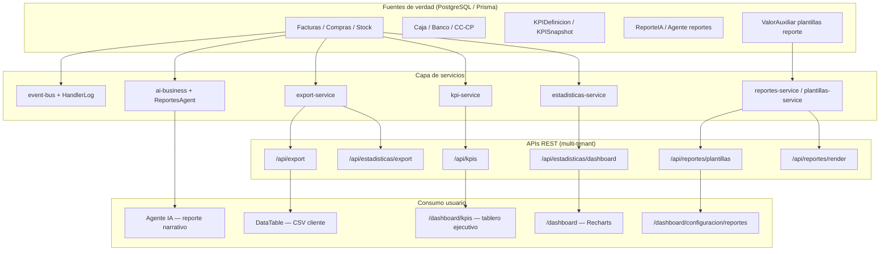
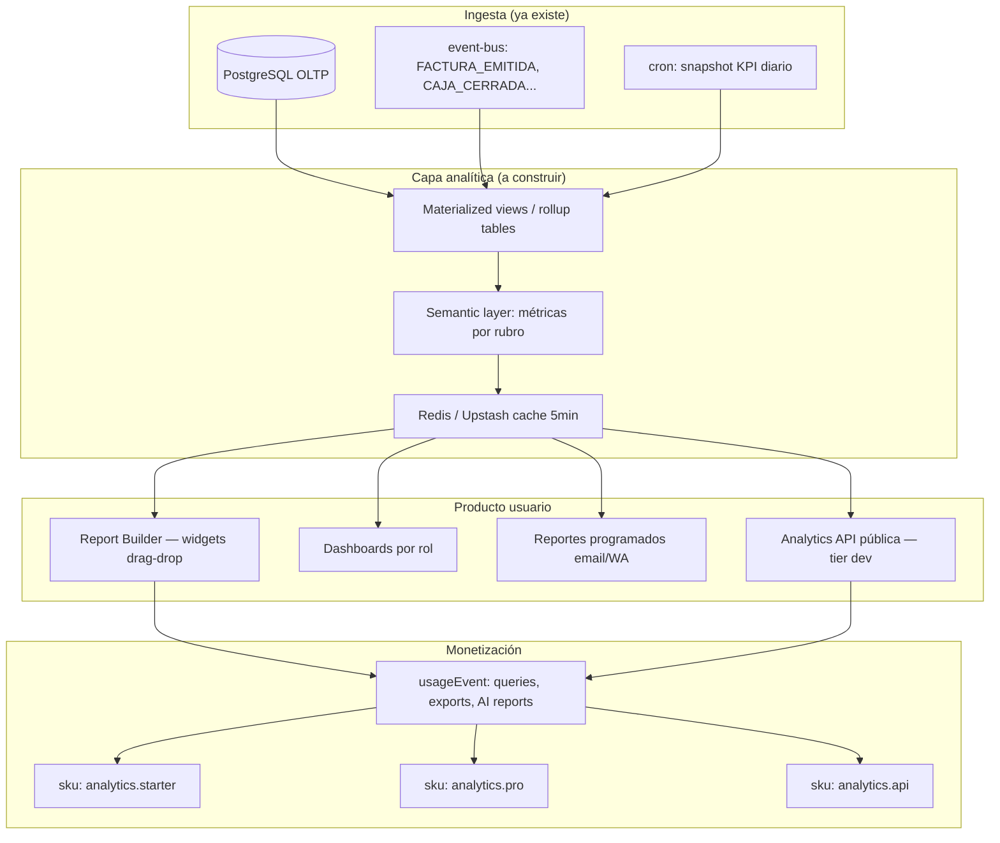
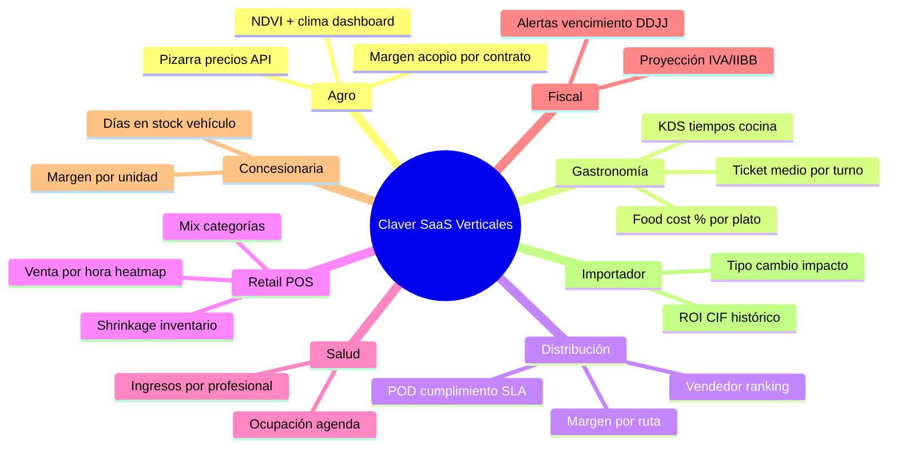
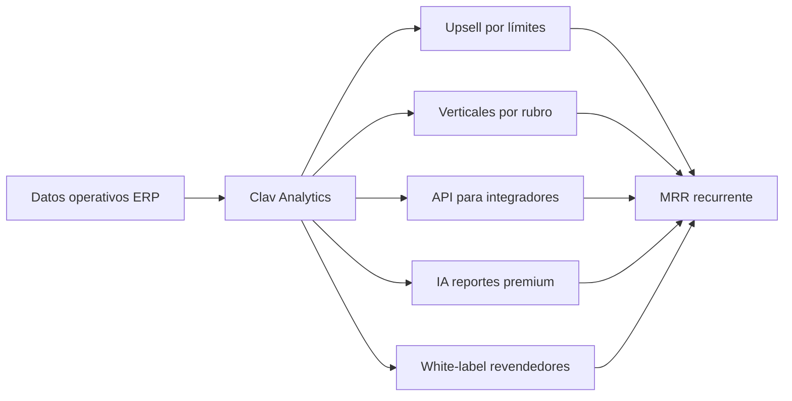
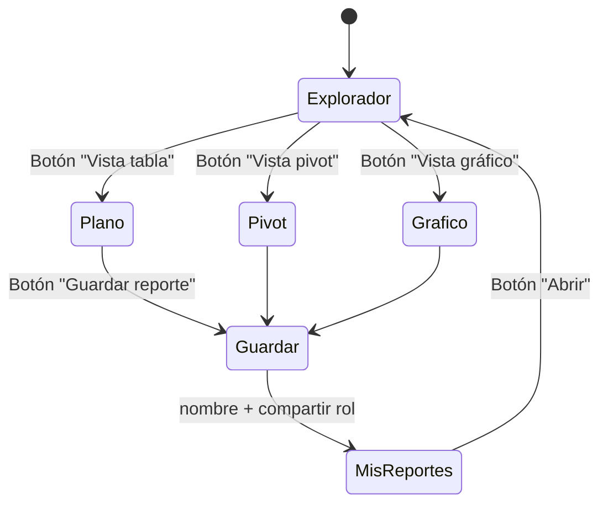
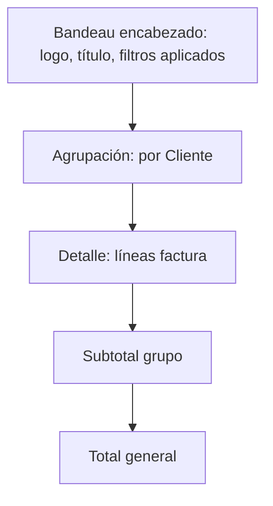
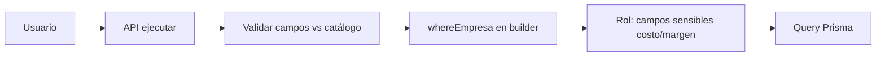

# ClavERP / Claver Cloud — Reportes, BI y Monetización SaaS

> Documento de investigación basado en el estado real del repo (`pos-system-argentina`, junio 2026).  
> Objetivo: definir qué usa el sistema hoy, qué falta vs Power BI / SAP, si el usuario puede armar reportes, y cómo monetizar verticales.

---

## 1. Resumen ejecutivo

| Pregunta | Respuesta corta |
|----------|-----------------|
| ¿Usa Power BI, SAP Crystal, Tableau? | **No.** No hay integración embebida ni conector oficial. |
| ¿Qué usa hoy? | **Stack propio**: Prisma aggregates → APIs REST → Recharts en React + export CSV + plantillas HTML + agente IA de reportes. |
| ¿El usuario arma sus reportes? | **Parcialmente.** Puede crear plantillas HTML con variables `{{campo}}` (admin). No hay drag-and-drop, SQL visual ni cubo OLAP. |
| ¿Dónde está el dinero? | **Clav Analytics** (línea catalogada “próximamente”), add-ons por canal (`commercial-service`), datos por rubro/vertical, API de exportación medida, y torre Claver para analistas. |

**Posicionamiento vs gigantes:**

| Vendor | Producto BI | ClavERP hoy | Oportunidad Claver |
|--------|-------------|-------------|-------------------|
| Microsoft | Power BI + Fabric | Solo `@vercel/analytics` (tráfico web) | **Power BI Embedded** como tier Enterprise |
| SAP | SAC, Crystal Reports | Plantillas HTML + stub Jasper | Motor PDF/Jasper real o **semantic layer** propia |
| Tango / Xubio | Tableros fijos + export | KPIs dinámicos + Recharts | **Mejor** si se productiza Clav Analytics |
| Colppy | Reportes simples CSV | Export multi-entidad + IA narrativa | **IA + alertas** como diferenciador premium |

---

## 2. Arquitectura actual de exposición de datos



### 2.1 Capas implementadas (detalle)

#### A) Dashboard operativo (`/dashboard`)
- **API:** `GET /api/estadisticas/dashboard?periodo=mes|trimestre|anio`
- **Servicio:** `lib/impuestos/estadisticas-service.ts` — agregaciones Prisma sobre facturas/compras
- **UI:** Recharts (barras, torta), KPI cards, drill-down por rubro onboarding
- **Límite:** consultas en tiempo real sobre OLTP; sin warehouse ni cache semántico

#### B) Tablero KPI ejecutivo (`/dashboard/kpis`)
- **API:** `GET /api/kpis`, `POST /api/kpis` (snapshot diario)
- **Servicio:** `lib/kpis/kpi-service.ts` — 10+ KPIs (venta día/mes, DSO, DPO, morosidad, stock bajo mínimo, CXC/CXP…)
- **Modelos:** `KPIDefinicion`, `KPISnapshot` — histórico para tendencias
- **UI:** Recharts Area/Bar, semáforos verde/amarillo/rojo, drill-down a módulos
- **Comentario en código:** “Equivalente a SAP Analytics Cloud + Tango Tablero de Control” — aspiracional pero **la base es real**

#### C) Exportación masiva (CSV)
- **API:** `GET /api/export?entidad=...`, `GET /api/estadisticas/export?tipo=...`
- **Servicio:** `lib/export/export-service.ts` — clientes, productos, facturas, compras, libro IVA, CC/CP
- **UI:** `components/data-table.tsx` — botón export CSV por grilla (`exportFilename`)
- **Formato:** CSV UTF-8 BOM; XLSX mencionado pero degrada a CSV sin `exceljs`

#### D) Plantillas de reporte configurables
- **Ruta UI:** `/dashboard/configuracion/reportes`, `/nuevo`, `/[id]`
- **API:** `/api/reportes/plantillas`, `/api/reportes/render`
- **Almacenamiento:** `ValorAuxiliar` + metadata JSON (no tabla dedicada)
- **Motores:**
  - `html` — interpolación `{{variable}}` ✅ funcional
  - `jasper` — **stub** (muestra preview sin transformar)
- **Quién puede:** render solo `administrador`

#### E) Reportes IA (lenguaje natural)
- **Agente:** `lib/ai/agents/reportes-agent.ts` — cron 7:00, períodos día/semana/mes
- **Persistencia:** modelo `ReporteIA` (resumen, métricas, insights, recomendaciones)
- **UX:** visible desde módulo IA; narrativa tipo “¿cómo me fue hoy?”
- **Monetización natural:** SKU `ops.morning_commander` / tier IA en `commercial-service`

#### F) PDF fiscal / documentos
- **Servicio:** `lib/printer/pdf-service.ts` — facturas, tickets, remitos
- **No es BI**, pero es el canal de “reporte legal” que el usuario imprime

#### G) Claver “Reportes” (interno)
- **Ruta:** `/dashboard/claver/reportes` → redirect a `/claver-cloud/operations/reports`
- **API:** `app/api/claver/reportes/*` — en la práctica **tickets de soporte**, no BI de negocio
- **Confusión de naming:** oportunidad de separar “Soporte” vs “Analytics flota”

#### H) Analytics web
- **`@vercel/analytics`** en `app/layout.tsx` — métricas de producto (páginas), no contabilidad

---

## 3. ¿Puede el usuario armar sus propios reportes hoy?

```mermaid
flowchart LR
    subgraph Hoy["Capacidades actuales"]
        U1[Admin crea plantilla HTML]
        U2[Variables {{cliente.nombre}}]
        U3[Export CSV desde grillas]
        U4[Ver KPIs fijos]
        U5[Pedir reporte a IA en chat]
    end

    subgraph No["No disponible"]
        N1[Drag-and-drop dashboard]
        N2[Query builder SQL/visual]
        N3[Cubo OLAP / drill anywhere]
        N4[Reportes programados email]
        N5[Compartir dashboard externo]
        N6[Power BI / Looker embed]
    end

    U1 --> U2
```

| Perfil | ¿Puede armar reportes? | Cómo |
|--------|------------------------|------|
| **Dueño / admin** | Limitado | Plantillas HTML en Configuración → Reportes; export CSV; KPIs fijos |
| **Contador externo** | Solo export | Descarga CSV vía API si tiene usuario; no hay portal read-only BI |
| **Analista Claver** | Parcial | Dossier JSON implementación, métricas ops, tickets — no tablero negocio cliente |
| **Usuario operativo** | No | Solo ve dashboards predefinidos y export de su grilla |

**Conclusión:** hoy es **ERP con tableros fijos + export + plantillas rudimentarias**, no una plataforma de self-service BI como Power BI.

---

## 4. Opciones tecnológicas (React / Next.js / JS) — ranking para ClavERP

### Tier 1 — Máximo ROI con stack actual (sin vendor lock-in)

| Opción | Tecnología | Encaje con repo | Esfuerzo | Monetización |
|--------|------------|-----------------|----------|--------------|
| **Clav Analytics nativo** | Recharts + `kpi-service` + React Grid Layout | Ya hay `/dashboard/kpis`, `chart.tsx` shadcn | Medio | SKU mensual por empresa |
| **Semantic API layer** | Zod + Prisma views + `/api/analytics/query` | Unifica 330 rutas dispersas | Medio-alto | API calls medidos (`usageEvent`) |
| **Report builder JSON** | Schema de widgets (KPI, tabla, gráfico, filtro) guardado en BD | Extensión de `plantillas-service` | Medio | Plantillas premium por rubro |
| **ExcelJS export real** | Ya referenciado en `export-service` | Bajo | Add-on “Export Pro” |
| **Snapshots + cron** | `guardarSnapshotDiario` + BullMQ | KPI histórico ya existe | Bajo | Histórico >90 días = plan superior |

### Tier 2 — Embed OSS (self-hosted BI)

| Opción | Pros | Contras |
|--------|------|---------|
| **Metabase Embedded** | SQL visual, dashboards usuario, email programado | Otro servicio que hostear; SSO custom |
| **Apache Superset Embedded** | Potente, open source | Pesado operativamente |
| **Cube.js** | Semantic layer + cache + React components | Curva aprendizaje; otro container |
| **Evidence.dev** | Reports as code en MDX | Más para equipo técnico que usuario final |

**Recomendación:** si el usuario final debe **armar reportes sin código**, **Metabase Embedded** o **Cube.js + React** son el mejor balance. Si Claver quiere **control total y margen**, **Tier 1 nativo**.

### Tier 3 — Enterprise / upsell grande

| Opción | Cuándo |
|--------|--------|
| **Power BI Embedded** | Clientes que ya pagan Microsoft 365; ticket $500+/mes |
| **Fabric OneLake sync** | Grupos con data lake; overkill para PyME |
| **JasperReports Server** | Ya está nombrado en plantillas; motor PDF enterprise |
| **DuckDB WASM + Parquet** | Análisis offline masivo en browser (nicho) |

### Tier 4 — IA como capa de reportes (diferenciador)

| Opción | Estado repo |
|--------|-------------|
| Agente reportes NL | ✅ `ReportesAgent` |
| Preguntas ad-hoc sobre datos | Parcial — falta text-to-SQL seguro |
| Reportes programados WhatsApp/Telegram | Infra alertas existe; falta wire |
| Insights automáticos post-cierre caja | Event `CAJA_CERRADA` ya en agente |

---

## 5. Arquitectura objetivo — “Clav Analytics” monetizable



---

## 6. APIs y “huecos” para generar verticales SaaS

### 6.1 APIs de datos ya expuestas (monetizables con rate limit)

| API | Datos | SKU sugerido |
|-----|-------|--------------|
| `GET /api/estadisticas/dashboard` | Ventas, compras, IVA, top clientes | Incluido en base |
| `GET /api/kpis` | KPIs ejecutivos tiempo real | `analytics.starter` |
| `GET /api/estadisticas/export` | CSV multi-entidad | `analytics.pro` — límite exports/mes |
| `GET /api/export` | CSV simple | Freemium 10/mes |
| `POST /api/reportes/render` | HTML/PDF custom | Por plantilla premium |
| `GET /api/claver/ops/metricas` | Flota multi-tenant | Solo Claver Cloud |
| `GET /api/claver/implementaciones/*/export` | Dossier JSON | Servicios consultoría |

### 6.2 Huecos = nuevas APIs verticales (productos SaaS)



| Vertical | API propuesta | Dashboard | Precio sugerido ARS/mes |
|----------|---------------|-----------|-------------------------|
| **Agro** | `GET /api/analytics/agro/margen-contratos` | `/dashboard/agro/analytics` | $19.900 |
| **Hospitalidad** | `GET /api/analytics/hospitalidad/food-cost` | tab en hospitalidad | $14.900 |
| **Distribución** | `GET /api/analytics/logistica/rentabilidad-ruta` | `/dashboard/logistica/analytics` | $14.900 |
| **Retail** | `GET /api/analytics/pos/heatmap` | tab en POS | Incluido Pro |
| **Fiscal** | `GET /api/analytics/fiscal/proyeccion` | `/dashboard/impuestos/analytics` | $9.900 |
| **Contador** | `GET /api/analytics/contador/cierre-mensual` | portal read-only | $29.900 multi-empresa |

### 6.3 Infra SaaS ya iniciada (`lib/platform/commercial-service.ts`)

```typescript
// SKUs ya seed en catálogo:
// - channel.mercadopago, channel.mercadolibre, channel.whatsapp
// - ops.morning_commander (IA)
// - AUTOMATION_SKU (n8n)

// Patrón: productoComercial + suscripcionModulo + usageEvent
await recordUsageEvent(empresaId, "analytics.pro", "export_csv")
await resolveEventLimit(empresaId, "analytics.pro") // soft cap
```

**Falta implementar en producto:**
- SKU `analytics.starter` / `analytics.pro` / `analytics.api` en `seedCommercialCatalog()`
- Middleware `requireSubscription(sku)` en rutas `/api/analytics/*`
- UI `/dashboard/conexiones` o billing para activar add-ons
- Facturación recurrente del add-on vía `facturacion-recurrente-service`

---

## 7. Modelo de monetización recomendado

### 7.1 Packaging

| Plan | Incluye | Precio orientativo |
|------|---------|-------------------|
| **Clavis Base** | Dashboard, KPIs básicos, CSV 5 exports/mes | Incluido en ERP |
| **Clav Analytics Starter** | KPIs históricos 12 meses, 3 dashboards custom, email semanal | +$9.900/mes |
| **Clav Analytics Pro** | Builder drag-drop, exports ilimitados, alertas umbral, 1 vertical | +$19.900/mes |
| **Clav Analytics API** | 10k queries/mes, webhooks, acceso contador | +$29.900/mes |
| **Vertical Pack** | Dashboard + APIs rubro (agro, gastronomía…) | +$14.900/mes c/u |
| **Power BI Bridge** (enterprise) | Dataset sync + embed token | +$49.900/mes |
| **Clav Consult** | Dossier + readiness + reportes CCA | Servicio profesional |

### 7.2 Palancas de revenue



1. **Land** — ERP genera datos (ventas, stock, AFIP)
2. **Expand** — usuario choca techo de export / quiere histórico → Analytics Starter
3. **Verticalize** — onboarding rubro activa pack analytics específico
4. **Platform** — contadores y consultoras consumen API multi-empresa
5. **Services** — Claver Analyst vende interpretación (torre CCA + dossier)

### 7.3 Métricas a medir (usageEvent)

| eventKey | Cuándo cobrar/limitar |
|----------|----------------------|
| `kpi_refresh` | >1000/día en plan base |
| `export_csv` | >N/mes |
| `export_xlsx` | Solo Pro |
| `report_render` | Plantillas premium |
| `ai_report` | Morning Commander quota |
| `analytics_query` | API tier |
| `dashboard_share` | Links públicos Pro |

---

## 8. Roadmap de implementación (para Gemini / equipo)

### Fase 1 — Productizar lo existente (4–6 semanas)

| # | Entregable | Botones UI |
|---|------------|------------|
| 1 | Activar **Clav Analytics** en menú → `/dashboard/kpis` + histórico snapshots | **Ver histórico**, **Exportar KPIs CSV**, **Configurar metas** |
| 2 | SKU `analytics.starter` + gate en `/api/kpis` histórico >30d | **Activar Clav Analytics** en conexiones |
| 3 | ExcelJS real en `export-service` | **Exportar Excel** en DataTable |
| 4 | Reportes programados email desde `ReportesAgent` | **Programar envío semanal** en `/dashboard/ia` |
| 5 | Renombrar claver reportes → soporte; crear **Analytics flota** | Separar tickets vs métricas negocio |

### Fase 2 — Self-service builder (8–12 semanas)

| # | Entregable | Stack |
|---|------------|-------|
| 6 | Modelo `DashboardWidget` + `DashboardLayout` en Prisma | JSON schema widgets |
| 7 | UI builder: react-grid-layout + Recharts | `/dashboard/analytics/builder` |
| 8 | Semantic layer: `lib/analytics/metrics-registry.ts` | métricas por rubro |
| 9 | `GET /api/analytics/query?metric=venta_mes&group=rubro` | Zod + whereEmpresa |

**Botones builder:**
- **Nuevo dashboard**
- **Agregar widget** (KPI, gráfico barras, tabla, filtro fecha)
- **Guardar y compartir**
- **Duplicar plantilla rubro**

### Fase 3 — Verticales + API monetizada (12+ semanas)

| # | Vertical | Primera métrica |
|---|----------|-----------------|
| 10 | Agro | Margen liquidación vs pizarra |
| 11 | Hospitalidad | Food cost % |
| 12 | Distribución | Rentabilidad por hoja de ruta |
| 13 | Fiscal | Proyección IVA 90 días |
| 14 | API pública | `/api/v1/analytics` + API keys por empresa |

### Fase 4 — Enterprise opcional

- Power BI Embedded / Metabase OSS
- JasperReports Server para PDFs complejos
- Data warehouse (BigQuery sync nocturno) para grupos >50 tenants

---

## 9. Comparativa: ¿armar propio vs integrar Power BI?

| Criterio | Clav Analytics nativo | Power BI Embedded |
|----------|----------------------|-------------------|
| Costo infra | Bajo (ya en Next+PG) | Licencia Microsoft + capacidad |
| Self-service usuario | Hay que construir builder | Excel-like, maduro |
| Multi-tenant | Nativo `empresaId` | Requiere RLS por dataset |
| Margen Claver | **Alto** | Bajo (pasa-through MS) |
| Time-to-market | 3 meses builder MVP | 4–6 semanas embed |
| Diferenciación IA | Fuerte (agentes ya existen) | Copilot extra costo |

**Estrategia híbrida recomendada:**
- **PyME Argentina:** Clav Analytics nativo (precio en pesos, AFIP-aware metrics)
- **Enterprise / exportadores:** opción Power BI Bridge como add-on caro

---

## 10. Prompt listo para Gemini — implementar Clav Analytics MVP

```
Contexto: ClavERP Next.js 15, Prisma, PostgreSQL multi-tenant.
Existe: lib/kpis/kpi-service.ts, /dashboard/kpis, export-service, plantillas-service,
commercial-service (SKU + usageEvent), ReportesAgent, Recharts.

Implementar "Clav Analytics Starter" monetizable:

1. prisma: DashboardSaved, DashboardWidget (empresaId, layout JSON, widgets JSON)
2. lib/analytics/metrics-registry.ts — catálogo métricas: venta_mes, dso, food_cost, etc.
3. GET /api/analytics/metrics — lista métricas disponibles por rubro empresa
4. POST /api/analytics/query — { metric, filters, groupBy, desde, hasta } → JSON serie
5. requireSubscription("analytics.starter") middleware
6. seedCommercialCatalog: analytics.starter $9900, analytics.pro $19900
7. UI /dashboard/analytics — builder con react-grid-layout:
   Botones: "Nuevo dashboard", "Agregar widget", "Guardar", "Exportar PDF", "Programar email"
8. Wire ReportesAgent para enviar email semanal si suscripción activa
9. Tests vitest metrics-registry + query API

No usar Power BI. Usar Recharts + shadcn chart. Respetar whereEmpresa en todas las queries.
```

---

## 11. Referencias en el repo

| Archivo | Rol |
|---------|-----|
| `lib/kpis/kpi-service.ts` | Motor KPI principal |
| `lib/export/export-service.ts` | Export CSV multi-entidad |
| `lib/reportes/plantillas-service.ts` | Plantillas usuario |
| `lib/reportes/report-service.ts` | Render HTML/Jasper stub |
| `lib/ai/agents/reportes-agent.ts` | Reportes narrativos IA |
| `lib/platform/commercial-service.ts` | SKUs y medición uso |
| `lib/marketing/claver-services-catalog.ts` | Línea "Clav Analytics" |
| `app/dashboard/kpis/page.tsx` | UI tablero ejecutivo |
| `app/api/estadisticas/dashboard/route.ts` | API dashboard principal |
| `components/data-table.tsx` | Export CSV cliente |

---

## 12. Mini-módulo unificado: planos + pivot + gráficos (estilo Metadata)

> **Metadata** (Evolution/TOTVS) no es un producto aparte: es un **motor de consultas** con tres salidas — listado plano, tabla dinámica (pivot) y gráfico — sobre el mismo universo de tablas del ERP.  
> ClavERP puede replicar esa idea en un **solo mini-módulo** sin Jasper ni Power BI, reutilizando lo que ya existe.

### 12.1 Principio: una definición, tres renderers

```mermaid
flowchart TB
    subgraph Def["Definición guardada (JSON)"]
        D1[fuente: ventas | stock | caja...]
        D2[dimensiones: fecha, cliente, rubro, depósito]
        D3[medidas: sum_total, count, avg_ticket]
        D4[filtros: desde, hasta, estado]
        D5[vista: plano | pivot | grafico]
        D6[layout plano: bandas, agrupación, totales]
    end

    subgraph Motor["Motor único"]
        CAT[metrics-catalog.ts — catálogo campos]
        Q[query-engine.ts — Prisma seguro]
        CACHE[cache 5min por empresaId]
    end

    subgraph Render["Tres renderers React"]
        R1[PlanoRenderer — TanStack Table + bandas]
        R2[PivotRenderer — pivot engine]
        R3[ChartRenderer — Recharts]
    end

    subgraph Export["Salida"]
        E1[CSV / XLSX]
        E2[PDF — react-pdf o pdf-service]
        E3[Pantalla + drill-down]
    end

    Def --> Q
    CAT --> Q
    Q --> CACHE
    CACHE --> R1
    CACHE --> R2
    CACHE --> R3
    R1 --> E1
    R2 --> E1
    R3 --> E2
    R1 --> E3
    R2 --> E3
    R3 --> E3
```

**No son tres módulos.** Es **Clav Reportes** (`/dashboard/reportes`) con pestaña o toggle de vista.

### 12.2 Qué reutiliza del repo (no empezar de cero)

| Pieza existente | Rol en el mini-módulo |
|-----------------|----------------------|
| `lib/export/export-service.ts` | Export plano / pivot a CSV y XLSX |
| `lib/reportes/plantillas-service.ts` | Evolucionar → `ReporteDefinicion` (hoy HTML; mañana JSON query) |
| `lib/kpis/kpi-service.ts` | Medidas precalculadas (DSO, venta mes…) como “campos calculados” |
| `components/data-table.tsx` | Base del **reporte plano** (sort, columnas, export) |
| `components/ui/chart.tsx` + Recharts | **Gráficos** |
| `GET /api/estadisticas/export` | Patrón de API export con auth |
| `whereEmpresa()` | Obligatorio en query-engine — **nunca SQL libre del usuario** |

### 12.3 Las tres vistas — equivalencia Metadata

| Vista Metadata | En Clav Reportes | UI / botones |
|----------------|------------------|--------------|
| **Listado / plano** | Tabla con bandas de agrupación | **Agrupar por**, **Subtotales**, **Ordenar**, **Exportar** |
| **Tabla dinámica** | Pivot filas × columnas × medida | **Arrastrar a filas**, **Arrastrar a columnas**, **Valores (SUM/COUNT)**, **Expandir/contraer** |
| **Gráfico** | Recharts desde misma query agregada | **Tipo: barras / líneas / torta**, **Apilar**, **Drill** |



### 12.4 Modelo de datos del mini-módulo (Prisma)

```prisma
model ReporteDefinicion {
  id          Int      @id @default(autoincrement())
  empresaId   Int
  codigo      String
  nombre      String
  descripcion String?
  /// "plano" | "pivot" | "grafico" | "mixto"
  tipoVista   String
  /// { fuente, dimensiones[], medidas[], filtros[], layout?, chart? }
  definicion  Json
  publico     Boolean  @default(false)
  creadoPor   Int?
  createdAt   DateTime @default(now())
  updatedAt   DateTime @updatedAt

  @@unique([empresaId, codigo])
}

model ReporteCatalogoCampo {
  id          Int    @id @default(autoincrement())
  /// "ventas" | "compras" | "stock" | "caja" — no tabla SQL cruda
  fuente      String
  campo       String
  etiqueta    String
  tipo        String /// "dimension" | "medida" | "fecha"
  agregacion  String? /// "sum" | "count" | "avg"
  rubros      String[] /// vacío = todos
}
```

El **catálogo** es lo que Metadata llama “metadata de tablas”: el usuario **no ve** `facturas` ni `JOIN`; ve **Ventas → Cliente → Total**.

### 12.5 Query engine — cómo evito SQL injection y replico pivot

```typescript
// lib/reportes/query-engine.ts — pseudocódigo

type QueryRequest = {
  fuente: "ventas" | "compras" | "stock_movimientos" | "caja"
  dimensiones: { campo: string; agruparPor?: "dia" | "mes" | "anio" }[]
  medidas: { campo: string; fn: "sum" | "count" | "avg" }[]
  filtros: { campo: string; op: "eq" | "gte" | "lte" | "in"; valor: unknown }[]
  pivot?: { filas: string[]; columnas: string[]; medida: string }
  limit?: number
}

// 1. Validar contra ReporteCatalogoCampo (whitelist)
// 2. Mapear fuente → builder Prisma predefinido (ventas → prisma.factura.groupBy...)
// 3. Si pivot: post-proceso en servidor con pivot-engine (ver abajo)
// 4. Retorno: { columnas, filas, totales, metadata }
```

**Pivot — dos estrategias según volumen:**

| Estrategia | Cuándo | Tecnología |
|------------|--------|------------|
| **Server pivot** | <50k filas agregadas | `lib/reportes/pivot-engine.ts` — agrupa JSON en Node (lodash groupBy o implementación liviana) |
| **SQL pivot** | Reportes pesados | `GROUP BY CUBE` / subqueries en vistas materializadas PostgreSQL |
| **Client pivot** | Exploración interactiva | Dataset ya agregado chico → `react-pivottable` o pivot propio con TanStack |

Para PyME Argentina, **server pivot sobre datos ya agregados** alcanza en el 90% de casos.

### 12.6 Reporte plano con “bandas” (lo que Metadata hace en papel)

Metadata usa bandas Header / Group / Detail / Footer. En web:



**Implementación React:**
- `PlanoRenderer` recibe datos + `layout.bandas`
- Agrupación: `dimensiones[0]` → nested TanStack Table o filas con `rowSpan`
- PDF: `@react-pdf/renderer` con misma estructura (o HTML → pdf-service existente)
- Botones: **Vista previa**, **Imprimir**, **PDF**, **Excel**

### 12.7 Gráficos desde la misma query

```typescript
// definicion.chart
{
  tipo: "bar" | "line" | "pie" | "area",
  ejeX: "mes",
  series: [{ medida: "sum_total", etiqueta: "Ventas" }],
  apilado: false,
  colores: "theme"
}
```

`ChartRenderer` mapea resultado del query-engine a props Recharts — **mismo payload que alimenta el pivot**, distinto componente.

### 12.8 Pantallas del mini-módulo (una sola entrada de menú)

| Ruta | Contenido | Botones clave |
|------|-----------|---------------|
| `/dashboard/reportes` | Mis reportes guardados + plantillas rubro | **Nuevo reporte**, **Duplicar**, **Programar envío** |
| `/dashboard/reportes/explorar` | Explorador Metadata-like | **Fuente**, **Campos**, **Filtros**, **Vista tabla/pivot/gráfico**, **Ejecutar** |
| `/dashboard/reportes/[id]` | Reporte guardado | **Editar**, **Exportar**, **Compartir**, **Fijar en dashboard** |
| `/dashboard/reportes/plantillas` | Pack por rubro (comercio, agro…) | **Usar plantilla** |

**Menú lateral:** un ítem **Reportes** (reemplaza o complementa “Plantillas” en configuración).

### 12.9 APIs del mini-módulo

```
GET  /api/reportes/catalogo          → fuentes + campos (metadata usuario)
POST /api/reportes/ejecutar          → { definicion } → datos plano|pivot|chart
GET  /api/reportes/definiciones      → listar guardados
POST /api/reportes/definiciones      → guardar
GET  /api/reportes/definiciones/:id/export?format=csv|xlsx|pdf
POST /api/reportes/definiciones/:id/schedule  → email semanal (Pro)
```

### 12.10 Seguridad multi-tenant (no negociable)



- **Prohibido:** SQL libre, aunque el usuario sea admin.
- **Campos sensibles** (`costo`, `margen`): flag `requiereRol: ["administrador", "contador"]` en catálogo.
- **Límite comercial:** `recordUsageEvent(empresaId, "analytics.pro", "report_execute")`.

### 12.11 Monetización del mini-módulo (todo en uno)

| Feature | Plan |
|---------|------|
| Explorar + 3 reportes guardados | Base |
| Pivot + gráficos + export Excel | Starter |
| Reportes ilimitados + programar email + plantillas rubro | Pro |
| API ejecutar + embed iframe | API tier |

**Un SKU `clav.reportes`** puede incluir BI liviano (KPIs) + planos + pivot + gráficos — no hace falta vender “BI” y “reportes” por separado al usuario PyME.

### 12.12 Roadmap implementación (orden práctico)

| Sprint | Entregable | Metadata equivalente |
|--------|------------|---------------------|
| 1 | `metrics-catalog` + `query-engine` + explorador tabla plana | Consulta simple |
| 2 | `PivotRenderer` + export XLSX pivot | Tabla dinámica |
| 3 | `ChartRenderer` + toggle vista | Gráficos |
| 4 | Bandas agrupación + PDF plano | Reporte impreso |
| 5 | Guardar/compartir + plantillas rubro | Reportes usuario |
| 6 | Programar email + gate SKU | Distribución |

### 12.13 Librerías JS recomendadas (stack actual)

| Necesidad | Librería | Nota |
|-----------|----------|------|
| Tabla plana | **TanStack Table v8** (ya patrón en DataTable) | Sort, group, virtualización |
| Pivot UI | **Implementación propia** o `react-pivottable` | Propia = menos peso, control total |
| Gráficos | **Recharts** (ya en repo) | |
| Excel pivot export | **ExcelJS** | Hoja + tabla dinámica opcional |
| PDF bandas | **@react-pdf/renderer** o HTML→pdf-service | |
| Drag campos pivot | **@dnd-kit/core** | Arrastrar dimensión a filas/columnas |
| Cache | **Upstash Redis** o `unstable_cache` Next | |

### 12.14 Prompt Gemini — mini-módulo completo

```
Implementar mini-módulo "Clav Reportes" en ClavERP:

1. Prisma: ReporteDefinicion, ReporteCatalogoCampo
2. lib/reportes/metrics-catalog.ts — fuentes ventas, compras, stock, caja (10 campos c/u)
3. lib/reportes/query-engine.ts — whitelist, whereEmpresa, groupBy Prisma
4. lib/reportes/pivot-engine.ts — pivot sobre resultado agregado
5. APIs: catalogo, ejecutar, definiciones CRUD, export
6. UI /dashboard/reportes/explorar:
   - Panel campos (dimensiones/medidas) estilo Metadata
   - Toggle: Tabla | Pivot | Gráfico
   - Botones: Ejecutar, Guardar, Exportar CSV, Exportar Excel, PDF
7. Reutilizar DataTable, chart.tsx, export-service, plantillas-service patterns
8. SKU analytics.starter gate en pivot+excel
9. Tests vitest query-engine + pivot-engine

NO SQL libre. NO Power BI. Español es-AR.
```

---

*Documento generado para planificación comercial y desarrollo. Actualizar cuando se implemente Clav Analytics MVP.*