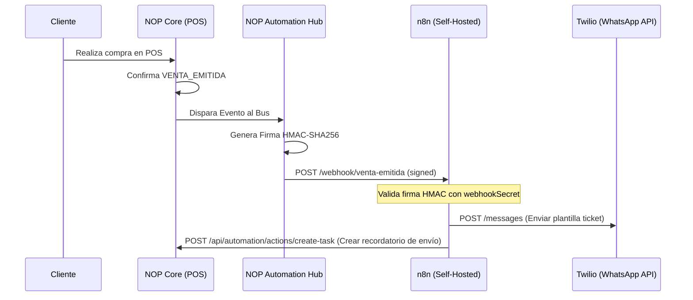
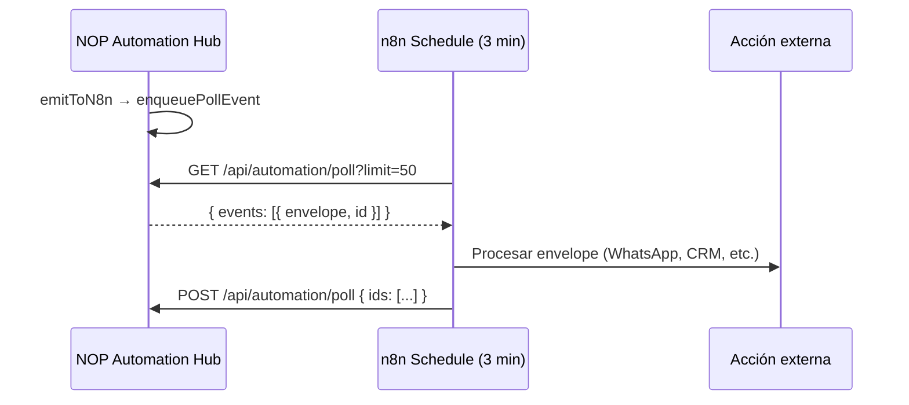

# NOP Automation Hub — Especificación Funcional (n8n Integration)

Este documento detalla la especificación de integración de **n8n** como el motor de automatización externo de NOP (Need of Retail). n8n no se embebe en el código fuente del ERP; en su lugar, NOP actúa como un **Automation Hub** que emite eventos firmados (saliente) y recibe callbacks seguros (entrante) para orquestar flujos de trabajo.

---

## 📖 Glosario de Conceptos

*   **Automation Hub**: El módulo de NOP encargado de capturar eventos del ciclo de vida del negocio, encolarlos, firmarlos con HMAC y despacharlos a los webhooks de n8n.
*   **n8n Webhook / Workflow**: El flujo de trabajo visual configurado en n8n que recibe un payload estructurado desde NOP, realiza integraciones de terceros (Slack, Twilio, CRM externos) y opcionalmente retorna comandos mediante la API de NOP.
*   **Virtual Worker (Empleado Virtual)**: Un bot parametrizado en NOP con un rol asignado, horario laboral y playbooks JSON locales que emite y recibe tareas de forma determinística sin LLMs.
*   **Playbook**: Plantilla JSON de parámetros que dicta cómo se ejecuta una automatización específica para un tenant.
*   **Entitlement (`automation.n8n_hub`)**: El flag comercial de licenciamiento en NOP que habilita el envío de webhooks externos y la ejecución de virtual workers.

---

## 🎨 Diagrama de Secuencia (Venta a Factura → n8n → WhatsApp)



---

## 📡 Catálogo de 15 Eventos Estándar NOP

Todos los webhooks de salida enviados por NOP encapsulan los payloads de negocio dentro del siguiente sobre seguro (**Envelope**):

```json
{
  "eventId": "14f2e96d-c8ef-4171-87ab-f91cbdb24c11",
  "event": "STOCK_BAJO",
  "empresaId": 1,
  "timestamp": "2026-06-19T10:00:00Z",
  "idempotencyKey": "empresa-1-stock-42-20260619",
  "data": {
    "productoId": 42,
    "codigo": "PROD-CAB-50",
    "nombre": "Cable Cobre 50mm",
    "stockActual": 12.0,
    "stockMinimo": 20.0,
    "unidad": "metros"
  },
  "signature": "8b5f3a09cd50fe96e95267a57a070eb3357591462bd890bb8a53efea9db03d15"
}
```

### 📋 Detalle de Eventos y Payloads JSON

#### 1. `VENTA_EMITIDA`
Disparado al confirmarse un ticket de venta en el POS o facturación A/B.
```json
{
  "facturaId": 1054,
  "tipo": "A",
  "numero": 40532,
  "puntoVenta": 5,
  "total": 125000.0,
  "clienteId": 12,
  "moneda": "ARS"
}
```

#### 2. `NC_EMITIDA`
Disparado al generar una nota de crédito por devoluciones o descuentos posteriores.
```json
{
  "notaCreditoId": 234,
  "facturaId": 1054,
  "total": 15000.0,
  "motivo": "Devolución de artículo defectuoso"
}
```

#### 3. `STOCK_BAJO`
Alerta emitida cuando el inventario cae por debajo de la cota mínima definida.
```json
{
  "productoId": 88,
  "codigo": "FAR-IBU-600",
  "stockActual": 4.0,
  "stockMinimo": 10.0
}
```

#### 4. `CAJA_ABIERTA`
Control del POS al abrir una nueva caja por parte del cajero.
```json
{
  "cajaId": 4,
  "usuarioId": 12,
  "montoApertura": 5000.0
}
```

#### 5. `CAJA_CERRADA`
Control de conciliación al cerrar la caja al finalizar el turno.
```json
{
  "cajaId": 4,
  "saldoFinal": 48200.0,
  "diferencia": -200.0
}
```

#### 6. `CIERRE_Z_EJECUTADO`
Emisión del reporte de cierre fiscal Z diario obligatorio.
```json
{
  "puntoVenta": 5,
  "totalFacturado": 348000.0,
  "cantComprobantes": 43
}
```

#### 7. `CAE_RECHAZADO`
Fallo crítico de facturación electrónica ante AFIP.
```json
{
  "facturaId": 1055,
  "cuitReceptor": "20-12345678-9",
  "codigoError": "10015",
  "errorMsg": "CUIT del receptor inválido o inactivo en padrón"
}
```

#### 8. `CAE_OBTENIDO`
Aprobación del comprobante electrónico por AFIP.
```json
{
  "facturaId": 1054,
  "cae": "74251649234851",
  "vencimientoCAE": "2026-06-29T23:59:59Z"
}
```

#### 9. `PEDIDO_CONFIRMADO`
Aceptación del pedido B2B o preventa que requiere armado.
```json
{
  "pedidoId": 450,
  "clienteId": 82,
  "itemsCount": 15
}
```

#### 10. `OC_CREADA`
Generación de una orden de compra hacia proveedores.
```json
{
  "ordenCompraId": 882,
  "proveedorId": 45,
  "totalEst": 98500.0
}
```

#### 11. `CUENTA_VENCIDA`
Alerta de cuenta corriente vencida de clientes sin pago imputado.
```json
{
  "clienteId": 12,
  "diasVencido": 30,
  "saldoVencido": 18500.0
}
```

#### 12. `APROBACION_PENDIENTE`
Solicitud de compra o descuento que requiere autorización gerencial (Capa 4/5).
```json
{
  "solicitudId": 129,
  "modulo": "compras",
  "usuarioSolicitanteId": 15,
  "totalAprobar": 250000.0
}
```

#### 13. `USUARIO_CREADO`
Alta de un nuevo empleado o cliente en la plataforma.
```json
{
  "usuarioId": 98,
  "rol": "vendedor",
  "email": "juan@empresa.com"
}
```

#### 14. `TURNO_AGENDA_CREADO`
Reserva de turno en veterinaria, clínica o salón de belleza.
```json
{
  "turnoId": 1420,
  "clienteId": 52,
  "fechaHora": "2026-06-20T16:00:00Z"
}
```

#### 15. `WEBHOOK_TEST`
Ping de validación de conexión disparado desde `/dashboard/automatizacion`.
```json
{
  "test": true,
  "msg": "Conexión exitosa desde NOP Automation Hub"
}
```

#### 16. `PEDIDO_ML_RECIBIDO`
Disparado al sincronizar un pedido desde Mercado Libre (stub C14).
```json
{
  "pedidoMlId": "ML-ORD-99821",
  "comprador": "comprador_ml_123",
  "total": 45999.0,
  "items": 3,
  "estado": "paid"
}
```

#### 17. `PAGO_MP_RECIBIDO`
Webhook Mercado Pago confirmado y conciliado en NOP.
```json
{
  "transaccionId": 88,
  "monto": 15000.0,
  "metodo": "qr",
  "referenciaExterna": "VENTA-1054"
}
```

---

## 🔌 Modos de conexión n8n

| Modo | `metadata.modoConexion` | Descripción |
|------|-------------------------|-------------|
| **A — Webhook saliente** | `webhook` (default) | NOP hace POST firmado a URL n8n |
| **B — Inbound** | — | n8n llama `/api/automation/webhooks/inbound` o `/actions/*` |
| **C — Poll** | `poll` | n8n consulta `GET /api/automation/poll` cada N minutos |
| **D — Ambos** | `both` | Cola poll + webhook simultáneo |

### Modo C (Poll) — flujo recomendado



**Headers requeridos:** `X-NOP-Api-Key`, `X-NOP-Empresa-Id`

Plantilla importable: `docs/automation/n8n-templates/09-poll-consumer.json`

Wiki: `/dashboard/documentacion/funcional/automation-api-poll`

---

## 💳 Entitlements comerciales

NOP gobierna el acceso al Automation Hub con cascada:

1. **SuscripcionModulo** activa (`automation.n8n_hub`) → acceso + límite mensual
2. Sin suscripción → fallback **FeatureEmpresa** (`automation_n8n`)
3. Sin ninguno → HTTP 402 `module_not_entitled`

| Modelo | Tabla | Rol |
|--------|-------|-----|
| `ProductoComercial` | `productos_comerciales` | Catálogo SKU y precio ARS |
| `SuscripcionModulo` | `suscripciones_modulo` | Contrato por empresa |
| `UsageEvent` | `usage_events` | Contador mensual de eventos |

API admin: `GET/POST /api/platform/suscripciones`

Errores de uso: `usage_limit_exceeded` cuando se supera el cupo del mes.

Documentación: `/dashboard/documentacion/developer/automation-entitlements`

---

## 🛡️ Seguridad y Firmas HMAC

1.  **Firma HMAC-SHA256**: NOP genera una firma en el encabezado `x-nop-signature` usando la clave secreta compartida (`webhookSecret`) del tenant y el cuerpo JSON crudo del payload.
2.  **Verificación en n8n**: El nodo Webhook de n8n debe interceptar la cabecera y computar la firma para compararla. Si no coincide, rechaza con HTTP 401.
3.  **IP Allowlist**: Los tenants corporativos pueden restringir las IPs entrantes de la API de NOP a un rango fijo de salida.

---

## ⚙️ Parametrización en `/dashboard/automatizacion`

La pantalla administrativa expone las siguientes secciones:

1.  **Conexión**:
    *   `nop_base_url`: URL del webhook de n8n.
    *   `webhook_secret`: Llave de encriptación para HMAC.
2.  **Mapeo de Rutas**: Asocia eventos estándar NOP con URLs de webhooks específicos en n8n.
3.  **Virtual Workers**: Visualización de bots operativos activos, su asignación de horario y playbooks asignados.
4.  **Bitácora de Ejecuciones (Logs)**: Monitorización de los últimos 50 disparos con payload de error si n8n no responde.

---

## 🏷️ Esquema de Precios (Pricing)

Alineado con seed `ProductoComercial` (2026-06):

*   **SKU Base (`automation.n8n_hub`)**: $29.900 ARS/mes. Incluye 10.000 eventos/mes.
*   **Canal WhatsApp (`channel.whatsapp`)**: $7.900 ARS/mes · 5.000 eventos.
*   **Morning Commander IA (`ops.morning_commander`)**: $19.900 ARS/mes · 2.000 eventos.
*   **Evento adicional**: consultar plan comercial del tenant.

OpenAPI actualizado: `docs/automation/OPENAPI_AUTOMATION.yaml` v1.1.0
