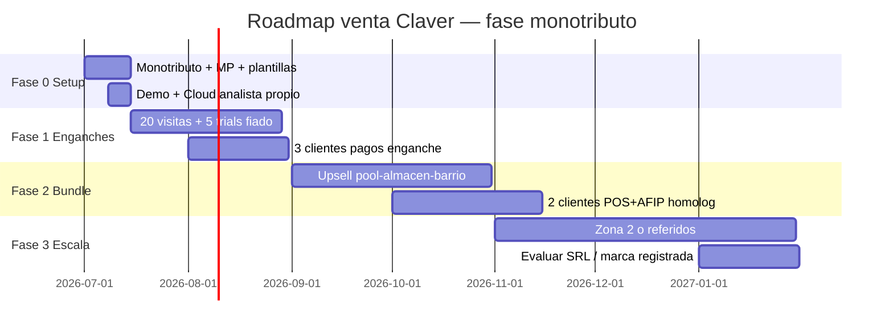
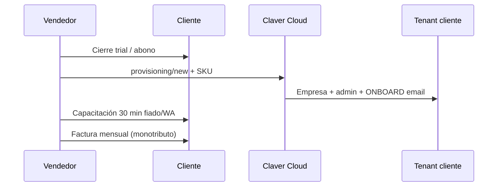

# Roadmap de venta — Vendedor en calle (fase monotributo)

> **Audiencia:** vendedores, fundador operando sin sociedad, implementador-comercial.  
> **Estado producto:** alineado a enganches y CCA existentes (jun 2026).  
> **Legal:** arranque facturando a nombre propio como monotributista — sin estructura Claver formal.

---

## ¿Está documentado en Claver hoy?

| Qué necesitás | ¿Existe? | Dónde |
|---------------|----------|-------|
| Enganches y precios | ✅ | [12-enganches-comerciales](../marketplace/12-enganches-comerciales.md) |
| Ciclo comercial → implementación | ✅ | [00-ciclo-completo](../marketplace/00-ciclo-completo.md) |
| Onboarding cliente | ✅ | [01-onboarding-cliente](../marketplace/01-onboarding-cliente.md) |
| Proceso CCA (analista) | ✅ | [CLAVER_CLOUD_PROCESO_IMPLEMENTACION](../operaciones/CLAVER_CLOUD_PROCESO_IMPLEMENTACION.md) |
| Pack almacén / retail | ✅ | [14-pack-almacen-rosario](../marketplace/14-pack-almacen-rosario.md) |
| Automatización / IA (pitch) | ✅ | Wiki `content/docs/roadmap/comercial-automation.mdx` |
| **Playbook vendedor calle + speech** | ❌ | **Este documento** |
| **Roadmap monotributo** | ❌ | **Este documento** |
| App “vendedor carga lead” | 🟡 | Existe `/vendedor` (logística/ruta), no CRM comercial |

**Conclusión:** el producto y los enganches están documentados para **analistas y marketplace**; **no** había guía unificada para el vendedor que golpea puerta. Este archivo es la referencia.

---

## Modelo de negocio fase 1 (vos como monotributista)

No necesitás sociedad para **empezar a vender**. Operás como:

```
Cliente retail ──paga mensual──► Vos (monotributista)
                                      │
                                      └── contratás / activás Clavis vía Claver Cloud (tenant)
```

| Concepto | Práctica recomendada |
|----------|---------------------|
| **Qué facturás** | “Servicio de digitalización / software / implementación” (validá categoría monotributo con contador) |
| **Cómo cobrás** | Transferencia, Mercado Pago, efectivo + factura mensual |
| **Contrato** | Orden de servicio simple 1 página (anexo SKU + precio + duración) |
| **Marca al cliente** | Presentás **Claver / Clavis**; vos sos el “partner implementador” |
| **Soporte** | Vos primer nivel; escalás a analista / Cloud para AFIP y provisioning |

**Límite consciente:** sin SRL/SA no escalás equipo grande ni contratos enterprise; esta fase es **validar venta repetible** en una zona.

---

## Roadmap por fases (12 meses)



### Fase 0 — Setup (2 semanas)

| # | Tarea | Entregable |
|---|-------|------------|
| 0.1 | Monotributo al día, factura E o C habilitada | Podés emitir al primer cobro |
| 0.2 | Cuenta MP / alias CBU para cobros | Link de pago por cliente |
| 0.3 | Acceso **Claver Cloud** (analista) + demo ERP | Provisioning de prueba |
| 0.4 | Tablet/celular con demo `admin@erp-argentina.com` | Demo fiado + cobranzas |
| 0.5 | Plantilla WhatsApp post-visita + orden de servicio 1 pág. | PDF o Notion |
| 0.6 | Zona piloto definida (ej. 30 comercios en 10 cuadras) | Mapa de visitas |

### Fase 1 — Solo enganches (mes 1–2)

**Objetivo:** 3–5 clientes pagando **Libreta Fiado** o **Cobranzas WA** — no vender ERP completo.

| SKU | Precio ref. | Trial | Speech de una línea |
|-----|-------------|-------|---------------------|
| `pos.fiado_barrio` | $4.990/mes | 14 días | “Libreta digital con límite por cliente” |
| `intang.cobranzas_wa` | $20.000/mes | — | “El WhatsApp cobra; vos vendés” |

**Metas:**

- 80 visitas / mes (4/día hábil)
- 15 diagnósticos completos
- 8 trials activados
- 3 conversiones a pago

**Flujo post-cierre:**



### Fase 2 — Bundle + operación (mes 3–5)

**Objetivo:** subir ticket con **pool-almacen-barrio** ($34.900) o primer **POS + AFIP homologación**.

| Oferta | Cuándo | Condición |
|--------|--------|-----------|
| `pool-almacen-barrio` | Cliente con fiado + deuda recurrente | Ya usa fiado o cobranzas |
| Clavis POS + stock | Comercio con caja formal | Dueño quiere facturar |
| Reporte mañanero + IA | Dueño dependiente del negocio | “Quiero saber sin entrar al sistema” |

**Metas:** 2 bundles + 1 homologación AFIP en marcha.

### Fase 3 — Escala o formalizar (mes 6–12)

| Señal para dar el paso | Acción |
|------------------------|--------|
| >15 clientes activos | Evaluar SRL unipersonal o SAS |
| Pedidos de factura A / grandes cadenas | Sociedad + contrato marco |
| Necesitás vendedor 2 | Comisiones + playbook (este doc) |

---

## Proceso de visita (checklist vendedor)

### Antes de entrar (30 seg)

- [ ] Rubro probable (almacén, kiosco, indumentaria…)
- [ ] Enganche candidato (fiado vs cobranzas vs POS)
- [ ] Demo cargada en el celular

### En el local (15 min máx)

1. **Apertura:** “No vengo a cambiar todo el negocio…”
2. **5 preguntas diagnóstico** (ver abajo)
3. **Demo un solo módulo** (fiado o link cobro)
4. **Precio único** en ARS/mes
5. **Cierre:** trial 14 días o seña primer mes

### Después (mismo día)

- [ ] WhatsApp resumen + link demo / video 60s
- [ ] Alta en planilla leads (ver plantilla)
- [ ] Si cerró: provisioning en Cloud en <24 h

### 5 preguntas diagnóstico

1. ¿Cómo anotás fiado / cuentas?
2. ¿Cuánto tiempo por semana en cobrar?
3. ¿Facturás electrónico hoy?
4. ¿Sabés qué falta en góndola / depósito?
5. Si no estás, ¿quién atiende y cómo sabe precios?

**Regla:** vendé **una respuesta**, un SKU.

---

## Speech por situación (retail)

### Almacén / kiosco

> “La libreta de fiado en papel pierde plata. Te dejo límite por cliente en el celular; si se pasa, avisa. En 14 días lo probás gratis.”

### Mucha deuda / morosos

> “No hace falta que vayas casa por casa. El sistema manda el link de pago por WhatsApp; vos seguís en el mostrador.”

### “No quiero sistemas”

> “No tenés que aprender un ERP. Te mando un resumen cada mañana: qué vendiste y qué te deben.”

### Resistencia al precio

> “¿Cuánto fiado no cobraste el mes pasado? Si recuperás una deuda, ya pagaste el año.”

---

## Tabla de precios sugerida (fase monotributo)

Podés cobrar **catálogo Claver** o un **pack redondeado** (tu margen = implementación + soporte).

| Producto | Precio catálogo | Tu precio calle (sugerido) | Tu trabajo incluido |
|----------|-----------------|----------------------------|---------------------|
| Libreta Fiado | $4.990/mes | $4.990–$7.990 | Alta + 30 min training |
| Cobranzas WA | $20.000/mes | $20.000–$25.000 | Config WA + 1 campaña |
| pool-almacen-barrio | $34.900/mes | $39.900–$44.900 | Bundle + visita mensual |
| POS + AFIP (proyecto) | Consulta | Setup $80k–$150k único + abono | Homolog + capacitación |

**Política simple:** primer mes 50% si paga transferencia anual por adelantado (opcional).

---

## Facturación monotributo (operativa, no legal)

| Paso | Acción |
|------|--------|
| 1 | Cliente acepta por WhatsApp o firma orden de servicio |
| 2 | Emitís factura C (o E) por “servicios de informática” / categoría que defina tu contador |
| 3 | Cobrás MP o transferencia |
| 4 | Activás tenant en Cloud (no entregues sin cobro salvo trial documentado) |
| 5 | Renovación: misma factura día 1 de cada mes |

**Trial 14 días:** documentá fecha inicio en planilla; día 12 contacto de conversión.

> ⚠️ Consultá con contador: categoría monotributo, límite facturación, y si el software como servicio va como venta de servicios o licencia.

---

## Handoff técnico (vos → Claver Cloud)

| Paso | Quién | Dónde |
|------|-------|-------|
| Crear tenant | Vos (analista) | `/claver-cloud/provisioning/new` |
| Plan inicial | Starter (enganches) / Pro (bundle) | Billing tenant |
| SKUs | Solo los vendidos | Marketplace / wizard |
| Email ONBOARD | Automático | Cliente recibe admin |
| Go-live fiado/WA | Vos + checklist | [02-activacion-producto](../marketplace/02-activacion-producto.md) |
| AFIP producción | Analista / escalación | CCA-040 VAL → PRD |

---

## Métricas semanales (planilla mínima)

| Campo | Uso |
|-------|-----|
| Fecha visita | |
| Comercio + rubro | |
| Dolor #1 | fiado / cobranza / caja / stock |
| SKU ofrecido | |
| Resultado | no / trial / venta |
| MRR estimado | |
| Próximo paso + fecha | |

**Dashboard personal:** sumá MRR activo vs meta ($50k → $150k → $300k en 6 meses es ambicioso pero orientativo).

---

## Qué construir después en producto (para vos)

| Prioridad | Herramienta | Beneficio |
|-----------|-------------|-----------|
| P1 | Formulario “lead vendedor” → provisioning | Cierre en calle sin entrar a Cloud en el local |
| P1 | Trial automático 14 días fiado | Menos fricción |
| P2 | PDF comercial por rubro | Dejás en el mostrador |
| P2 | Comisión tracking por SKU | Cuando sumes vendedor 2 |
| P3 | Facturación Claver → cliente final | Cuando tengas SRL |

---

## Enlaces rápidos producto

| Recurso | URL |
|---------|-----|
| Grupo Claver | `/claver` |
| Ecommerce (historia) | `/claver/ecommerce` |
| Demo login | `/login` |
| Torre (vos) | `/claver-cloud` |
| Enganches código | `lib/marketplace/enganche-catalog.ts` |

---

## Resumen ejecutivo

1. **Hoy no había** playbook de vendedor calle en Claver — solo marketplace + CCA.
2. **Arrancá monotributo** vendiendo **fiado o cobranzas**, no el ERP entero.
3. **Roadmap:** setup 2 sem → enganches 2 meses → bundle 3 meses → escala o SRL.
4. **Vos facturás, vos activás en Cloud, vos das soporte** hasta que el volumen pida estructura legal Claver.

---

*Última actualización: 2026-06-26 · Mantenedor: equipo producto / fundador comercial*