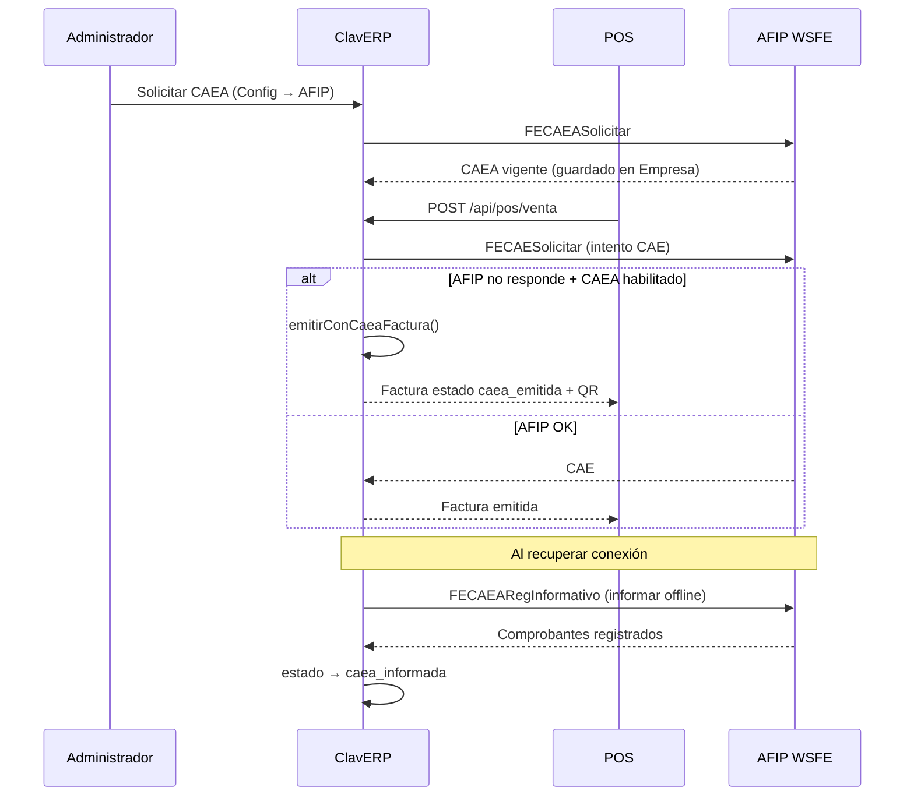

# Guía CAEA — Contingencia Offline (RG 5782)

ClavERP soporta emisión con **CAEA** (Código de Autorización Electrónico Anticipado) cuando AFIP no responde o cuando la empresa configura el modo preferir CAEA.

---

## 1. ¿Qué es CAEA?

| Concepto | CAE (normal) | CAEA (contingencia) |
|----------|--------------|---------------------|
| Cuándo se obtiene | Al emitir cada comprobante | Anticipado, por quincena |
| Requiere AFIP online | Sí, en el momento de venta | No para emitir (sí para informar después) |
| Validez | Por comprobante | Por período (quincena) |
| QR fiscal | `tipoCodAut: "E"` | `tipoCodAut: "A"` |

---

## 2. Flujo operativo en ClavERP

---

## 3. Parametrización

**Ubicación:** `Dashboard → Configuración → AFIP → Parametrización CAEA`

**API:** `GET/PUT /api/config/caea`

| Parámetro (`ParametroFiscal`) | Valor | Default | Descripción |
|-------------------------------|-------|---------|-------------|
| `caea_habilitado` | 0 / 1 | 1 | Activa o desactiva CAEA en la empresa |
| `caea_modo_emision` | 0 / 1 / 2 | 0 | Ver modos abajo |
| `caea_auto_informar` | 0 / 1 | 1 | Cron `sync-afip` informa comprobantes CAEA |
| `caea_auto_solicitar` | 0 / 1 | 0 | Solicitar CAEA al inicio de quincena (cron) |

### Modos de emisión (`caea_modo_emision`)

| Valor | Nombre | Comportamiento |
|-------|--------|----------------|
| **0** | Automático (recomendado) | Intenta CAE online. Si AFIP no responde (timeout/red), usa CAEA vigente |
| **1** | Deshabilitado | Solo CAE. Sin CAEA → queda `pendiente_cae` |
| **2** | Preferir CAEA | Si hay CAEA vigente, emite directo con CAEA sin llamar a AFIP |

---

## 4. Estados de factura CAEA

| Estado | Significado | Acción |
|--------|-------------|--------|
| `caea_emitida` | Emitida offline con CAEA, QR válido | Informar a AFIP antes del tope |
| `caea_informada` | Registrada en AFIP vía FECAEARegInformativo | Ninguna |
| `pendiente_cae` | Sin CAE ni CAEA disponible | Reintentar cuando AFIP vuelva |

---

## 5. Operación manual

### Solicitar CAEA (inicio de quincena)
1. Configuración → AFIP → panel **CAEA**
2. Botón **Solicitar CAEA** (requiere certificados AFIP)
3. Verificar badge **CAEA vigente** en POS

### Informar comprobantes offline
1. Cuando recuperás internet
2. Panel CAEA → **Informar comprobantes offline**
3. O esperar cron `/api/cron/sync-afip` si `caea_auto_informar = 1`

---

## 6. Archivos técnicos

| Archivo | Rol |
|---------|-----|
| `lib/afip/caea-config.ts` | Parametrización y vigencia |
| `lib/afip/caea-service.ts` | SOAP FECAEASolicitar / Informar |
| `lib/afip/emitir-caea-factura.ts` | Emisión offline de factura |
| `lib/afip/solicitar-cae-factura.ts` | Fallback CAEA tras error de red |
| `lib/afip/caea-informar.ts` | Informe masivo a AFIP |
| `app/api/afip/caea/route.ts` | API solicitar/consultar/informar |
| `app/api/config/caea/route.ts` | API parametrización |
| `components/fiscal/caea-config-panel.tsx` | UI parametrización |
| `components/fiscal/caea-panel.tsx` | UI operación |

---

## 7. Requisitos previos

- Certificados AFIP (.crt + .key) cargados en Configuración → AFIP
- Punto de venta habilitado en AFIP para el CUIT
- CAEA solicitado **antes** del corte de servicio
- Percepciones IIBB: se calculan en emisión vía `resolver-percepciones-factura.ts`

---

## 8. Limitaciones actuales

- **IndexedDB POS:** si el servidor ERP tampoco responde, la venta se guarda localmente pero aún no hay sync automático al servidor (pendiente P1)
- **FCE MiPyME:** requiere CAE online; CAEA no aplica a FCE en contingencia extendida
- **Auto-solicitar CAEA:** parámetro disponible; cron dedicado de quincena en roadmap

---

## 9. Checklist pre-corte AFIP

- [ ] Certificados vigentes y entorno correcto (homologación/producción)
- [ ] CAEA solicitado para la quincena actual
- [ ] `caea_habilitado = 1` y modo `0` (automático)
- [ ] `caea_auto_informar = 1`
- [ ] Probar venta en homologación simulando timeout
- [ ] Verificar QR con `tipoCodAut: A` en comprobante CAEA