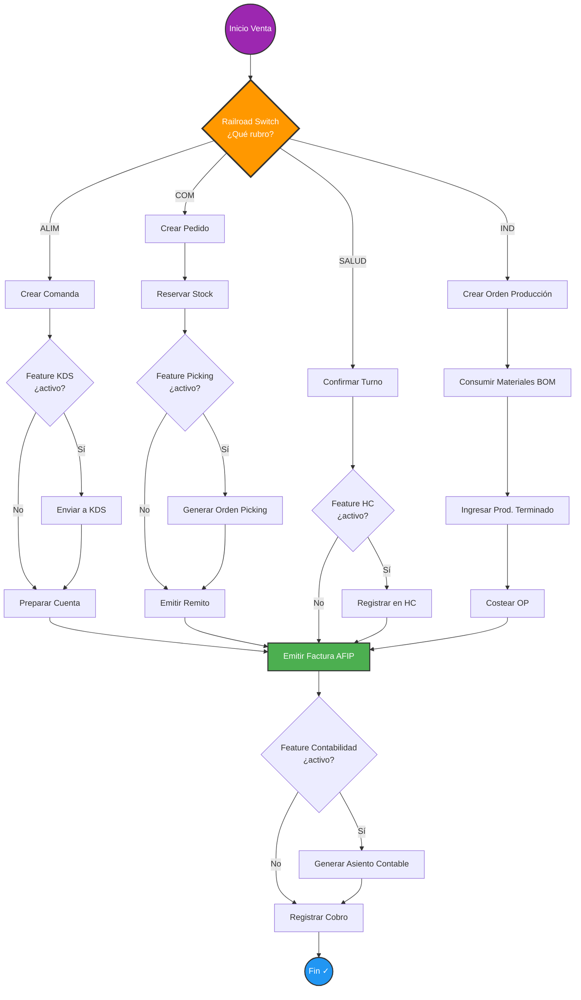

# Sistema de Configuración Dinámica por Rubro — Railroad Switch Engine

> **Versión**: 1.0  
> **Fecha**: Enero 2025  
> **Estado**: Implementado  

---

## 1. Arquitectura General

El ERP es 100% configurable por rubro (gastronomía, veterinaria, salud, distribución, industria, etc.) con activación dinámica de funcionalidades y flujos condicionales tipo "vía de tren" (railroad switch).

### Modelo de 3 capas de configuración

```
┌─────────────────────────────────────────────────
│  Capa 1: FeatureRubro (catálogo global)         │
│  → "¿Qué features EXISTEN para este rubro?"     │
├─────────────────────────────────────────────────┤
│  Capa 2: ConfiguracionRubro (defaults)          │
│  → "¿Cuáles se ACTIVAN por defecto?"            │
│  → Parámetros default, modo simplificado        │
├─────────────────────────────────────────────────┤
│  Capa 3: FeatureEmpresa (override)              │
│  → "¿Qué personalizó ESTA empresa?"             │
│  → Activa/desactiva individual + parámetros     │
└─────────────────────────────────────────────────┘
```

### Resolución en cascada
```
FeatureEmpresa (override) → ConfiguracionRubro (default rubro) → false (desactivado)
```
Los parámetros se mergean: `{...rubroParams, ...empresaParams}`.

---

## 2. Diagrama Railroad Switch — Flujo de Venta por Rubro



---

## 3. Modelos Prisma Agregados

| Modelo | Tabla | Propósito |
|--------|-------|-----------|
| `ConfiguracionRubro` | `configuracion_rubro` | Defaults de features por rubro (activado, parámetros, modo simplificado) |
| `FeatureRubro` | `features_rubro` | Catálogo de features disponibles por rubro |
| `FeatureEmpresa` | `features_empresa` | Override por empresa sobre features del rubro |
| `WorkflowRubro` | `workflow_rubro` | Definición de flujos por proceso y rubro |
| `WorkflowStep` | `workflow_steps` | Pasos individuales dentro de un workflow |
| `WorkflowTransition` | `workflow_transitions` | Transiciones entre pasos (vías del tren) |
| `WorkflowInstancia` | `workflow_instancias` | Ejecución en vuelo de un workflow |
| `WorkflowPasoLog` | `workflow_paso_log` | Audit trail de cada paso ejecutado |

---

## 4. Tabla Maestra: Features por Rubro

### Features Core (todas las verticales)

| Feature Key | Label | ALIM | COM | SALUD | IND | SERV | TRANS | AGRO | FIN | TECH | EDUC |
|-------------|-------|:----:|:---:|:-----:|:---:|:----:|:-----:|:----:|:---:|:----:|:----:|
| `pos` | Punto de Venta | ✅ | ✅ | ✅ | ✅ | ✅ | ✅ | ✅ | ✅ | ✅ | ✅ |
| `stock` | Control de Stock | ✅ | ✅ | ✅ | ✅ | ✅ | ✅ | ✅ | ✅ | ✅ | ✅ |
| `facturacion_afip` | Facturación AFIP | ✅ | ✅ | ✅ | ✅ | ✅ | ✅ | ✅ | ✅ | ✅ | ✅ |
| `contabilidad` | Contabilidad | ✅ | ✅ | ✅ | ✅ | ✅ | ✅ | ✅ | ✅ | ✅ | ✅ |
| `cc_cp` | Cta Cte. Cliente/Proveedor | ✅ | ✅ | ✅ | ✅ | ✅ | ✅ | ✅ | ✅ | ✅ | ✅ |
| `cobros_pagos` | Cobros y Pagos | ✅ | ✅ | ✅ | ✅ | ✅ | ✅ | ✅ | ✅ | ✅ | ✅ |
| `presupuestos` | Presupuestos | ✅ | ✅ | ✅ | ✅ | ✅ | ✅ | ✅ | ✅ | ✅ | ✅ |
| `iva_digital` | IVA Digital | ✅ | ✅ | ✅ | ✅ | ✅ | ✅ | ✅ | ✅ | ✅ | ✅ |
| `listas_precio` | Listas de Precio | ✅ | ✅ | ✅ | ✅ | ✅ | ✅ | ✅ | ✅ | ✅ | ✅ |
| `cheques` | Cheques | ✅ | ✅ | ✅ | ✅ | ✅ | ✅ | ✅ | ✅ | ✅ | ✅ |
| `conciliacion_bancaria` | Conciliación Bancaria | ✅ | ✅ | ✅ | ✅ | ✅ | ✅ | ✅ | ✅ | ✅ | ✅ |

### Features Verticales (por rubro)

| Feature Key | Label | ALIM | COM | SALUD | IND | SERV | TRANS | AGRO | FIN |
|-------------|-------|:----:|:---:|:-----:|:---:|:----:|:-----:|:----:|:---:|
| `kds` | Kitchen Display | ✅ | - | - | - | - | - | - | - |
| `mesas_salon` | Mesas / Salón | ✅ | - | - | - | - | - | - | - |
| `comandas` | Comandas | ✅ | - | - | - | - | - | - | - |
| `recetas_bom` | Recetas / BOM | ✅ | - | - | - | - | - | - | - |
| `picking_warehouse` | Picking Warehouse | - | ✅ | - | - | - | - | - | - |
| `logistica` | Logística | - | ✅ | - | - | - | ✅ | ✅ | - |
| `hojas_ruta` | Hojas de Ruta | - | ✅ | - | - | - | ✅ | - | - |
| `remitos` | Remitos | - | ✅ | - | - | - | - | - | - |
| `portal_b2b` | Portal B2B | - | ⚪ | - | - | - | - | - | - |
| `historia_clinica` | Historia Clínica | - | - | ✅ | - | - | - | - | - |
| `turnos_agenda` | Turnos / Agenda | - | - | ✅ | - | ✅ | - | - | - |
| `membresias` | Membresías | - | - | ⚪ | - | ⚪ | - | - | - |
| `bom_produccion` | BOM / Producción | - | - | - | ✅ | - | - | - | - |
| `ordenes_produccion` | Órdenes Producción | - | - | - | ✅ | - | - | - | - |
| `stock_multi_deposito` | Multi-Depósito | - | ✅ | - | ✅ | - | - | ✅ | - |
| `iot_sensores` | IoT / Sensores | - | - | - | ⚪ | - | ⚪ | ⚪ | - |
| `activos_fijos` | Activos Fijos | - | - | - | - | - | - | - | ✅ |
| `centros_costo` | Centros de Costo | - | - | - | - | - | - | - | ✅ |
| `multi_moneda` | Multi-Moneda | - | - | - | - | - | - | - | ✅ |
| `ajuste_inflacion` | Ajuste por Inflación | - | - | - | - | - | - | - | ✅ |
| `veterinaria` | Veterinaria | - | - | - | - | - | - | - | - |

✅ = activo por defecto | ⚪ = disponible pero inactivo | - = no aplica

---

## 5. Ejemplos de Uso

### 5.1 Verificar feature en un servicio existente

```typescript
// lib/hospitalidad/comanda-service.ts
import { isFeatureActiva, FEATURES } from "@/lib/config/rubro-config-service"

export async function crearComanda(empresaId: number, data: ComandaInput) {
  // Solo si tiene KDS activo
  const tieneKDS = await isFeatureActiva(empresaId, FEATURES.KDS)
  
  const comanda = await prisma.comanda.create({ data: { ... } })
  
  if (tieneKDS) {
    await eventBus.emit({ type: "comanda.nueva", payload: comanda })
  }
  
  return comanda
}
```

### 5.2 Ejecutar un workflow por la ruta del rubro

```typescript
// app/api/ventas/route.ts
import { WorkflowEngine } from "@/lib/config/workflow-engine"

export async function POST(req: NextRequest) {
  const auth = getAuthContext(req)
  // ... validar, crear factura, etc.
  
  const engine = new WorkflowEngine(auth.empresaId)
  const resultado = await engine.ejecutar("venta", {
    facturaId: factura.id,
    total: factura.total,
    clienteId: factura.clienteId,
  })
  
  // resultado = { instanciaId: 42, estado: "completado", contexto: {...} }
  return NextResponse.json({ factura, workflow: resultado })
}
```

### 5.3 UI — Activar/desactivar features desde el dashboard

```typescript
// app/dashboard/configuracion/features/page.tsx
const { data: features } = useAuthFetch("/api/config/features")

async function toggleFeature(featureKey: string, activado: boolean) {
  await authFetch("/api/config/features", {
    method: "PATCH",
    body: JSON.stringify({ featureKey, activado }),
  })
  mutate() // refresh SWR
}
```

### 5.4 Seed al crear empresa (onboarding)

```typescript
import { inicializarFeaturesDesdeRubro } from "@/lib/config/rubro-config-service"

// Después de crear la empresa en onboarding:
const empresa = await prisma.empresa.create({ data: { ... , rubroId: 3 } })
await inicializarFeaturesDesdeRubro(empresa.id, 3)
```

---

## 6. APIs Disponibles

| Método | Ruta | Descripción |
|--------|------|-------------|
| GET | `/api/config/rubros` | Listar rubros con stats |
| POST | `/api/config/rubros` | Seed completo de features+workflows para un rubro |
| GET | `/api/config/features` | Listar todas las features de la empresa |
| GET | `/api/config/features?feature=kds` | Verificar una feature específica |
| PATCH | `/api/config/features` | Activar/desactivar/configurar una feature |
| GET | `/api/config/workflows` | Templates de workflow del rubro |
| GET | `/api/config/workflows?modo=instancias` | Instancias de workflow en vuelo |
| POST | `/api/config/workflows` | Ejecutar un workflow `{proceso, contexto}` |

---

## 7. Plan de Migración

### Fase 1: Schema Migration (Inmediato)
```bash
npx prisma migrate dev --name add-rubro-config-workflow-engine
```
Esto crea las 8 tablas nuevas. Es **non-breaking** — todas las columnas nuevas son opcionales o tienen defaults.

### Fase 2: Seed de rubros existentes
```typescript
import { seedTodosLosRubros } from "@/lib/config/configuracion-feature-service"

// Ejecutar una vez:
const results = await seedTodosLosRubros()
// → { ALIM: { features: 19, workflows: 1 }, COM: { features: 25, workflows: 2 }, ... }
```

### Fase 3: Vincular empresas existentes a rubros
```sql
-- Migrar el campo STRING rubro a FK rubroId
UPDATE "Empresa" e
SET "rubroId" = r.id
FROM "Rubro" r
WHERE UPPER(e.rubro) = r.codigo
AND e."rubroId" IS NULL;
```

### Fase 4: Inicializar features de empresas existentes
```typescript
const empresas = await prisma.empresa.findMany({ where: { rubroId: { not: null } } })
for (const emp of empresas) {
  await inicializarFeaturesDesdeRubro(emp.id, emp.rubroId!)
}
```

### Fase 5: Integrar en servicios existentes (gradual)
Agregar `isFeatureActiva()` checks a los servicios que deben ser condicionales. No es breaking — sin feature config, todo retorna defaults.

---

## 8. Archivos Creados/Modificados

### Nuevos
| Archivo | Descripción |
|---------|-------------|
| `lib/config/rubro-config-service.ts` | Servicio principal de configuración por rubro con cache, feature checks, CRUD |
| `lib/config/workflow-engine.ts` | Motor de workflows dinámicos con railroad switch, feature gates, audit trail |
| `lib/config/configuracion-feature-service.ts` | Seeds por rubro, CRUD de configuraciones, query helpers |
| `app/api/config/rubros/route.ts` | API de rubros (listar + seed) |
| `app/api/config/features/route.ts` | API de features por empresa (CRUD) |
| `app/api/config/workflows/route.ts` | API de workflows (templates + ejecutar) |
| `__tests__/config/rubro-config-service.test.ts` | 8 tests unitarios del config service |
| `__tests__/config/workflow-engine.test.ts` | 5 tests unitarios del workflow engine |

### Modificados
| Archivo | Cambios |
|---------|---------|
| `prisma/schema.prisma` | +8 modelos (ConfiguracionRubro, FeatureRubro, FeatureEmpresa, WorkflowRubro, WorkflowStep, WorkflowTransition, WorkflowInstancia, WorkflowPasoLog). Rubro model enhanced (icono, color, orden). Empresa: added rubroId FK + new relations. |

---

## 9. Tests

**124/124 passing** (111 existentes + 13 nuevos)

Tests nuevos:
- `rubro-config-service.test.ts`: isFeatureActiva (4 tests), getFeatureParam (2), getAllFeatures (1), setFeature (1), inicializarFeaturesDesdeRubro (1)
- `workflow-engine.test.ts`: sin_workflow (1), ejecución secuencial completa (1), feature gate skip (1), error handling (1)
