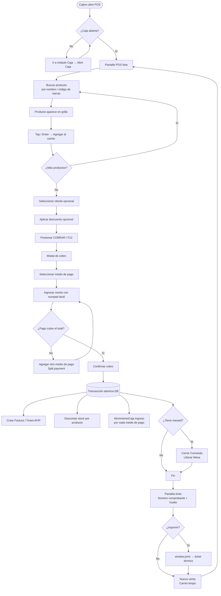
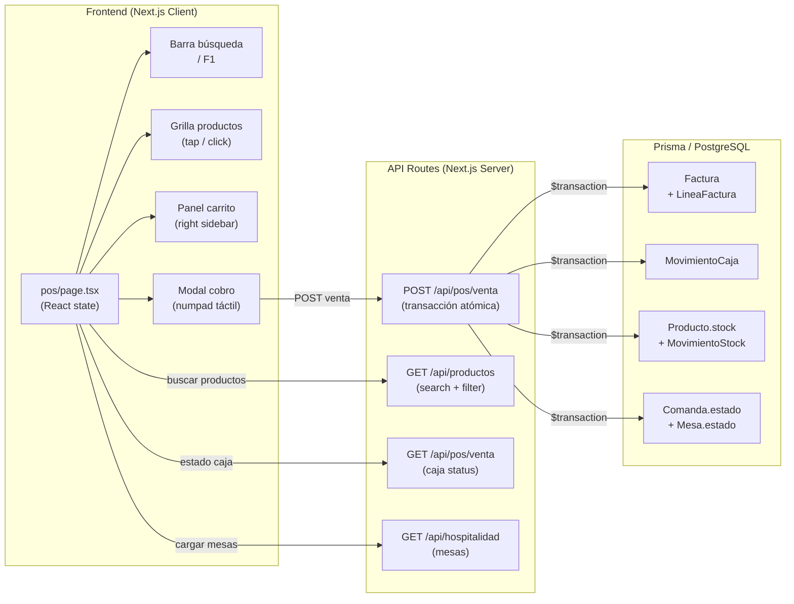
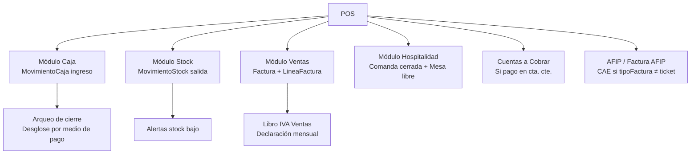
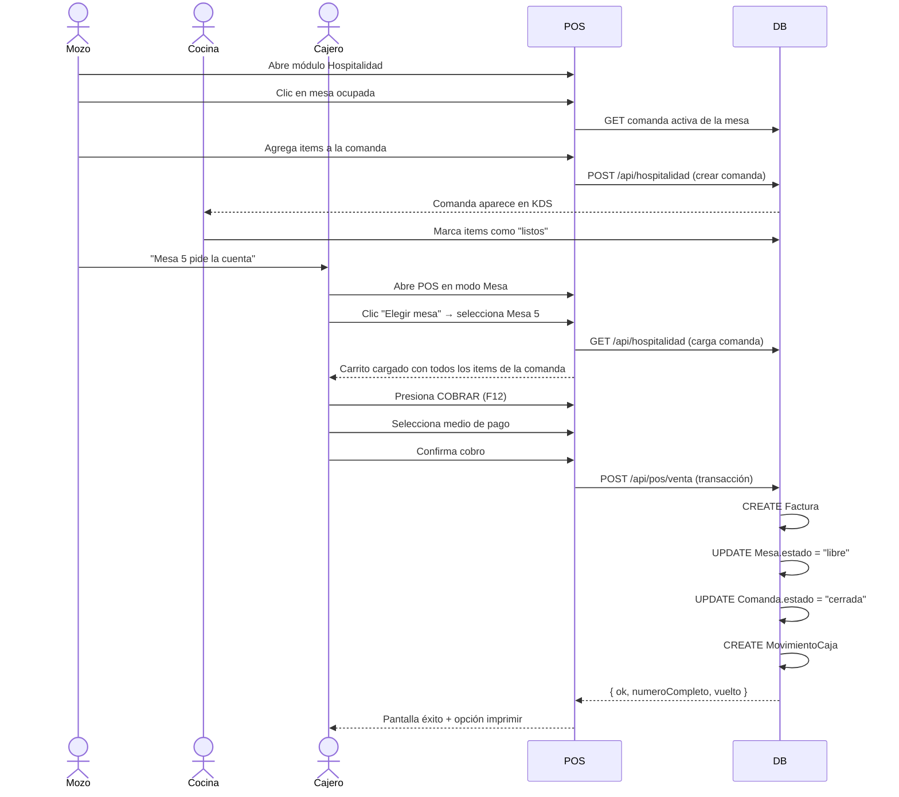
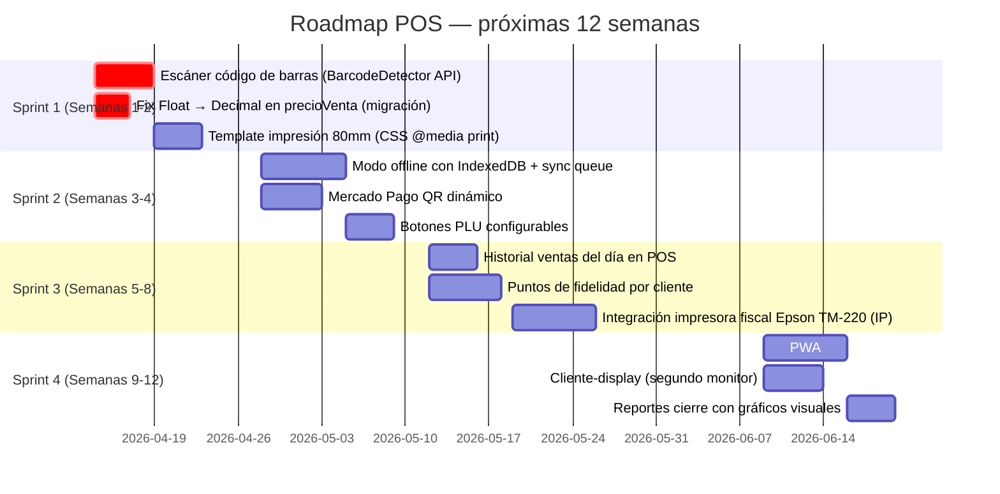
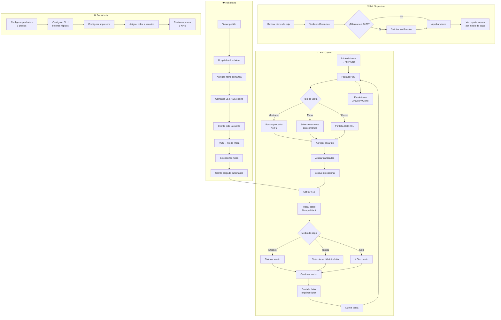

# Sistema POS — Punto de Venta
> NegocioOS ERP Argentina | Documento funcional + ingeniería + capacitación  
> Generado: 2026-04-14 | Estado: implementado (MVP sellable)

---

## Índice

1. [¿Qué es el POS y por qué importa?](#1-qué-es-el-pos-y-por-qué-importa)
2. [Modos de operación](#2-modos-de-operación)
3. [Flujo principal — diagrama](#3-flujo-principal--diagrama)
4. [Arquitectura técnica](#4-arquitectura-técnica)
5. [Atajos de teclado y touch](#5-atajos-de-teclado-y-touch)
6. [Integración con otros módulos](#6-integración-con-otros-módulos)
7. [Flujo completo modo Mesa / Restaurante](#7-flujo-completo-modo-mesa--restaurante)
8. [Split payment — pagos mixtos](#8-split-payment--pagos-mixtos)
9. [Comparativa con otros sistemas POS de la región](#9-comparativa-con-otros-sistemas-pos-de-la-región)
10. [Autocrítica — lo que todavía nos falta](#10-autocrítica--lo-que-todavía-nos-falta)
11. [Plan de mejoras priorizadas](#11-plan-de-mejoras-priorizadas)
12. [Capacitación — guía paso a paso](#12-capacitación--guía-paso-a-paso)
13. [Diagrama de flujo de capacitación](#13-diagrama-de-flujo-de-capacitación)

---

## 1. ¿Qué es el POS y por qué importa?

El módulo **Punto de Venta (POS)** es la pantalla donde se procesa una venta en tiempo real, desde que el cliente pide hasta que se emite el comprobante y se registra el movimiento de caja.

A diferencia del módulo de *Facturación* (diseñado para ventas B2B con pedidos y remitos), el POS está optimizado para:

- **Velocidad**: una venta en < 30 segundos
- **Tacto y teclado**: funciona igual con mouse, touch de tablet o teclado físico
- **Sin errores de caja**: cada cobro impacta automáticamente en la caja del turno
- **Stock en tiempo real**: cada venta descuenta automáticamente el inventario

---

## 2. Modos de operación

| Modo | Icono | Descripción | Rubros típicos |
|------|-------|-------------|----------------|
| **Mostrador** | `Store` | Venta directa. El cajero busca productos y cobra | Kiosko, ferretería, farmacia, librería |
| **Mesa** | `UtensilsCrossed` | Integrado con Mesas/Comandas. Carga la comanda de la mesa al carrito | Restaurante, bar, café, delivery |
| **Kiosko** | `Monitor` | Pantalla full-screen con botones XXL, ideal para pantallas táctiles autoatendidas | Kiosko tech, fast food |

---

## 3. Flujo principal — diagrama



---

## 4. Arquitectura técnica

### Archivos clave

| Archivo | Responsabilidad |
|---------|----------------|
| `app/dashboard/pos/page.tsx` | UI completa del POS (cliente) |
| `app/api/pos/venta/route.ts` | Transacción atómica POST + estado GET |
| `app/api/productos/route.ts` | Catálogo de productos para la grilla |
| `app/api/caja/movimientos/route.ts` | Backup para movimientos manuales |
| `app/api/hospitalidad/route.ts` | Datos de mesas para modo Mesa |
| `prisma/schema.prisma` | Modelos: Factura, MovimientoCaja, MovimientoStock, Comanda |

### Diagrama de componentes



### La transacción atómica (`prisma.$transaction`)

```
POST /api/pos/venta
  ├─ Validación Zod (lineas, pagos, tipoFactura)
  ├─ Verificar caja abierta
  ├─ Calcular siguiente número de factura
  ├─ prisma.$transaction([
  │    1. CREATE Factura + LineaFactura[]
  │    2. Para cada producto:
  │         UPDATE stock - cantidad
  │         CREATE MovimientoStock
  │    3. Para cada pago:
  │         CREATE MovimientoCaja (ingreso)
  │    4. Si mesaId:
  │         UPDATE Comanda.estado = "cerrada"
  │         UPDATE Mesa.estado = "libre"
  │    5. Si pago en cuenta corriente:
  │         CREATE CuentaCobrar
  │  ])
  └─ Return { facturaId, numeroCompleto, total, vuelto }
```

Si cualquier paso falla, **toda la transacción se revierte**. No puede quedar stock descontado sin factura, ni factura sin movimiento de caja.

---

## 5. Atajos de teclado y touch

| Tecla | Acción |
|-------|--------|
| `/` o `F1` | Enfocar barra de búsqueda |
| `Enter` (con 1 resultado) | Agregar ese producto al carrito |
| `F12` | Abrir modal de cobro |
| `Esc` | Limpiar búsqueda / cerrar modal |
| `+` | Incrementar cantidad del último ítem |
| `-` | Decrementar cantidad del último ítem |
| `Del` | Eliminar último ítem del carrito |
| `0-9` en modal cobro | Numpad táctil activo |

### Touch design

- Botones de productos: `min-height: 80px` (120px en modo Kiosko)
- Numpad: teclas `48px` de alto, gap visual al presionar (`active:scale-95`)
- Scroll independiente en grilla de productos y en carrito
- Botón COBRAR: `56px` de alto, fuente `text-lg`, siempre visible en bottom panel

---

## 6. Integración con otros módulos



---

## 7. Flujo completo modo Mesa / Restaurante



---

## 8. Split payment — pagos mixtos

El POS soporta dividir el pago en hasta 3 medios de pago distintos.

**Ejemplo**: Total $5.000
- Efectivo: $2.000
- Tarjeta débito: $3.000

```
pagos: [
  { medio: "efectivo",       monto: 2000 },
  { medio: "tarjeta_debito", monto: 3000 }
]
```

Cada pago genera un **MovimientoCaja independiente** con su propio `medioPago`, lo que permite el arqueo exacto por medio al cierre del turno.

Si el cliente paga con `cuenta_corriente`, se genera automáticamente una **CuentaCobrar** a 30 días.

---

## 9. Comparativa con otros sistemas POS de la región

> Investigación propia sobre Odoo POS, Tango Punto de Venta, RestBar, Bsale, Alegra POS, iPos, Siigo y Bind.

### Tabla comparativa

| Característica | **NegocioOS** | Odoo POS | Tango PdV | RestBar | Bsale | Alegra |
|----------------|:---:|:---:|:---:|:---:|:---:|:---:|
| AFIP/ARCA nativo | ✅ | ⚠️ addon | ✅ | ✅ | ✅ (Chile/Col) | ✅ (Col/Mx) |
| Split payment | ✅ | ✅ | ✅ | ✅ | ❌ | ❌ |
| Modo mesa + KDS | ✅ | ✅ (Odoo 17) | ✅ (RestBar) | ✅ nativo | ❌ | ❌ |
| Onboarding IA por rubro | ✅ | ❌ | ❌ | ❌ | ❌ | ❌ |
| Multi-rubro en una app | ✅ | ✅ | ❌ | ❌ | ❌ | ❌ |
| Offline mode | ❌ parcial | ✅ | ❌ | ❌ | ❌ | ❌ |
| Impresora fiscal Argentina | ⚠️ pendiente | ❌ | ✅ Epson/Hasar | ✅ | ❌ | ❌ |
| Código de barras (cámara) | ❌ pendiente | ✅ | ✅ | ✅ | ✅ | ✅ |
| Portal B2B integrado | ✅ | ✅ | ❌ | ❌ | ❌ | ❌ |
| App móvil nativa | ❌ | ✅ iOS/Android | ❌ | ✅ | ✅ | ✅ |
| Contabilidad integrada | ✅ | ✅ | ✅ | ❌ | ❌ | ✅ |
| Precio/mes ARG (est.) | Propio | $30-$150k | $15-$60k | $8-$30k | $15-$40k | $8-$25k |

**Leyenda:** ✅ implementado · ⚠️ parcial/addon · ❌ no tiene

### Análisis por sistema

#### Odoo POS (Odoo 17)
**Lo que nos gana:** modo offline robusto, integración con Mercado Pago oficial, escáner de cámara vía ZXing, reportes avanzados de sesión.  
**Lo que le ganamos:** onboarding por IA en < 10 minutos, integración AFIP nativa sin addons, precio accesible para pymes argentinas sin servidor propio, UX más simple para cajeros sin entrenamiento técnico.  
**A copiar:** implementar modo offline con Service Worker + cola de sync, escáner de cámara con BarcodeDetector API.

#### Tango Punto de Venta (Tango Gestión)
**Lo que nos gana:** integración profunda con impresoras fiscales Epson TM-220 y Hasar, soporte técnico local, ecosistema maduro de ~30 años.  
**Lo que le ganamos:** arquitectura web (sin instalar nada), módulos de hospitalidad, veterinaria y gymn en la misma app, portal B2B para clientes.  
**A copiar:** integración con impresoras fiscales Epson/Hasar vía protocolo serial (o IP), teclado numérico físico de cajero.

#### RestBar
**Lo que nos gana:** diseño UX muy pulido para gastronómico, integración con delivery apps (Pedidos Ya, Rappi), TV de cocina sin servidor adicional.  
**Lo que le ganamos:** multi-rubro (RestBar es solo gastronomía), facturación A/B/C en la misma pantalla, membresías para bar con socios.  
**A copiar:** plano de mesas con drag-and-drop, timer de mesa (tiempo ocupada), comanda dividida (un ítem a múltiples personas).

#### Bsale / Alegra
**Lo que nos gana:** soporte fiscal para Argentina (estos son Chile/Colombia-first), integración con AFIP, cobranza recurrente local.  
**Lo que le ganamos:** precio más bajo para pymes ARG, onboarding más rápido, módulos de industria y distribución sin pagar extra.  
**A copiar:** UX de la app móvil de Bsale (muy limpia para vendedores en ruta), reportes de cierre de caja visuales con gráficos.

---

## 10. Autocrítica — lo que todavía nos falta

### Crítico para competir (must-have en 30 días)

| # | Problema | Impacto | Fix sugerido |
|---|---------|---------|-------------|
| P1 | **Sin escáner de código de barras en POS** | En kiosko/ferretería el cajero no puede escanear. Tiene que tipear el nombre. | Implementar `BarcodeDetector` API + fallback `QuaggaJS` para cámara. Input oculto que captura scan de pistola USB. |
| P2 | **Sin impresora fiscal / térmica** | No imprime ticket físico legal. Solo `window.print()` (usa papel A4, inútil en POS real). | Integrar con API del browser `PrinterService` + template CSS `@media print` para 80mm. Para fiscal: socket TCP Epson/Hasar. |
| P3 | **Sin modo offline real** | Si se corta internet → caja queda inutilizable. | Service Worker con queue de ventas en IndexedDB. Sync cuando vuelve la red. |
| P4 | **`Producto.precioVenta` es `Float` no `Decimal`** (Bug A-007) | Errores de redondeo en IVA: `$1234.50 × 1.21 = $1493.745000000001` | Migración Prisma a `Decimal @db.Decimal(15,2)`. |
| P5 | **Sin búsqueda por código de barras en API** | El campo `codigoBarras` existe en el schema pero no se usa en el WHERE de búsqueda POS. | Agregar `{ codigoBarras: { contains: search } }` en el OR de `/api/productos`. |

### Importante para diferenciación (60 días)

| # | Problema | Fix |
|---|---------|-----|
| P6 | Sin Mercado Pago link de pago QR en cobro | Integrar MP QR dinámico: POST a MP API → mostrar QR → webhook confirma pago |
| P7 | Sin cliente frecuente / puntos | Tabla `ClientePuntos` + acumular en cada venta POS |
| P8 | Sin historial de ventas del día en pantalla POS | Sección colapsable "Últimas ventas" con anular última |
| P9 | Sin PLU (botones de acceso rápido personalizados) | Tabla `PLU { empresaId, productoId, orden, color }` |
| P10 | Sin pesaje integrado (balanza) | Para carnicería/dietética: serial/USB con protocolo Toledo o Marte |

### Deseable (90 días)

| # | Deseable |
|---|---------|
| D1 | App móvil PWA instalable (icono en home screen, sin browser chrome) |
| D2 | Pantalla de cliente-display (segundo monitor con total y medios de pago) |
| D3 | Fidelización: tarjeta de puntos QR por cliente |
| D4 | Estadísticas live en POS: "Vendiste $X hoy" |
| D5 | Sincronización con Pedidos Ya / Rappi para modo restaurante |

---

## 11. Plan de mejoras priorizadas



---

## 12. Capacitación — guía paso a paso

### Para el cajero (operador)

#### Antes de empezar
1. Ir a **Financiero → Caja**
2. Hacer clic en **Abrir Caja**
3. Ingresar el efectivo inicial (fondo de caja)
4. Seleccionar el turno (Mañana / Tarde / Noche)
5. Confirmar

#### Realizar una venta
1. Ir a **Ventas → Punto de Venta (POS)**
2. Verificar que el indicador superior diga **"Caja abierta"** en verde
3. Buscar el producto escribiendo nombre o código (atajo: `/`)
4. Hacer clic en el producto → se agrega al carrito (o `Enter` si hay 1 resultado)
5. Ajustar cantidades con `+` / `-` en el panel derecho
6. Si el cliente tiene descuento: seleccionar porcentaje en la barra de descuento
7. Presionar **COBRAR** (o `F12`)
8. En el modal de cobro:
   - Seleccionar medio de pago
   - Ingresar monto con el numpad (o tipear el monto)
   - Si paga con varios medios: clic en "+ Agregar otro medio de pago"
   - Verificar el vuelto calculado automáticamente
   - Presionar **Confirmar cobro**
9. Aparece pantalla de éxito con el número de comprobante
10. Imprimir si es necesario → **Nueva venta**

#### Al final del turno
1. Ir a **Financiero → Caja**
2. Contar el efectivo físico
3. Clic en **Arqueo y Cierre**
4. Declarar cada medio de pago
5. Si hay diferencia > $100: ingresar justificación
6. Confirmar cierre

### Para el mozo (modo Mesa)

1. Atender la mesa normalmente desde **Hospitalidad → Mesas y Comandas**
2. Agregar ítems a la comanda de la mesa
3. Cuando el cliente pide la cuenta:
   - Ir a **Ventas → Punto de Venta (POS)**
   - Seleccionar modo **Mesa** (ícono de tenedor)
   - Clic en **"Elegir mesa"** → seleccionar la mesa del cliente
   - El carrito se carga automáticamente con todos los ítems de la comanda
   - Presionar **COBRAR** y seguir el proceso normal
4. Al confirmar el cobro, la mesa queda en estado **Libre** automáticamente

### Para el supervisor / administrador

- **Ver ventas del día**: Financiero → Caja → Movimientos de Hoy
- **Reportes fiscales**: Fiscal → IVA / Libros Fiscales
- **Stock en tiempo real**: Stock → Productos (columna "Stock Actual")
- **Historial de facturas**: Ventas → Facturación

---

## 13. Diagrama de flujo de capacitación



---

## Apéndice: variables de configuración relevantes

| Variable | Dónde configurar | Descripción |
|----------|-----------------|-------------|
| `AFIP_PUNTO_VENTA` | `.env` | Número de punto de venta AFIP (ej: `1`) |
| `NEXT_PUBLIC_ECOMMERCE_EMPRESA_ID` | `.env` | ID de empresa para el portal B2B |
| Tipo de factura por defecto | Onboarding IA | Se setea según condición fiscal del onboarding |
| Módulos visibles en sidebar | `lib/onboarding/onboarding-ia.ts` | `CONFIG_POR_RUBRO` activa/desactiva el módulo POS |
| Descuentos permitidos | (pendiente) | Tabla `ConfigPOS { maxDescuento, requiresAuth }` |

---

*Documento mantenido automáticamente. Última revisión: 2026-04-14.*
