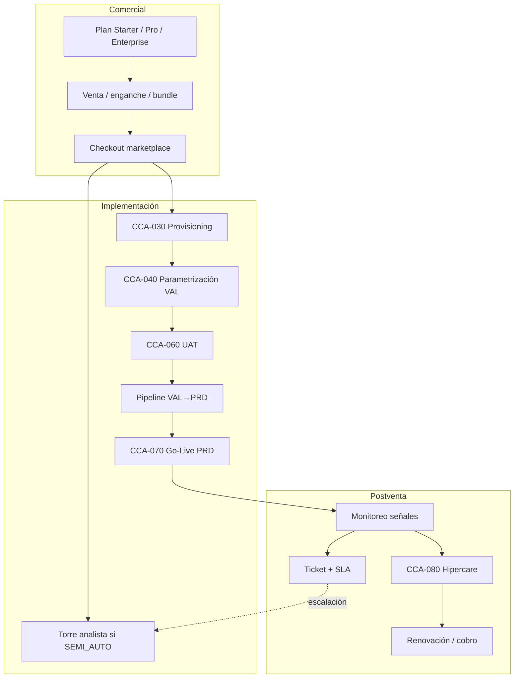
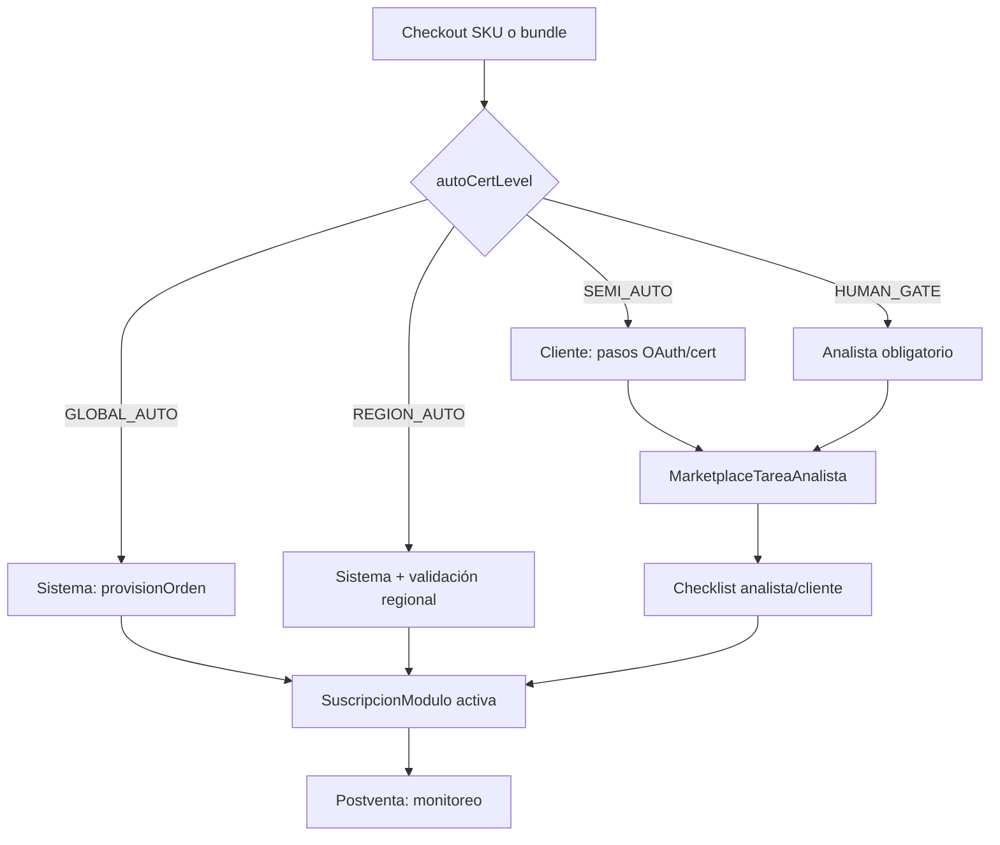
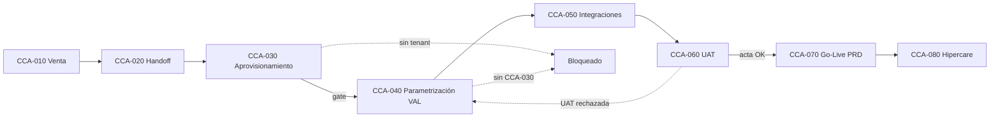
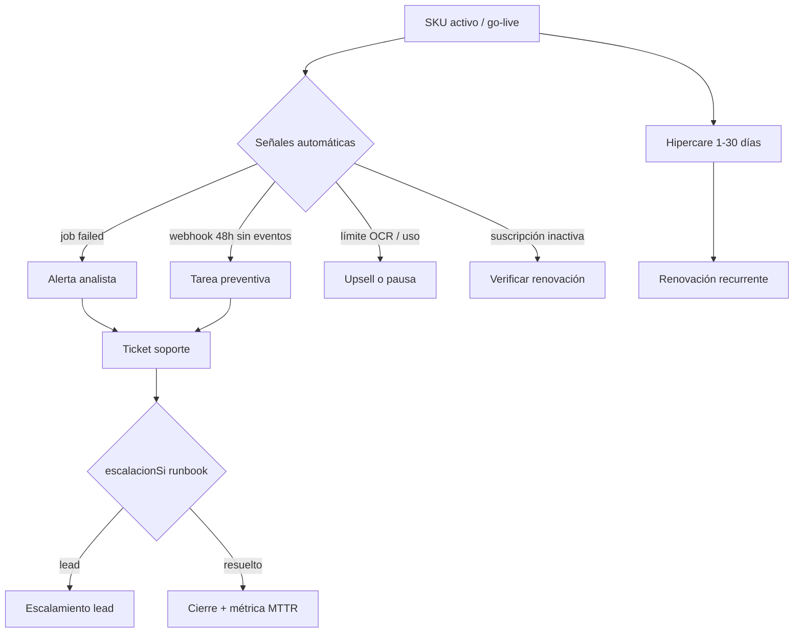
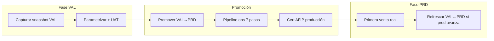
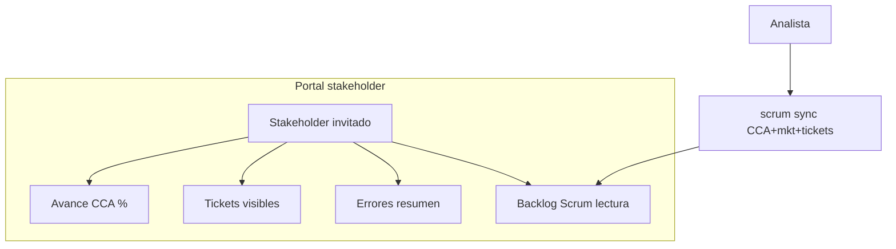
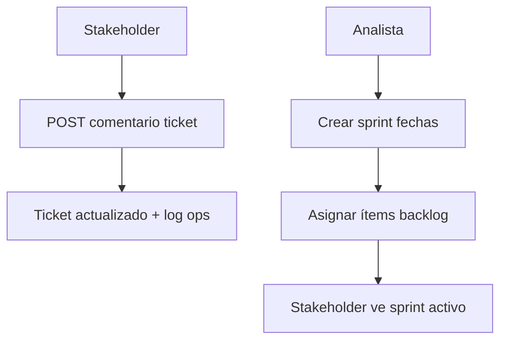
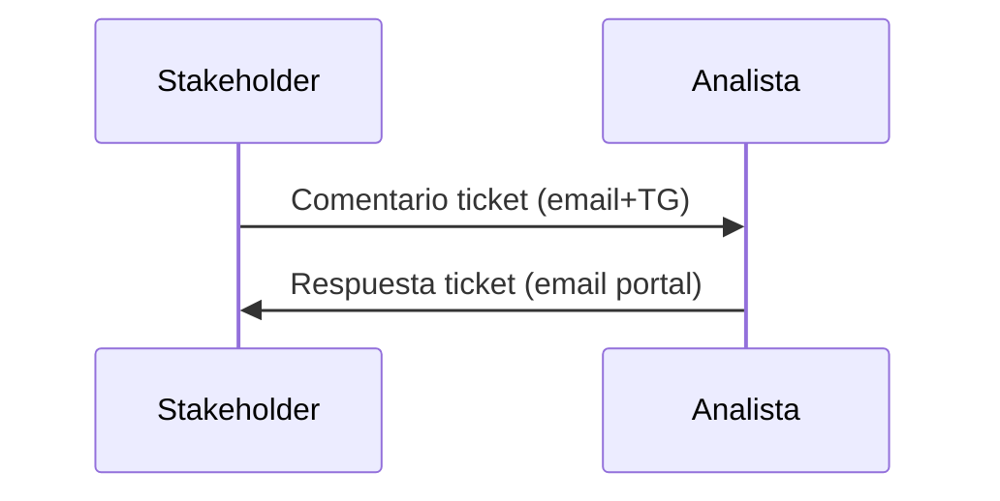

# 00 — Ciclo completo: Comercial → Implementación → Postventa

> **Documento maestro** de flujos funcionales Clavis / Claver Cloud.  
> Complementa [README marketplace](./README.md) y [CCA](../../content/docs/operaciones/claver-cloud-proceso-implementacion.mdx).

## Diagrama transversal

---

## P0 — Activación por certificación (C5 + I6)

| Nivel | Quién ve qué | Tiempo típico |
|-------|--------------|---------------|
| GLOBAL_AUTO | Badge Instalado en App Store | Segundos |
| REGION_AUTO | Igual + dato regional si aplica | Segundos |
| SEMI_AUTO | Badge Analista + email instrucciones | 1–3 días hábiles |
| HUMAN_GATE | Especialista contacta al cliente | Según SLA |

---

## P0 — CCA con gates (I1)

**Regla de oro:** no iniciar CCA-040 sin CCA-030 (tenant + entornos + admin).

---

## P0 — Postventa ciclo de vida (P1)

---

## VAL → PRD (implementación técnica)

Ver detalle: [VAL/PRD activación](../operaciones/VAL_PRD_ACTIVACION.md)

---

## Índice de diagramas por documento

| Doc | Diagramas agregados |
|-----|---------------------|
| [01-onboarding](./01-onboarding-cliente.md) | Funnel comercial |
| [02-activacion](./02-activacion-producto.md) | Swimlane cliente |
| [03-otorgamiento](./03-otorgamiento-servicio.md) | Por ejecutor + SEMI_AUTO |
| [04-torre-analista](./04-torre-analista-claver-cloud.md) | Flujo tarea |
| [05-postventa](./05-postventa.md) | Hipercare, escalación, canales |
| [07-bundles](./07-bundles-comerciales.md) | Checkout multi-SKU |
| [12-enganches](./12-enganches-comerciales.md) | Funnel enganche→ERP |
| [09-top5](./09-servicios-intangibles-top5.md) | Journey intangible |
| [13-premium-7](./13-servicios-intangibles-premium-7.md) | Journey premium |

## P2 implementado

| Componente | Doc / ruta |
|------------|------------|
| Portal stakeholder | [15-portal-stakeholder](./15-portal-stakeholder.md) · `/claver-cliente` |
| Tablero Scrum | `lib/ops/scrum-service.ts` · `/claver-cloud/implementation/[id]` |
| Runbooks Premium + Impl | [16-runbooks-premium-impl](./16-runbooks-premium-impl.md) |

## P3 implementado

| Componente | Doc / ruta |
|------------|------------|
| Comentarios stakeholder en tickets | `POST /api/claver-cliente/tickets/:id/comentarios` · `/claver-cliente/tickets/[id]` |
| Sprints con fechas | `crearSprint` / `asignarItemASprint` · `/claver-cloud/implementation/[id]` |
| Sprint activo (lectura cliente) | `GET /api/claver-cliente/scrum` · `/claver-cliente/scrum` |
| Diagramas Tier 1 | [17-runbooks-tier1-diagramas](./17-runbooks-tier1-diagramas.md) |

## P6 implementado — Flota + automatizaciones

| Componente | Ruta |
|------------|------|
| Dashboard flota super admin | `/claver-cloud/superadmin` |
| Playbooks automáticos | `POST /api/claver/tenants/:id/playbooks` |
| Impersonación ERP | `POST /api/claver/tenants/:id/impersonate` |
| Servicios ops | `ops.claver_superadmin`, `ops.playbooks_auto` |

## P7 implementado — Billing + parametrización Cloud

| Componente | Ruta / API |
|------------|------------|
| Billing flota MRR | `/claver-cloud/billing` · `GET /api/claver/billing` |
| Plan comercial por tenant | `PATCH /api/claver/tenants/:id/billing` |
| Parametrización sin impersonar | Pestaña Parametrización · `PATCH .../config` |
| AFIP producción dual | `POST .../afip-produccion` |
| Playbooks custom Enterprise | `.../playbooks/custom` |
| Diccionario parámetros | `docs/analista/PARAMETROS_ERP.md` |
| Health integraciones readiness | MP / WA / Shopify en checklist |

## P5 implementado — Super Admin Cloud

| Componente | Doc / ruta |
|------------|------------|
| Panel super admin por tenant | `/claver-cloud/tenants/[empresaId]` |
| Activar/provisionar/desactivar SKUs y packs | `POST /api/claver/tenants/:id/productos` |
| Readiness integrado | `lib/ops/tenant-admin-service.ts` |

Ver [CLAVER_CLOUD_SUPERADMIN](../operaciones/CLAVER_CLOUD_SUPERADMIN.md)

## P4 implementado

| Componente | Doc / ruta |
|------------|------------|
| Email analista al comentar stakeholder | `notifyAnalistasComentarioStakeholder` · Telegram opcional |
| Email stakeholder al responder analista | `notifyStakeholdersRespuestaTicket` · `POST /api/tickets/:id/comentarios` |
| Diagramas enganches Tier 2 | [18-runbooks-tier2-enganches-diagramas](./18-runbooks-tier2-enganches-diagramas.md) |

---

## Referencias código

| Flujo | Archivo |
|-------|---------|
| Checkout → provision | `lib/marketplace/provision-service.ts` |
| Tareas analista | `lib/marketplace/analyst-task-service.ts` |
| CCA | `lib/ops/implementacion-service.ts` |
| Sync VAL/PRD | `lib/ops/entorno-sync-service.ts` |
| Pipeline ops | `lib/ops/ops-service.ts` |
| Tickets | `lib/soporte/tickets-service.ts` |