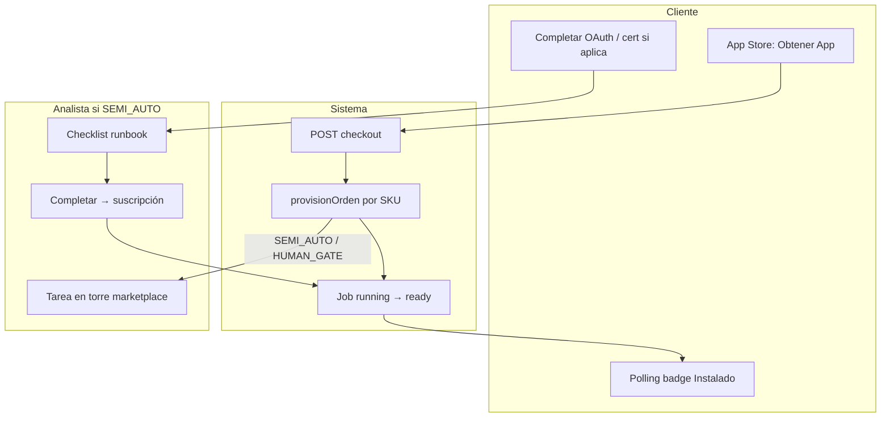

# 02 — Activación de producto (vista cliente)

## Objetivo

El cliente elige un producto, paga (o activa trial) y el sistema inicia la provisión correcta según `autoCertLevel`.

## Dónde activa el cliente

| Superficie | URL | Acción |
|------------|-----|--------|
| App Store tenant | `/dashboard/apps` | Obtener App |
| Web marketing | `/claver/apps` | CTA → login → checkout |
| Bundle | checkout con `bundleId` | Varios SKUs en una orden |

## Swimlane activación (vista funcional)



## Flujo técnico (cliente)

```
1. GET /api/marketplace/catalog
   → catalog + autopool + bundles + estado instalación

2. POST /api/marketplace/checkout
   Body: { items: [{ sku, cantidad, precio }], origen: "dashboard" }
   → MarketplaceOrden (paid)
   → provisionOrden() por cada SKU

3. GET /api/marketplace/jobs/:id (polling)
   → estado: running | pending | ready | failed
```

## Qué ve el cliente según nivel

| autoCertLevel | UI tras checkout | Tiempo típico |
|---------------|------------------|---------------|
| GLOBAL_AUTO | Badge "Instalado" tras polling | Segundos |
| REGION_AUTO | Igual; puede requerir dato regional | Segundos |
| SEMI_AUTO | Badge "Analista" + instrucciones en email | 1–3 días hábiles |
| HUMAN_GATE | Mensaje "Un especialista te contactará" | Según SLA |

## Instrucciones por producto (activación cliente)

Cada SKU tiene `activacionCliente` en el runbook. Ejemplos:

| SKU | Instrucción cliente |
|-----|---------------------|
| `sec.backup` | Dashboard → Marketplace → Activar Backup Cloud |
| `integ.shopify` | Integraciones → Shopify → OAuth o token |
| `integ.odoo` | Integraciones → Odoo → URL + API key |
| `impl.migracion_odoo` | Marketplace → Migración Odoo → Contratar |

El catálogo API expone `activacionCliente` en cada ítem del catálogo.

## Bundles

Ver [07 — Bundles comerciales](./07-bundles-comerciales.md). Un bundle expande a N SKUs en la misma orden; cada SKU sigue su propio camino de certificación.

### Pack Almacén Rosario (`pool-almacen-rosario`)

| Paso | Acción |
|------|--------|
| 1 | `/dashboard/apps` → Pack **Almacén Rosario** o SKU suelto (deep link: `?sku=pos.envases_gaseosas`) |
| 2 | Checkout → polling job → badge **Instalado** |
| 3 | `/dashboard/almacen` → módulo pasa de **Bloqueado** a **Activo** |
| 4 | `/dashboard/almacen/guia#docAnchor` → primer uso documentado |

**Visibilidad:** panel, guía y botones POS se muestran **siempre**; sin SKU activo la UI queda bloqueada y las APIs devuelven 403. Ver [14 — Pack Almacén Rosario](./14-pack-almacen-rosario.md).

## Errores comunes

| Síntoma | Causa | Acción cliente |
|---------|-------|----------------|
| Checkout 400 | SKU inválido | Refrescar catálogo |
| Job `failed` | Error interno provision | Soporte / reintentar provision |
| "Analista" eterno | Tarea sin tomar | Contactar soporte o completar pasos cliente (OAuth, cert) |

## Re-provisión manual

Si el cliente ya pagó pero falló el job:

```
POST /api/marketplace/provision
Body: { sku: "integ.shopify" }
```

Requiere autenticación tenant; no duplica orden si ya existe suscripción activa (validar en soporte).

## Siguiente paso

→ [03 — Otorgamiento del servicio](./03-otorgamiento-servicio.md) (analista)