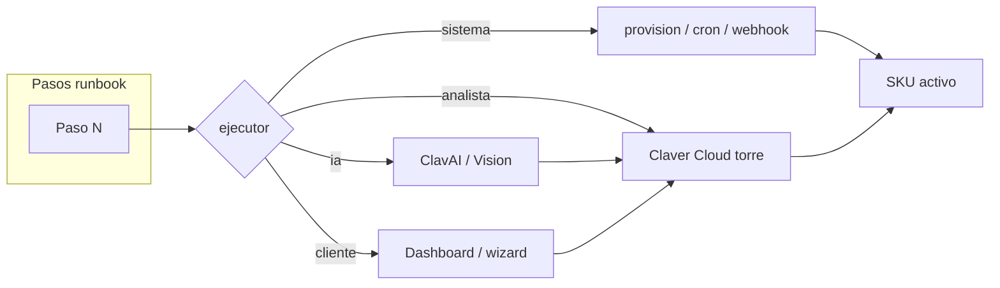
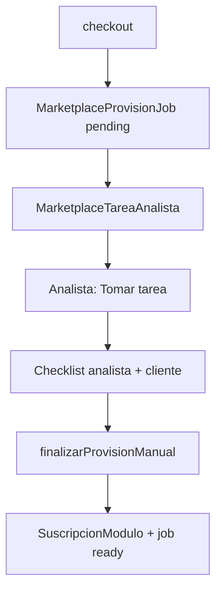
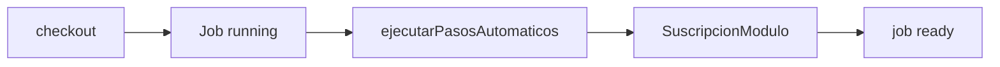

# 03 — Otorgamiento del servicio

## Objetivo

Definir **cómo se entrega** cada producto al cliente una vez contratado: qué hace el sistema, qué hace el analista, qué hace ClavAI y qué debe hacer el cliente.

## Modelo contra-analista

Cada producto tiene un **runbook** (`lib/marketplace/product-runbooks.ts`) que actúa como contra-analista documentado:

- `otorgamiento`: qué se activa en backend
- `pasos[]`: secuencia con `ejecutor` (sistema | ia | analista | cliente)
- `ccaFase`: alineación con proyecto implementación
- `escalacionSi`: cuándo escalar al lead

## Matriz de otorgamiento por ejecutor

| Ejecutor | Herramientas | Ejemplo |
|----------|--------------|---------|
| `sistema` | `provision-service`, `upsertSuscripcion`, cron, webhooks | Backup, Mañanero |
| `ia` | ClavAI, Gemini Vision | Mapeo Odoo, capacitación fiscal |
| `analista` | Claver Cloud Marketplace, ops | Validar pedido test Shopify |
| `cliente` | Dashboard integraciones, wizard | OAuth TN, subir cert AFIP |

## Flujo por ejecutor (runbook)



## Flujo otorgamiento SEMI_AUTO / HUMAN_GATE



## Flujo otorgamiento GLOBAL_AUTO / REGION_AUTO



```
checkout → MarketplaceProvisionJob (running)
        → ejecutarPasosAutomaticos()
        → upsertSuscripcion
        → job ready (sin tarea analista)
```

## Otorgamiento por tipo de producto

### Automatizaciones horizontales (Tier 1)

| SKU | Otorgamiento |
|-----|--------------|
| `sec.backup` | Job `backup_db` + suscripción |
| `sec.mfa` | Política MFA empresa |
| `data.reportes_prog` | Cron 07:00 + email reporte |

### Integraciones

| SKU | Otorgamiento |
|-----|--------------|
| `integ.shopify` | `ConexionIntegracion` + webhooks + sync |
| `integ.tienda_nube` | OAuth TN + webhooks pedidos |
| `integ.odoo` | Bridge XML-RPC + import piloto |

### Implementaciones (one-shot / mixto)

| SKU | Otorgamiento |
|-----|--------------|
| `impl.migracion_odoo` | Proyecto CCA + migración + `integ.odoo` |
| `impl.homologacion_afip` | Cert homologación + factura prueba |

## Responsable de asignar tareas

1. **Automático:** `resolverAnalistaEmpresa()` al crear tarea.
2. **Manual:** lead en **Settings → Assignments** con rol `marketplace`.
3. **IA:** tareas con `asignadoA: "clav-ai"` cuando no requiere humano obligatorio.

## API otorgamiento (analista completa)

```
PATCH /api/claver/marketplace/tareas/:id
Body: { accion: "completar", notas: "...", checklistJson: [...] }
```

Efecto: `finalizarProvisionManual` → `SuscripcionModulo` activo.

## SLA sugeridos

| Prioridad | Primera respuesta | Cierre |
|-----------|-------------------|--------|
| critica | 2h | 8h |
| alta | 4h | 24h |
| media | 1 día hábil | 3 días |
| baja | 2 días | 5 días |

## Siguiente paso

→ [04 — Torre analista Claver Cloud](./04-torre-analista-claver-cloud.md)