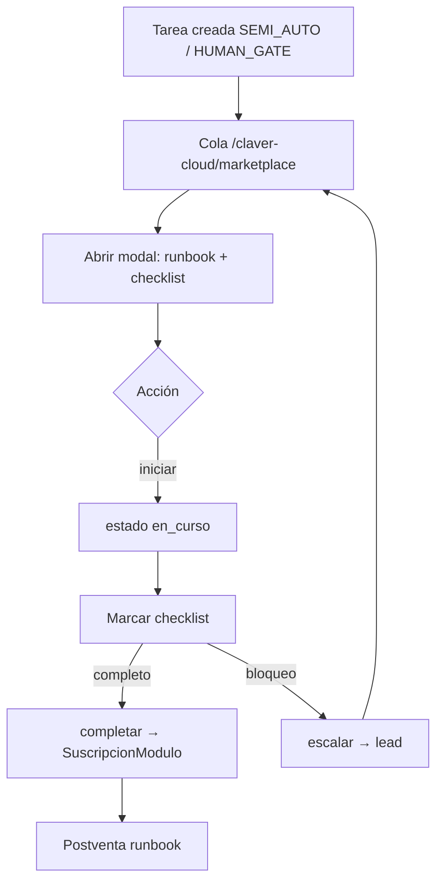

# 04 — Torre analista (Claver Cloud)

## Objetivo

Centralizar en Claver Cloud todas las tareas de activación marketplace que requieren humano o supervisión IA.

## Acceso

- URL: **`/claver-cloud/marketplace`**
- Requisito: email en `CLAVER_ANALYST_EMAILS` o rol `analista_claver`
- Scope: si tiene `AnalistaAsignacion`, solo ve sus empresas; si no, ve todas

## Flujo de tarea (analista)



## Pantalla principal

La torre muestra:

1. **Métricas:** pendientes, completadas, total
2. **Filtros:** activas, pendiente, en_curso, completada
3. **Tarjeta por tarea:**
   - SKU, prioridad, estado
   - Cliente (nombre, CUIT)
   - Fase CCA y `activacionCliente`
   - Ejecutor: humano o ClavAI

## Detalle de tarea (modal)

Al abrir una tarea el analista ve:

| Sección | Contenido |
|---------|-----------|
| Qué pidió el cliente | `runbook.activacionCliente` |
| Cómo otorgar | `descripcion` / `runbook.otorgamiento` |
| Runbook pasos | Lista ordenada con ejecutor |
| Checklist | Items analista/cliente marcables |
| Escalar si | Condiciones de escalación |
| Postventa | Qué monitorear después |

## Acciones del analista

| Botón | API | Efecto |
|-------|-----|--------|
| Tomar tarea | `PATCH accion: "iniciar"` | `estado: en_curso`, asignado al email |
| Completar y activar SKU | `PATCH accion: "completar"` | Suscripción + job ready |
| Escalar | `PATCH accion: "escalar"` | `estado: escalada`, notifica lead |

**Regla:** no se puede completar si el checklist tiene ítems sin marcar.

## Cómo sabe el analista qué producto quiere el cliente

1. `titulo`: "Activar {nombre} ({sku})"
2. `empresa`: datos del tenant
3. `runbook.activacionCliente`: pasos que el cliente debe o debió hacer
4. `metadata.pasos`: runbook completo persistido en la tarea
5. Link **Ops** → `/claver-cloud/operations/{empresaId}` para contexto técnico
6. Link **Super Admin** → `/claver-cloud/tenants/{empresaId}` catálogo SKUs + readiness

## Asignación de tareas humano vs IA

| autoCertLevel | tipoEjecutor | asignadoA |
|---------------|--------------|-----------|
| SEMI_AUTO | mixto | email analista |
| HUMAN_GATE | mixto | email analista |
| (pasos solo IA en runbook) | ia | `clav-ai` |

ClavAI puede ejecutar pasos `ejecutor: "ia"`; el analista valida y completa.

## APIs

```
GET  /api/claver/marketplace/tareas?estado=pendiente
GET  /api/claver/marketplace/tareas/:id
PATCH /api/claver/marketplace/tareas/:id
```

## Configurar analista para un cliente

**Claver Cloud → Settings → Assignments**

```
POST /api/claver/ops/asignaciones
{
  "analistaEmail": "analista@claver.com",
  "empresaId": 42,
  "rolAsignacion": "marketplace"
}
```

## Email de notificación

Al crear tarea SEMI_AUTO/HUMAN_GATE, si `RESEND_API_KEY`:

- To: analista resuelto
- Subject: `[Claver Cloud] Activar {nombre} — empresa #{id}`
- CTA: Claver Cloud → Marketplace

## Integración con Implementation (CCA)

| ccaFase | Cuándo |
|---------|--------|
| CCA-030 | Infra, backup, MFA |
| CCA-040 | Migraciones, kickoff |
| CCA-050 | Integraciones |
| CCA-070 | AFIP, go-live |
| CCA-080 | Reportes, hipercare |

Proyectos en `/claver-cloud/implementation` complementan tareas marketplace de implementación.

## Siguiente paso

→ [05 — Postventa](./05-postventa.md)