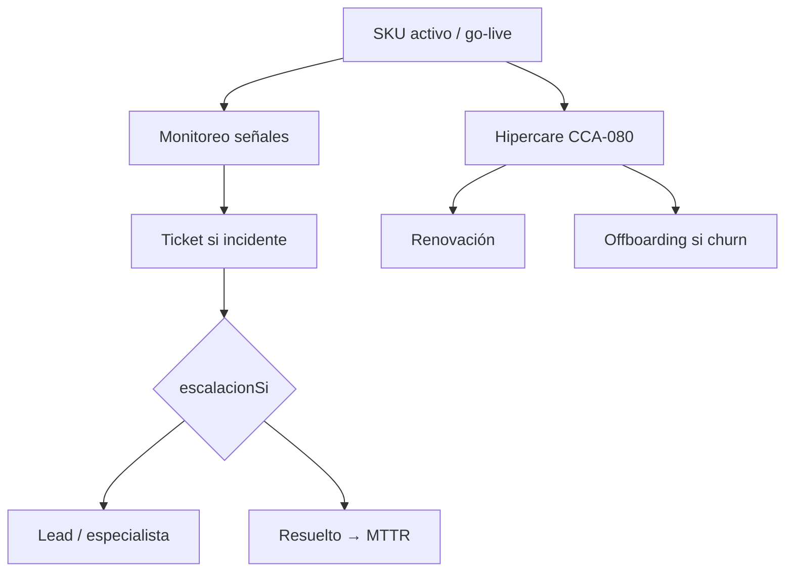
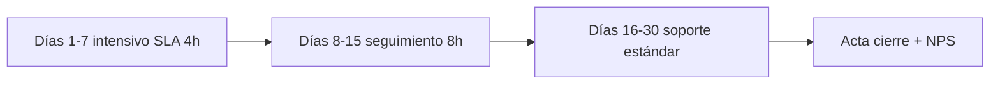
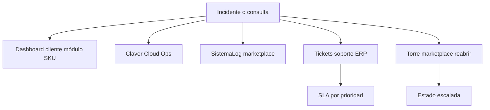
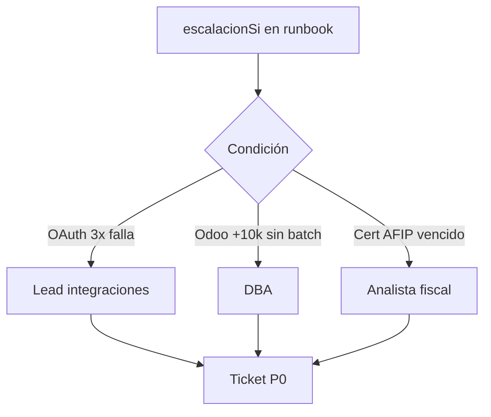
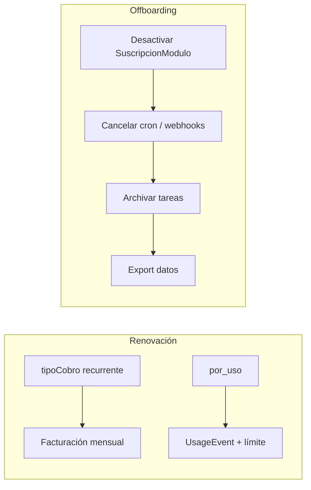

# 05 — Postventa

## Objetivo

Garantizar que cada SKU activo sigue funcionando después del otorgamiento, con monitoreo, soporte y renovación.

Ver ciclo maestro: [00-ciclo-completo](./00-ciclo-completo.md).

## Ciclo de vida post-activación

## Hipercare implementaciones (CCA-080)

## Canales de atención

## Escalación postventa

## Renovación y offboarding

## Fuentes de postventa

Cada runbook define `postventa`. Patrones comunes:

| Tipo SKU | Postventa típica |
|----------|------------------|
| Backup | Monitoreo job fallido; restore self-service |
| Integraciones | Alerta webhook caído; sync desfasado |
| Implementación | Hipercare 14 días post go-live |
| Fiscal | Paso a producción AFIP con analista |
| Reportes | Ajuste KPIs a pedido |

## Canales de atención

1. **Dashboard cliente** — módulo del SKU, logs integración
2. **Claver Cloud Ops** — `/claver-cloud/operations/{empresaId}`
3. **Sistema logs** — `persistSistemaLog` módulo `marketplace`
4. **Tickets soporte** — módulo Soporte ERP (si habilitado)
5. **Torre marketplace** — reabrir si `estado: escalada`

## Monitoreo automático

| Señal | Acción |
|-------|--------|
| `MarketplaceProvisionJob` failed | Alerta ops + email analista |
| Webhook sin eventos 48h | Tarea preventiva integraciones |
| `SuscripcionModulo` inactivo | Verificar renovación / pago |
| Uso OCR &gt; límite | Upsell o pausa FotoFactura |

## Renovación y cobro

- SKUs `tipoCobro: recurrente` → facturación mensual vía módulo comercial
- `por_uso` → `limiteEventosMes` en `SuscripcionModulo` + `UsageEvent`
- Bundles mixtos → recurrente + one-shot según SKU del pack

## Hipercare implementaciones

Para `impl.*` y bundles `pool-impl-*`:

1. Días 1–14 post go-live: analista lead en canal dedicado
2. Checklist CCA-080: reportes, backups, integraciones estables
3. Cierre: acta en `ProyectoImplementacion`

## Escalación postventa

Usar `escalacionSi` del runbook. Ejemplos:

- Shopify OAuth falla 3x → lead integraciones
- Odoo &gt;10k productos sin batch → DBA
- Cert AFIP vencido → analista fiscal

## Métricas postventa

- MTTR por SKU
- NPS post-activación (SKUs `data.nps`)
- Churn suscripciones marketplace 90 días
- Tareas escaladas / completadas

## Offboarding

1. Desactivar `SuscripcionModulo`
2. Cancelar jobs cron / webhooks
3. Archivar `MarketplaceTareaAnalista` completadas
4. Export datos si aplica (GDPR / cliente)

## Siguiente paso

→ [06 — Runbooks por producto](./06-runbooks-por-producto.md)