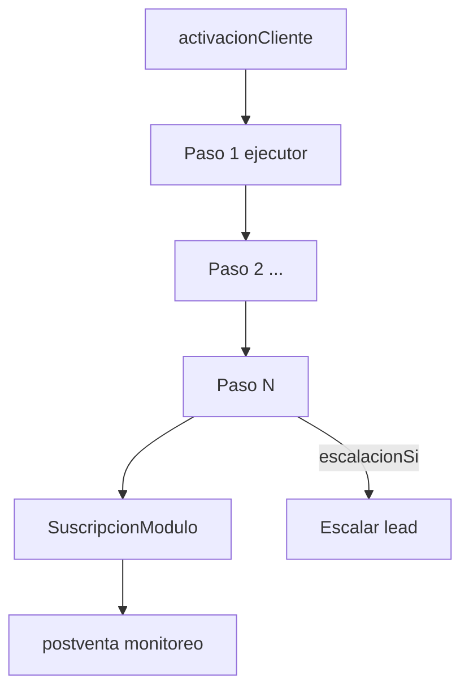

# 06 — Runbooks por producto

> Fuente canónica en código: `lib/marketplace/product-runbooks.ts`  
> SKUs sin runbook explícito usan plantilla generada por `getRunbookOrDefault()`.  
> **Pack Almacén Rosario (18 SKUs):** runbooks dedicados en `almacen-rosario-runbooks.ts` — ver [14-pack-almacen-rosario](./14-pack-almacen-rosario.md).

## Plantilla de flujo runbook (cualquier SKU)

> Pack Almacén Rosario (18 diagramas operativos): [14-pack-almacen-rosario](./14-pack-almacen-rosario.md)

## Leyenda ejecutores

| Ejecutor | Responsable |
|----------|-------------|
| sistema | Backend Clavis / cron / webhooks |
| ia | ClavAI (Gemini) |
| analista | Humano en Claver Cloud |
| cliente | Usuario del tenant |

---

## sec.backup — Backup Cloud

| Campo | Valor |
|-------|-------|
| autoCertLevel | GLOBAL_AUTO |
| CCA | CCA-030 |
| Activación cliente | Dashboard → Marketplace → Activar Backup Cloud |
| Otorgamiento | Job ops backup_db + SuscripcionModulo |
| Postventa | Monitoreo job fallido; restore self-service |

**Pasos:** (1) Crear job backup [sistema] → (2) Activar entitlement [sistema] → (3) Email Pack ONBOARD [sistema]

---

## sec.mfa — Escudo 2FA

| Campo | Valor |
|-------|-------|
| autoCertLevel | GLOBAL_AUTO |
| CCA | CCA-040 |
| Activación | Marketplace → Activar 2FA |
| Otorgamiento | Política empresa mfaObligatorio=true |
| Postventa | Soporte TOTP perdido |

---

## integ.shopify — Shopify Link

| Campo | Valor |
|-------|-------|
| autoCertLevel | SEMI_AUTO |
| CCA | CCA-050 |
| Activación | Integraciones → Shopify → OAuth |
| Otorgamiento | ConexionIntegracion + webhooks + sync |
| Postventa | Revisar errores sync 24h |
| Escalar si | OAuth falla 3x; stock desfasado >5% |

**Pasos:** dominio [cliente] → OAuth [cliente] → webhooks [sistema] → sync [sistema] → pedido test [analista]

---

## integ.tienda_nube — Tienda Nube Link

| Campo | Valor |
|-------|-------|
| autoCertLevel | REGION_AUTO |
| CCA | CCA-050 |
| Escalar si | TN API 401; sin pedidos 48h |

---

## integ.odoo — Odoo Bridge

| Campo | Valor |
|-------|-------|
| autoCertLevel | SEMI_AUTO |
| CCA | CCA-050 |
| Activación | Integraciones → Odoo → URL + API key |
| Escalar si | Odoo &lt;14; &gt;10k productos sin batch |

**Pasos:** credenciales [cliente] → test [sistema] → mapeo [ia] → import piloto [analista] → sync [sistema]

---

## impl.migracion_odoo — Salí de Odoo

| Campo | Valor |
|-------|-------|
| autoCertLevel | SEMI_AUTO |
| CCA | CCA-040 |
| Postventa | Hipercare 14 días |
| Escalar si | Datos inconsistentes; sin UAT |

---

## impl.homologacion_afip — AFIP Ready

| Campo | Valor |
|-------|-------|
| autoCertLevel | SEMI_AUTO |
| CCA | CCA-070 |
| Postventa | Paso producción con analista fiscal |

---

## com.whatsapp — WhatsApp ON

| Campo | Valor |
|-------|-------|
| autoCertLevel | REGION_AUTO |
| CCA | CCA-050 |

---

## data.reportes_prog — Mañanero

| Campo | Valor |
|-------|-------|
| autoCertLevel | GLOBAL_AUTO |
| CCA | CCA-080 |

---

## fiscal.ocr — FotoFactura

| Campo | Valor |
|-------|-------|
| autoCertLevel | GLOBAL_AUTO |
| CCA | CCA-050 |
| Postventa | Revisión si confianza OCR &lt;80% |

---

## SKUs sin runbook dedicado

El catálogo tiene ~45 SKUs; los listados arriba son los **Tier 1** con runbook completo. El resto recibe plantilla automática:

- GLOBAL_AUTO / REGION_AUTO → 1 paso sistema
- SEMI_AUTO / HUMAN_GATE → tarea analista + checklist genérico

Para agregar un runbook: extender `PRODUCT_RUNBOOKS` en `product-runbooks.ts` y sincronizar esta doc.

## Diagramas operativos Tier 1

Diagramas Mermaid detallados por SKU: [17-runbooks-tier1-diagramas](./17-runbooks-tier1-diagramas.md)

## Siguiente paso

→ [07 — Bundles comerciales](./07-bundles-comerciales.md)