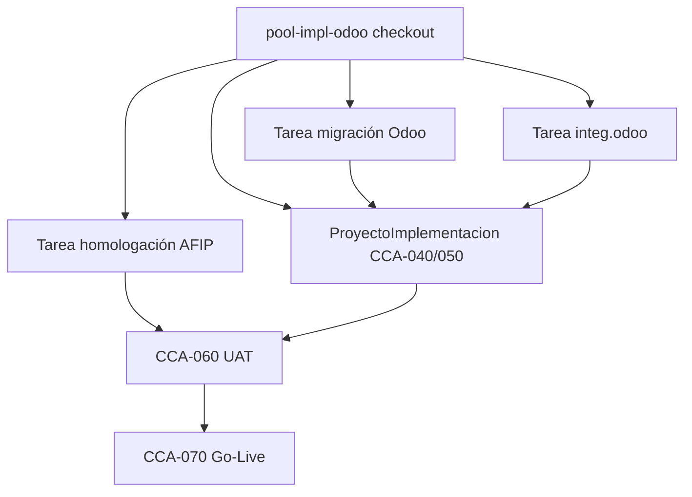
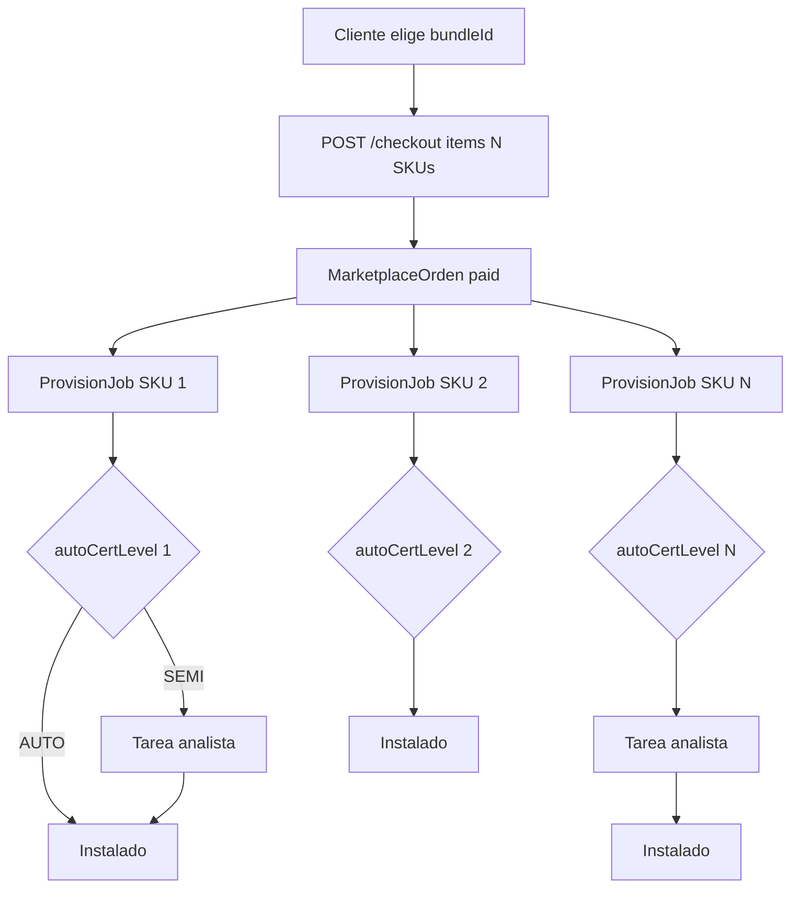

# 07 — Bundles comerciales (pools)

> Fuente: `lib/marketplace/bundles.ts`

Los bundles agrupan SKUs para venta consultiva y checkout único. Cada SKU del bundle **mantiene su propio** `autoCertLevel` y runbook.

## Pools disponibles

### pool-essentials — AutoPool Essentials

| Campo | Valor |
|-------|-------|
| Lema | Protegé, enterate y arrancá. |
| SKUs | `sec.backup`, `sec.mfa`, `data.reportes_prog` |
| Precio pack | $7.990 ARS/mes |
| Ahorro | 15% |
| Cobro | mensual |
| Destacado | sí |

**Ideal para:** cualquier rubro, primer upsell post-onboarding.

---

### pool-conecta-ar — Conecta Argentina

| Campo | Valor |
|-------|-------|
| Lema | Un stock, todos los canales locales. |
| SKUs | `integ.tienda_nube`, `integ.mercado_libre`, `com.whatsapp` |
| Precio | $34.900/mes |
| Ahorro | 20% |

**Ideal para:** retail/ecommerce AR.

---

### pool-conecta-global — Conecta Global

| SKUs | `integ.shopify`, `integ.woocommerce`, `mkt.pixel_ads` |
| Precio | $29.900/mes |

---

### pool-mide — Mide + Releva

| SKUs | `data.nps`, `releva.encuesta_clientes`, `releva.formulario_web` |
| Precio | $7.990/mes |

---

### pool-impl-odoo — Salí de Odoo

| SKUs | `impl.migracion_odoo`, `integ.odoo`, `impl.homologacion_afip` |
| Precio | $89.900 one-shot |
| Cobro | one_shot |

**Torre analista:** 3 tareas potenciales (migración SEMI_AUTO + odoo SEMI_AUTO + AFIP SEMI_AUTO).



---

### pool-impl-ecommerce — Traé tu tienda

| SKUs | `impl.migracion_tienda_nube`, `integ.tienda_nube`, `mkt.pixel_ads` |
| Precio | $49.900 mixto |

---

### pool-intangibles-top5 — Intangibles Top 5

| SKUs | Los 5 servicios intangibles |
| Precio | $44.900/mes |
| Ahorro | 25% |

### pool-cobra-recupera — Cobra y Recupera

| SKUs | `intang.cobranzas_wa`, `intang.reactivador_clientes`, `com.whatsapp` |
| Precio | $39.900/mes |

### pool-premium-erp-7 — Premium ERP 7

| Campo | Valor |
|-------|-------|
| Lema | Lo que SAP cobra millones, en pesos argentinos. |
| SKUs | Conciliador pagos, recuperador fiscal, guardián POS, reactivador B2B, reponedor JIT, OCR compras, ruteador entregas |
| Precio | $89.900/mes |
| Ahorro | 22% |
| Destacado | sí |

**Ideal para:** Pymes que quieren automatización enterprise sin consultora. Ver [13-servicios-intangibles-premium-7](./13-servicios-intangibles-premium-7.md).

---

### pool-almacen-rosario — Almacén Rosario

| Campo | Valor |
|-------|-------|
| Lema | Margen, merma y caja para el barrio. |
| SKUs | 18 módulos POS (margen, zero waste, envases, vale, recargas, balanza, 2×1, etc.) + fiado + guardián POS |
| Precio | $34.900/mes |
| Ahorro | 28% |
| Panel | `/dashboard/almacen` · Guía `/dashboard/almacen/guia` |

**Ideal para:** almacenes, kioscos y autoservicios de barrio en Argentina.

Documentación completa con diagramas: [14-pack-almacen-rosario](./14-pack-almacen-rosario.md).

---

## Flujo checkout bundle multi-SKU



Ejemplo `pool-impl-odoo`: 3 SKUs → hasta 3 tareas SEMI_AUTO en paralelo.

## Checkout bundle

```json
POST /api/marketplace/checkout
{
  "bundleId": "pool-essentials",
  "origen": "dashboard",
  "items": [
    { "sku": "sec.backup", "cantidad": 1 },
    { "sku": "sec.mfa", "cantidad": 1 },
    { "sku": "data.reportes_prog", "cantidad": 1 }
  ]
}
```

`origen` guarda `dashboard:bundle:pool-essentials` para analytics.

## Estrategia comercial (4 pools)

| Pool | Modelo | Recurrencia |
|------|--------|-------------|
| Essentials | SaaS horizontal | Alta |
| Conecta | SaaS integraciones | Alta |
| Mide | SaaS datos | Media |
| Impl | Proyecto + SaaS | Mixto |

## Siguiente paso

→ [08 — Flujo técnico backend](./08-flujo-tecnico-backend.md)