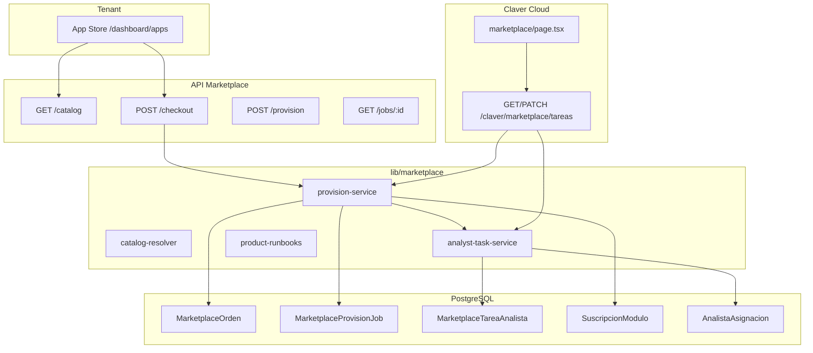

# 08 — Flujo técnico backend (A-Z)

## Diagrama de componentes



## Secuencia checkout completa

```
1. POST /api/marketplace/checkout
   ├─ getAuthContext() → empresaId
   ├─ resolveSku() por cada item
   ├─ prisma.marketplaceOrden.create({ estado: "paid", items, totalArs })
   └─ provisionOrden(empresaId, ordenId)
        └─ for each sku: provisionSku()

2. provisionSku(empresaId, sku)
   ├─ resolveSku + getRunbookOrDefault
   ├─ marketplaceProvisionJob.create({ estado: "running" })
   ├─ if GLOBAL_AUTO | REGION_AUTO:
   │    ├─ upsertSuscripcion()
   │    └─ job.estado = "ready"
   └─ else SEMI_AUTO | HUMAN_GATE:
        ├─ crearTareaMarketplace()
        ├─ job.estado = "pending", metadata.tareaAnalistaId
        └─ email analista (opcional)

3. PATCH /api/claver/marketplace/tareas/:id { accion: "completar" }
   └─ finalizarProvisionManual(jobId, tareaId)
        ├─ upsertSuscripcion()
        ├─ tarea.estado = "completada"
        └─ job.estado = "ready"
```

## Modelos Prisma

### MarketplaceOrden

```prisma
items Json  // [{ sku, cantidad, precio, nombre }]
estado    // pending | paid | failed | cancelled
origen    // web | dashboard | trial_ads | upsell | dashboard:bundle:*
```

### MarketplaceProvisionJob

```prisma
estado     // pending | running | ready | failed
pasosJson  // [{ orden, titulo, ejecutor, done }]
metadata   // { playbookId, autoCertLevel, tareaAnalistaId, ordenId }
```

### MarketplaceTareaAnalista

```prisma
tipoEjecutor  // humano | ia | mixto
asignadoA     // email | clav-ai
checklistJson // [{ paso, titulo, hecho, ejecutor }]
metadata      // { ccaFase, activacionCliente, postventa, pasos, escalacionSi }
```

## Resolución analista

```typescript
// analyst-task-service.ts — orden de prioridad
1. AnalistaAsignacion (rol lead | implementacion | marketplace | soporte)
2. ProyectoImplementacion.analistaEmail
3. process.env.CLAVER_MARKETPLACE_ANALISTA_FALLBACK
```

## Seguridad multi-tenant

| Ruta | Guard |
|------|-------|
| `/api/marketplace/*` | `getAuthContext` + `whereEmpresa` |
| `/api/claver/marketplace/*` | `getClaverAnalystContext` + `canAnalystAccessEmpresa` |

## Archivos clave

| Archivo | Responsabilidad |
|---------|-----------------|
| `lib/marketplace/provision-service.ts` | Orquestación jobs y suscripciones |
| `lib/marketplace/analyst-task-service.ts` | CRUD tareas torre |
| `lib/marketplace/catalog-resolver.ts` | Catálogo + AutoPool |
| `lib/marketplace/product-runbooks.ts` | Contra-analista por SKU |
| `lib/platform/commercial-service.ts` | `upsertSuscripcion` |
| `lib/ops/sistema-log.ts` | Auditoría marketplace |

## Migración DB

```
prisma/migrations/20260624120000_marketplace_tareas_analista/
```

Tabla: `marketplace_tareas_analista`

## Tests

```
__tests__/marketplace/provision-service.test.ts
__tests__/marketplace/analyst-task.test.ts
```

## Startup técnico — checklist deploy

1. `npx prisma migrate deploy`
2. `npx prisma generate`
3. Configurar `CLAVER_ANALYST_EMAILS`
4. Configurar `CLAVER_MARKETPLACE_ANALISTA_FALLBACK`
5. (Opcional) `RESEND_API_KEY` para alertas analista
6. Verificar `/claver-cloud/marketplace` con usuario analista
7. Smoke: checkout `sec.backup` → job ready en &lt;5s
8. Smoke: checkout `integ.shopify` → tarea en torre

## Roadmap técnico

| Item | Estado |
|------|--------|
| Checkout + provision cableado | ✅ |
| Torre Claver Cloud | ✅ |
| Runbooks Tier 1 | ✅ |
| Playbook runner real (Inngest) | 🔜 |
| Pasarela pago producción | 🔜 |
| `lib/odoo/` bridge completo | 🔜 |
| Polling UI tenant mejorado | 🔜 |

## Volver al índice

→ [README](./README.md)