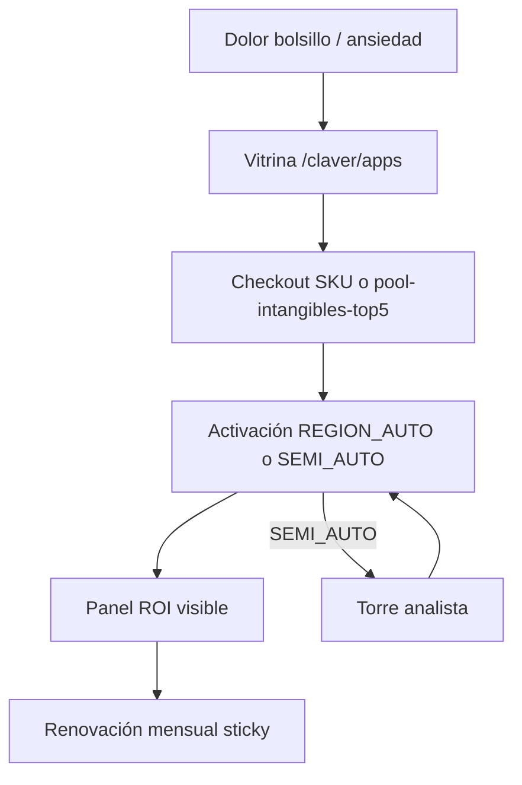

# 09 — Servicios intangibles Top 5

> Rama: `tipo: intangible` en AutoPool · Categoría **Intangibles** en App Store  
> Criterio de selección: **bolsillo** (ahorro o ingresos) + **ansiedad** (protección legal/reputacional)

## Journey intangible (comercial → retención)

## Los 5 servicios

| # | SKU | Nombre | Audiencia | Precio ARS | Cert |
|---|-----|--------|-----------|------------|------|
| 1 | `intang.cobranzas_wa` | Secretaria de Cobranzas WA | B2B | $20.000/mes | REGION_AUTO |
| 2 | `intang.reputation_firewall` | Escudo Reputación | B2B/B2C | $14.900/mes | SEMI_AUTO |
| 3 | `intang.legal_shield` | Legal Shield | B2B/B2C | $9.900/mes | SEMI_AUTO |
| 4 | `intang.subs_tax_scanner` | Cazador de Gastos Zombies | B2C | $3.000/mes | SEMI_AUTO |
| 5 | `intang.reactivador_clientes` | Despertador de Clientes | B2B | $12.900/mes | REGION_AUTO |

## Bundles

| Bundle | SKUs | Precio |
|--------|------|--------|
| `pool-intangibles-top5` | Los 5 | $44.900/mes (-25%) |
| `pool-cobra-recupera` | Cobranzas + Reactivador + WhatsApp | $39.900/mes |

## Por qué cada uno es sticky

1. **Cobranzas WA** — Si recuperás $500k/mes, $20k es obvio. Usa `cuentaCobrar` + WhatsApp existentes.
2. **Escudo Reputación** — Seguro 24/7 contra crisis 1★. Miedo > precio.
3. **Legal Shield** — Una estafa evitada paga años de suscripción.
4. **Gastos Zombies** — Ahorro neto visible; anzuelo B2C masivo.
5. **Despertador** — ROI en panel: *"Gastaste $1.000 en SMS, generaste $150.000"*.

## Prioridad de build

| Prioridad | SKU | Estado código |
|-----------|-----|---------------|
| **AHORA** | `intang.cobranzas_wa` | ✅ Activación + regla + cron |
| Próximo | `intang.reactivador_clientes` | Runbook + catálogo |
| Próximo | `intang.reputation_firewall` | Runbook + tarea analista |
| Próximo | `intang.legal_shield` | Runbook + email ingest |
| Fase 2 | `intang.subs_tax_scanner` | Beta en catálogo |

## Código

- Metadatos: `lib/marketplace/intangible-services.ts`
- Cobranzas: `lib/marketplace/cobranzas-wa-service.ts`
- Runbooks: `lib/marketplace/product-runbooks.ts` (prefijo `intang.*`)

## Siguiente

→ [10 — Arquitectura Cobranzas WA](./10-arquitectura-cobranzas-wa.md)