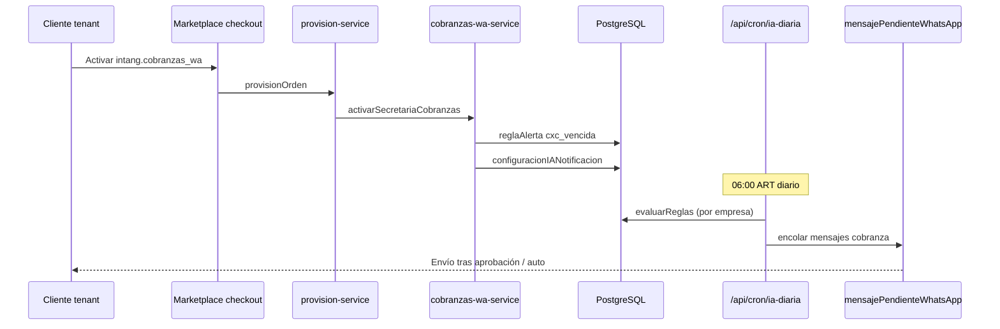

# 10 — Arquitectura: Secretaria de Cobranzas WA

> **SKU:** `intang.cobranzas_wa` · Prioridad #1 para arrancar mañana

## Problema

Las Pymes venden pero no cobran. Facturas vencidas en `cuentaCobrar` sin seguimiento humano sistemático.

## Solución

Bot diario que:
1. Lee deudores del ERP
2. Arma mensaje amable personalizado
3. Encola WhatsApp (con aprobación o auto según config)
4. (Fase 2) Adjunta link MercadoPago vía `fiscal.clavpay_link`

## Diagrama



## Modelo de datos (existente — sin migración)

| Tabla | Uso |
|-------|-----|
| `cuentaCobrar` | Saldo, vencimiento, estado |
| `cliente` | Nombre, teléfono WA |
| `reglaAlerta` | Regla `cxc_vencida` 7 días |
| `configuracionIANotificacion` | Max clientes/día, auto-aprobar |
| `mensajePendienteWhatsApp` | Cola envío |
| `suscripcionModulo` | Entitlement SKU |

## Activación (ya implementada)

```typescript
// lib/marketplace/cobranzas-wa-service.ts
activarSecretariaCobranzas(empresaId)
// → crea regla "Secretaria Cobranzas WA (AutoPool)"
// → saveIANotificacionConfig({ whatsappCobranzaMaxPorRegla: 20, ... })
```

Llamada automática desde `provision-service` al activar SKU `REGION_AUTO`.

## Cron existente

`GET /api/cron/ia-diaria` ya ejecuta `evaluarReglas()` → `encolarWhatsAppDesdeRegla()` → `encolarCobranzaClientes()` en `lib/alertas/whatsapp-regla-dispatcher.ts`.

**No hace falta cron nuevo** para MVP.

## API panel ROI (tenant)

```
GET /api/marketplace/intangibles/cobranzas/resumen
→ { saldoTotal, clientesUnicos, contactablesWhatsApp, cuentasVencidas }
```

## Dependencias

| SKU | Obligatorio |
|-----|-------------|
| `com.whatsapp` | Sí — canal de envío |
| `fiscal.clavpay_link` | Opcional — link pago en mensaje |

## Configuración analista (primera activación)

1. Cliente conecta WhatsApp Business
2. Analista aprueba 1 mensaje piloto (torre marketplace paso 4)
3. Habilitar auto-aprobar si tono OK

## Mensaje tipo

```
Hola {nombre}, le escribimos de {empresa}.
Registramos un saldo pendiente de ${monto} con {dias} días de vencimiento.
¿Podemos coordinar el pago? Gracias.
```

Fase 2: append `Pagá acá: {link_mp}`

## Stack externo (opcional n8n)

| Paso n8n | Equivalente en Clavis |
|----------|----------------------|
| Schedule 7am | cron ia-diaria |
| Query ERP | cuentaCobrar Prisma |
| OpenAI tono | futuro: ClavAI personaliza |
| WhatsApp send | mensajePendienteWhatsApp → cron enviar-whatsapp |

## Métricas éxito

- $ recuperado / mes (recibos post-mensaje)
- Tasa respuesta WA
- Días promedio de mora
- Churn del SKU (objetivo &lt;2%)

## Roadmap

| Sprint | Entrega |
|--------|---------|
| ✅ MVP | Activación + regla + cron + runbook |
| S+1 | Link MP en mensaje |
| S+2 | Panel ROI en dashboard |
| S+3 | Tono IA por rubro (ClavAI) |
| S+4 | A/B mensajes y escalación analista |

## Volver

→ [09 — Intangibles Top 5](./09-servicios-intangibles-top5.md)