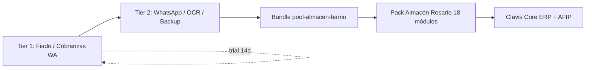

# 12 — Enganches comerciales (anzuelos)

> Productos de entrada: dolor inmediato, ticket bajo, upsell al ERP.

## Resumen numérico

| Métrica | Cantidad |
|---------|----------|
| **Enganches definidos** (`ENGANCHES`) | **15** |
| Implementados (backend usable hoy) | **2** |
| Parciales (infra + provision, sin producto completo) | **6** |
| Solo catálogo (vendible, build pendiente) | **7** |
| Enganches para almacén de barrio | **6** |
| Bundles enganche destacados | **5** |
| SKUs marketplace total | **51** |
| Intangibles Top 5 | **5** |

## Tier 1 — Implementado (usar ya)

| SKU | Lema | Precio |
|-----|------|--------|
| `pos.fiado_barrio` | Fiá con límite. Que el otro se entere. | $4.990/mes |
| `intang.cobranzas_wa` | El link cobra. Vos seguís vendiendo. | $20.000/mes |

## Tier 2 — Parcial (enganche + upsell)

| SKU | Uso como enganche |
|-----|-------------------|
| `com.whatsapp` | Canal para fiado y cobranzas |
| `fiscal.clavpay_link` | Link MP en emails de deuda |
| `data.reportes_prog` | Reporte mañanero — retención diaria |
| `fiscal.ocr` | FotoFactura — dolor de carga manual |
| `sec.backup` | Miedo a perder datos |
| `sec.mfa` | Seguridad accesos compartidos |

## Tier 3 — Catálogo (vender, construir después)

Intangibles restantes + NPS, Pixel Ads, Formulario Web.

## Bundle recomendado almacén

**`pool-almacen-barrio`** — $34.900/mes  
`pos.fiado_barrio` + `intang.cobranzas_wa` + `com.whatsapp`

## Código

- `lib/marketplace/enganche-catalog.ts` — fuente de verdad
- `resumenEnganches()` — contadores para vitrine / IA comercial

## Funnel enganche → ERP

## Diagramas operativos

Diagramas Mermaid por enganche implementado y parcial: [18-runbooks-tier2-enganches-diagramas](./18-runbooks-tier2-enganches-diagramas.md)

## Estrategia de venta

1. **Primer contacto:** Libreta Fiado ($4.990) — trial 14 días
2. **Semana 2:** Cobranzas WA si hay deuda acumulada
3. **Mes 2:** ClavPay + WhatsApp si no entraron en el bundle
4. **Upsell ERP:** core POS + stock + AFIP cuando el almacén crece