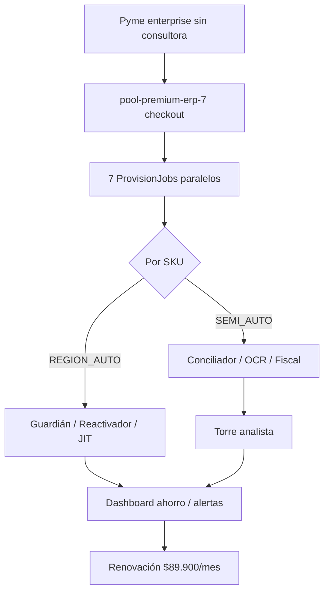

# 13 — Servicios Intangibles Premium 7

> Rama: `tipo: intangible` en AutoPool · Inspirado en SAP, NetSuite, Salesforce, Zoho, Odoo  
> Adaptado a fiscalidad y operación Argentina / LATAM  
> Generado: 2026-06-25

## Resumen ejecutivo

Siete servicios automáticos de **alto margen** y **retención extrema**, diseñados para monetizar rápido vía suscripción recurrente, microtransacción por uso o comisión por éxito.

| # | SKU | Nombre | Precio ARS | Cert | Estado |
|---|-----|--------|------------|------|--------|
| 1 | `intang.liquidacion_pagos` | Conciliador Liquidación MP y Tarjetas | $24.900/mes | SEMI_AUTO | beta |
| 2 | `intang.recuperador_fiscal` | Recuperador de Retenciones AFIP | $18.900/mes | SEMI_AUTO | beta |
| 3 | `intang.guardian_pos` | Guardián de Caja POS | $14.900/mes | REGION_AUTO | **disponible** |
| 4 | `intang.reactivador_clientes` | Reactivador B2B | $12.900/mes | REGION_AUTO | disponible |
| 5 | `intang.reponedor_jit` | Reponedor JIT | $16.900/mes | REGION_AUTO | beta |
| 6 | `intang.ocr_compras` | OCR Compras Proveedores | $9.900/mes + $99/doc | SEMI_AUTO | beta |
| 7 | `intang.ruteador_entregas` | Ruteador de Entregas | $19.900/mes | REGION_AUTO | planned |

**Bundle:** `pool-premium-erp-7` — los 7 por **$89.900/mes** (-22%)

## Journey Premium 7



---

## 1. Conciliador Liquidación MP y Tarjetas

**Inspirado en:** NetSuite Treasury · SAP Cash Management

**Dolor:** Las Pymes pierden 1–5% de facturación en comisiones fantasmas, adelantos mal liquidados, contracargos y retenciones duplicadas.

**Solución:** Conciliador en segundo plano que cruza ventas POS con liquidaciones MercadoPago, Prisma y MODO. Alerta WhatsApp al dueño sobre discrepancias.

**Monetización:** $24.900/mes o 8% del dinero recuperado.

**Código:** `lib/marketplace/liquidacion-pagos-service.ts` · API `GET /api/marketplace/intangibles/premium/resumen`

---

## 2. Auditor Tributario y Recuperador de Retenciones

**Inspirado en:** TaxEngine ERPs · AFIP Mis Retenciones

**Dolor:** Percepciones IVA/IIBB no computadas; pagos a proveedores apócrifos sin bloqueo.

**Solución:** Bot fiscal con padrones diarios, cruce con compras, pre-carga de crédito y bloqueo de apócrifos.

**Monetización:** $18.900/mes — ROI visible en panel de ahorro.

---

## 3. Guardián de Caja y Auditor de Fraude POS

**Inspirado en:** Odoo Retail · Square Risk

**Dolor:** Robo hormiga — anulaciones, descuentos dudosos, egresos sin venta.

**Solución:** Score diario ALTO/MEDIO/BAJO con reporte WhatsApp. Implementado con datos reales del POS.

**Monetización:** $14.900/mes.

**Código:** `lib/marketplace/guardian-pos-service.ts`

---

## 4. Reactivador y Optimizador B2B

**Inspirado en:** Salesforce Einstein

**Dolor:** Cliente mayorista baja 20% volumen — el vendedor se entera tarde.

**Solución:** IA sobre frecuencia histórica + alertas WA/SMS de retención. *(SKU existente Top 5, incluido en Premium 7)*

**Monetización:** $12.900/mes o comisión por venta reactivada.

---

## 5. Reponedor Inteligente Just-In-Time

**Inspirado en:** SAP IBP · NetSuite Demand Planning

**Dolor:** Capital inmovilizado en stock sobrante o ventas perdidas por quiebre.

**Solución:** Velocidad de venta + lead time → propuestas OC y mails de cotización.

**Código:** `lib/marketplace/reponedor-jit-service.ts`

---

## 6. Importador Inteligente de Facturas de Proveedores

**Inspirado en:** Odoo Documents

**Dolor:** Horas cargando ítems de facturas de compra manualmente.

**Solución:** `compras@claver.com` + Gemini Vision → borrador OC mapeado.

**Monetización:** $9.900/mes (100 docs) o $99/PDF extra.

---

## 7. Ruteador Logístico y Notificador de Entregas

**Inspirado en:** Bringg

**Dolor:** Clientes llamando por horario; choferes con rutas ineficientes.

**Solución:** Agrupación geo + WA con link de seguimiento al iniciar recorrido.

**Estado:** planned (catálogo + runbook listos)

---

## Prioridad de build

| Prioridad | SKU | Backend |
|-----------|-----|---------|
| **AHORA** | `intang.guardian_pos` | ✅ Servicio + API resumen |
| **AHORA** | `intang.liquidacion_pagos` | ✅ Conciliación MP vs POS |
| **AHORA** | `intang.ocr_compras` | Runbook + depende `fiscal.ocr` |
| Próximo | `intang.reponedor_jit` | ✅ Propuestas JIT |
| Próximo | `intang.recuperador_fiscal` | Padrones AFIP |
| Fase 2 | `intang.ruteador_entregas` | Logística + GPS |

---

## Código y rutas

```
lib/marketplace/
  intangible-premium-7.ts      # Metadatos comerciales
  guardian-pos-service.ts
  liquidacion-pagos-service.ts
  reponedor-jit-service.ts
app/api/marketplace/intangibles/premium/resumen/route.ts
components/marketing/claver-apps-marketplace.tsx  # Vitrina comercial
```

## Siguiente

→ [07 — Bundles comerciales](./07-bundles-comerciales.md) (actualizar con `pool-premium-erp-7`)