# 14 — Pack Almacén Rosario

> Bundle: `pool-almacen-rosario` · Lema: *Margen, merma y caja para el barrio.*  
> Fuente canónica código: `lib/almacen-rosario/modulos-catalog.ts`  
> Runbooks: `lib/marketplace/almacen-rosario-runbooks.ts`  
> UI tenant: `/dashboard/almacen` · Guía: `/dashboard/almacen/guia` · API módulos: `GET /api/almacen-rosario/modulos`

## Principio de visibilidad

**Todos los módulos son visibles** en panel, guía y App Store. Si el SKU no está contratado:

- La UI se muestra **bloqueada** (overlay + botón Activar)
- Las APIs responden **403** (`SKU no activo`)
- No se ocultan menús ni documentación

## Flujo comercial e implementación

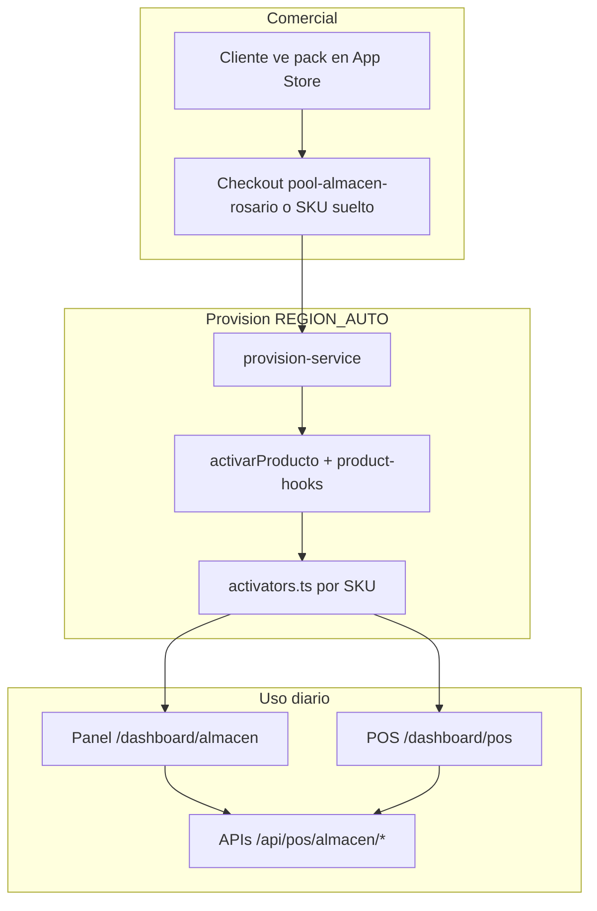

## Bundle

| Campo | Valor |
|-------|-------|
| ID | `pool-almacen-rosario` |
| Precio | $34.900 ARS/mes |
| SKUs | 18 módulos POS + `pos.fiado_barrio` + `intang.guardian_pos` (add-ons relacionados) |
| autoCertLevel | REGION_AUTO por SKU |

## Activación (cliente)

1. `/dashboard/apps` → Pack **Almacén Rosario** o SKU individual → **Obtener App**
2. Polling job hasta badge **Instalado**
3. `/dashboard/almacen` → verificar módulo **Activo**
4. `/dashboard/almacen/guia` → seguir pasos del módulo

## Torre analista

Cada SKU tiene runbook dedicado (no plantilla genérica). Checklist típico:

1. Confirmar hook `onActivate` en logs (`sistema_log` categoría `marketplace`)
2. Probar 1 flujo de uso documentado abajo
3. Cerrar tarea en Claver Cloud si hubo SEMI_AUTO

---

## Módulos y diagramas de flujo

### margen-guard — `pos.margen_guard`

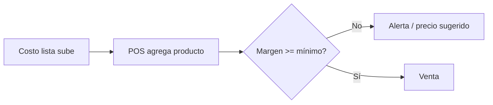

- **API:** `POST /api/pos/almacen/evaluar-producto`
- **Superficie:** automático en POS

---

### zero-waste — `pos.zero_waste`

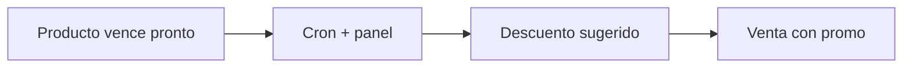

- **API:** `GET /api/almacen-rosario/resumen`
- **Superficie:** panel Almacén

---

### stock-cero — `pos.stock_cero_alert`

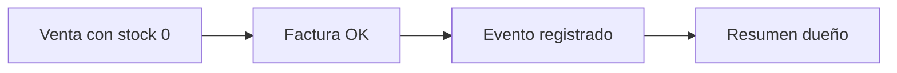

---

### promos-pago — `pos.promos_pago`

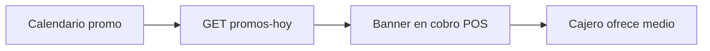

- **API:** `GET /api/pos/almacen/promos-hoy`

---

### lista-distribuidora — `pos.lista_distribuidora`

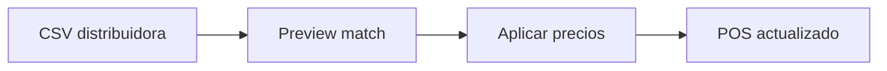

- **API:** `POST /api/almacen-rosario/importar-lista`

---

### panico-vecinal — `pos.panico_vecinal`

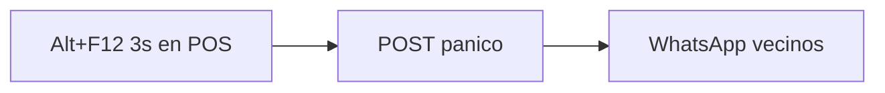

- **Requiere:** `com.whatsapp` activo
- **API:** `POST /api/pos/almacen/panico`

---

### envases-gaseosas — `pos.envases_gaseosas`

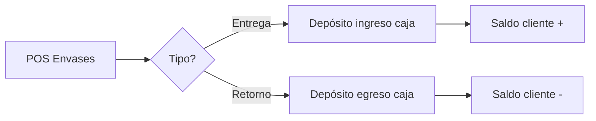

- **API:** `POST /api/pos/envases/movimiento` · `GET /api/pos/envases/saldo`

---

### vale-dinero — `pos.vale_dinero`

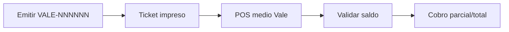

- **API:** `POST /api/vales` · `POST /api/vales/validar` · integrado en `POST /api/pos/venta`

---

### recargas — `pos.recargas_servicios`

- **API:** `POST /api/pos/almacen/retail` `{ modulo: "recargas" }`

---

### balanza-peso — `pos.balanza_peso`

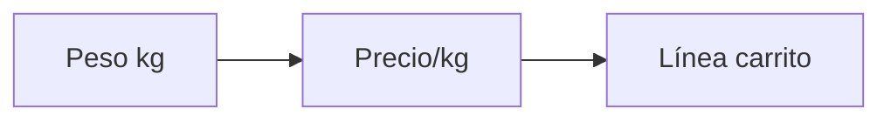

- **API:** `POST /api/pos/almacen/retail` `{ modulo: "balanza" }`

---

### promos-cantidad — `pos.promos_cantidad`

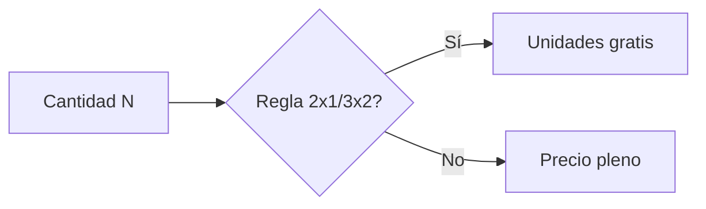

- **API:** `GET /api/pos/almacen/retail?q=promos_cantidad`

---

### ticket-regalo — `pos.ticket_regalo`

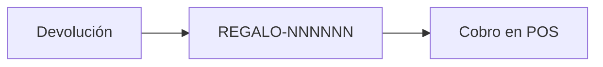

- **API:** `POST /api/pos/almacen/retail` `{ modulo: "ticket_regalo" }`

---

### pedido-distribuidora — `pos.pedido_distribuidora`

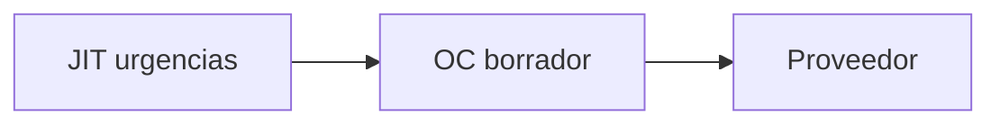

- **API:** `POST /api/pos/almacen/retail` `{ modulo: "pedido_distribuidora" }`

---

### mermas-roturas — `pos.mermas_roturas`

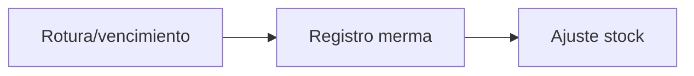

- **API:** `POST /api/pos/almacen/retail` `{ modulo: "merma" }`

---

### arqueo-ciego — `pos.arqueo_ciego`

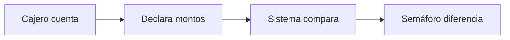

- **API:** `GET/POST /api/pos/almacen/retail` módulo `arqueo_ciego`

---

### lista-mayorista — `pos.lista_mayorista_pos`

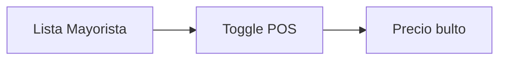

- **API:** `GET /api/pos/almacen/retail?q=lista_mayorista`

---

### cheques-cartera — `pos.cheques_cartera`

- **API:** `POST /api/pos/almacen/retail` `{ modulo: "cheque" }`

---

### inventario-express — `pos.inventario_express`

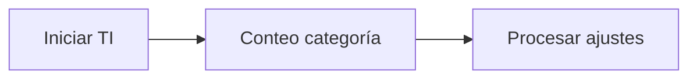

- **API:** `POST /api/pos/almacen/retail` módulos `inventario_*`

---

## API retail unificada

| Método | Ruta | Descripción |
|--------|------|-------------|
| GET | `/api/almacen-rosario/modulos` | Lista todos los módulos + estado activo |
| GET | `/api/pos/almacen/retail` | `?q=` recargas, promos, lista, arqueo, cheques |
| POST | `/api/pos/almacen/retail` | `{ modulo: ... }` ver schema en route |

## Postventa

| Señal | Acción |
|-------|--------|
| Módulo activo pero 403 | Re-provisionar SKU / revisar `canUseSku` |
| Caja cerrada en módulos caja | Mensaje estándar "Abrí la caja" |
| Sin proveedor (pedido distribuidora) | Alta proveedor en ABM |

## Referencias

- [07 — Bundles](./07-bundles-comerciales.md)
- [06 — Runbooks](./06-runbooks-por-producto.md)
- [11 — Libreta Fiado](./11-libreta-fiado-almacen.md)
- [12 — Enganches](./12-enganches-comerciales.md)