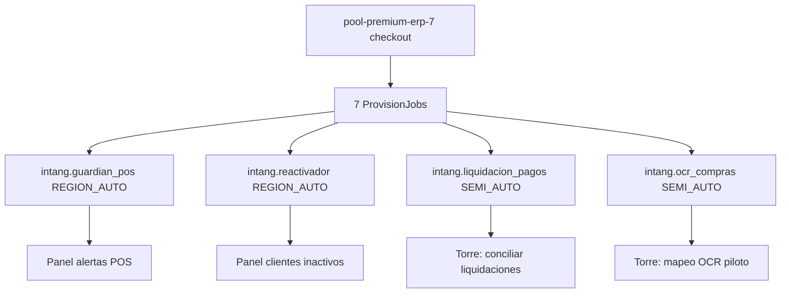
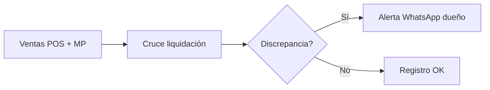
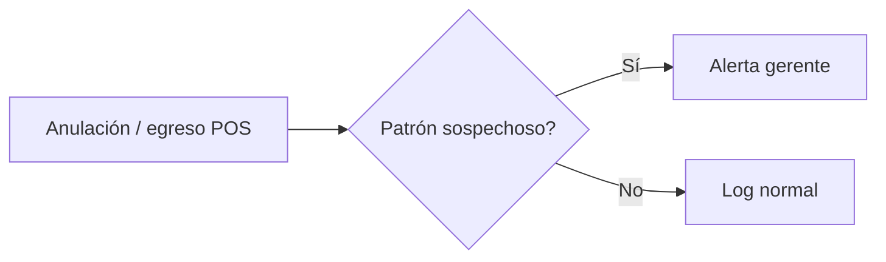
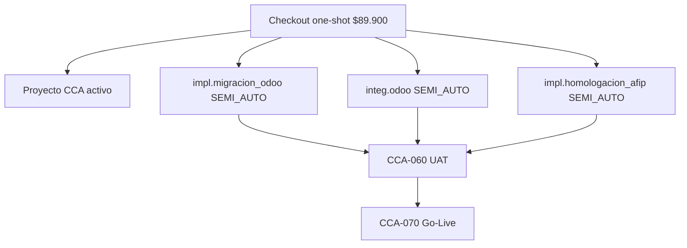
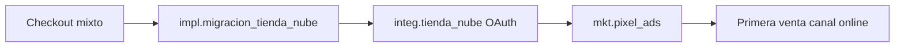

# 16 — Runbooks Premium 7 y pools de implementación

> Diagramas operativos P2 para SKUs enterprise e implementación one-shot.

## Premium ERP 7 — flujo por SKU



## Conciliador liquidación (`intang.liquidacion_pagos`)



## Guardián POS (`intang.guardian_pos`)



## Pool impl Odoo (`pool-impl-odoo`)



## Pool impl Ecommerce (`pool-impl-ecommerce`)



## Tablero Scrum unificado

Los ítems de estos pools aparecen en el backlog del proyecto vía:

```
POST /api/claver/implementaciones/:id/scrum { action: "sync" }
```

Tipos: `cca_hito`, `marketplace_sku`, `servicio_custom`, `ticket_epic`.

Ver [15-portal-stakeholder](./15-portal-stakeholder.md) para vista cliente.