# 17 — Runbooks Tier 1: diagramas operativos

> Complementa [06 — Runbooks por producto](./06-runbooks-por-producto.md) con un diagrama Mermaid por cada SKU **Tier 1**.  
> Fuente canónica: `lib/marketplace/product-runbooks.ts`

## Plantilla común

Todos los Tier 1 siguen la misma estructura de activación → otorgamiento → postventa:

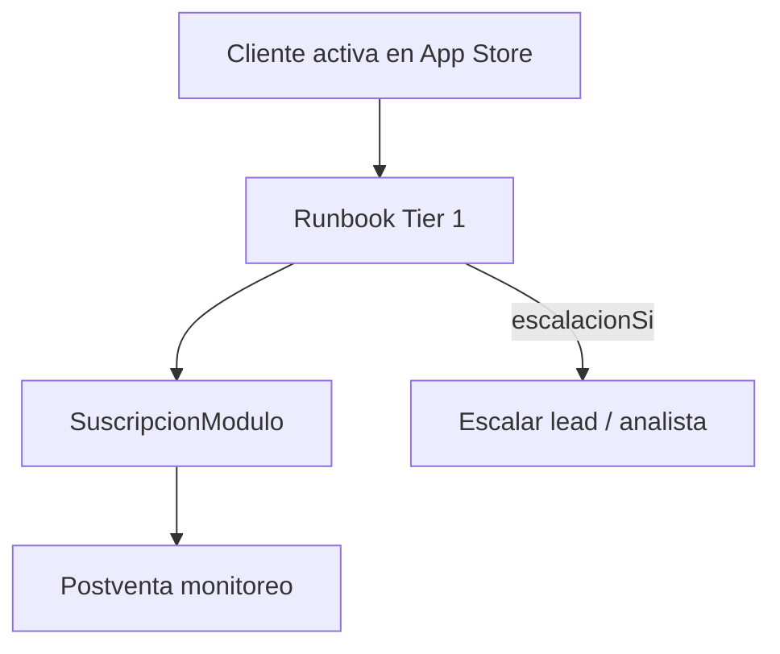

---

## sec.backup — Backup Cloud

| Campo | Valor |
|-------|-------|
| autoCertLevel | GLOBAL_AUTO |
| CCA | CCA-030 |

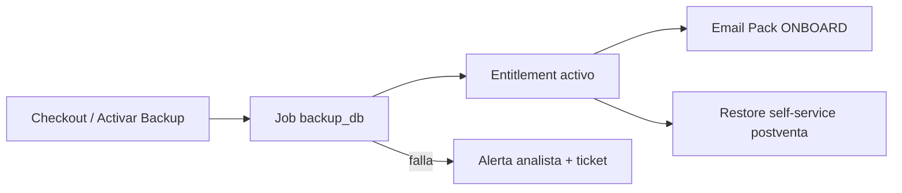

---

## sec.mfa — Escudo 2FA

| Campo | Valor |
|-------|-------|
| autoCertLevel | GLOBAL_AUTO |
| CCA | CCA-040 |

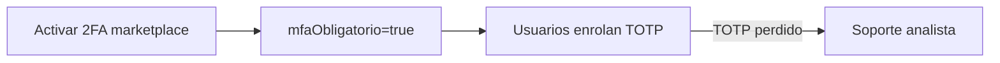

---

## integ.shopify — Shopify Link

| Campo | Valor |
|-------|-------|
| autoCertLevel | SEMI_AUTO |
| CCA | CCA-050 |

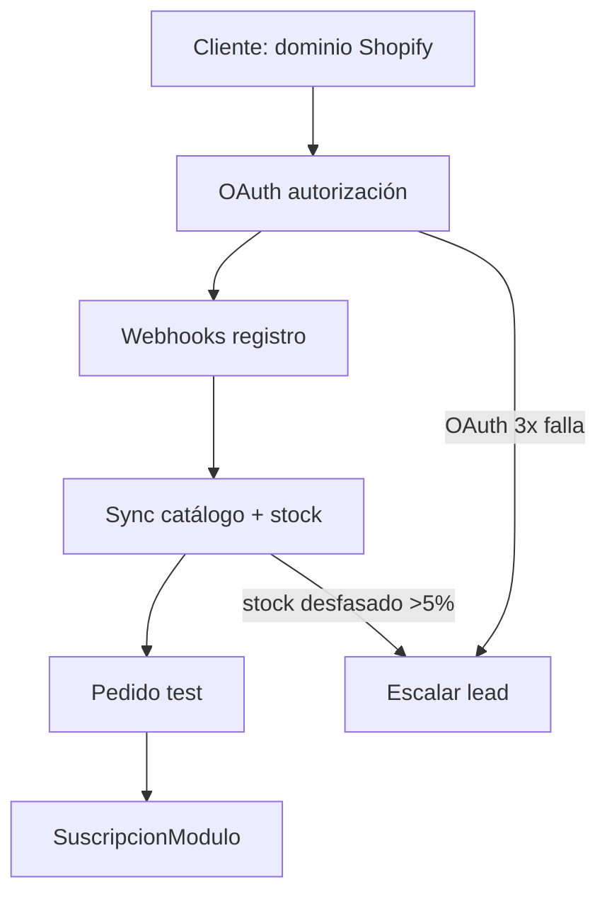

---

## integ.tienda_nube — Tienda Nube Link

| Campo | Valor |
|-------|-------|
| autoCertLevel | REGION_AUTO |
| CCA | CCA-050 |

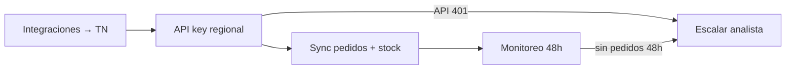

---

## integ.odoo — Odoo Bridge

| Campo | Valor |
|-------|-------|
| autoCertLevel | SEMI_AUTO |
| CCA | CCA-050 |

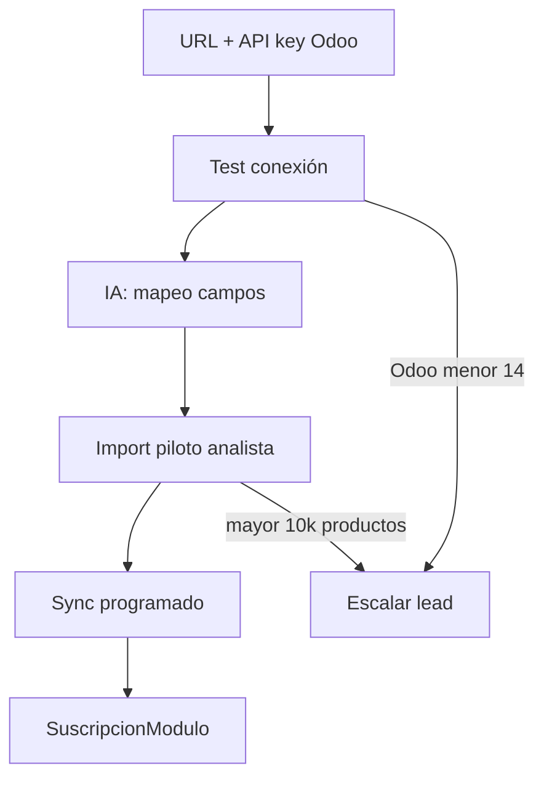

---

## impl.migracion_odoo — Salí de Odoo

| Campo | Valor |
|-------|-------|
| autoCertLevel | SEMI_AUTO |
| CCA | CCA-040 |

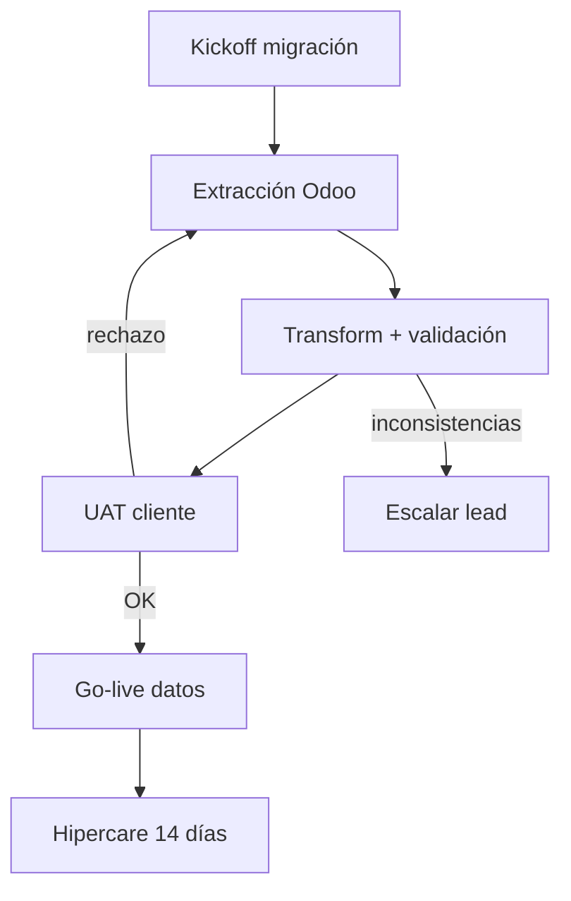

---

## impl.homologacion_afip — AFIP Ready

| Campo | Valor |
|-------|-------|
| autoCertLevel | SEMI_AUTO |
| CCA | CCA-070 |

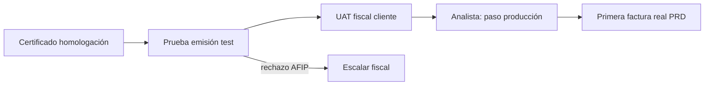

---

## com.whatsapp — WhatsApp ON

| Campo | Valor |
|-------|-------|
| autoCertLevel | REGION_AUTO |
| CCA | CCA-050 |

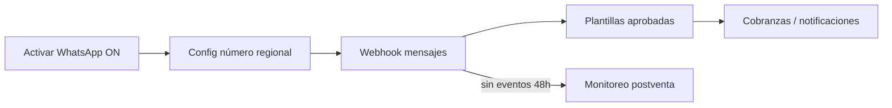

---

## data.reportes_prog — Mañanero

| Campo | Valor |
|-------|-------|
| autoCertLevel | GLOBAL_AUTO |
| CCA | CCA-080 |

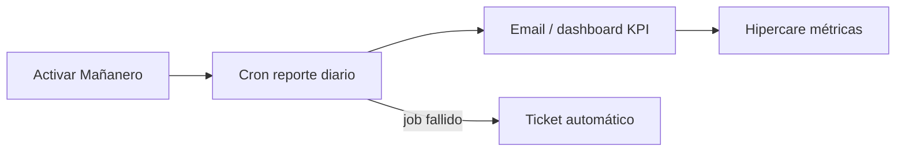

---

## fiscal.ocr — FotoFactura

| Campo | Valor |
|-------|-------|
| autoCertLevel | GLOBAL_AUTO |
| CCA | CCA-050 |

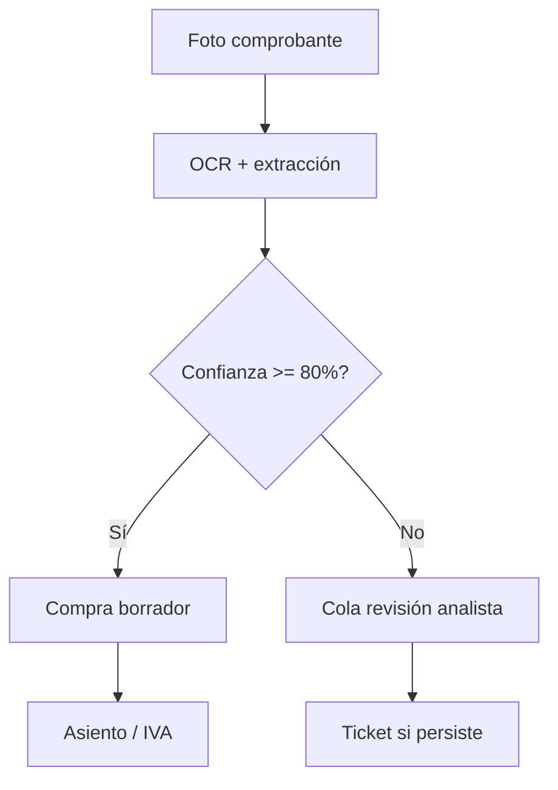

---

## Relación con portal stakeholder (P3)

Los ítems `marketplace_sku` del backlog Scrum se sincronizan desde `MarketplaceTareaAnalista` y reflejan la activación de estos SKUs para el cliente en `/claver-cliente/scrum`.

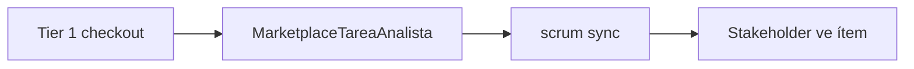

## Siguiente paso

→ [00 — Ciclo completo](./00-ciclo-completo.md) · [15 — Portal stakeholder](./15-portal-stakeholder.md)