# 18 — Enganches Tier 2: diagramas operativos

> Complementa [12 — Enganches comerciales](./12-enganches-comerciales.md) con diagramas Mermaid por SKU **implementado** y **parcial**.  
> Fuente canónica: `lib/marketplace/enganche-catalog.ts` + `lib/marketplace/product-runbooks.ts`

## Funnel enganche → ERP

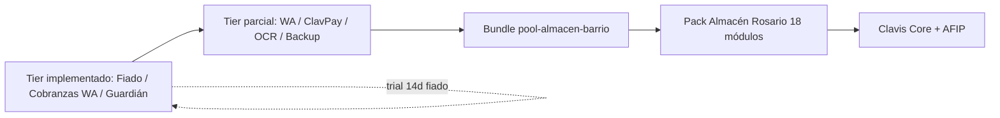

---

## Implementados (usar ya)

### pos.fiado_barrio — Libreta Fiado

| Campo | Valor |
|-------|-------|
| tier | implementado |
| autoCertLevel | GLOBAL_AUTO |
| Precio | $4.990/mes |

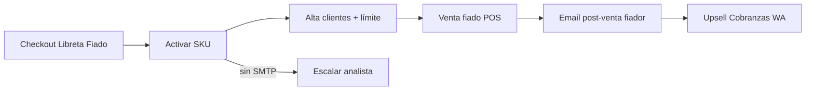

---

### intang.cobranzas_wa — Secretaria de Cobranzas WA

| Campo | Valor |
|-------|-------|
| tier | implementado |
| autoCertLevel | REGION_AUTO |
| Precio | $20.000/mes |

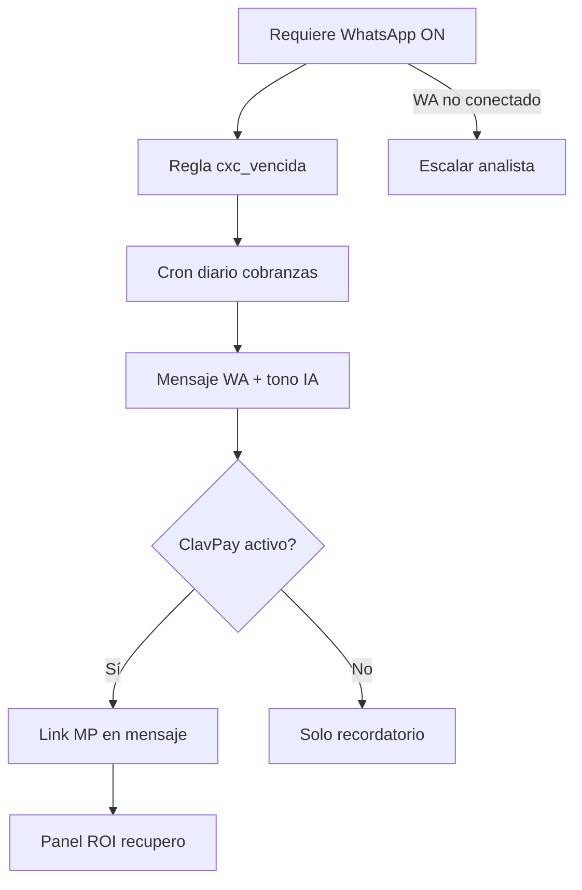

---

### intang.guardian_pos — Guardián de Caja POS

| Campo | Valor |
|-------|-------|
| tier | implementado |
| autoCertLevel | REGION_AUTO |
| Precio | $14.900/mes |

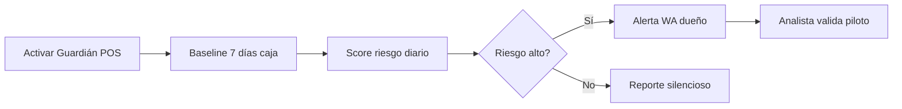

---

## Parciales (enganche + upsell)

### com.whatsapp — WhatsApp Business ON

| Campo | Valor |
|-------|-------|
| tier | parcial |
| autoCertLevel | REGION_AUTO |

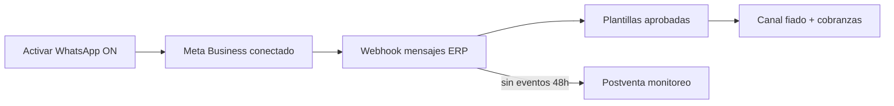

---

### fiscal.clavpay_link — ClavPay Link

| Campo | Valor |
|-------|-------|
| tier | parcial |
| autoCertLevel | REGION_AUTO |

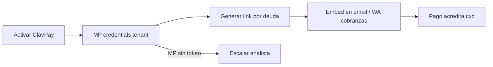

---

### data.reportes_prog — Reporte Mañanero

| Campo | Valor |
|-------|-------|
| tier | parcial |
| autoCertLevel | GLOBAL_AUTO |

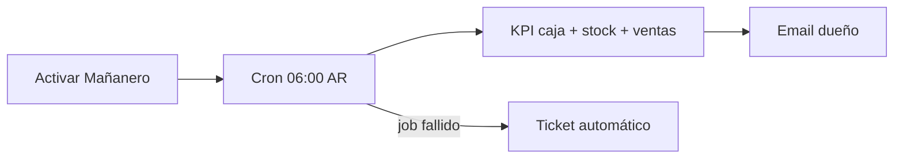

---

### fiscal.ocr — FotoFactura

| Campo | Valor |
|-------|-------|
| tier | parcial |
| autoCertLevel | GLOBAL_AUTO |

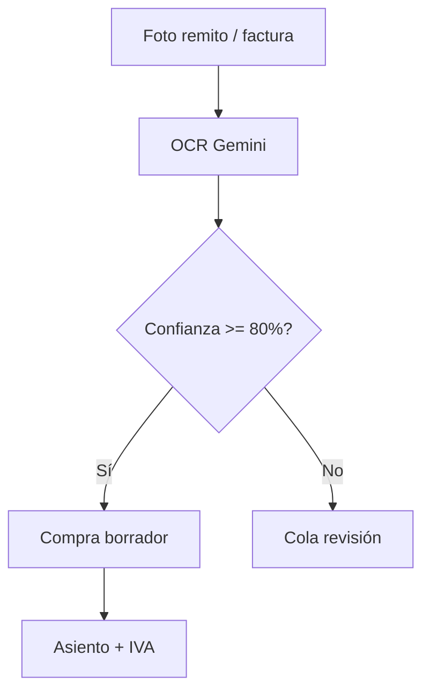

---

### sec.backup — Backup Cloud

| Campo | Valor |
|-------|-------|
| tier | parcial |
| autoCertLevel | GLOBAL_AUTO |

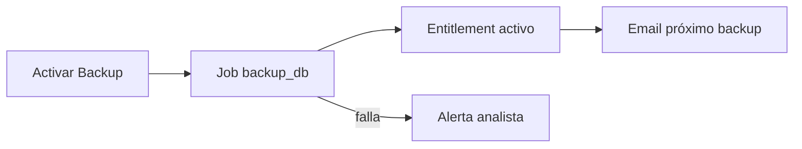

---

### sec.mfa — Escudo 2FA

| Campo | Valor |
|-------|-------|
| tier | parcial |
| autoCertLevel | GLOBAL_AUTO |

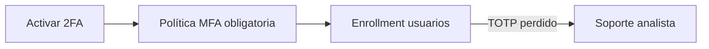

---

### intang.liquidacion_pagos — Conciliador Liquidación MP

| Campo | Valor |
|-------|-------|
| tier | parcial |
| autoCertLevel | SEMI_AUTO |

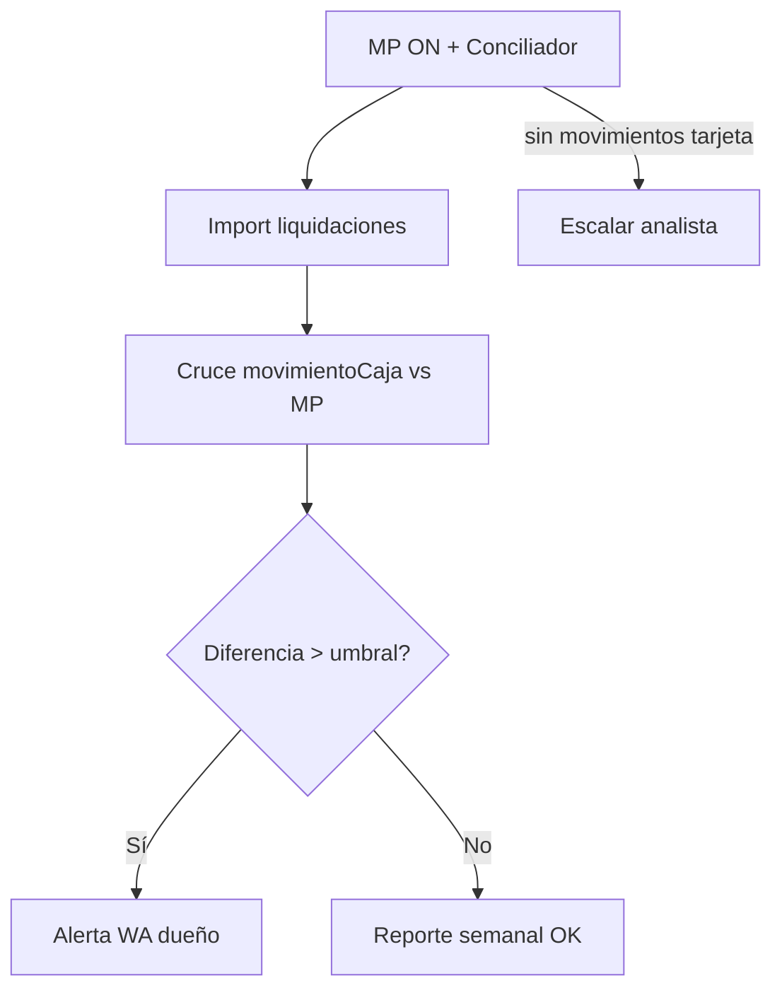

---

## Bundle enganche almacén

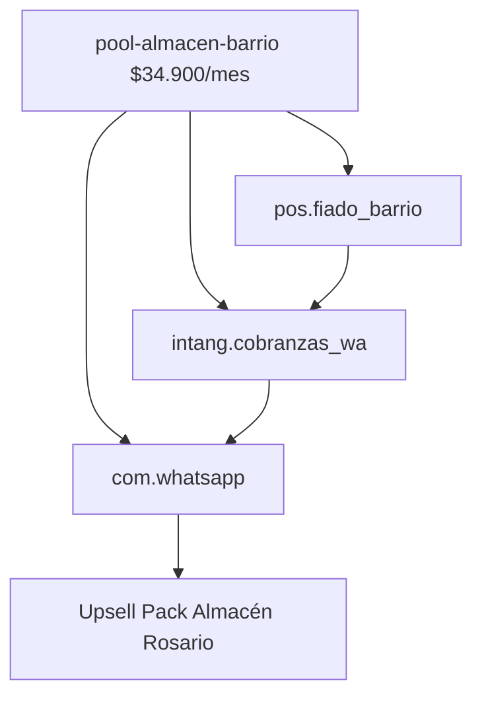

## Notificaciones portal (P4)

Cuando un stakeholder comenta un ticket, el analista asignado recibe email + Telegram. Cuando el analista responde desde el ERP, los stakeholders reciben email con link al portal.

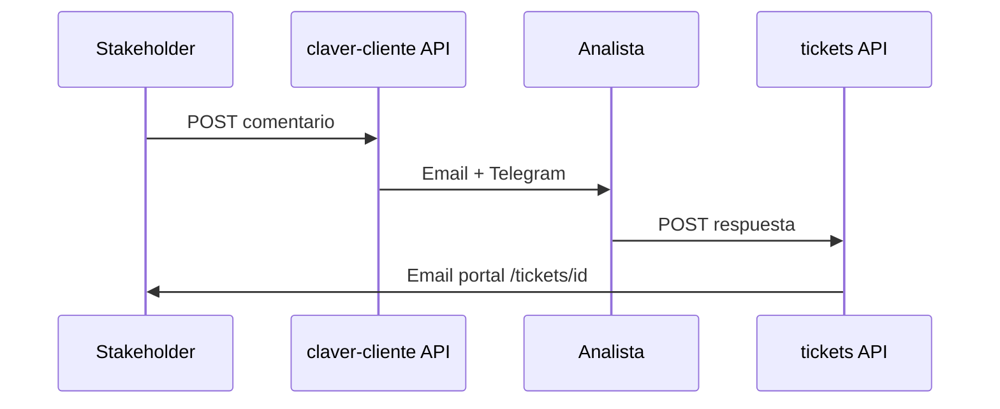

## Siguiente paso

→ [17 — Diagramas Tier 1](./17-runbooks-tier1-diagramas.md) · [15 — Portal stakeholder](./15-portal-stakeholder.md)