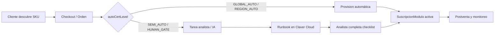

# Claver Marketplace — Documentación A-Z

> **Lema AutoPool:** *Prendelo una vez. Labura todos los días.*

Este índice cubre el ciclo completo del marketplace de automatizaciones y servicios de Clavis: desde que un cliente descubre un producto hasta la atención postventa, pasando por la torre de analistas en Claver Cloud.

## Audiencia

| Rol | Documentos clave |
|-----|------------------|
| Comercial / onboarding | [01-onboarding-cliente](./01-onboarding-cliente.md) |
| Cliente (tenant) | [02-activacion-producto](./02-activacion-producto.md) |
| Analista Claver | [04-torre-analista-claver-cloud](./04-torre-analista-claver-cloud.md), [06-runbooks-por-producto](./06-runbooks-por-producto.md) |
| Contra-analista / lead | [03-otorgamiento-servicio](./03-otorgamiento-servicio.md), [04-torre-analista](./04-torre-analista-claver-cloud.md) |
| Soporte postventa | [05-postventa](./05-postventa.md) |
| Ingeniería | [08-flujo-tecnico-backend](./08-flujo-tecnico-backend.md) |

## Ciclo maestro (comercial → implementación → postventa)

**Documento canónico con todos los diagramas P0:** [00-ciclo-completo](./00-ciclo-completo.md)

## Flujo resumido marketplace



## Documentos recientes

| Doc | Tema |
|-----|------|
| [13-servicios-intangibles-premium-7](./13-servicios-intangibles-premium-7.md) | **Premium 7** — SAP/Odoo adaptados AR |
| [14-pack-almacen-rosario](./14-pack-almacen-rosario.md) | **Pack Almacén Rosario** — 18 módulos retail + diagramas |
| [09-servicios-intangibles-top5](./09-servicios-intangibles-top5.md) | Top 5 bolsillo + ansiedad |
| [12-enganches-comerciales](./12-enganches-comerciales.md) | Productos anzuelo |

## Estructura de código

```
lib/marketplace/
  marketplace-catalog.ts   # SKUs catálogo principal (+ Premium 7)
  intangible-premium-7.ts  # Metadatos comerciales Premium 7
  autopool-manifest.ts     # Entradas AutoPool (nichos, lemas)
  bundles.ts               # Pools comerciales (+ pool-premium-erp-7)
  catalog-resolver.ts      # Unifica catálogo + AutoPool
  product-runbooks.ts      # Runbook por SKU (contra-analista)
  analyst-task-service.ts  # Tareas humano/IA
  provision-service.ts     # Orquestación checkout → job → suscripción

app/api/marketplace/       # APIs tenant (catalog, checkout, provision, jobs)
app/api/claver/marketplace/ # APIs analista (tareas)
app/claver-cloud/marketplace/ # UI torre analista
app/dashboard/apps/        # App Store del tenant
```

## Niveles de certificación (`autoCertLevel`)

| Nivel | Quién ejecuta | Resultado |
|-------|---------------|-----------|
| `GLOBAL_AUTO` | Sistema | Suscripción inmediata |
| `REGION_AUTO` | Sistema (+ validación regional) | Suscripción inmediata |
| `SEMI_AUTO` | Cliente + analista/IA | Tarea en torre |
| `HUMAN_GATE` | Analista obligatorio | Tarea prioritaria |

## Documentos

0. [00 — Ciclo completo (maestro)](./00-ciclo-completo.md)
0b. [15 — Portal stakeholder](./15-portal-stakeholder.md)
0c. [16 — Runbooks Premium e Impl](./16-runbooks-premium-impl.md)
0d. [17 — Diagramas Tier 1](./17-runbooks-tier1-diagramas.md)
0e. [18 — Enganches Tier 2](./18-runbooks-tier2-enganches-diagramas.md)
1. [01 — Onboarding del cliente](./01-onboarding-cliente.md)
2. [02 — Activación de producto](./02-activacion-producto.md)
3. [03 — Otorgamiento del servicio](./03-otorgamiento-servicio.md)
4. [04 — Torre analista (Claver Cloud)](./04-torre-analista-claver-cloud.md)
5. [05 — Postventa](./05-postventa.md)
6. [06 — Runbooks por producto](./06-runbooks-por-producto.md)
7. [07 — Bundles comerciales](./07-bundles-comerciales.md)
8. [08 — Flujo técnico backend](./08-flujo-tecnico-backend.md)
9. [09 — Servicios intangibles Top 5](./09-servicios-intangibles-top5.md)
10. [10 — Arquitectura Cobranzas WA](./10-arquitectura-cobranzas-wa.md)
11. [11 — Libreta Fiado almacén](./11-libreta-fiado-almacen.md)
12. [12 — Enganches comerciales](./12-enganches-comerciales.md)
13. [13 — Premium ERP 7](./13-servicios-intangibles-premium-7.md)
14. [14 — Pack Almacén Rosario](./14-pack-almacen-rosario.md)

## Variables de entorno

| Variable | Uso |
|----------|-----|
| `CLAVER_ANALYST_EMAILS` | Emails con acceso Claver Cloud |
| `CLAVER_MARKETPLACE_ANALISTA_FALLBACK` | Analista si no hay asignación por empresa |
| `RESEND_API_KEY` | Email al analista cuando se crea tarea |

## Referencias cruzadas

- Proyecto implementación CCA: `lib/ops/implementacion-service.ts`
- Asignaciones analista: `app/claver-cloud/settings/assignments`
- Catálogo integraciones: `lib/integrations/catalog.ts`