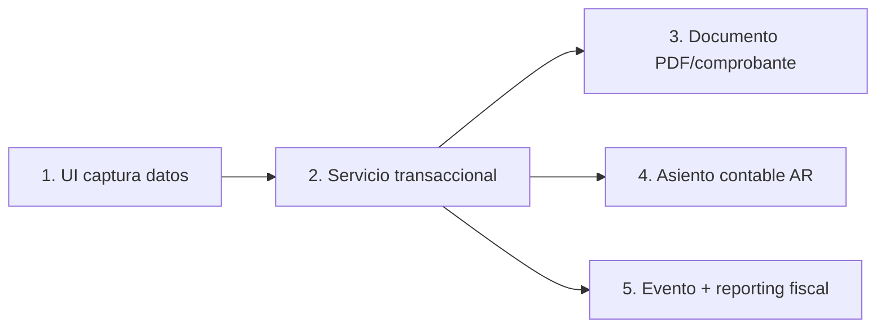
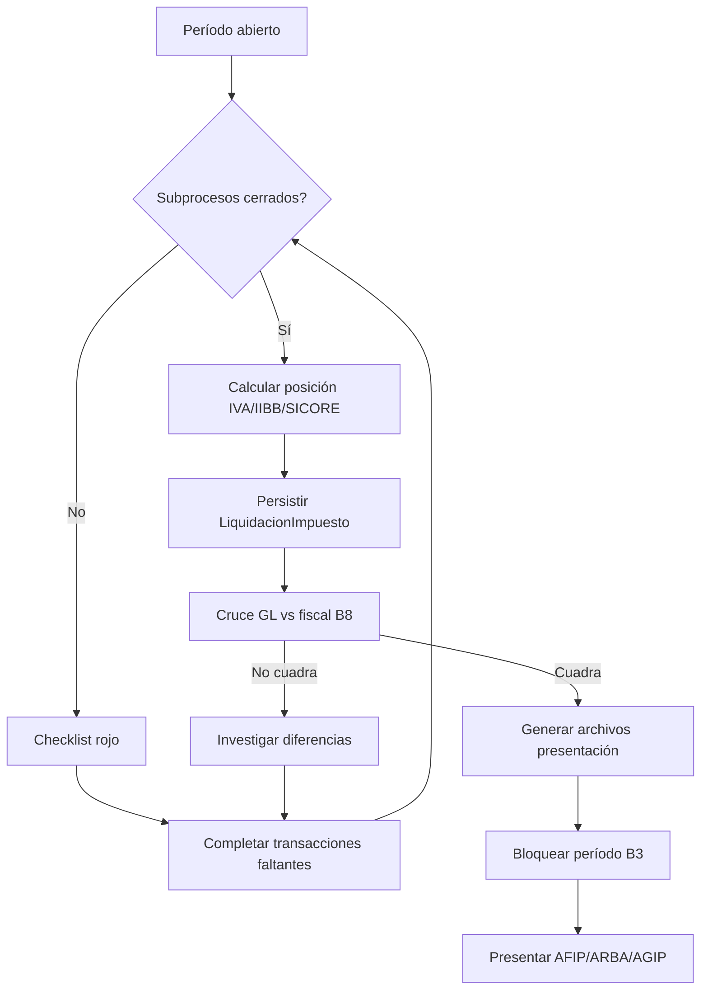
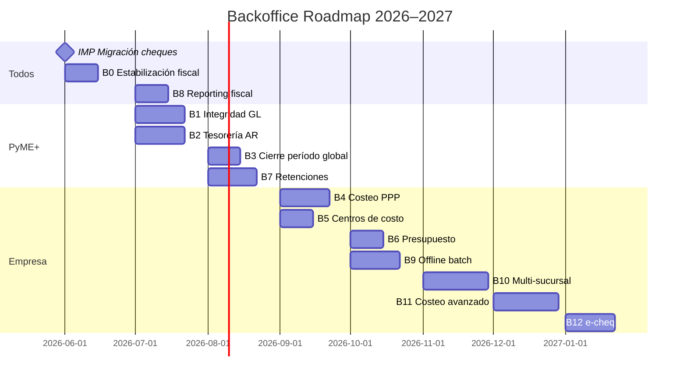
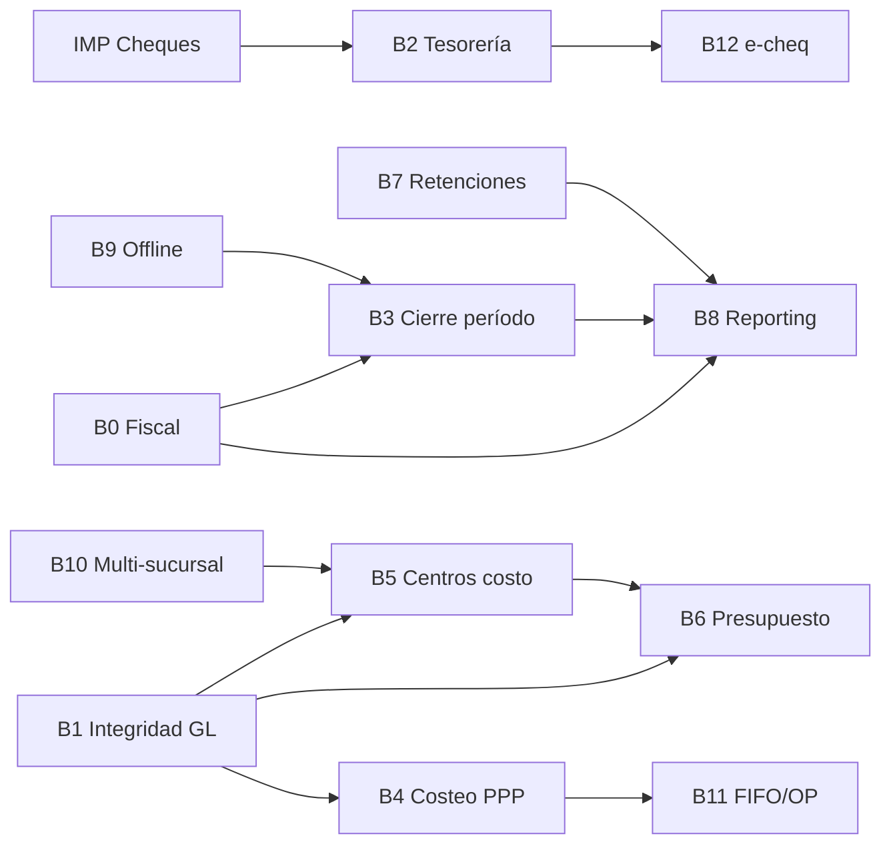

# Roadmap Backoffice — Sprints por tamaño de empresa

> **Documento:** Plan de implementación de procesos críticos de backoffice  
> **Versión:** 1.1 — Junio 2026  
> **Alcance:** Contabilidad, tesorería, costos, reporting, impuestos Argentina  
> **Referencia funcional:** Protheus (SIGACTB/SIGAFIN/SIGACUS), Tango Gestión, SAP Business One  
> **Estado base:** Auditoría de código + implementación circuito cheques (Jun 2026)

---

## 1. Objetivo del documento

Definir **sprints priorizados** para cerrar brechas de backoffice, con activación **parametrizable** según el perfil de empresa. Cada sprint indica:

- Para **quién aplica** (Micro / PyME / Empresa)
- Qué **procesos automáticos** debe verificar QA
- Qué **reportes e impuestos** desbloquea
- **Dependencias** y orden recomendado de ejecución

### 1.1 Perfiles de empresa

| Perfil | Descripción típica | Módulos mínimos go-live |
|--------|------------------|-------------------------|
| **Micro** | Monotributo / autónomo / retail chico | POS, factura B/C, caja, stock simple, IVA básico |
| **PyME** | B2B con CC, cheques, contador externo | + CC/CP, tesorería, GL básico, libros fiscales, retenciones |
| **Empresa** | Distribución, industria, multi-sucursal | + costeo PPP/FIFO, centros de costo, presupuesto, consolidación |

---

## 2. Madurez actual vs referencia (baseline Jun 2026)

Comparativa estimada frente a ERP maduro (Protheus/Tango/SAP B1):

| Área | ClavERP hoy | Referencia | Sprint(s) que cierran |
|------|:-----------:|:----------:|----------------------|
| GL / Libros contables | ~55% | 100% | B1, B3, B5 |
| Costos (PPP/FIFO/OP) | ~15% | 100% | B4, B11 |
| CC comercial / tesorería | ~70% | 100% | B2, B12 |
| Fiscal Argentina (IVA/IIBB/SICORE) | ~75% | 100% | B0, B7, B8 |
| Reporting pre-impostivo | ~60% | 100% | B0, B8 |
| Offline / batch contable | ~0% | 100% | B9 |

### 2.1 Lo que SÍ funciona

| Área | Estado |
|------|--------|
| Facturación AFIP (WSFE, CAE, CAEA) | ✅ Operativo |
| Venta → stock → asiento venta (event bus) | ✅ |
| Compra → stock → CP → asiento compra | ✅ |
| NC → stock + asiento | ✅ |
| CC / CP con aging, cobro, pago | ✅ Base |
| Plan de cuentas, períodos, cierre ejercicio | ✅ |
| Balance, EERR, sumas y saldos, inflación RT6 | ✅ |
| Activos fijos + depreciación | ✅ |
| IVA, CITI, IIBB DDJJ, SICORE, padrón | ✅ Base sólida |
| Reporting BI (pivot, templates, export) | ✅ MVP |
| PDF factura, NC, remito, OC, presupuesto | ✅ |

### 2.2 Brechas críticas confirmadas (auditoría + chat)

| Brecha | Impacto | Sprint |
|--------|---------|--------|
| `MovimientoContable.cuenta` es string, no FK al plan | Integridad mayor / reporting | B1 |
| `centroCostoId` en schema pero no en asientos automáticos | Contabilidad analítica inexistente | B5 |
| CMV usa `precioCompra` fijo (no PPP/FIFO real) | Costos y margen incorrectos | B4 |
| `validarPeriodoAbierto()` solo en venta/compra/asiento manual | Cierre fiscal riesgoso | B3 |
| Cobros/pagos/cheques **sin** validación de período | Transacciones en mes cerrado | B3 |
| `PresupuestoGasto` + `registrarEjecucion()` sin wire a asientos | Control de gestión muerto | B6 |
| Sin cola contable offline/batch | POS/vendedor offline desincroniza GL | B9 |
| Retenciones manuales; sin certificado PDF | Agentes de retención / SICORE | B7 |
| Recibo multi-medio | Cobranzas B2B reales | B2 |
| e-cheq, endoso integrado OP en un paso | Tesorería AR madura | B12 |
| `LiquidacionImpuesto` no persistida | Trazabilidad fiscal | B0 |
| Libro mayor UI principal con parámetros incorrectos | Operación contador | B0 |
| Percepciones IIBB/IVA al facturar (wire padrón → línea) | DDJJ IIBB / posición IVA | B0 |
| Conciliación bancaria sin asiento de diferencia | GL vs banco desalineado | B2 |
| Transferencia bancaria sin asiento contable | Tesorería incompleta | B2 |
| Vendedor ruta: cobro sin API real (corregido Jun 2026) | CC desactualizada | ✅ IMP |
| UI CC/CP enviaba payload incorrecto a APIs (corregido) | Cobros/pagos fallidos | ✅ IMP |

---

## 3. Patrón de cierre de circuito — “5 patas”

**Regla de diseño:** un proceso backoffice solo se considera **cerrado** cuando cumple las 5 patas:



| Pata | Qué verificar | Ejemplo OK | Ejemplo GAP |
|------|---------------|------------|-------------|
| UI | Formulario estructurado, validación cliente | Cobro con datos cheque | Vendedor captura sin POST |
| Servicio | Transacción Prisma, reglas negocio | `cheque-service.ts` | CMV con costo fijo |
| Documento | PDF correlativo, numeración | Recibo PDF | Sin certificado retención |
| Asiento | Partida doble, cuenta AR correcta | Cheque → 1.1.5 | Cobro cheque iba a banco |
| Evento | Handler downstream + dato BI/fiscal | `CHEQUE_DEPOSITADO` | Presupuesto sin ejecutado |

> **Lección del chat:** el modelo/servicio puede existir pero el **circuito no cierra** si falta cualquiera de las 5 patas. El gap de cheques era exactamente esto: existía `Cheque` en schema pero el cobro no lo creaba ni asentaba a cartera.

---

## 4. Sprint IMP — Implementación reciente (Jun 2026)

**Estado:** código implementado, **pendiente migración DB** en entorno productivo.

### 4.1 Circuito cheque ↔ recibo ↔ OP (P0 cerrado)

| Ítem | Archivo / ruta | Estado |
|------|----------------|--------|
| Servicio cheque integrado | `lib/cheques/cheque-service.ts` | ✅ |
| Event handlers | `lib/cheques/cheque-event-handlers.ts` | ✅ |
| Cuentas medio pago (1.1.5 / 2.8) | `lib/contabilidad/medio-pago-cuentas.ts` | ✅ |
| Seeds plan cuentas | `lib/contabilidad/plan-cuentas-seeds.ts` | ✅ |
| Cobros con cheque | `lib/cobros/cobros-service.ts` | ✅ |
| Pagos con cheque propio | `lib/pagos/pagos-service.ts` | ✅ |
| Schemas API validados | `lib/cobros/cobro-schemas.ts`, `lib/pagos/pago-schemas.ts` | ✅ |
| API cheques | `app/api/cheques/[id]/route.ts` | ✅ |
| API cobros/pagos (compat legacy) | `app/api/cuentas-cobrar/cobros/route.ts`, `app/api/cuentas-pagar/pagos/route.ts` | ✅ |
| UI CC con form cheque + payload fix | `app/dashboard/cuentas-cobrar/page.tsx` | ✅ |
| UI CP con modal pago + cheque | `app/dashboard/cuentas-pagar/page.tsx` | ✅ |
| PDF recibo y OP | `lib/printer/pdf-service.ts`, `app/api/impresion/pdf/route.ts` | ✅ |
| Vendedor ruta cobro real vía API | `app/vendedor/page.tsx` | ✅ |
| Schema Prisma | `Cheque.reciboId`, `Cheque.ordenPagoId`, `bancoNombre` | ✅ schema |

### 4.2 Asientos automáticos post-IMP

| Evento | Cuenta DEBE/HABER | Cuenta AR |
|--------|-------------------|-----------|
| Cobro efectivo | DEBE Caja | 1.1 |
| Cobro transferencia | DEBE Banco | 1.2 |
| Cobro cheque tercero | DEBE Cheques en Cartera | **1.1.5** |
| Depósito cheque | DEBE Banco / HABER Cartera | ✅ |
| Cheque rechazado | Re-débito CC + reversa | ✅ |
| OP cheque propio | HABER Cheques a Pagar | **2.8** |
| Débito cheque propio | HABER Banco / DEBE Ch. a Pagar | ✅ |

### 4.3 Tests automatizados (7 passing)

```bash
npm run test -- __tests__/cheques/cheque-service.test.ts
npm run test -- __tests__/contabilidad/medio-pago-cuentas.test.ts
npm run test -- __tests__/cobros/cobros-service.test.ts
```

### 4.4 Pendiente operativo post-IMP

| Acción | Comando / nota |
|--------|----------------|
| Migración schema | `npx prisma db push` o `prisma migrate dev` |
| Regenerar client | `npx prisma generate` (en Windows puede requerir cerrar procesos por EPERM) |
| QA manual PyME | Factura crédito → cobro cheque → depósito → CITI del mes |
| Seed testing | `npm run db:seed-testing` — credenciales demo: `admin@erp-argentina.com` / `admin1234` |

---

## 5. Modelo de parametrización por tamaño

### 5.1 Flags de activación (propuesta `ConfiguracionModulo` / onboarding)

```yaml
backoffice:
  perfil_empresa: micro | pyme | empresa   # default según rubro/plan comercial

  modulos:
    contabilidad_gl: true|false            # micro: false por defecto
    tesoreria_cheques: true|false            # pyme B2B: true
    centros_costo: true|false                # empresa/industria: true
    costeo_ppp: true|false
    costeo_fifo: true|false
    presupuesto_gasto: true|false
    multi_sucursal_gl: true|false
    cola_asientos_offline: true|false
    retenciones_auto: true|false
    echeq: true|false
    facturacion_recurrente: true|false       # PyME servicios

  fiscal:
    regimen: monotributo | ri_iva | ri_ganancias
    iva_mensual: true|false                  # micro monotributo: false
    iibb_multijurisdiccion: true|false
    sicore: true|false                       # agentes retención
    citi: true|false
    inflacion_rt6: true|false                # empresa: true
    agente_retencion_iva: true|false
    agente_retencion_ganancias: true|false
    agente_retencion_iibb: true|false
```

### 5.2 Matriz “qué sprint necesita cada perfil”

| Sprint | Micro | PyME | Empresa | Semanas est. |
|--------|:-----:|:----:|:-------:|:------------:|
| IMP — Cheques (hecho) | ○ | ● | ● | — |
| B0 — Estabilización fiscal | ● | ● | ● | 2 |
| B1 — Integridad contable GL | ○ | ● | ● | 2–3 |
| B2 — Tesorería AR completa | ○ | ● | ● | 3 |
| B3 — Período y cierre global | ○ | ● | ● | 2 |
| B4 — Costeo PPP | ○ | ○ | ● | 3 |
| B5 — Centros de costo wire | ○ | ○ | ● | 2 |
| B6 — Presupuesto vs ejecutado | ○ | ○ | ● | 2 |
| B7 — Retenciones y certificados | ○ | ● | ● | 2–3 |
| B8 — Reporting fiscal cerrado | ● | ● | ● | 2 |
| B9 — Offline/batch contable | ○ | ○ | ● | 3 |
| B10 — Multi-sucursal / consolidación | ○ | ○ | ● | 4 |
| B11 — Costeo avanzado (FIFO, OP) | ○ | ○ | ● | 4 |
| B12 — e-cheq y tesorería pro | ○ | ● | ● | 3 |

● = obligatorio go-live típico | ○ = opcional / fase 2

### 5.3 Rutas de implementación por perfil

**Micro (4–6 semanas):**
```
IMP (migración) → B0 (parcial: sin GL) → B8 (IVA/POS) → Go-live
```
Omite: GL completo, cheques, centros de costo, retenciones.

**PyME (8–12 semanas):**
```
IMP → B0 → B1 → B2 → B3 → B7 → B8 → Go-live
```
Opcional fase 2: B4 (si distribución), B12 (e-cheq).

**Empresa (6–9 meses por fases):**
```
IMP → B0 → B1 → B2 → B3 → B7 → B8  [Fase 1: fiscal+tesorería]
→ B4 → B5 → B6                        [Fase 2: costos+gestión]
→ B9 → B10 → B11 → B12                [Fase 3: escala+industria]
```

---

## 6. Checklist — Procesos automáticos críticos

### 6.1 Circuito comercial → contable

| Proceso | Auto | Asiento | Fiscal | Reporting | Estado |
|---------|:----:|:-------:|:------:|:---------:|--------|
| Factura venta AFIP | ✅ | ✅ | ✅ CAE | ✅ ventas | OK |
| NC electrónica | ✅ | ✅ | ✅ | ✅ | OK |
| Pedido → remito → factura | ✅ | — | — | ⚠️ | Parcial |
| Presupuesto → pedido | ✅ | — | — | ⚠️ | Parcial |
| Compra proveedor | ✅ | ✅ | ✅ IVA CF | ✅ compras | OK |
| 3-way match OC/recepción/factura | ✅ | — | — | ⚠️ | Parcial |
| Stock venta (event bus) | ✅ | — | — | ✅ | OK |
| Stock compra | ✅ | — | — | ✅ | OK |
| CMV al facturar | ✅ | ⚠️ `precioCompra` fijo | — | ⚠️ margen | **GAP B4** |
| CC por factura crédito | ✅ | — | — | ✅ aging | OK |
| CP por compra crédito | ✅ | — | — | ✅ aging | OK |
| Facturación recurrente | ✅ | ⚠️ | ✅ | ⚠️ | Parcial |

### 6.2 Tesorería

| Proceso | Auto | Asiento | Fiscal | Reporting | Estado |
|---------|:----:|:-------:|:------:|:---------:|--------|
| Cobro efectivo/transferencia | ✅ | ✅ | — | ✅ | OK |
| Cobro con cheque → cartera | ✅ | ✅ 1.1.5 | — | ✅ cheques | ✅ IMP |
| Depósito cheque → banco | ✅ | ✅ | — | ✅ banco | ✅ IMP |
| Cheque rechazado → CC | ✅ | ✅ | — | ✅ | ✅ IMP |
| Recibo PDF | ✅ | — | — | ✅ | ✅ IMP |
| Recibo multi-medio | ❌ | — | — | — | **GAP B2** |
| OP proveedor | ✅ | ✅ | — | ✅ | OK |
| OP cheque propio | ✅ | ✅ 2.8 | — | ✅ | ✅ IMP |
| Retenciones en cobro/OP | ⚠️ manual | ⚠️ | ⚠️ SICORE | ⚠️ | **GAP B7** |
| Certificado retención PDF | ❌ | — | ✅ obligatorio | — | **GAP B7** |
| Conciliación bancaria | ✅ | ❌ sin asiento | — | ⚠️ | Parcial B2 |
| Transferencia bancaria → asiento | ❌ | ❌ | — | — | **GAP B2** |
| Endoso cheque → pago proveedor | ❌ | — | — | — | **GAP B12** |
| e-cheq COELSA | ❌ | — | — | — | **GAP B12** |
| Vendedor ruta → API cobro | ✅ | ✅ | — | ✅ | ✅ IMP |

### 6.3 Contabilidad general (GL)

| Proceso | Auto | Período bloqueado | Reporting | Estado |
|---------|:----:|:-----------------:|:---------:|--------|
| Asiento venta | ✅ | ✅ | ✅ | OK |
| Asiento compra | ✅ | ✅ | — | OK |
| Asiento cobro/pago | ✅ | ❌ | — | **GAP B3** |
| Asiento cheque depósito/rechazo | ✅ | ❌ | — | **GAP B3** |
| Asiento manual | ✅ | ✅ | — | OK |
| Anulación con reverso | ✅ | ✅ | — | OK |
| Libro diario | ✅ | — | ✅ | OK |
| Libro mayor API | ✅ | — | ✅ | OK |
| Libro mayor UI principal | ⚠️ | — | ⚠️ params | **GAP B0** |
| Balance / EERR | ✅ | — | ✅ | OK |
| Cierre ejercicio | ✅ | — | ✅ | OK |
| Inflación RT6 | ✅ | — | ✅ empresa | OK |
| Centro costo en movimientos | ❌ | — | ❌ | **GAP B5** |
| Cuenta contable FK (no string) | ❌ | — | ❌ | **GAP B1** |
| Presupuesto → ejecutado | ❌ | — | ❌ | **GAP B6** |
| Cola offline contable | ❌ | — | ❌ | **GAP B9** |

### 6.4 Impuestos y reporting fiscal (pre-presentación)

| Proceso | Genera archivo | Persiste liquidación | Cruce contable | Estado |
|---------|:--------------:|:--------------------:|:--------------:|--------|
| Libro IVA ventas/compras (CITI) | ✅ | ❌ | ⚠️ | Parcial B0 |
| Posición IVA mensual | ✅ | ❌ | ⚠️ | Parcial B0 |
| IIBB DDJJ (ARBA/AGIP) | ✅ | ❌ | ⚠️ | Parcial B0 |
| SICORE retenciones | ✅ | ⚠️ | ⚠️ | Parcial B7 |
| Percepciones al facturar | ⚠️ parcial | — | — | **GAP B0** |
| Padrones IIBB import | ✅ | — | — | OK |
| TES (tipo impuesto por operación) | ✅ config | — | — | OK |
| Resumen fiscal reporting BI | ✅ template | — | — | OK |
| Bloqueo período post-presentación | ✅ | — | — | OK |
| Certificado retención entregable | ❌ | — | — | **GAP B7** |
| Cruce IVA GL vs fiscal | ❌ template | — | — | **GAP B8** |
| Pack cierre mensual contador | ❌ | — | — | **GAP B8** |

---

## 7. Flujo crítico — Cierre pre-presentación impuestos

**Regla de oro fiscal:** antes de presentar IVA / IIBB / SICORE debe existir un **cierre de subprocesos** del período y una **liquidación persistida** con trazabilidad.



### 7.1 Checklist automático pre-presentación (debe ser UI en B0.3)

| # | Validación | Micro | PyME | Empresa | Auto |
|---|------------|:-----:|:----:|:-------:|:----:|
| 1 | Todas las facturas del mes con CAE | ● | ● | ● | ✅ |
| 2 | Todas las compras con IVA imputado | ○ | ● | ● | ✅ |
| 3 | Cobranzas del mes registradas | ○ | ● | ● | ✅ |
| 4 | Pagos del mes registrados | ○ | ● | ● | ✅ |
| 5 | Cheques en cartera documentados | ○ | ● | ● | ⚠️ |
| 6 | Asientos cuadran (debe = haber) | ○ | ● | ● | ✅ |
| 7 | Posición IVA = liquidación persistida | ● | ● | ● | ❌ B0 |
| 8 | Retenciones período = SICORE | ○ | ● | ● | ❌ B7 |
| 9 | Percepciones facturadas = padrón | ○ | ● | ● | ❌ B0 |
| 10 | Stock valorizado (si aplica CMV) | ○ | ○ | ● | ❌ B4 |
| 11 | Período contable abierto solo si hay ajustes | ○ | ● | ● | ✅ |
| 12 | Depreciación activos fijos corrida | ○ | ● | ● | ✅ |

### 7.2 Archivos de salida por impuesto

| Impuesto | Servicio actual | Archivo | Sprint cierre |
|----------|----------------|---------|---------------|
| IVA ventas/compras | `lib/impuestos/citi-service.ts` | TXT CITI | B0 + B8 |
| Posición IVA | `lib/impuestos/iva-service.ts` | Resumen + liquidación | B0 |
| IIBB DDJJ | `lib/impuestos/iibb-service.ts` | TXT ARBA/AGIP | B0 + B8 |
| SICORE | `lib/impuestos/sicore-service.ts` | TXT SICORE | B7 + B8 |
| Padrones | `lib/impuestos/padron-service.ts` | Import CSV | OK |
| Inflación RT6 | `lib/contabilidad/inflacion-service.ts` | Asientos ajuste | OK (empresa) |

---

## 8. Sprints detallados

---

### Sprint B0 — Estabilización fiscal y documentos (2 semanas)

**Perfiles:** Micro ● | PyME ● | Empresa ●

**Objetivo:** Ningún cliente presenta impuestos con huecos documentales ni datos sin persistir.

| Ítem | Descripción | Automático |
|------|-------------|:----------:|
| B0.0 | Ejecutar migración IMP (cheques) en todos los entornos | — |
| B0.1 | Corregir libro mayor UI (`contabilidad/page.tsx` — selector cuenta + fechas API) | — |
| B0.2 | Modelo + persistir `LiquidacionImpuesto` (IVA, IIBB, SICORE) por período/empresa | ✅ al generar DDJJ |
| B0.3 | Dashboard “checklist pre-presentación” por período (sección 7.1) | ✅ validaciones |
| B0.4 | Percepciones IIBB/IVA al facturar (wire padrón → línea factura) | ✅ |
| B0.5 | Tests E2E: factura → CITI → posición IVA cuadra | ✅ |
| B0.6 | Monotributo: ocultar módulos GL/retenciones si `regimen: monotributo` | ✅ config |

**Criterios de aceptación:**
- Contador genera CITI ventas/compras sin ajustes manuales en DB
- Liquidación IVA del mes queda guardada con totales, hash y fecha
- Checklist muestra rojo/verde por cada ítem de sección 7.1
- Micro con monotributo no ve pantallas de retenciones/SICORE

**Reporting/impuesto desbloqueado:** Presentación IVA mensual confiable, trazabilidad liquidaciones.

---

### Sprint B1 — Integridad contable GL (2–3 semanas)

**Perfiles:** PyME ● | Empresa ● | Micro ○

**Objetivo:** Mayor contable con integridad referencial (comparable Protheus CT1).

| Ítem | Descripción |
|------|-------------|
| B1.1 | `MovimientoContable.cuentaContableId` FK (migración desde string `cuenta`) |
| B1.2 | Validar cuenta imputable al crear movimiento |
| B1.3 | Libro mayor / balance leen por FK |
| B1.4 | Export mayor para auditoría (CSV/Excel) |
| B1.5 | Deprecar campo string `cuenta` (período transición) |

**Procesos automáticos a verificar post-sprint:**

| Evento | Debe generar asiento con FK válido |
|--------|----------------------------------|
| FACTURA_EMITIDA | ✅ |
| COMPRA_REGISTRADA | ✅ |
| RECIBO_EMITIDO | ✅ |
| ORDEN_PAGO_EMITIDA | ✅ |
| CHEQUE_DEPOSITADO / RECHAZADO | ✅ |

**Criterios de aceptación:** Ningún movimiento con cuenta inexistente; libro mayor cuadra con balance.

---

### Sprint B2 — Tesorería Argentina completa (3 semanas)

**Perfiles:** PyME ● | Empresa ●

**Objetivo:** Paridad operativa B2B con Tango/Protheus FIN.

| Ítem | Estado actual | Acción |
|------|---------------|--------|
| Recibo por cheque integrado | ✅ IMP | Migración + QA |
| Recibo multi-medio | ❌ | `ReciboMedioPago[]` — 1 recibo, N medios, 1 asiento multi-cuenta |
| OP cheque propio + débito | ✅ IMP | UI módulo cheques completa |
| PDF recibo/OP | ✅ IMP | — |
| Transferencia bancaria → asiento | ❌ | Wire `transferencias-service` → GL |
| Conciliación → asiento diferencia | ❌ | Opcional PyME, obligatorio Empresa |
| Endoso cheque → pago proveedor (1 paso) | ❌ | B12 o B2.7 si flag |
| UI módulo cheques (cartera, vencimientos) | ⚠️ parcial | Dashboard cheques operativo |

**Procesos automáticos críticos:**

```
Cobro mixto → 1 recibo → N medios → 1 asiento multi-cuenta
Depósito → MovimientoBancario + asiento (OK post-IMP)
Rechazo → CC + asiento reversa (OK post-IMP)
Transferencia → 2 mov. banco + 1 asiento interno
```

**Reporting desbloqueado:** Cashflow real, aging vs cobrado, cartera cheques por vencimiento.

---

### Sprint B3 — Cierre de período global (2 semanas)

**Perfiles:** PyME ● | Empresa ●

**Objetivo:** Ninguna transacción en período cerrado (comparable CTBA020 bloqueado).

| Ítem | Descripción |
|------|-------------|
| B3.1 | `validarPeriodoAbierto()` en: `cobros-service`, `pagos-service`, `cheque-service`, stock, NC |
| B3.2 | Wizard cierre mensual: checklist sección 7.1 + bloqueo |
| B3.3 | Reapertura con auditoría (solo admin/contador) |
| B3.4 | Sincronizar cierre período fiscal ↔ bloqueo presentación AFIP |

**Estado actual `validarPeriodoAbierto`:** solo en `asiento-service` (venta, compra, manual). **No** en cobros/pagos/cheques.

**Checklist automático pre-cierre:** ver sección 7.1 ítems 1–12.

---

### Sprint B4 — Motor de costeo PPP (3 semanas)

**Perfiles:** Empresa ● | PyME ○ (distribución)

**Objetivo:** CMV con costo real. Hoy: `asiento-service.ts` línea ~312 usa `producto.precioCompra` estático.

| Ítem | Descripción |
|------|-------------|
| B4.1 | Al comprar: recalcular PPP por producto/depósito |
| B4.2 | CMV = cantidad × PPP vigente al facturar |
| B4.3 | Config `metodoCosto: ppp|fifo|ultimo` por empresa (UI config ya tiene radio — hoy cosmético) |
| B4.4 | Reporte margen bruto real (BI + contabilidad) |
| B4.5 | NC revierte CMV proporcional |

**Reporting/impuesto:** Margen para estimación Ganancias; stock valorizado en balance (empresa).

---

### Sprint B5 — Centros de costo cableados (2 semanas)

**Perfiles:** Empresa ● | PyME ○

| Ítem | Descripción |
|------|-------------|
| B5.1 | Campo centro costo en factura/compra/gasto (default por rubro/CC seed) |
| B5.2 | Asientos automáticos asignan `centroCostoId` (existe en schema, no se usa) |
| B5.3 | Reporte resultado por centro (`centro-costo-service.ts` — hoy vacío) |
| B5.4 | Opcional: dimensión “item contable” (nuevo maestro, comparable CTD Protheus) |

---

### Sprint B6 — Presupuesto vs ejecutado (2 semanas)

**Perfiles:** Empresa ●

| Ítem | Descripción |
|------|-------------|
| B6.1 | Wire `registrarEjecucion()` desde `asiento-service` (egresos) — función existe en `presupuesto-service.ts`, sin llamada |
| B6.2 | Wire `registrarCompromiso()` desde OC aprobada |
| B6.3 | Alertas 80%/100% desvío (event bus → alertas) |
| B6.4 | UI presupuesto gasto (`app/dashboard/presupuesto/page.tsx` — parcial) |

---

### Sprint B7 — Retenciones y certificados (2–3 semanas)

**Perfiles:** PyME ● | Empresa ● (agentes de retención)

| Ítem | Descripción |
|------|-------------|
| B7.1 | Motor retención Ganancias/IVA/IIBB por régimen + mínimos no imponibles |
| B7.2 | Cálculo automático en OP y recibo (hoy manual en UI) |
| B7.3 | PDF certificado de retención (obligatorio entregar a contraparte) |
| B7.4 | Export SICORE cuadra con retenciones calculadas (códigos 767/217/219/305) |
| B7.5 | Asiento retención siempre cuadrado |
| B7.6 | Acumulado anual por CUIT para mínimos |

**Crítico para reporting fiscal:** SICORE y certificados son prerequisito de presentación para agentes.

---

### Sprint B8 — Reporting fiscal cerrado (2 semanas)

**Perfiles:** Todos ●

| Ítem | Descripción |
|------|-------------|
| B8.1 | Template BI: posición IVA vs GL (cruce automático) |
| B8.2 | Template: retenciones período vs SICORE |
| B8.3 | Template: IIBB por jurisdicción |
| B8.4 | Template: libro diario exportable |
| B8.5 | Pack “cierre mensual contador” (PDF + CSV bundle descargable) |
| B8.6 | Trazabilidad: liquidación → comprobantes origen (drill-down) |
| B8.7 | Dashboard ejecutivo: semáforo fiscal por período |

**Servicios base:** `lib/reporting/*`, templates BI existentes.

---

### Sprint B9 — Cola contable offline/batch (3 semanas)

**Perfiles:** Empresa ● | PyME ○ (vendedor ruta, POS offline)

| Ítem | Descripción |
|------|-------------|
| B9.1 | Modelo `AsientoPendiente` (payload JSON, estado, origen, reintentos) |
| B9.2 | POS offline → cola → replay al reconectar |
| B9.3 | Vendedor offline → cola cobros/pedidos |
| B9.4 | Job batch nocturno (comparable Protheus CTBA040) |
| B9.5 | Dashboard errores de contabilización |

---

### Sprint B10 — Multi-sucursal y consolidación (4 semanas)

**Perfiles:** Empresa ●

| Ítem | Descripción |
|------|-------------|
| B10.1 | Asientos por `sucursalId` |
| B10.2 | Mayor por sucursal |
| B10.3 | Consolidación grupo (eliminaciones intercompany) |
| B10.4 | Reporting consolidado BI |

---

### Sprint B11 — Costeo avanzado industria (4 semanas)

**Perfiles:** Empresa ● (industria / MRP)

| Ítem | Descripción |
|------|-------------|
| B11.1 | FIFO por depósito/lote |
| B11.2 | Costo estándar + variaciones |
| B11.3 | Absorción materiales en OP (`lib/industria/mrp-service.ts`) |
| B11.4 | Costo rollup BOM |
| B11.5 | Toma inventario con ajuste valorizado |

---

### Sprint B12 — Tesorería profesional (3 semanas)

**Perfiles:** PyME ● | Empresa ●

| Ítem | Descripción |
|------|-------------|
| B12.1 | Integración e-cheq / COELSA (import estados) |
| B12.2 | Clearing cheques / fechas vencimiento en cashflow |
| B12.3 | Letras / pagarés (si flag `letras: true`) |
| B12.4 | Cashflow proyectado integrado GL |
| B12.5 | Endoso cheque → OP en un paso |

---

## 9. Roadmap visual por trimestre



---

## 10. Paquetes comerciales sugeridos

### Pack Micro — “Facturación + Caja”

| Parámetro | Valor |
|-----------|-------|
| Sprints | B0 (parcial), B8 (IVA/POS) |
| Módulos | Factura AFIP, caja, stock simple |
| Omite | GL completo, cheques, centros de costo, retenciones |
| Go-live | 4–6 semanas |
| Fiscal | Monotributo o RI simplificado |

### Pack PyME — “B2B + Contador”

| Parámetro | Valor |
|-----------|-------|
| Sprints | IMP → B0 → B1 → B2 → B3 → B7 → B8 |
| Módulos | + CC/CP, tesorería, GL, retenciones, libros fiscales |
| Go-live | 8–12 semanas |
| Fiscal | RI IVA + IIBB + SICORE (si agente) |

### Pack Empresa — “Distribución / Industria”

| Parámetro | Valor |
|-----------|-------|
| Sprints | Todos B0–B12 según rubro |
| Módulos | + costeo, centros de costo, presupuesto, multi-sucursal |
| Go-live | 6–9 meses por fases |
| Fiscal | RI completo + inflación RT6 + multi-jurisdicción IIBB |

---

## 11. Verificación QA post-sprint

### 11.1 Tests automatizados

```bash
npm run test -- __tests__/events/
npm run test -- __tests__/contabilidad/
npm run test -- __tests__/cobros/
npm run test -- __tests__/cheques/
npm run test -- __tests__/impuestos/
```

### 11.2 Escenario manual PyME (circuito completo)

1. Factura crédito → CC generada → asiento venta
2. Cobro cheque → recibo + cheque cartera + asiento 1.1.5
3. Depositar → movimiento banco + asiento
4. CITI ventas del mes incluye factura
5. Posición IVA = liquidación persistida (post B0)
6. Período cerrado → rechaza cobro retroactivo (post B3)
7. OP con retención → certificado PDF + SICORE (post B7)

### 11.3 Escenario manual Empresa (costos + fiscal)

1. Compra mercadería → PPP actualizado (post B4)
2. Venta → CMV = PPP × cantidad
3. Margen BI cuadra con EERR
4. Asiento con centro de costo (post B5)
5. Presupuesto gasto alerta al 80% (post B6)
6. Pack cierre mensual contador descargable (post B8)

---

## 12. Comparativa funcional vs Protheus

| Capacidad | Protheus | ClavERP hoy | Sprint |
|-----------|----------|-------------|--------|
| Lançamento automático módulos | ✅ | ⚠️ ~70% | B1, B3 |
| Razão / mayor analítico | ✅ | ⚠️ | B1, B5 |
| Centros de costo en todo movimiento | ✅ | ❌ | B5 |
| SIGACUS PPP/FIFO | ✅ | ❌ ~15% | B4, B11 |
| FIN cuenta corriente + cheques | ✅ | ⚠️ ~70% | B2, IMP, B12 |
| Orçamento vs realizado | ✅ | ❌ schema sin wire | B6 |
| Libros fiscales AR (CITI/IIBB/SICORE) | N/A | ✅ ~75% | B0, B7, B8 |
| Offline contable | ✅ | ❌ | B9 |
| Multi-filial consolidación | ✅ | ❌ | B10 |
| Retenciones + certificados | ✅ | ❌ manual | B7 |

---

## 13. Dependencias entre sprints



**Orden universal recomendado:**
```
IMP (migración) → B0 → B1 → B2 → B3 → B7 → B8
```
Luego ramas por perfil:
- **Costos:** B4 → B11
- **Gestión:** B5 → B6
- **Escala:** B9 → B10 → B12

---

## 14. Registro de cambios

| Fecha | Versión | Cambio |
|-------|---------|--------|
| 2026-06-23 | 1.0 | Documento inicial post-auditoría backoffice |
| 2026-06-23 | 1.1 | + Sprint IMP (cheques), madurez %, flujo pre-presentación fiscal, checklist 12 ítems, rutas por perfil, gaps confirmados del chat |

---

## 15. Referencias internas

| Recurso | Ruta |
|---------|------|
| Diagnóstico gaps UI | `/dashboard/capacitacion/diagnostico` |
| Plan de cuentas seeds | `lib/contabilidad/plan-cuentas-seeds.ts` |
| Event bus bootstrap | `lib/events/bootstrap.ts` |
| Circuito cheques | `lib/cheques/cheque-service.ts` |
| Medio pago cuentas | `lib/contabilidad/medio-pago-cuentas.ts` |
| Asientos automáticos | `lib/contabilidad/asiento-service.ts` |
| Período fiscal | `lib/contabilidad/periodo-fiscal-service.ts` |
| Presupuesto (sin wire) | `lib/presupuesto/presupuesto-service.ts` |
| Impuestos | `lib/impuestos/*` |
| Reporting BI | `lib/reporting/*` |
| Tesorería funcional | `docs/funcional/tesoreria-cuentas-corrientes.md` |
| Guía analista | `docs/analista/GUIA_ANALISTA_IMPLEMENTACION.md` |

---

*Documento vivo — actualizar al cerrar cada sprint con estado ✅, fecha QA y responsable.*