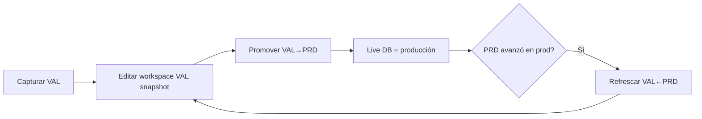
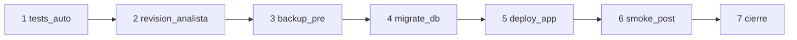

# Activación VAL → PRD por cliente

> Procedimiento funcional para analistas. Código: `lib/ops/entorno-sync-service.ts`, UI: `/claver-cloud/operations/{empresaId}`.

## Entornos lógicos

| Código | URL típica | Uso |
|--------|------------|-----|
| `dev` | `dev.{app}` | Parametrización analista |
| `val` | `val.{app}` | UAT cliente, AFIP homologación |
| `prd` | `{app}` | Operación real |

Se crean juntos en provisioning: `ensureTenantEntornos(empresaId)`.

## Flujo completo

```mermaid
flowchart TB
  subgraph F0["CCA-030 Provisioning"]
    P[/claver-cloud/provisioning/new]
    P --> E[Empresa + admin + entornos dev/val/prd]
    E --> M[entornoAfip = homologacion]
  end
  subgraph F1["CCA-040 / 060 en VAL"]
    O[/dashboard/onboarding]
    O --> CAP[Capturar snapshot VAL]
    CAP --> UAT[UAT + acta]
  end
  subgraph F2["Promoción a PRD"]
    PROM[Promover VAL→PRD]
    PIPE[Pipeline ops: tests → backup → migrate → deploy → smoke → cierre]
    CERT[Cert AFIP producción manual]
    AFIP[Empresa.entornoAfip = produccion]
  end
  subgraph F3["Mantenimiento"]
    REF[Refrescar VAL←PRD]
  end
  E --> O
  UAT --> PROM --> PIPE --> CERT --> AFIP
  AFIP --> REF
```

## Sincronización de configuración (analista)



| Acción | API | Efecto |
|--------|-----|--------|
| Capturar VAL | `POST .../sync { action: capture, codigo: val }` | Snapshot en metadata |
| Promover | `POST .../sync { action: promote_val_prd }` | Aplica VAL a live DB |
| Refrescar | `POST .../sync { action: refresh_val_from_prd }` | Copia prod → VAL sin tocar live |

## Pipeline VAL→PRD (7 pasos)



Pasos con job automático: 1, 3, 4, 5, 6. Pasos humanos: 2, 7.

## Checklist go-live (resumen)

- [ ] Acta UAT firmada (CCA-060)
- [ ] Snapshot VAL capturado
- [ ] Promover VAL→PRD o sync manual validado
- [ ] Pipeline completado sin rechazo
- [ ] Certificado AFIP producción cargado
- [ ] `entornoAfip = produccion` (dispara CCA-070 automático)
- [ ] Primera venta supervisada

## Referencias

- [CCA completo](../../content/docs/operaciones/claver-cloud-proceso-implementacion.mdx)
- [00-ciclo-completo](../marketplace/00-ciclo-completo.md)