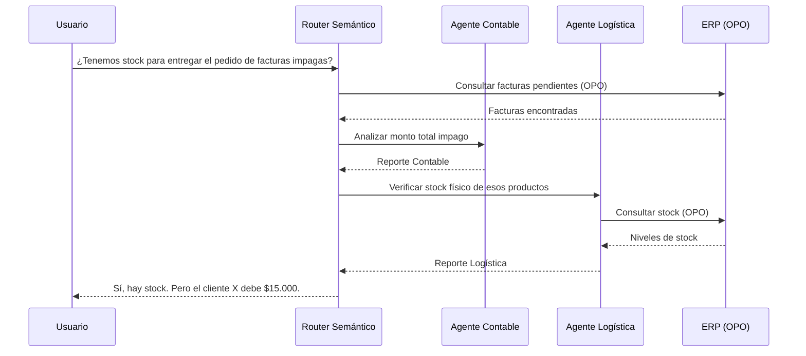

# Cognitive Mesh (Malla Cognitiva)

La **Malla Cognitiva (Cognitive Mesh)** es el motor de orquestación y paso de contexto en tiempo real que implementa OPO. 

A diferencia de las arquitecturas de agentes tradicionales que operan en hilos aislados o en flujos lineales rígidos, el Cognitive Mesh permite que múltiples agentes especializados colaboren dinámicamente compartiendo un **entendimiento semántico unificado** del negocio.

---

## Limitaciones de los Agentes Tradicionales

En los frameworks convencionales de agentes (ej. CrewAI o AutoGen):
- Cada agente suele gestionar su propio historial de chat (contexto).
- Cuando un agente le pasa una tarea a otro (handover), suele transferir texto plano o resúmenes ambiguos.
- No hay garantía de que dos agentes interpreten una entidad (como un `Pedido`) de la misma manera si consumen diferentes endpoints.

## Cómo soluciona esto el Cognitive Mesh

El Mesh introduce una capa de memoria y enrutamiento centralizada:

1. **Estado Semántico Compartido:** Todos los agentes leen el mismo mapa de datos (el manifiesto OPO). Si el Agente Logístico habla de un `Product`, el Agente Financiero entiende exactamente a qué modelo de datos se refiere.
2. **Enrutamiento Inteligente (Semantic Routing):** OPO Studio incluye un Router que analiza la consulta inicial del usuario y decide qué agente es el más idóneo para resolver cada paso, o si necesita lanzar una sub-consulta en paralelo.
3. **Paso de Contexto (Handover) Estructurado:** En lugar de pasarse resúmenes de texto informales, los agentes se transmiten fragmentos JSON con tipos de datos definidos por el estándar OPO (ej: pasar una entidad `Invoice` tipada).

---

## Control en Tiempo Real

El Cognitive Mesh no es una "caja negra". OPO Studio provee un panel de visualización en tiempo real (`MeshPanel`) donde los analistas pueden auditar el flujo de pensamiento de la malla:
- Ver qué agente tiene el control del token en cada segundo.
- Inspeccionar las queries OPOQL generadas hacia la base de datos.
- Pausar la ejecución para requerir aprobación humana (Human-in-the-loop) antes de realizar acciones en el ERP real.
