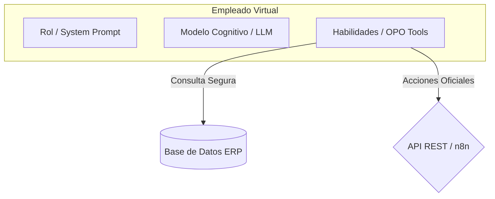

# Empleados Virtuales (Agentes Cognitivos)

En OPO Studio, un agente de IA no es solo un chat o un script automatizado; lo diseñamos bajo el concepto de un **Empleado Virtual**. 

Un Empleado Virtual es un agente autónomo o semiautónomo al que se le asigna un rol específico dentro de la empresa, configurado con un modelo de lenguaje (LLM), instrucciones claras de comportamiento (System Prompt) y un conjunto de **Habilidades** (Tools de lectura y escritura en los sistemas ERP).

---

## Anatomía de un Empleado Virtual

Para crear un Empleado Virtual en OPO Studio, configuras tres componentes:

1. **Cerebro (LLM Provider):** Puedes elegir entre modelos locales como Llama 3 o Qwen (corriendo en Ollama para máxima privacidad y coste cero) o modelos en la nube como GPT-4o, Gemini 1.5 Pro o Claude 3.5 Sonnet.
2. **Personalidad e Instrucción (Prompt de Sistema):** Define sus límites y lógica de negocio. Por ejemplo: *"Eres el Auditor Contable de la empresa. Tu deber es buscar inconsistencias en facturas y reportarlas. Nunca apruebes un pago mayor a $5.000 sin confirmación de un supervisor."*
3. **Habilidades (Tools):** Es el acceso controlado que el empleado tiene a la base de datos de tu empresa. El mapeo semántico de OPO expone estas tablas como funciones simples: `buscar_clientes()`, `obtener_facturas()`, `actualizar_stock()`.

---

## Roles Prediseñados (Plantillas)

OPO Studio incluye una galería de plantillas para instanciar rápidamente agentes listos para el trabajo:

### 🔍 Auditor Contable
* **Habilidades principales:** Consulta de la entidad `Invoice`, cruce con la entidad `Payment`, acceso a tablas de impuestos.
* **Función:** Detectar automáticamente facturas vencidas, clientes morosos o cobros mal imputados.

### 📦 Analista de Inventario
* **Habilidades principales:** Consulta de las entidades `Product` y `Stock`, cruce con movimientos de pedidos (`SalesOrder`).
* **Función:** Analizar el ritmo de ventas de cada producto y alertar antes de que ocurra un quiebre de stock, sugiriendo las cantidades óptimas a reponer.

### 🏦 Conciliador Bancario
* **Habilidades principales:** Lectura de resúmenes bancarios externos (APIs) y coincidencia con la entidad `Payment` del ERP.
* **Función:** Realizar el punteo de cuentas a primera hora del día, automatizando el 95% del trabajo rutinario de tesorería.

### 📄 Asistente de Data Entry (Carga de Facturas)
* **Habilidades principales:** Procesamiento de documentos (OCR / Visión) y ejecución de APIs de creación de entidades.
* **Función:** Leer facturas en PDF que llegan a un buzón de correo electrónico, extraer los datos del emisor, montos e ítems, y cargarlos en borrador dentro de la tabla de compras del ERP respetando las validaciones.

---

## Seguridad y Human-in-the-Loop (Aprobación Humana)

OPO Studio implementa por diseño medidas de protección estrictas:
- **Lecturas directas (SQL):** El empleado virtual puede realizar consultas masivas rápidas a la base de datos a través de OPOQL de forma segura porque la conexión SQL se fuerza a ser **solo-lectura (Read-Only)**.
- **Acciones de impacto (Escritura):** Para crear registros o modificar estados, el agente no escribe en la base de datos de forma directa. En su lugar, el flujo de OPO lo obliga a gatillar un endpoint REST validado o a enviar la propuesta a un nodo de **Aprobación Humana (n8n)**, asegurando que un operador valide la acción antes de que toque el sistema de producción.
