# Ontología Empresarial

El concepto central de OPO se basa en la **Ontología Empresarial**, una idea fuertemente inspirada en plataformas de datos de clase mundial como *Palantir Foundry*. 

Una ontología es la representación digital y semántica del negocio. No es una base de datos más, sino un **gemelo digital** que traduce las tablas físicas y relaciones crudas a conceptos lógicos que los humanos y las Inteligencias Artificiales pueden entender y operar fácilmente.

```mermaid
graph LR
    SubGraph1[ERP Crudo] -->|Mapeo Semántico| SubGraph2[Ontología OPO]
    SubGraph2 -->|Contexto Inteligente| SubGraph3[Agente de IA]
    
    style SubGraph1 fill:#1f2937,stroke:#374151
    style SubGraph2 fill:#0f172a,stroke:#10b981
    style SubGraph3 fill:#1e1b4b,stroke:#8b5cf6
```

---

## De Tablas Físicas a Entidades Semánticas

Tradicionalmente, las bases de datos de los ERPs se diseñaban con restricciones físicas extremas (por ejemplo, nombres de 8 caracteres en sistemas heredados) o abreviaciones alemanas/portuguesas que dificultan su integración directa.

OPO traduce este caos estructural a una capa lógica limpia:

| Base de Datos (Física) | Ontología OPO (Semántica) | Descripción de Negocio |
| :--- | :--- | :--- |
| `SA1010` (Protheus) / `KNA1` (SAP) | `Customer` | Clientes de la empresa |
| `SF2010` (Protheus) / `VBRK` (SAP) | `Invoice` | Facturas de venta emitidas |
| `SB1010` (Protheus) / `MARA` (SAP) | `Product` | Productos en el catálogo |

---

## Por qué es fundamental para la Inteligencia Artificial

Los Modelos de Lenguaje (LLMs) son excelentes analizando texto, pero carecen de información previa sobre la estructura interna de la base de datos de tu empresa. 

Si le pides a una IA:
> *"Busca el saldo pendiente del cliente Juan Pérez"*

Sin una ontología, la IA tendría que:
1. Intentar descubrir en qué tabla se guardan los clientes.
2. Adivinar que el campo de saldo es `A1_SALDO` o `KNA1-UMSAT`.
3. Escribir una query SQL compleja a ciegas, con alta probabilidad de fallar (alucinación).

**Con OPO:**
El Agente de IA lee el manifiesto de la ontología y ve de inmediato que existe una entidad `Customer` con el atributo `balance` y `name`, mapeados por detrás a los campos reales. La IA solo tiene que solicitar la información de `Customer` y OPO se encarga de la traducción y consulta exacta de forma transparente.

---

## La Declaración de la Ontología (`opo.json`)

Toda esta traducción se escribe en un manifiesto estándar JSON que se aloja en el servidor en la ruta `/.well-known/opo.json`. Este archivo describe:
- Qué entidades existen.
- Qué atributos tiene cada entidad.
- Cómo se relacionan entre sí (por ejemplo, que una `Invoice` pertenece a un `Customer`).

Al estandarizar esta capa de datos, cualquier software o agente compatible con el protocolo OPO puede "enchufarse" a tu ERP y empezar a interactuar en segundos, eliminando el 90% del trabajo manual de integración.
