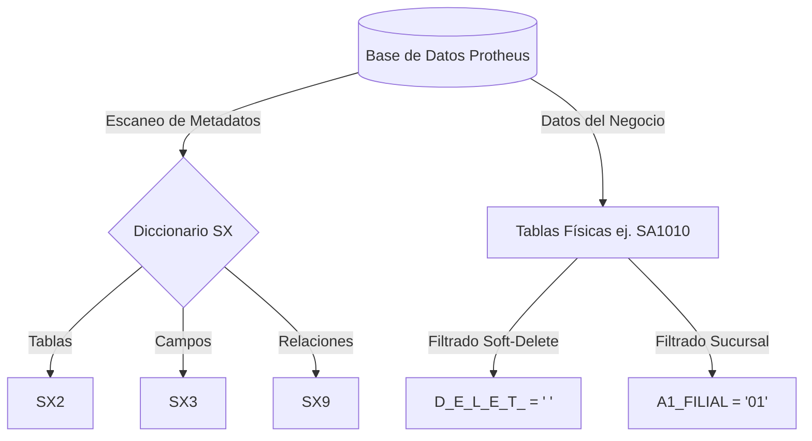

# Guía del Adaptador: TOTVS Protheus

**API:** REST API (AdvPL TLPP) / Conexión SQL Directa | **Dificultad:** Media | **Setup:** ~30 min

El adaptador OPO para **TOTVS Protheus** actúa como un puente semántico entre los estándares de Inteligencia Artificial moderna y el framework de base de datos propietario de TOTVS (AdvPL/TLPP). Permite traducir las crípticas tablas relacionales (como `SA1`, `SA2`, `SF2`) a esquemas JSON estándar y legibles por cualquier agente cognitivo.

---

## Particularidades de la Arquitectura Protheus

Protheus es un ERP diseñado en los años 80 y 90, lo que significa que arrastra una serie de patrones de diseño específicos que OPO Studio debe resolver para garantizar la correctitud de los datos:

---

## 1. El Diccionario de Datos (Tablas SX)

En lugar de delegar la estructura de la base de datos al motor SQL (como Postgres o SQL Server), Protheus gestiona su propio "Diccionario de Datos" interno a través de tablas del sistema que empiezan con `SX`. 

El autodescubrimiento de OPO consulta directamente estas tablas para armar la ontología sin requerir que la IA adivine el esquema:

*   **`SX2` (Diccionario de Tablas):** Lista todas las tablas registradas en el ERP (ej: `SA1` es Clientes, `SB1` es Productos) y define si son compartidas o exclusivas por sucursal.
*   **`SX3` (Diccionario de Campos):** Define todas las columnas físicas de cada tabla, sus tipos de datos, descripciones, y si son campos obligatorios.
*   **`SX9` (Diccionario de Relaciones):** Guarda las conexiones lógicas entre tablas. Este archivo es vital porque **Protheus no utiliza Foreign Keys físicas a nivel de base de datos (SQL)**. Las relaciones se definen únicamente a nivel de aplicación en la tabla `SX9`.

---

## 2. Gestión de Borrado Lógico (`D_E_L_E_T_`)

Protheus **nunca realiza un borrado físico (`DELETE`)** en sus registros. En su lugar, aplica un borrado lógico (*soft-delete*):

- Cuando un usuario borra una factura, el sistema coloca un asterisco `*` en la columna especial `D_E_L_E_T_`.
- Los registros activos tienen el campo `D_E_L_E_T_` vacío (`' '`).

> [!CAUTION]
> **Bug de Consulta Crítico:**
> Si escribes consultas SQL directas o dejas que una IA consulte la base de datos sin considerar esto, se retornarán facturas y clientes eliminados. 
> El motor `sqlTranslator.ts` de OPO inyecta de forma automática la regla `WHERE D_E_L_E_T_ = ' '` en cada consulta de lectura.

---

## 3. Gestión de Sucursales (Filiales) e `X2_MODO`

Protheus está diseñado para ser multi-empresa y multi-sucursal.
- Cada tabla física lleva el código de sucursal en el nombre (ej: `SA1010` para la empresa 01, sucursal 0).
- Cada registro contiene una columna de filial (ej: `A1_FILIAL`).
- El campo `X2_MODO` de la tabla `SX2` indica si la tabla es **Compartida** (`C`, todos los registros son visibles para todas las sucursales) o **Exclusiva** (`E`, cada sucursal solo lee sus propios registros).

El traductor de OPO valida `X2_MODO` y auto-inyecta el filtro de `FILIAL = <sucursal_actual>` para garantizar que la IA no mezcle datos de diferentes sucursales físicas.

---

## Mapeo de Entidades Comunes

| Entidad OPO | Tabla Protheus | Mapeo de Campos |
| :--- | :--- | :--- |
| `Customer` (Cliente) | `SA1` | `A1_COD` → `id` `A1_NOME` → `name` `A1_SALDUP` → `outstandingBalance` |
| `Supplier` (Proveedor) | `SA2` | `A2_COD` → `id` `A2_NOME` → `name` |
| `Product` (Producto) | `SB1` | `B1_COD` → `id` `B1_DESC` → `description` |
| `Invoice` (Factura Venta) | `SF2` | `F2_DOC` → `id` / `number` `F2_EMISSAO` → `issueDate` `F2_VALBRUT` → `grandTotal` |
