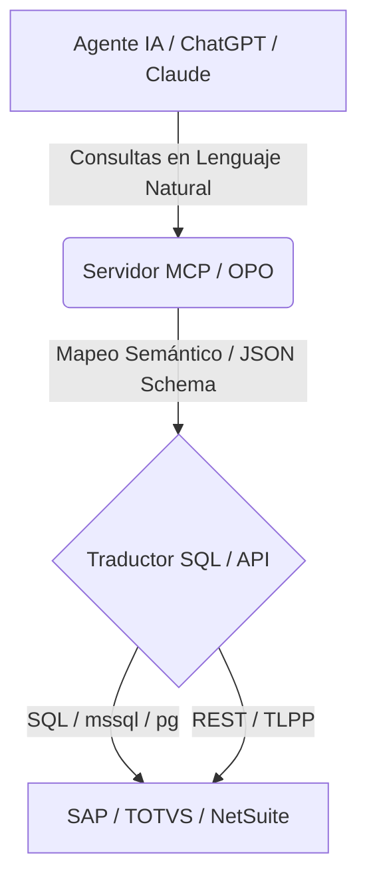

# Introducción a OPO (Open Protocol Ontology)

**Open Protocol Ontology (OPO)** es una capa semántica de código abierto y un estándar universal diseñado para que las Inteligencias Artificiales (LLMs, agentes autónomos y orquestadores) puedan interactuar directamente con sistemas de gestión empresarial (ERP, WMS, CRM).

OPO actúa como un **traductor universal** entre las complejas bases de datos corporativas y los agentes cognitivos.

## El Problema

Los sistemas de gestión empresarial (ERPs) son notoriamente difíciles de integrar. Tienen miles de tablas con nombres oscuros o legados (como `SA1` para Clientes o `SF2` para Facturas de Venta en Protheus/TOTVS). 

Cuando intentas conectar un Agente de IA a un ERP:
1. **Falta de Contexto:** El agente no sabe qué significa `sf2010`.
2. **Consultas Complejas:** Generar queries SQL a mano es propenso a errores y alucinaciones.
3. **Seguridad y Reglas de Negocio:** La IA podría saltearse disparadores, validaciones de stock o insertar datos inconsistentes directamente en las tablas.

## La Solución: OPO

OPO resuelve esto mediante tres pilares:
1. **Un Vocabulario Común:** Mapea la terminología de cualquier ERP a un estándar legible por máquinas (ej: `Invoice`, `Customer`, `Product`).
2. **Auto-Descubrimiento:** Escanea los diccionarios internos de bases de datos para entender automáticamente las relaciones entre tablas (ej: usando la tabla `SX9` en Protheus).
3. **Interfaces Seguras:** Ofrece traducción SQL inteligente en solo-lectura y rutea mutaciones a través de APIs REST validadas por el ERP.

## OPO Studio

Para facilitar esto a los consultores funcionales y analistas de negocio, **OPO Studio** proporciona un lienzo visual interactivo donde puedes diseñar ontologías y ensamblar **Empleados Virtuales** (agentes IA con habilidades específicas) sin escribir código.

¿Listo para empezar? Explora los [Conceptos Clave](/docs/conceptos/ontologia-empresarial) para entender cómo funciona la ontología empresarial.
