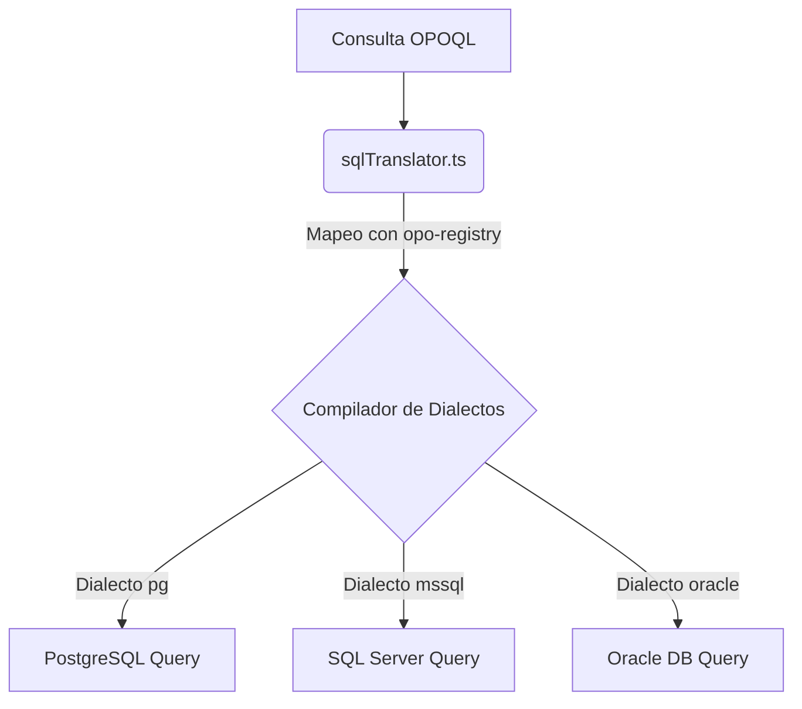

# Traductor de OPO a SQL (`sqlTranslator.ts`)

El componente **`sqlTranslator.ts`** es el núcleo de traducción del protocolo OPO. Se encarga de tomar consultas semánticas declarativas (OPOQL) y compilarlas en tiempo de ejecución a consultas SQL nativas y seguras, compatibles con el motor de base de datos del ERP de destino.

---

## Estructura del Traductor

El traductor expone dos funciones principales en la API del CLI y Studio:

1. **`translateOpoToSql(opoQuery, dictionary)`**: Traduce una consulta de lectura (Select) a SQL.
2. **`translateOpoMutationToSql(opoMutation, dictionary)`**: Traduce una mutación (Insert, Update, Delete) a SQL.

---

## Funcionalidades Clave

### 1. Paginación Basada en Cursor (Cursor-Based Pagination)
El traductor evita la paginación tradicional `LIMIT/OFFSET` (que es ineficiente en bases de datos gigantes de ERP) y utiliza una paginación basada en cursor codificado en Base64:
- Decodifica el cursor del cliente para extraer el `offset` y límite físico de la query.
- Devuelve la consulta SQL optimizada junto con la estructura para calcular el siguiente cursor de la página.

### 2. Parseo de Nodos de Filtros (`parseFilterNode`)
El traductor evalúa recursivamente árboles de condiciones lógicas (`AND`, `OR`, `NOT`) y mapea los operadores semánticos a sintaxis SQL nativa de forma segura utilizando **Consultas Parametrizadas (Prepared Statements)** para evitar inyección SQL:

- `eq` $\rightarrow$ `=`
- `neq` $\rightarrow$ `!=`
- `like` $\rightarrow$ `LIKE`
- `in` $\rightarrow$ `IN (?, ?, ?)`

### 3. Inyección Automática de Reglas ERP (Soft-Delete y Filiales)
Cuando el traductor detecta que el sistema de destino es **TOTVS Protheus**, aplica reglas automáticas de correctitud de datos sobre la consulta compilada:
*   **Filtro de Registro Eliminado:** Inyecta automáticamente `AND D_E_L_E_T_ = ' '` en las cláusulas `WHERE`.
*   **Filtro de Sucursal (Filial):** Consulta el estado de la tabla (`X2_MODO`) y, si es exclusiva, inyecta `AND FILIAL = ?` pasando el código de sucursal activo en los parámetros del query.
*   **Evita Mutaciones Directas:** En caso de recibir mutaciones (`CREATE/UPDATE`) para tablas restringidas, el traductor aborta la compilación SQL y arroja una excepción, obligando a la IA a consumir el endpoint REST del ERP para resguardar las reglas de negocio.
