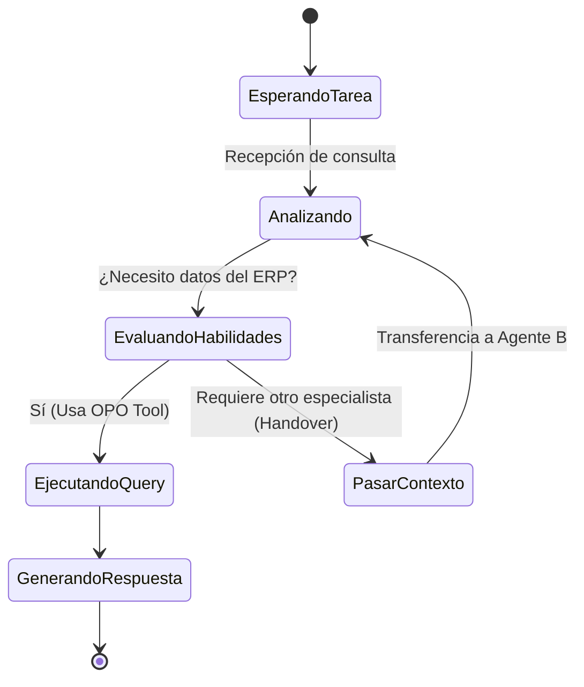

# Configuración de Agentes e Hilos de Trabajo (Swarm)

En OPO Studio, la resolución de tareas complejas no recae en un único agente gigante. En su lugar, promovemos el uso de un **Enjambre de Agentes (Swarm)**: un grupo de "Empleados Virtuales" hiper-especializados en un solo rol que colaboran y se pasan el trabajo entre sí.

---

## Configuración de un Empleado Virtual

Al seleccionar un `AgentNode` (Empleado Virtual) en el canvas, puedes configurar sus propiedades cognitivas en el panel derecho:

1. **System Prompt (Instrucción de Sistema):** Define su identidad, alcance y reglas de conducta.
   * *Ejemplo:* `"Eres un Analista Contable. Analiza las facturas impagas del cliente solicitado y genera un reporte detallado. Si la deuda supera los $10.000, marca el reporte como URGENTE. No respondas sobre otros temas."`
2. **Proveedor del Modelo (LLM Provider):**
   * **Ollama:** Ejecuta modelos locales y privados (ej. Llama 3, Qwen) en tu propia máquina de forma gratuita y segura.
   * **OpenAI:** Modelos GPT-4o o GPT-4o-mini (requiere cargar tu API Key).
   * **Google:** Modelos Gemini 1.5 Pro o Flash (requiere cargar tu API Key).
   * **Anthropic:** Modelos Claude 3.5 Sonnet (requiere cargar tu API Key).
3. **Capabilities (Habilidades Asignadas):** Las acciones o consultas que este agente tiene permiso para ejecutar. Se habilitan automáticamente al conectar un nodo de tipo `ToolNode` (Habilidad) al agente mediante una línea en el canvas.

---

## Cómo opera el Enjambre (Swarm Execution)

Cuando envías una tarea a la Malla Cognitiva, el sistema activa un flujo colaborativo:

* **Paso 1: Análisis Semántico:** El Router analiza la solicitud y la deriva al agente más calificado.
* **Paso 2: Delegación (Handover):** Si el agente contable detecta que la duda del usuario requiere verificar el estado físico de un paquete en el depósito, en lugar de intentar responder a ciegas o fallar, "transfiere" el control del hilo de ejecución al *Analista de Inventario*, pasándole la entidad `Product` y el ID del pedido en formato estructurado.
* **Paso 3: Consolidación:** El último agente en la cadena toma el contexto consolidado de sus compañeros y genera la respuesta final para el usuario.
* **Seguridad:** En todo momento, las queries de base de datos se ejecutan en modo **solo-lectura** y cualquier cambio en los sistemas se realiza a través de APIs controladas.
