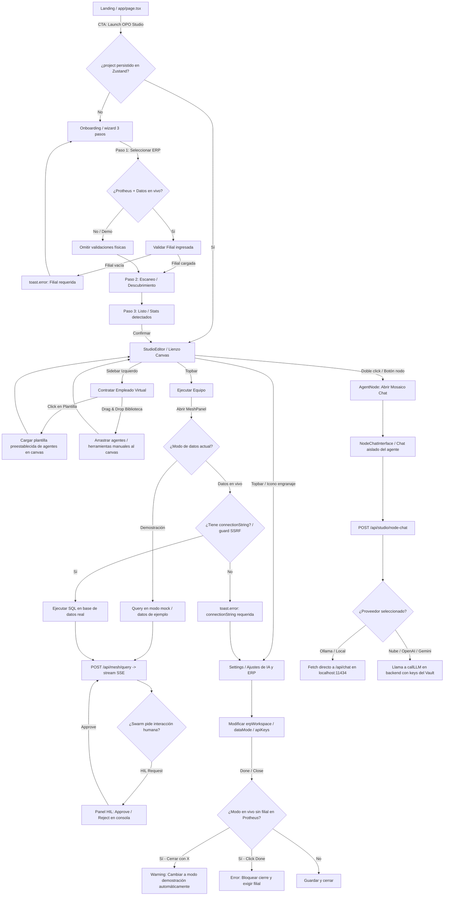

# Flujo de Usuario Completo y Auditoría de Integración

Este documento detalla el recorrido funcional completo que realiza un **Consultor Funcional** o **Analista de Negocio** en **OPO Studio**, mapeando el flujo desde la landing de bienvenida hasta la ejecución del equipo (Swarm) en modo demostración o en vivo con Ollama.

---

## 🗺️ Diagrama del Flujo End-to-End

A continuación se presenta el mapa del flujo del sistema auditado en el código. Cada enlace y decisión ha sido verificado para reflejar el estado actual de la implementación:

### Código de Estado del Diagrama
*   **✅ Funciona hoy:** Todos los caminos principales descritos en el diagrama están completamente implementados y funcionales.
*   **⚠️ Funciona con fricción:** 
    *   *Configuración de Ollama:* Si se selecciona Ollama pero no se inicializa la URL en Settings, el chat de nodo y el mesh fallan silenciosamente o tiran error (falta auto-configurar `http://localhost:11434` en el estado inicial del store).
    *   *Canvas vacío:* Si se elige "Proyecto en blanco" en el onboarding, el canvas queda vacío y no hay una guía visual interactiva que dirija al usuario a contratar un empleado del sidebar izquierdo.
*   **❌ Roto o no implementado:**
    *   *Localhost en Docusaurus:* El enlace a los docs de CLI/SDK en la barra lateral apunta fijamente a `http://localhost:3002`, lo que causa enlaces rotos en producción.

---

## 📖 Guía Paso a Paso para el Consultor Funcional

### 1. Desde la Bienvenida al Lienzo (Landing → Studio)
Al hacer clic en **"Launch OPO Studio"**, el sistema evalúa si tienes un proyecto activo. Si es tu primera visita, se iniciará el asistente de Onboarding. 
*   *Modo Experto:* Al final de la pantalla de bienvenida tienes un acordeón para cargar de inmediato la estructura local del proyecto desde tu workspace (`.well-known/opo.json`) o cargar el baseline de desarrollo de Protheus.

### 2. Conexión de Datos (Demo vs Live)
*   **Demostración:** Si dejas la cadena de conexión vacía, OPO Studio simulará las tablas principales del ERP. No se requiere conexión a internet ni credenciales reales.
*   **Datos en Vivo:** Si colocas la cadena de conexión de tu base de datos (Postgres, Oracle, SQL Server), OPO Studio leerá el catálogo físico del ERP para inferir la estructura organizativa de tu negocio. Si usas **TOTVS Protheus**, es obligatorio rellenar el campo **Filial** (ej: `01`) para permitir la inyección de seguridad en el traductor SQL.

### 3. Contratación de Empleados Virtuales (Galería)
Una vez en el lienzo (`StudioEditor`), contrata tu equipo utilizando el sidebar izquierdo:
*   **Desde la galería:** Selecciona una plantilla predefinida (ej: *Auditor Contable*). Con un solo clic, se agregarán los agentes cognitivos específicos y sus herramientas mapeadas al canvas de ReactFlow.
*   **Manual (Drag & Drop):** Arrastra agentes manuales, bases de datos o automatizaciones n8n directamente al lienzo.

### 4. Ejecución del Swarm en la Malla Cognitiva (Mesh)
Haz clic en **"Ejecutar Equipo"** en la barra superior para abrir la consola de la malla cognitiva (`MeshPanel`):
*   Elige uno de los reportes estándar (Chips) o escribe una orden en lenguaje natural.
*   El orquestador central analizará la intención, armará un pipeline de ejecución y delegará la tarea a los agentes en paralelo.
*   **Human-in-the-Loop (HIL):** Si un agente requiere aprobación (por ejemplo, para confirmar un descuento crítico en una factura), la consola pausará la ejecución y te mostrará los botones de **Aprobar** o **Rechazar** en tiempo real.

### 5. Configuración de IA y Mosaico de Chats
*   **Chat del Nodo (Aislado):** Haz clic en el icono de mensaje de cualquier agente en el canvas. Se desplegará un chat interactivo dentro del nodo. Este chat es ideal para probar al agente de forma individual o darle instrucciones personalizadas.
*   **Ajustes Globales (Settings):** Gestiona tus API keys o conéctate de forma local a **Ollama** con un solo clic. Las claves de la nube se guardan en el Vault del servidor seguro (`/api/vault`) de forma encriptada, eliminando el riesgo de que viajen en texto plano por la red del navegador.

---

## 📋 Matriz de Acciones de Negocio

Si necesitas lograr un objetivo concreto, sigue esta guía rápida:

| Si querés... | Hacé esto... | Botón / Elemento |
| :--- | :--- | :--- |
| **Simular datos Protheus sin configurar conexión** | Iniciá el onboarding, seleccioná Protheus y dejá vacío el campo URL. | **"Analizar mi sistema"** (Paso 1) |
| **Modificar la filial de Protheus post-onboarding** | Abrí los ajustes generales del lienzo. | Icono de **Engranaje** (Topbar) $\rightarrow$ Input **Filial** |
| **Agregar un auditor de inventario al lienzo** | Buscá plantillas en la sección superior del sidebar izquierdo. | Plantilla **"Auditor de Inventario"** |
| **Ejecutar una consulta recurrente de negocio** | Abrí el panel Mesh y selecciona una plantilla de reporte. | **"Ejecutar Equipo"** $\rightarrow$ Chip **"Invoices fuera de término"** |
| **Darle instrucciones específicas a un solo agente** | Hacé clic en el icono de chat en la cabecera del nodo del agente. | Icono **MessageSquare** (Nodo de Agente) |
| **Aprobar una transacción detenida por el Swarm** | Observá el log interactivo cuando la ejecución se detenga. | Botón **"Approve"** (Mesh Console) |
| **Generar el servidor MCP para Claude Desktop** | Compilá tu ontología visual del canvas en un endpoint portable. | Menú de tres puntos $\rightarrow$ **"Crear Empleado Virtual (exportar)"** |

---

## 🛠️ Resolución de Problemas (Troubleshooting)

### 🔴 Ollama no responde
*   **Causa:** Ollama no está iniciado, no se ha descargado el modelo, o no se ha configurado la URL en Ajustes.
*   **Solución:** 
    1. Asegúrate de que Ollama está corriendo en tu máquina ejecutando `ollama list` en tu terminal.
    2. Descarga el modelo configurado (por ejemplo, `ollama run llama3.1`).
    3. Abre el modal de configuración en el Studio y haz clic en **"Quick-connect running Ollama"** para configurar automáticamente el puerto `11434`.

### 🟡 Error: "Filial requerida para consultas Protheus en vivo"
*   **Causa:** Estás en modo de datos en vivo (`live`) en Protheus, pero no has especificado qué sucursal/filial filtrar.
*   **Solución:** Abre **Settings** (Engranaje) $\rightarrow$ Sección **ERP Workspace Connection** $\rightarrow$ Rellena el campo **Filial** con la sucursal correcta (ej. `01`). Si deseas probar sin base de datos real, cambia el toggle a **Demostración**.

### ⚪ Las claves de la nube (Gemini, Claude, GPT) fallan
*   **Causa:** La API key no ha sido introducida o no está guardada en el Vault del servidor.
*   **Solución:** Introduce tu clave de API en el modal de configuración y haz foco fuera del input (Blur). El sistema llamará al endpoint seguro `/api/vault` para persistirla en el servidor de desarrollo local de manera encriptada. Puedes validar el estado en la lista **"Server Vault Keys"** dentro del mismo modal.
