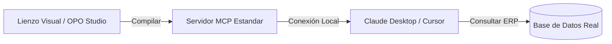

# Generación de Servidor MCP (Model Context Protocol)

El principal canal de salida de OPO Studio es la capacidad de exportar todo tu mapa de conocimiento visual a un **Servidor MCP (Model Context Protocol)** estándar listo para usar.

MCP es el protocolo abierto diseñado por Anthropic que permite a las aplicaciones de IA (como Claude Desktop, Cursor IDE o Zed) conectarse de forma segura a fuentes de datos locales o remotas y ejecutar herramientas.



---

## Cómo compilar tu Servidor MCP

En la barra superior de OPO Studio (`Topbar`), verás el botón **"Generar MCP"**. Al hacer clic:

1. **Compilación de Ontología:** El compilador de OPO toma todos tus nodos de entidad (`EntityNode`), habilidades (`ToolNode`) y relaciones del canvas.
2. **Generación de Código:** Genera una estructura de servidor MCP en TypeScript que incluye:
   - Configuración de Prisma para la conexión a la base de datos (con las queries optimizadas generadas por `sqlTranslator`).
   - Las declaraciones de herramientas (Tools) estándar que describe el manifiesto OPO.
3. **Guardado en Workspace:** Escribe el servidor compilado directamente dentro de la carpeta `dist/` o la ruta local de tu proyecto.

---

## Cómo conectar el servidor a Claude Desktop

Para que la aplicación de escritorio oficial de Claude (Anthropic) pueda consumir tu ERP mapeado con OPO:

1. Genera el servidor MCP haciendo clic en el botón de OPO Studio.
2. Abre el archivo de configuración de Claude Desktop:
   - En Windows: `%APPDATA%\Claude\claude_desktop_config.json`
   - En macOS: `~/Library/Application Support/Claude/claude_desktop_config.json`
3. Agrega la configuración del servidor OPO indicando la ruta de ejecución. Por ejemplo:

```json
{
  "mcpServers": {
    "opo-protheus-server": {
      "command": "node",
      "args": ["C:/ruta/a/tu/proyecto/dist/index.js", "mcp-start"]
    }
  }
}
```

4. Reinicia la aplicación Claude Desktop. Verás un icono de **Enchufe (Plug)** que indica que Claude se ha conectado al servidor local de OPO.
5. ¡Empieza a chatear! Puedes escribirle a Claude: *"Mostrame las facturas pendientes de cobro del cliente SA1010"* y Claude ejecutará la consulta a tu base de datos local en tiempo real usando tu servidor MCP.
