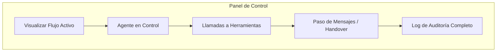

# Monitor de Malla en Tiempo Real (Mesh Panel)

Para evitar que los sistemas multi-agente operen como una "caja negra" inescrutable, OPO Studio incorpora el **Mesh Panel (Monitor de la Malla)**.

Este componente visual te permite observar y auditar en tiempo real cómo interactúan los agentes de IA, qué herramientas ejecutan y cómo se transmiten los datos a medida que se procesa un flujo de trabajo.

---

## Elementos del Panel de Control

El Mesh Panel se compone de cuatro zonas clave para el seguimiento de la ejecución:

### 1. Indicador del Agente Activo (Token Holder)
Muestra una tarjeta destacada con el Empleado Virtual que tiene el control actual del proceso de razonamiento.
* El nodo del agente se ilumina en el lienzo principal con un borde violeta parpadeante.
* Muestra el LLM que está procesando y cuántos pasos lleva ejecutados.

### 2. Log de Eventos y Herramientas
Un feed detallado en tiempo real que registra cada acción atómica:
* `[Router]` derivando la consulta al *Auditor Contable*.
* `[Auditor]` llamando a la habilidad `get_invoice_by_id` con el parámetro `{ id: 1004 }`.
* `[Base de Datos]` retornando JSON de respuesta con 0.4s de latencia.

### 3. Visualización del Handover (Traspaso de Control)
Cuando un agente le pasa el control a otro, el panel dibuja una línea temporal clara indicando qué información y qué entidades de datos se transfirieron (ej: *"El Agente A le transfirió el control al Agente B adjuntando la entidad Cliente"*).

### 4. Consola de Respuestas Parciales
A medida que los agentes generan borradores de texto o respuestas estructuradas intermedias, el panel te permite previsualizar los resultados antes de la finalización del flujo.

---

## Importancia de la Auditoría en Producción

El Mesh Panel no es solo una herramienta visual vistosa; es fundamental para:
* **Debugging:** Identificar rápidamente si un agente entró en un bucle infinito de consultas o si una herramienta retornó un error de base de datos.
* **Seguridad:** Confirmar que los agentes solo están accediendo a los datos permitidos por la ontología.
* **Optimización de Tokens:** Analizar qué pasos del proceso consumieron más tokens y optimizar los System Prompts en consecuencia.
