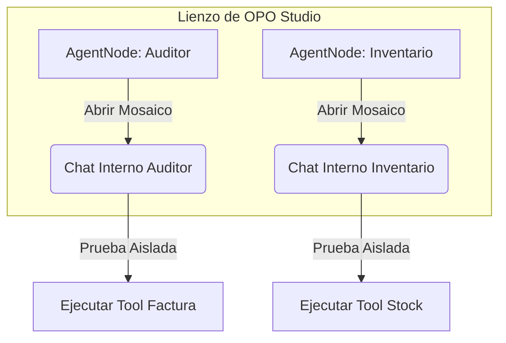

# El Mosaico de IA (NodeChatInterface)

Una de las características más potentes y distintivas de OPO Studio es la capacidad de interactuar con tus agentes mediante la **Vista de Mosaico (Mosaic View)**.

En lugar de tener una única ventana de chat global genérica, cada `AgentNode` (tarjeta de Empleado Virtual en el lienzo) contiene una interfaz de chat embebida que se puede expandir y contraer de forma independiente.

---

## Cómo usar el Mosaico

1. **Abrir el Chat:** En cualquier nodo de tipo *Empleado Virtual* (`AgentNode`), verás un icono de **Mensaje (`MessageSquare`)** en la esquina superior derecha de su cabecera. Haz clic allí.
2. **Expansión del Nodo:** La tarjeta del nodo se ampliará automáticamente hacia abajo en el lienzo, revelando una interfaz de chat completa con un historial de conversación, un campo de texto y un botón de envío.
3. **Múltiples Chats Simultáneos:** Puedes abrir los chats de varios agentes al mismo tiempo. Esto te permite tener, por ejemplo, al *Auditor Contable* y al *Analista de Inventario* abiertos en paralelo en la misma pantalla.

---

## Ciclo de Ejecución de Pruebas

Cuando escribes un mensaje en el chat de un nodo en modo mosaico, se ejecuta el siguiente flujo:

* **Paso 1: Captura de Contexto:** La interfaz lee las Habilidades (`Tools`) que tienes conectadas físicamente a ese agente en el canvas.
* **Paso 2: Prompt dinámico:** Se le inyecta al modelo seleccionado su System Prompt junto con la descripción de las herramientas a las que tiene acceso.
* **Paso 3: Llamada a Herramientas (Tool Calling):** Si le pides al agente un dato del ERP, el chat mostrará un indicador visual animado indicando qué herramienta está ejecutando (ej: `Llamando a get_invoice_by_id...`).
* **Paso 4: Respuesta Local:** El agente responde directamente en la tarjeta de chat. Si el resultado no es el esperado, puedes ajustar su System Prompt en el panel derecho e inmediatamente volver a probar en el chat sin perder el hilo de la conversación.

Este entorno es ideal para **depurar el comportamiento (debugging)** de tus agentes de forma individual antes de integrarlos al flujo de trabajo completo del enjambre o de publicarlos como un servidor MCP para Claude.
