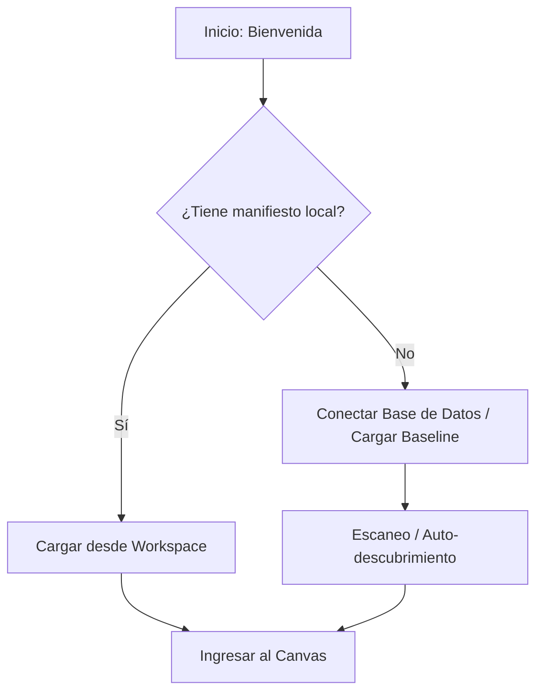

# Asistente de Onboarding (Inicio Rápido)

Para que tu experiencia en OPO Studio sea fluida, la plataforma cuenta con un **Asistente de Onboarding** que se despliega de manera automática la primera vez que creas o abres un proyecto.

Este asistente te guiará paso a paso para pasar de una base de datos incomprensible a un mapa semántico totalmente funcional en minutos.

---

## Opciones de Inicio

Cuando ingresas a un nuevo proyecto, el asistente de Onboarding te presentará tres rutas de configuración rápida:

### 1. Cargar del Workspace (`.well-known/opo.json`)
Si el sistema detecta que en la carpeta raíz del proyecto ya existe un archivo de manifiesto configurado en `https://tu-dominio.com/.well-known/opo.json`, te ofrecerá cargarlo directamente.
* **Ventaja:** Ideal para continuar trabajando en un proyecto previamente mapeado o importado desde tu repositorio local.

### 2. Cargar Baseline de ERP (Recomendado para Protheus)
Carga un modelo preestablecido de datos de negocio de tu ERP.
* En el caso de **TOTVS Protheus**, este botón precarga de forma inmediata las 23 entidades estándar más comunes del sistema (como Clientes `SA*`, Facturas `SF*`, Cobros `SE*`, Ventas `SC*`) junto con las relaciones extraídas de la tabla `SX9`.
* **Ventaja:** Te ahorra tener que mapear a mano las tablas estándar y te deja listo para el siguiente paso: buscar tablas personalizadas.

### 3. Proyecto en Blanco
Te permite ignorar los asistentes y entrar al lienzo con una pantalla vacía.
* **Ventaja:** Ideal si vas a mapear un sistema a medida o no estándar desde cero absoluto.

---

## Flujo Paso a Paso de Conexión

Si decides realizar un escaneo completo de tu base de datos personalizada:

1. **Ingreso de Credenciales:** Coloca los datos de tu motor de base de datos (Postgres, SQL Server, Oracle).
2. **Escaneo Automático:** OPO Studio se conectará y leerá el diccionario de datos. Durante este proceso, verás una animación de escaneo que detalla el avance en tiempo real.
3. **Generación del DER:** Al finalizar el escaneo, OPO Studio organizará las tablas en nodos de Entidades (`EntityNode`) y dibujará las conexiones entre ellas basándose en sus llaves foráneas o diccionarios internos de relaciones.
4. **Confirmación:** Una vez finalizado, puedes hacer clic en **"Empezar a Crear Empleados Virtuales"** para ser redirigido directamente al lienzo interactivo con tu base de datos ya traducida.
